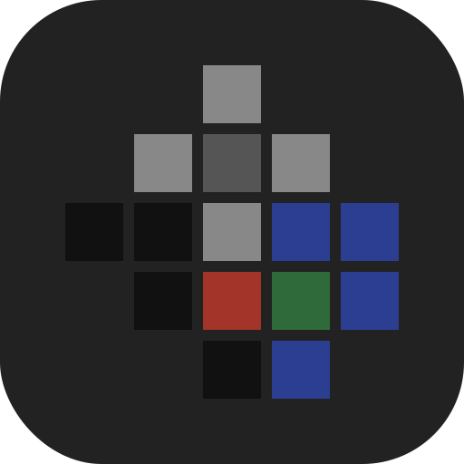
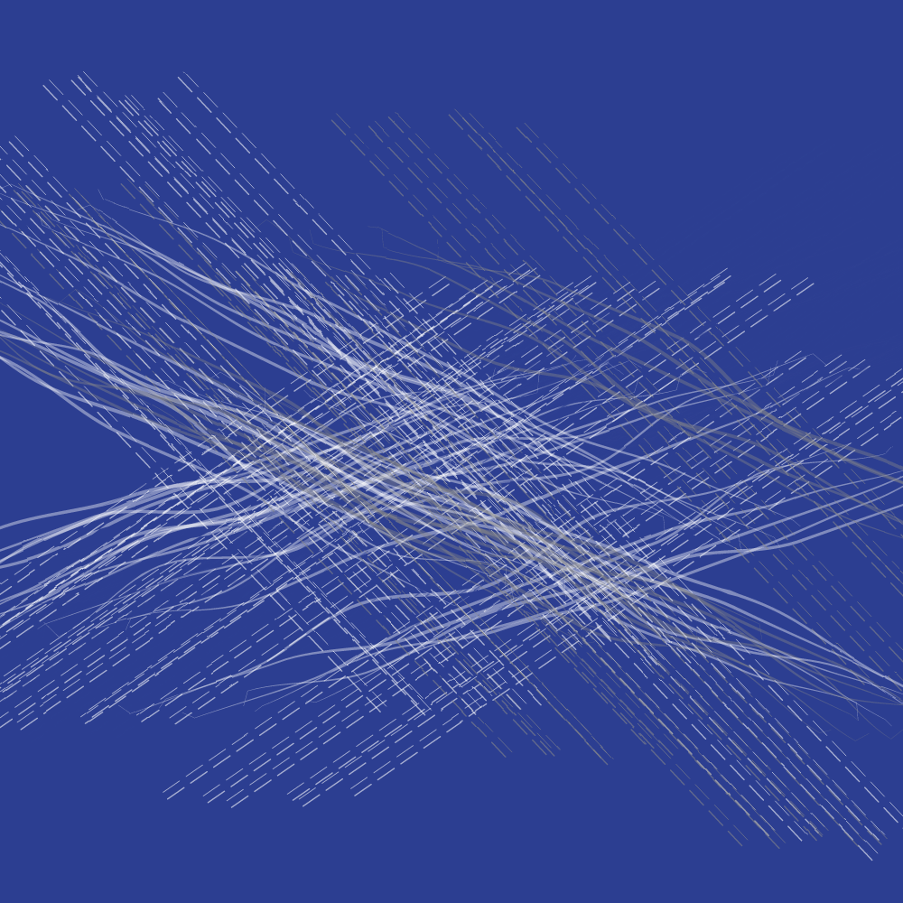
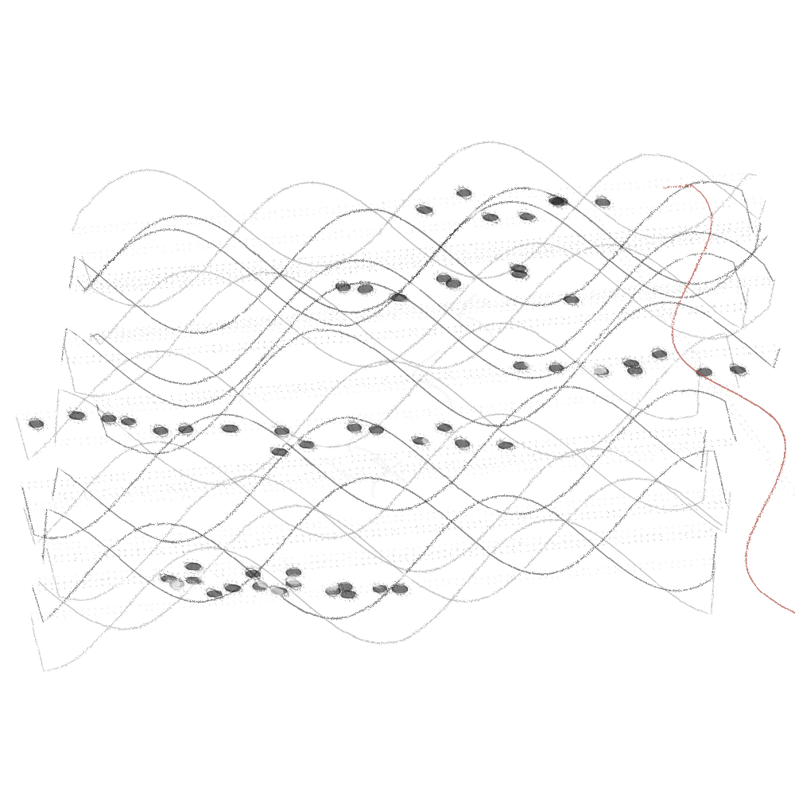
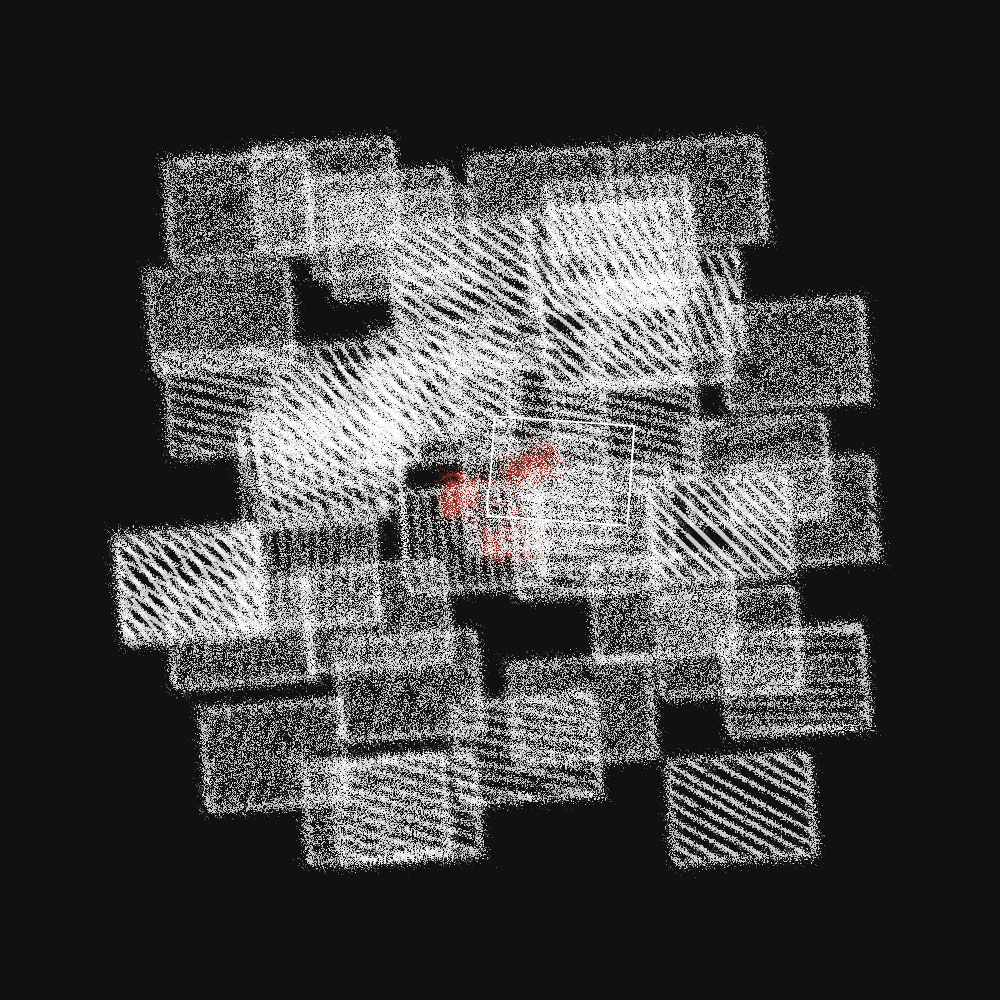
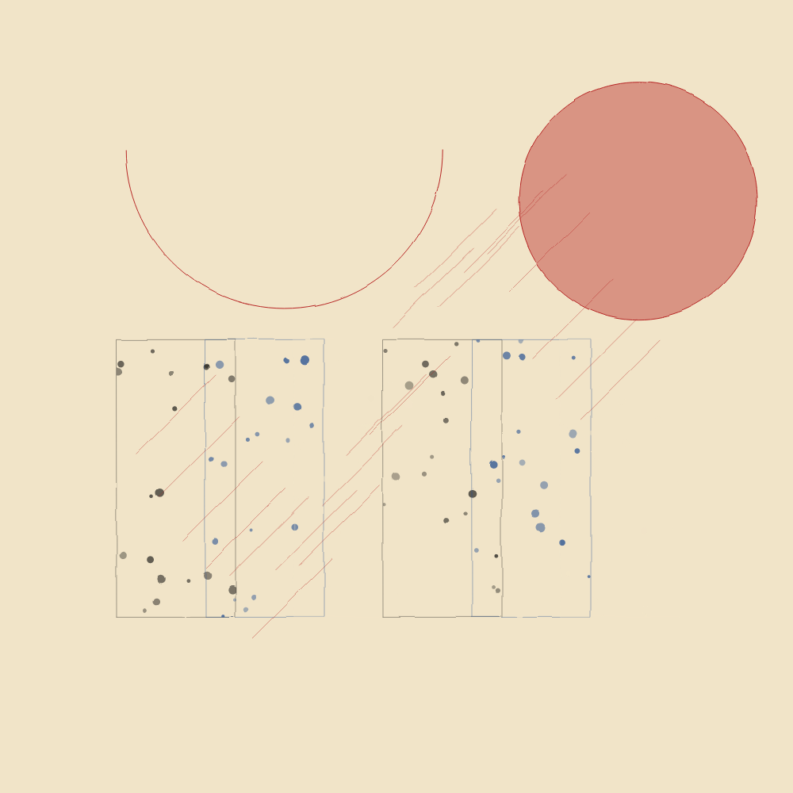
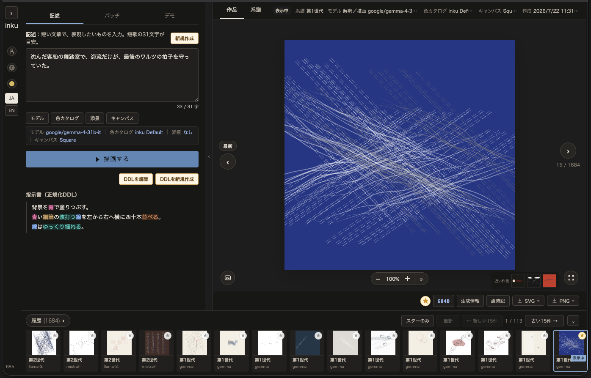
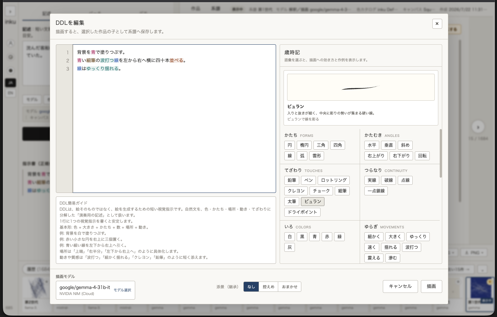

<p align="center">
  
</p>

<p align="center">
  <strong>日本語</strong> ｜ <a href="README.md">English</a>
</p>

# inku

**一文が、絵になる。**

<table align="center">
<tr>
<td width="33%"></td>
<td width="33%"></td>
<td width="33%"></td>
</tr>
</table>

`inku`（インク）は、短い記述から抽象的なベクターグラフィックを生み出す描画言語 DDL（Drawing Description Language）のリファレンスとなるアプリケーションです。絵画の経験や道具が無くても、自分のイメージを形に出来ます。心に残った光景をひとつ、短く書くことが始まりで、そこから作品を作っていくことが出来ます。

```
夜の水面に、青い線がゆっくりほどける
```

この一文が解釈され、楽譜になり、ベクターグラフィックの形に演奏されて、一枚の絵が現れます。同じ一文からもう一度描画すれば、ゆらぎによって少し違う絵が返ってきます。作品は系譜で管理され、世代を追って保存されます。最初の作品をベースにバリエーションを作り、推敲し、選び、新しい世代が生まれる——**書くことと選ぶことの往復**が、inku での創作です。最初の一文に拘って、最後まで作品に仕上げてもよいし、途中で忘れてしまっても良いでしょう。DDL には意味や感情は実装されません。何を運ばせるかは作り手次第です。

inku は美術館で、Sol LeWitt の展示を見ているときに、自分でも仕組みを作れるのでは？と思ったことがスタートでした。主に、以下の三つのアイディアを起点にしています。

| 文化・伝統 | inku への寄与 |
|---|---|
| **Sol LeWitt の指示書** | 記述そのものが作品であるという思想、アプリケーションの発想のもとになったコンセプト |
| **盆栽** | 制約は制限ではなく凝縮であるという実践 |
| **短歌** | 型が自我を削ぎ、主張ではなく提示が残る形式 |

現時点（2026年）での生成AIによる画像生成は、過程が創作者自身にも隠されており、呪術的と言っても良い、プロンプトを書いてあとはお祈り、の試行のくり返しと言えます。DDLのコンセプトは、作品生成のプロセスを層毎に分け、生成AIと決定論的にプログラムされたアルゴリズムを交互に重ねています。

LLMをベースにしていますが、語彙・図形・座標といった指示要素には厳しい制約を設け、作者の意図を汲みつつ型を守るようにプログラムされています。この制約は、作品製作の上での限界ではありません。あなたが作品を作り、その意図を可視化するための道具立てです。

---

## 作品 — 記述が絵になる

**それぞれの絵の下に、書かれた一文（詞書）と、そこから生まれた指示書（正規化DDL）を添えました。** 言葉と絵の対応こそが、この言語の中身です。

<table><tr><td></td></tr></table>

> 沈んだ客船の舞踏室で、海流だけが、最後のワルツの拍子を守っていた。

<details>
<summary>指示書（正規化DDL）と元 SVG</summary>

```
背景を青で塗りつぶす。
青い細筆の波打つ線を左から右へ横に四十本並べる。
線はゆっくり揺れる。
```

[ballroom-current-waltz.svg](docs/assets/gallery/ballroom-current-waltz.svg) — seed `7735827479582915` / 色カタログ inku Default

</details>

<table><tr><td></td></tr></table>

> 戦争が終わった朝、対岸の狙撃手と漁師は、同じ魚群の銀色を見ていた。

<details>
<summary>指示書（正規化DDL）と元 SVG</summary>

```
背景を白で塗りつぶす。
画面下半分に灰色の細筆の横線を二十本並べる。
中央付近に白い小さな楕円を百二十個、波打つ軌跡に沿って散らす。
右端に黒い鉛筆の縦線を一本引く。
```

[armistice-morning-silver-shoal.svg](docs/assets/gallery/armistice-morning-silver-shoal.svg) — seed `1759981552357047` / 色カタログ inku Default

</details>

<table><tr><td></td></tr></table>

> 海が引いたあとの街で、ビルの谷間に鯨の骨が横たわり、朝日を梳いていた。

<details>
<summary>指示書（正規化DDL）と元 SVG</summary>

```
背景を白で塗りつぶす。
黒いロットリングの縦長の四角を左右に三つずつ並べる。
白いビュランの太い弧を中央に一本引く。
白いビュランの短い線を弧に沿って二十本並べる。
右上に黄色い大きな円を置く。
```

[whale-bones-low-tide-city.svg](docs/assets/gallery/whale-bones-low-tide-city.svg) — seed `7251697323642884` / 色カタログ Desert Mineral

</details>

いずれも Build 667・render engine 10 で描かれたもので、Stage 1 / Stage 2 とも `nvidia:google/gemma-4-31b-it` による生成です。三枚目だけ地の色が違うのは、**色カタログ**を切り替えているためで、同じ「白」「黒」の指定が選んだカタログの色域へ翻訳されます。

**残り 3 点は [ギャラリー](docs/guide/gallery.ja.md) にあります。**

---

## Quick Start

### 0. Docker（リリースイメージ・最速）

リリース版は GHCR のコンテナイメージ（`ghcr.io/oikawas/inku-api` / `inku-web`、amd64 / arm64）で配布しています。

```sh
curl -fsSLO https://raw.githubusercontent.com/oikawas/inku-lang/main/deploy/compose.yaml
curl -fsSLO https://raw.githubusercontent.com/oikawas/inku-lang/main/deploy/.env.example
cp .env.example .env   # LLM の API キーと INKU_BOOTSTRAP_ADMIN_PASSWORD（8 文字以上）を記入
docker compose up -d   # → http://localhost:5173
```

初回アカウント・データ永続・版固定・HTTPS の詳細は [`deploy/README.md`](deploy/README.md) を参照してください。

### 1. ソースから動かす

```sh
cd server && UV_CACHE_DIR=/tmp/inku-uv-cache uv run inku-server   # API（既定は SQLite）
cd web && npm install && npm run dev                              # → http://localhost:5173
```

少なくとも Stage 1 / Stage 2 用の LLM provider が要ります（`INKU_LLM_BACKEND` と API キー、または Web UI のモデル設定画面）。**API キーを持たずに始めることもできます** — 手元の [Ollama](https://ollama.com) を provider に選ぶ道で、手順と推奨のモデルは [SETUP.ja.md](SETUP.ja.md) にあります。セルフサインアップは無いため、新規 DB では `INKU_BOOTSTRAP_ADMIN_PASSWORD`（8 文字以上）で bootstrap 管理者を作らないと誰もログインできません。

ログインしたら短い記述を書きます。生成後は歳時記を参照し、解釈フィードバックの墨の濃淡で「どう読まれたか」を確かめ、必要なら記述を推敲します。

環境変数の一覧、provider ごとの設定、CLI（`inku-cli`）の使い方は [SETUP.ja.md](SETUP.ja.md) にあります。

---

## しくみ — 楽譜と演奏

```
あなたの一文（母語で書く）
     │  解釈 — 言葉をコア語彙に読み解く（Stage 1・LLM）
     ▼
指示書（正規化DDL — 人間が読める実行仕様）
     │  構造化 — 楽譜に書き起こす（Stage 2・LLM）
     ▼
JSON Score（楽譜 — 決定的に保存される）
     │  演奏 — 揺らぎとともに描く（Renderer・seed 駆動）
     ▼
SVG（演奏 — 一回性。壁にも、紙にも、画面にも）
```

**記述は永続し、演奏（レンダリング）は一回性です。** 楽譜は決定的に残り、絵は揺らぎとともに都度生まれます（技術的に言えば、楽譜は JSON として残されます）。LeWitt の指示書が職人の手で毎回少し違う壁画になるように、同じ楽譜は毎回少し違う演奏になります。揺らぎはバグではなく、この言語の仕様です。

言葉は楽譜の項目に落ちます。二枚目の作品でいえば、「魚群」は `count` と `cluster_count: 7` に、「波打つ軌跡に沿って」は `path: wave` に、「銀色」は `color_cycle` と `surface.texture: wash` に、「対岸」は右端の一本の縦線になりました。**狙撃手も漁師も戦争も残りません。残るのは図形・素材・運動の語だけです。**

解釈と構造化を分けるのは、求められる能力が違うからです。解釈は連想的・創造的、構造化は機械的・規則遵守的。各段は独立に調整でき、Stage ごとに使用する LLM を選択できます。実際に、モデルによって、出来上がる作品には大きな変化が見られます。**モデルの選択そのものが、創造的な変数です。**

非決定性が住む場所は二つだけです: Renderer の演奏（performance seed）と、あなたの明示操作（別の構図・別の解釈）。既定の経路は常に決定的で、履歴の `render_seed` / `composition_seed` / `render_hash`（作品エディション ID）から、保存した作品を再現できます。ただし、inku の仕様は常に進んでおり、新たな inku が描く作品は常に昔とは違うものです。版木が破棄されるように、過去の Renderer は Git の履歴にしかありません。

**楽譜の実物、各層の用語、面と地の質感の扱いは [しくみの詳細](docs/guide/how-it-works.ja.md) にあります。**

実装境界、DDL処理、API、履歴・系譜、変更影響は [アーキテクチャ文書](docs/architecture/README.ja.md) にあります。

---

## 画面 — 書くことと選ぶことの往復

左に記述、右に作品。その間に**指示書（正規化DDL）**が置かれ、書いた語がどう読まれたかを墨の濃淡で示します。下段は履歴です。画面に出ているのは、このページ冒頭のギャラリー 1 点目そのものです。

<table><tr><td></td></tr></table>

指示書はそのまま手で編集して描き直せます。右の歳時記は、語を選ぶとその筆致の見本と効き方を返します——語彙を覚えてから書くのではなく、見ながら書けます。「系譜」に切り替えると、その作品から生まれた世代が枝分かれして並び、表示中の作品が次の推敲の親になります。

<table><tr><td></td></tr></table>

---

## 推敲による作品の追求

一文から返ってきた一枚は、完成ではなく**初代**です。そこから引き直し、返ってきたものからまた引き直す——**世代を重ねることが制作**です。

当たりが出るまで引き直すのとは違います。引き直しは五つの軸に分かれていて、**どれを動かし、どれを保つかをあなたが決めます**。そして返ってきた候補から**あなたが選ぶ**。この変奏と選択の反復が、生成物ではなく作品を作ります。

どれも既定の再現性を壊さず、あなたの明示的な操作でのみ働きます。

| 操作 | 引き直すもの | 保たれるもの | 速さ |
|---|---|---|---|
| **別の演奏**（言葉でタッチを変える） | 線の震え、配置の位相 | 解釈と構図 | 超高速・LLM を呼ばない |
| **別の色**（色カタログを変える） | 色の割り当て | 解釈・構図・演奏 | 超高速・LLM を呼ばない |
| **別の構図**（配置を変える） | 構図・焦点・技法の選択 | 解釈（言葉の読み方） | 中速・Stage 2 |
| **変奏**（Stage 1.5 をお任せで変える） | 展開層の軸。強度で範囲が変わる | 一文と読み取り、強度が触れない軸 | 中速・Stage 2 |
| **別の解釈** | 言葉の読み方そのもの | あなたの一文 | 低速・Stage 1 から |

「別の解釈」では、新旧の指示書の差分が表示されます。自分の言葉が違う読まれ方をする瞬間——そのズレ自体が、次の一文を書く材料になります。世代を重ねること自体を AI に任せることもでき、任せている間も生まれた世代はすべて系譜に残ります。

**完成は、生成が当たったときではなく、あなたがここで止めると決めたときに訪れます。**

**変奏の強度、AI による自動推敲、系譜とエディションの詳細は [推敲の詳細](docs/guide/revision.ja.md) にあります。**

---

## 歳時記（Saijiki）

参照語彙辞書は **歳時記（Saijiki）** と呼びます。俳句の実践から借りた言葉で、季語を集めた書のこと。常に開いておくものではなく、迷ったときに見に行くものです。

| カテゴリ（日） | カテゴリ（英） | 語彙 |
|---|---|---|
| かたち | forms | 円、楕円、三角、四角、線、弧、雲形 |
| てざわり | touches | 銀筆、鉛筆、ペン、ロットリング、クレヨン、チョーク、細筆、太筆、ビュラン、ドライポイント、コンピュータ |
| うごき | motions | 置く、並べる、引く、散らす、埋める、敷き詰める |
| ばしょ | places | 上、下、中央、左端、右端、上端、下端、中心、隅 |
| つらなり | continuity | 実線、破線、点線、一点鎖線 |
| ゆらぎ | movements | 細かく、大きく、ゆっくり、速く、揺れる、波打つ、震える、滲む |
| いろ | colors | 白、黒、青、赤、緑、灰、黄、橙、紫 |
| かたむき | angles | 水平、垂直、斜め、右上がり、右下がり、回転 |
| わりあい | proportions | 縦長、横長、全幅、半幅、半円、上弦、下弦、三日月 |
| あいだ | relations | 沿う、触れない、切る、間に、触れる（「前の線に沿って」のように用いる） |

語彙の現行値は実装の saijiki テーブルが正であり、`inku-cli reference --md` でいつでも機械生成の一覧を得られます。

物理的・観察可能な言葉だけがコアに入ります。「美しく」「繊細に」「激しく」といった感情の評価語は含まれません——評価は書き手ではなく、見る人に属するからです。ギャラリーの記述をもう一度読むと、そこにも評価語が一つも無いことが分かります。

---

## DDLの設計原則

1. 記述は人間が読める——自然言語と記述言語の中間に位置する
2. 揺らぎは仕様であり、バグではない
3. 感情語彙を排除し、物理と運動の語彙を採用する
4. 固定のキャンバスを持たない——座標は 0.0〜1.0 の比率で、あらゆる媒体にスケール可能
5. 出力は静止画——動くのは見る人であり、画像ではない
6. 入力は制約付きDSLであり、完全な自由形式ではない
7. エンジンは後戻りしない——版木を彫り進めるように、描画エンジンは一方向にしか進まない

設計の詳細な根拠は、日本語正本の [SPEC.ja.md](SPEC.ja.md) を参照してください。

---

## 版画としてのエンジン

inku の描画エンジンには、**過去の版が存在しません**。現行の第 15 世代があるだけで、第 14 世代を選び直すことはできません。コードも残していません。

これは手抜きではなく、選択です。

> 彫りは進む。版木は一方向にしか変わらない。刷り上がった作品は残るが、彫る前の版木には戻れない。
> **アプリケーション自体を一つの作品として考えるなら、この実装になる。**

保存した作品は**刷り**です。SVG そのものが残るので、当時の姿はいつでも見られます。エンジンは**版木**で、彫り進めた先しか存在しません。再描画すれば最新のエンジンで刷られ、それは新しいエディションになります。両方を倉庫に取っておくことはしません。

版木は戻せませんが、刷りは残せます。世代が上がるたびに、決まった入力から得た出力の実物を凍結しています（`server/reference/`、現在 350 ケース）。**どの版が何をどう変えたかは [render engine の版史](docs/spec/render-engine-history.ja.md) にあります。**

---

## 機能概要

- **多段パイプライン** — Stage 1 / 1.5 / 2 / Renderer。AIによる非決定論的な層と、アルゴリズムによる決定論的な層が交互になっています
- **プリミティブと配置** — 線・円・楕円・弧・四角・三角・雲形。横・縦・放射・散布のレイアウトに、波打つ軌跡や斜めの帯などの path 指定
- **領域と関係** — 「前の線に沿って」「前の形に触れない」など、要素間の関係を楽譜に記し、演奏時に解決
- **素材表現** — 鉛筆、ロットリング、クレヨン、チョーク、筆、ビュラン、ドライポイントを、共有筆致エンジンの幅・追従・疎な事象と素材固有のエッジで描き分け
- **プラグイン** — `Nature.風` などの名前空間付き語彙マクロ。コア語彙への展開のみが許され、コアを変更できない
- **履歴とエディション** — ユーザー別 DB 保存。スター、検索、サムネイル、seed・エディション ID による完全再現
- **バッチ / CLI** — `inku-cli` からログイン、描画、バッチ生成、コンタクトシート、多様性分析

---

## ステータス

- **Web版** — 稼働中（Python FastAPI + SvelteKit、ローカルまたはサーバーで動作）
- **CLI** — `cli/` 以下に独立プロジェクトとして実装。API 経由でログイン、描画、バッチ生成、ベンチ評価を実行
- **Android アプリ** — `2.1.2-android.1`。描画は server と同じ render engine 15 を Kotlin で実装

**日本語版**と**英語版**の inku は作者が維持します。他言語の実装は、OSS として各言語話者の貢献を歓迎します。内部の JSON Score 層は言語非依存（英語キーで統一）で、翻訳が必要なのは記述の表層部分のみです。

---

## 起源

2026年4月2日、東京都現代美術館「ソル・ルウィット オープン・ストラクチャー」展の最終日に構想されました。

自分の心の中に言葉で手を伸ばし、返ってきたものの中に、もとからそこにあったものを見出す——記述という体験を、視覚の形で可能にすること。それが inku が試みていることです。

> *精神のフォグが削ぎ落とされ、元からそこにあったものが眼前に見えてくる。*

---

## ドキュメント

開発者とAIは、まず [PROJECT_CONTEXT.ja.md](PROJECT_CONTEXT.ja.md) を読んでください。毎回仕様全文を読み直さずに済むよう、現在のアーキテクチャ、守るべき契約、必要最小限の読み順をまとめています。

- [SPEC.ja.md](SPEC.ja.md) — 日本語の正本仕様（このアプリケーションの開発者は日本人なので、日本語を基底にして仕様の策定をしています）
- [SPEC.md](SPEC.md) — 英語公開仕様（過度な詳細を省いたものです）
- [CHANGELOG.ja.md](CHANGELOG.ja.md) / [CHANGELOG.md](CHANGELOG.md) — 変更履歴（過去分は [`docs/history/`](docs/history/)）
- [SETUP.ja.md](SETUP.ja.md) — 導入と運用の手引き

---

## ライセンス

MIT ライセンス。[LICENSE](LICENSE) を参照してください。

---

## Other Languages

- [English README](README.md)
