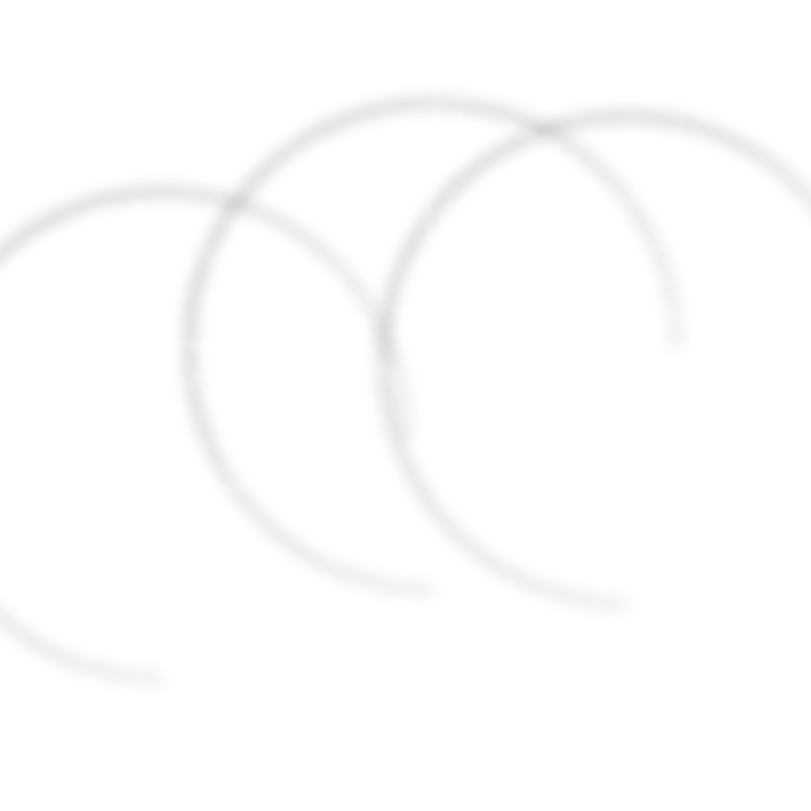
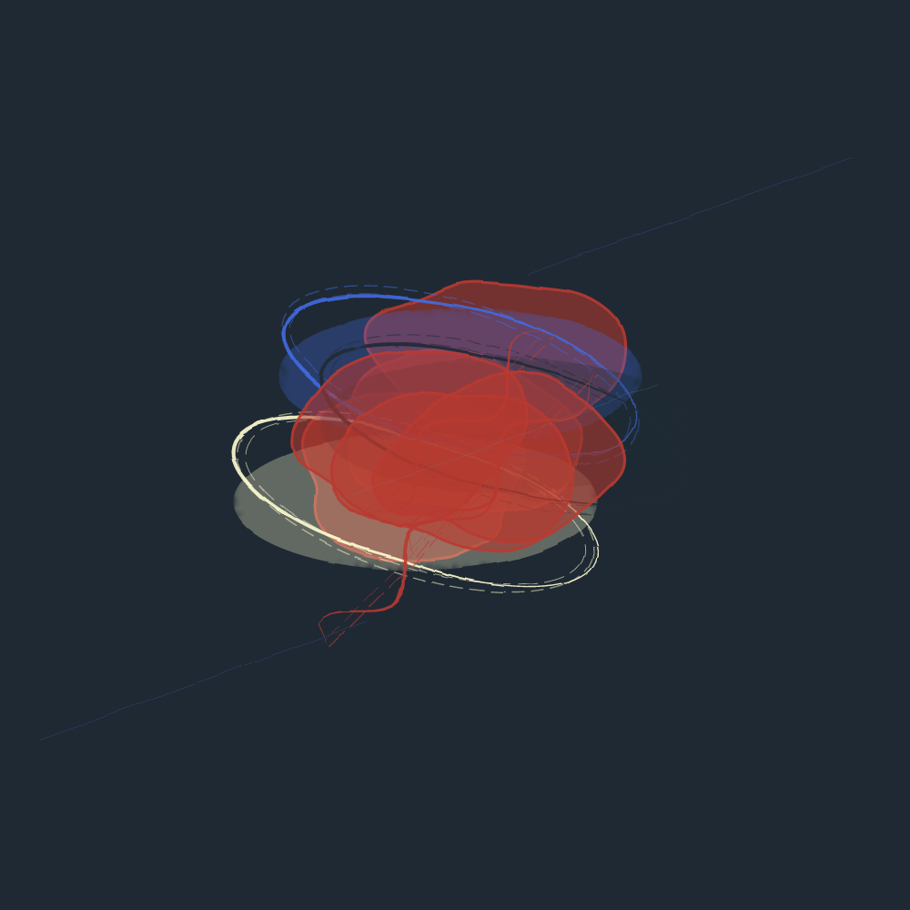
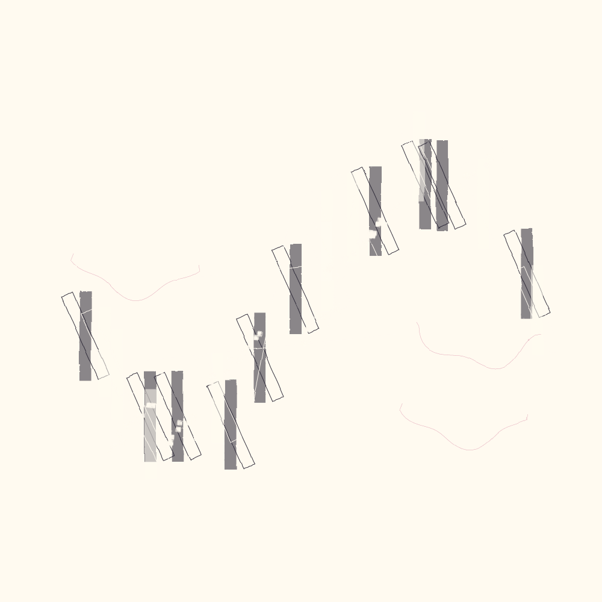
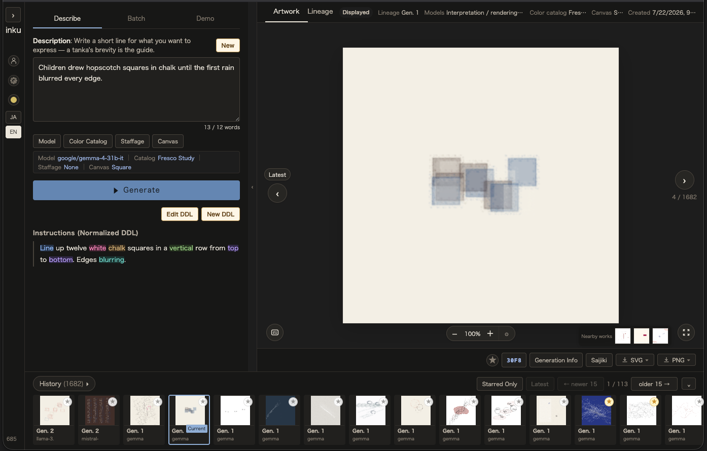
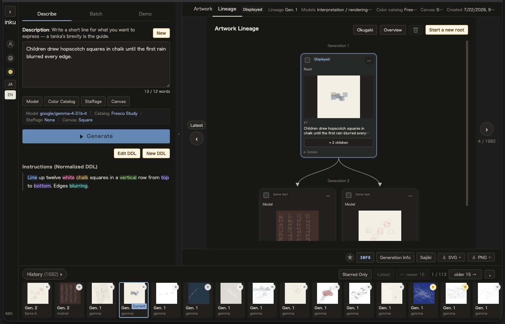
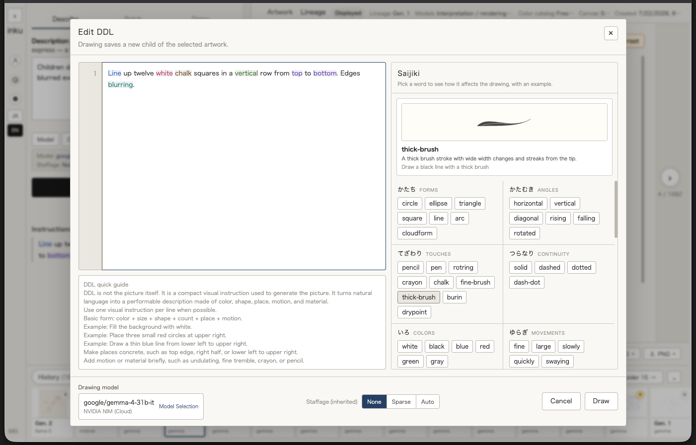

# inku

**One sentence becomes a picture.**

<table align="center">
<tr>
<td width="33%"></td>
<td width="33%"></td>
<td width="33%"></td>
</tr>
</table>

`inku` is the reference implementation of DDL (Drawing Description Language) — a description-based drawing language that turns a short written line into an abstract vector graphic. No drawing skill or tools are required to give your image a form. Writing down one scene that stayed with you, briefly, is the start — and from there you build the image up.

```
A blue line slowly loosens across the night water.
```

That sentence is interpreted, written into a score (drawing data in JSON), and performed (by inku's own rendering engine) into a picture. Generate again from the same sentence — not by AI, but by seeded variation — and a slightly different picture comes back. Every work you generate is kept under generational management as lineage: build variations on a work (by hand or through AI-assisted refinement), choose from the candidates lined up before you, and a new generation is born. **The back-and-forth of writing and choosing** is how creation works in inku.

inku stands at the crossing of ideas learned from three cultural traditions — and it is the result, or perhaps the ongoing process, of thinking about how generative-AI technology should be applied at that crossing.

| Tradition | What it gives inku |
|---|---|
| **Sol LeWitt's instruction art** | The idea that the description itself is the artwork; the concept from which this application began |
| **Bonsai** | The practice that constraint is not limitation but concentration |
| **Tanka** | The form in which the type silences the self, and presentation replaces assertion |

As of 2026, generative image and artwork making hides its own process from the creator; it might fairly be called incantatory — write a prompt, then pray, and repeat. The DDL concept takes the opposite path: it splits the generation process into layers, and the human interprets, selects, and edits the AI's interventions at each layer while finishing the work.

inku is built on LLMs, but each layer is placed under strict constraints. Constraints on vocabulary, primitives, and coordinates are not limits on what can be made. They are the instruments by which you make a work and render your intention visible.

---

## Works — a description becoming a picture

The pieces below were drawn by inku. **Under each picture is the sentence that was written (the kotobagaki) and the instructions (normalized DDL) that grew out of it.** The correspondence between words and picture is what this language is about.

These works were written in Japanese; the original text is given with an English rendering.


> *In the ballroom of the sunken liner, only the current kept the time of the last waltz.*
>
> 沈んだ客船の舞踏室で、海流だけが、最後のワルツの拍子を守っていた。

<details>
<summary>Instructions (normalized DDL) and source SVG</summary>

```
背景を青で塗りつぶす。
青い細筆の波打つ線を左から右へ横に四十本並べる。
線はゆっくり揺れる。
```

> Fill the background with blue.
> Line up forty undulating blue fine-brush lines horizontally, from left to right.
> The lines sway slowly.

[ballroom-current-waltz.svg](docs/assets/gallery/ballroom-current-waltz.svg) — seed `7735827479582915` / color catalog inku Default

</details>


> *On the low-tide sand, the arcs of foam left by the receding wave dried, layer upon layer.*
>
> 干潮の砂浜に、引き波が残した泡の弧が、幾重にも重なって乾いていった。

<details>
<summary>Instructions (normalized DDL) and source SVG</summary>

```
白い細筆の弧を、太さを変えて五本を並べる。波打つ軌跡に沿って、弧を重ねて置く。面: 滲む。
```

> Line up five white fine-brush arcs, varying the thickness. Place the arcs overlapping along an undulating path. Surface: blur.

[ebb-tide-foam-arcs.svg](docs/assets/gallery/ebb-tide-foam-arcs.svg) — seed `1997407931189975` / color catalog inku Default

</details>


> *On the night of the blackout, candles were lit one by one in the windows of the housing block, and an uneven lattice surfaced in the dark.*
>
> 停電の夜、団地の窓にひとつずつ蝋燭が灯り、闇に不揃いな格子が浮かんだ。

<details>
<summary>Instructions (normalized DDL) and source SVG</summary>

```
背景を黒で塗りつぶす。
黄色いクレヨンの小さな四角を画面全体に点々と四十八個散らす。
四角は不揃いに並べる。
```

> Fill the background with black.
> Scatter forty-eight small yellow crayon squares across the whole canvas.
> Arrange the squares unevenly.

[blackout-candle-lattice.svg](docs/assets/gallery/blackout-candle-lattice.svg) — seed `6197114075822707` / color catalog inku Default

</details>


> *In the city after the sea withdrew, whale bones lay in the canyon between the buildings, combing the morning sun.*
>
> 海が引いたあとの街で、ビルの谷間に鯨の骨が横たわり、朝日を梳いていた。

<details>
<summary>Instructions (normalized DDL) and source SVG</summary>

```
背景を白で塗りつぶす。
黒いロットリングの縦長の四角を左右に三つずつ並べる。
白いビュランの太い弧を中央に一本引く。
白いビュランの短い線を弧に沿って二十本並べる。
右上に黄色い大きな円を置く。
```

> Fill the background with white.
> Line up three tall black rotring squares on each side, left and right.
> Draw one thick white burin arc through the center.
> Line up twenty short white burin lines along the arc.
> Place a large yellow circle at the upper right.

[whale-bones-low-tide-city.svg](docs/assets/gallery/whale-bones-low-tide-city.svg) — seed `7251697323642884` / color catalog Desert Mineral

</details>



> *In the aquarium with its lights out, the jellyfish waxed and waned slowly, in place of the moon.*
>
> 灯りを消した水族館で、くらげは月の代わりに、ゆっくりと満ち欠けした。

<details>
<summary>Instructions (normalized DDL) and source SVG</summary>

```
背景を黒で塗りつぶす。白い細筆の雲形を中央に三つ、大きさの異なる順に並べる。波打つ軌跡に沿ってゆっくり揺れる。
```

> Fill the background with black. Line up three white fine-brush cloudforms at the center, ordered by differing size. They sway slowly along an undulating path.

[aquarium-jellyfish-phases.svg](docs/assets/gallery/aquarium-jellyfish-phases.svg) — seed `2184785730279672` / color catalog Weathered Heritage

</details>



> *Inside the piano no one plays anymore, dust assembled a chord of light in the order of the keys.*
>
> 誰も弾かなくなったピアノの中で、埃が鍵盤の順番に、光の和音を組んでいた。

<details>
<summary>Instructions (normalized DDL) and source SVG</summary>

```
背景を黒で塗りつぶす。
白いロットリングの縦長の四角を横に二十本並べる。
白い鉛筆の小さな四角を、前の四角の上に一つずつ、画面全体に点々と散らす。
細かく震える。
```

> Fill the background with black.
> Line up twenty tall white rotring squares horizontally.
> Scatter small white pencil squares across the whole canvas, one on top of each previous square.
> They tremble finely.

[silent-piano-dust-chord.svg](docs/assets/gallery/silent-piano-dust-chord.svg) — seed `6064752967664899` / color catalog Dye & Earth

</details>

All six were generated on Build 667 with render engine 10, using `nvidia:google/gemma-4-31b-it` for both Stage 1 and Stage 2. The grounds differ from work to work because a different **color catalog** was selected: the same "white" or "black" in the instructions is translated into the gamut of the chosen catalog.

---

## How it works — score and performance

```
Your sentence (written in your native language)
     │  interpretation — the words are read into core vocabulary
     ▼
Instructions (Normalized DDL — a human-readable executable specification)
     │  structuring — written down as a score
     ▼
JSON Score (the score — saved deterministically)
     │  performance — drawn, with variation
     ▼
SVG (the performance — one-time)
```

**The description is permanent; the performance is one-time.** The score remains fixed, while each picture is born with its own variation. Just as LeWitt's instructions became a slightly different wall drawing under each craftsman's hand, the same score becomes a slightly different performance each time. Variation is not a bug here — it is the specification of the language.

### Vocabulary and layers

| Term | Layer / act |
|---|---|
| **Description** | The poem-like input the author writes. The top layer of the work (inku-specific; no LeWitt counterpart) |
| **Interpret** | Stage 1's act of reading the description into instructions |
| **Instructions (Normalized DDL)** | The executable specification the interpretation produces. Corresponds to LeWitt's instruction sheet |
| **Score (JSON Score)** | The structured intermediate form of the instructions. Stored deterministically |
| **Performance (SVG)** | The one-time result of playing the score |
| **Kotobagaki (caption)** | The description re-presented beside the finished work (as in tanka) |
| **Reading** | Rebuilding candidates by re-reading the words (another interpretation) |

### One work, followed through the layers

Take the second piece in the gallery, the arcs of ebb-tide foam. The description was this sentence:

```
干潮の砂浜に、引き波が残した泡の弧が、幾重にも重なって乾いていった。
（On the low-tide sand, the arcs of foam left by the receding wave dried, layer upon layer.）
```

Interpretation reads it into instructions (normalized DDL). No emotional word survives — only shape, material, and motion.

```
白い細筆の弧を、太さを変えて五本を並べる。波打つ軌跡に沿って、弧を重ねて置く。面: 滲む。
（Line up five white fine-brush arcs, varying the thickness. Place the arcs overlapping along an undulating path. Surface: blur.）
```

Structuring writes those instructions down as a score (JSON Score). This is the excerpt actually stored — the first of three instructions, with `null` fields omitted.

```json
{
  "version": "0.1.0",
  "canvas": "square",
  "background": "white",
  "instructions": [
    {
      "primitive": "arc",
      "center": [0.5, 0.5],
      "radius": 0.3,
      "angle_start": 0.0,
      "angle_end": 270.0,
      "weight": "brush_thin",
      "color": "black",
      "variation": {
        "amplitude": "medium",
        "frequency": "medium",
        "quality": "pink",
        "dimensions": ["position_x", "position_y"]
      },
      "arrangement": {
        "count": 5,
        "layout": "scatter",
        "path": "wave",
        "color_cycle": ["black", "white"],
        "fade": "outward",
        "rhythm_spacing": "loose"
      },
      "surface": {
        "texture": "bleed",
        "opacity": 0.6,
        "bleed": 0.3,
        "tone_steps": 3
      }
    }
  ]
}
```

"Layer upon layer" landed in `arrangement.count` and `layout`; "dried" landed in `surface.texture: bleed` and `fade: outward`. The renderer performs this score — slightly differently each time. Because the output is vector, it holds up framed on paper, stretched across a wall, or viewed on a phone. There is no physical size constraint.

Scores may also carry surface and ground texture. A circle can say it is filled with wash or stipple through `instruction.surface`; the canvas can say it is off-white paper, washi, or ink-wash ground through `canvas.ground`. Those fields stay abstract. The renderer decides whether to perform them as SVG filters, clipped vector marks, or simplified compat output.

---

## Screens — the back-and-forth of writing and choosing

The description sits on the left, the work on the right, and the **instructions (normalized DDL)** in between, ink-shaded to show how each written word was read. History runs along the bottom.



Switching to Lineage lays out the generations that grew from that work. Whichever work is displayed becomes the parent of your next refinement. **Choosing is part of the work, alongside writing.**



The instructions can be edited by hand and drawn again. Selecting a word in the Saijiki on the right returns a sample of that stroke and a note on what it does — so you write while looking, rather than after memorizing the vocabulary. Light and dark themes can be switched at any time.



---

## Three ways to say "again"

Every result offers three tiers of regeneration. None of them breaks default reproducibility; each acts only on your explicit request.

| Operation | What is redrawn | What is kept |
|---|---|---|
| **Another performance** | Line tremor, placement phase (no LLM call) | Interpretation and composition |
| **Another composition** | Composition family, focus, technique | Interpretation (how the words were read) |
| **Another interpretation** | The reading of the words themselves | Your sentence |

With *another interpretation*, the old and new instructions are shown side by side as a diff. The moment your words are read differently — that gap itself becomes material for the next sentence.

You can also generate a grid of candidates and keep the ones you like (multiple selection is allowed), attaching a short note about why you chose them. **Choosing is part of the work, alongside writing.** History stores seeds and an edition ID, so anything you keep can be reproduced exactly as it was.

---

## Core vocabulary (Saijiki)

The reference dictionary is called **Saijiki**（歳時記）— a word borrowed from haiku practice, where it names a book of seasonal words. It is not kept open while you write; it is something you go and consult when you hesitate.

| Category (EN) | Category (JA) | Vocabulary |
|---|---|---|
| forms | かたち | circle, ellipse, triangle, square, line, arc, cloudform |
| touches | てざわり | pen, pencil, rotring, fine-brush, thick-brush, crayon, chalk, burin, drypoint |
| motions | うごき | place, line-up, draw, scatter, fill, tile |
| places | ばしょ | top, bottom, center, left-edge, right-edge, top-edge, bottom-edge, middle, corner |
| continuity | つらなり | solid, dashed, dotted, dash-dot |
| movements | ゆらぎ | fine, large, slowly, quickly, swaying, undulating, trembling, blurring |
| colors | いろ | white, black, blue, red, green, gray |
| angles | かたむき | horizontal, vertical, diagonal, rising, falling, rotated |
| proportions | わりあい | tall, wide, full-width, half-width, semicircle, waxing, waning, crescent |
| relations | あいだ | along, not touching, cutting, between, touching (used as "along the previous line") |

The saijiki table in the implementation is the source of truth for the current vocabulary; `inku-cli reference --md` produces a machine-generated listing at any time.

Only physical, observable words belong to the core. Emotional evaluation — "beautifully," "delicately," "boldly" — is excluded, because evaluation belongs to the viewer, not the writer. Read the gallery descriptions again and you will find not one evaluative word among them.

Outside the core live namespaced **plugin words** such as `Nature.wind`. A plugin is a validated `.inku-plugin.md` document, not code: it names a phenomenon and expands deterministically to core DDL. It cannot add shapes, Score fields, or executable code, and removing it does not change saved replay or rh2. Settings exposes load/rejection status, Saijiki shows qualified words with notes, and `inku-cli plugin list / validate / reload` provides administration.

---

## Architecture

```
 Your description (natural language, your native tongue)
      │
      ▼
┌──────────────────────────────────────┐
│ Stage 1   Interpretation (LLM)       │ free words → instructions, core vocabulary only
├──────────────────────────────────────┤
│ Plugin   Declarative expansion (det.) │ namespaced words → core-only instructions
├──────────────────────────────────────┤
│ Stage 1.5 Intermediate filter (det.) │ selects composition family and focus, attaches relations
├──────────────────────────────────────┤
│ Stage 2   Structuring (LLM)          │ instructions → JSON Score (the score)
├──────────────────────────────────────┤
│ Renderer  Performance (seed-driven)  │ score → SVG; resolves variation, regions, relations
└──────────────────────────────────────┘
      │
      ▼
 SVG (for a wall, a page, a screen)
```

Interpretation and structuring are separated because they demand different abilities: interpretation is associative and creative; structuring is mechanical and rule-abiding. Each stage can be tuned independently, and API models, local LLMs, and NVIDIA NIM-style endpoints can be selected per stage. **The choice of model is itself a creative variable.**

Non-determinism lives in exactly two places: the renderer's performance (performance seed) and your explicit operations (another composition, another interpretation). The default path is always deterministic, and history's `render_seed` / `vary_seed` / `render_hash` (work edition ID) let any saved work be reproduced exactly. That is why each gallery work above carries its seed.

---

## Design principles

1. Descriptions are human-readable, between natural language and code
2. Variation is a feature, not a bug
3. Emotional vocabulary is excluded; physical and motion vocabulary is embraced
4. No fixed canvas — coordinates are ratios from 0.0 to 1.0, scalable to any medium
5. Output is still — the viewer moves, not the image
6. Input is a constrained DSL, not free-form natural language

For the public English specification, see [SPEC.md](SPEC.md). The canonical Japanese source is [SPEC.ja.md](SPEC.ja.md).

---

## Quick Start

### 0. Docker (release images, fastest)

Releases are distributed as container images on GHCR (`ghcr.io/oikawas/inku-api` / `inku-web`, amd64 / arm64).

```sh
curl -fsSLO https://raw.githubusercontent.com/oikawas/inku-lang/main/deploy/compose.yaml
curl -fsSLO https://raw.githubusercontent.com/oikawas/inku-lang/main/deploy/.env.example
cp .env.example .env   # fill in your LLM API key and INKU_BOOTSTRAP_ADMIN_PASSWORD (8+ characters)
docker compose up -d   # → http://localhost:5173
```

See [`deploy/README.md`](deploy/README.md) for the first account, data persistence, version pinning, and HTTPS. The steps below run from source.

### 1. Backend

```sh
cd server
UV_CACHE_DIR=/tmp/inku-uv-cache UV_PYTHON_INSTALL_DIR=$HOME/.local/share/uv/python uv run inku-server
```

The default setup uses a local SQLite DB. There is no self-signup, so on a new DB nobody can sign in until you create the bootstrap admin with `INKU_BOOTSTRAP_ADMIN_PASSWORD` (8+ characters). Setting it later and restarting creates the account (an empty string is treated as unset, and DBs that already have accounts are left untouched).

### 2. LLM provider

Configure at least one provider for Stage 1 and Stage 2. Common environment variables are:

```sh
export INKU_LLM_BACKEND=nvidia        # nvidia / anthropic / local, etc.
export NVIDIA_API_KEY=...
export ANTHROPIC_API_KEY=...
export INKU_OVMS_BASE_URL=http://127.0.0.1:8000/v3
```

The web UI model settings page can also store provider/model choices and API keys. Saved API keys are not displayed again and are stored in encrypted DB form.

### 3. Web UI

```sh
cd web
npm install
npm run dev
```

Open `http://localhost:5173`, log in, and write a short description. Example:

```text
A blue line slowly loosens across the night water.
```

After generating, consult the Saijiki, read the ink-shaded interpretation feedback to see how your words were read, and refine the description if you like. Widen the field with *another performance*, *another composition*, or *another interpretation*, and keep what you love in history. The history manager replays any saved work with its stored seed.

### 4. CLI smoke test

```sh
cd cli
uv run inku-cli login --base-url http://127.0.0.1:8100 -u admin
uv run inku-cli paint "A blue line slowly loosens across the night water." --base-url http://127.0.0.1:8100 -o out/quickstart --prefix first --png --full-json
```

---

## Capabilities

- **Multi-stage pipeline** — Stage 1 / 1.5 / 2 / Renderer, with per-stage model selection; non-deterministic AI layers and deterministic algorithmic layers alternate
- **Refinement through regeneration** — another performance (no LLM call), another composition (vary seed), another interpretation (Stage 1 re-reading), LLM reselection, and generation management through lineage
- **Primitives and arrangement** — line, circle, ellipse, arc, square, triangle, cloudform; horizontal, vertical, radial, scatter, and literal tiling grid layouts with paths such as waves and diagonal bands
- **Regions and relations** — scores can state relations between elements ("along the previous line," "not touching the previous shape") that the performance resolves
- **Material rendering** — pencil, rotring, crayon, chalk, brushes, burin, and drypoint, differentiated through the shared stroke engine's width, tracking, and sparse events plus tool-specific edges
- **Color catalogs** — the same "white" or "black" in the instructions is translated into the gamut of the selected catalog (this is why the gallery grounds differ)
- **Plugins** — namespaced vocabulary macros such as `Nature.wind`; they expand into core vocabulary only and cannot modify the core
- **Interpretation feedback** — ink-density shading shows how each written word was read
- **History and editions** — per-user DB-backed history with stars, search, thumbnails, and exact reproduction via seeds and edition IDs
- **Batch / CLI** — `inku-cli` supports login, painting, batch generation, contact sheets, and diversity analysis
- **UI** — Saijiki panel, caption display of the source sentence beside the work, JSON/prompt views, light/dark mode, zoom/pan canvas

---

## Status

- **Web version** — operational (Python FastAPI + SvelteKit; runs locally or on a server)
- **CLI** — implemented as an independent `cli/` project; drives the API for login, drawing, batch generation, and benchmark output
- **Android app** — an older DDL demo has been verified on Pixel 9, but an Android version for the current inku-lang specification is not prepared yet

---

## Ecosystem

Related packages follow the `inku-` prefix convention:

- `inku-core` — core library
- `inku-saijiki` — vocabulary dictionary
- `inku-nature` — Nature plugin (wind, etc.)
- `inku-web` — web UI implementation
- `inku-android` — Android implementation
- `inku-cli` — command-line tool

---

## Language versions

The author maintains the **Japanese** and **English** versions of inku. Other language implementations are welcomed from the community as open-source contributions.

The internal JSON Score layer is language-neutral (English keys), so only the surface description layer needs translation.

---

## License

MIT License. See [LICENSE](LICENSE).

---

## Origin

Conceived on April 2, 2026, at the Museum of Contemporary Art Tokyo, on the final day of the *Sol LeWitt: Open Structures* exhibition.

Reaching into your own mind with words, and finding in what returns something that was always there — this is the experience inku attempts to make available in visual form.

> *The fog of the mind is brushed away, and what was always there comes into view.*

---

## Documentation

Developers and AI agents should start with [PROJECT_CONTEXT.md](PROJECT_CONTEXT.md). It summarizes the current architecture, contracts, and the smallest useful reading path without requiring a full specification reload.

- [SPEC.md](SPEC.md) — maintained public English specification (with excess detail trimmed)
- [SPEC.ja.md](SPEC.ja.md) — canonical Japanese specification (the author works Japanese-first, so the specification is authored in Japanese)
- [CHANGELOG.md](CHANGELOG.md) — public English release notes
- [CHANGELOG.ja.md](CHANGELOG.ja.md) — detailed canonical change history

Read the full specification for first-time onboarding, broad design changes, or consistency audits. For ordinary work, read the project context and only the relevant specification sections.

---

## Other Languages

- [日本語 README](README.ja.md)
