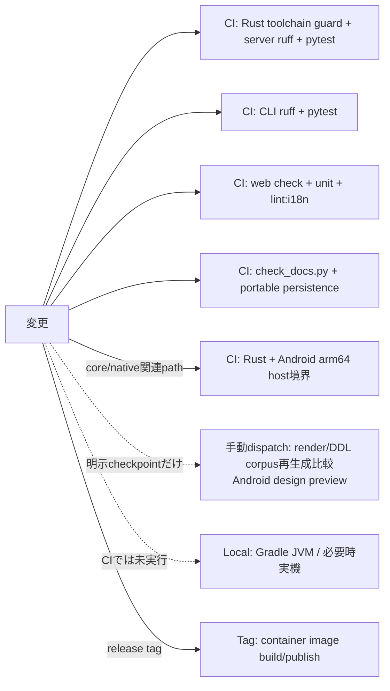

# Change impact map

## 変更領域と検査

| 変更領域 | 仕様・契約 | 主code | 直接test | 参照corpus / 生成物 | 追加確認 |
|---|---|---|---|---|---|
| saijiki語彙 | `SPEC.ja.md` §6, §12–14、語彙の正本は共有coreのasset | `core/crates/inku-ddl/assets/saijiki-v1.json`, `inku-ddl/src/saijiki.rs`, `server/src/inku_server/saijiki.py`, language support | `inku-ddl/tests/{saijiki_asset,saijiki_derived}.rs`, `test_reference.py`, `test_saijiki_api.py`, `test_saijiki_kt_is_current.py` | Android `SaijikiGenerated.kt`（`gen_saijiki_kt.py`）、作品計画の受理行列 | docs check、Web i18n |
| Stage 1 prompt / 作品計画 | §12.6、作品計画は一時物で可視DDLが正本 | `inku-pipeline/src/prompts.rs`, `inku-ddl/src/work_plan.rs`, `assets/{work-plan-capabilities-v1,prompt-body-templates-v1}.json` | `inku-ddl/tests/{work_plan,prompt_asset}.rs` | 受理行列は`examples/work-plan-capabilities.rs`でcompilerから再生成 | 日英の性質試験、provider schema変換（Server `pipeline_provider.py`、Android `GeminiJsonSchema.kt`） |
| 写生・色カタログ選択 | §12.6.1、§12.7.1 | `inku-pipeline/src/{prompts,machine}.rs`, `pipeline_product.py:sketch_request_for`, `sketch.py` | `test_sketch_state.py`, `test_pipeline_product.py`, Web sketch test, Android `SketchChoiceTest` | なし | 保存列`sketch_state`の旧値との互換 |
| authoring state machine / byte protocol | §12.7.1、§12.8、protocol `1.0.0` / binding `1.1.0` | `core/crates/inku-pipeline`, `core/crates/inku-pipeline-uniffi` | `inku-pipeline`のunit testと`focused_flow.rs`, `test_pipeline_candidate.py`, Android `SharedPipelineHostTest` | 保存済み実行のreplay | 版を変えるならServer `PipelineBinding`とAndroid bindingの期待値を同時に更新 |
| typed compiler / Stage 1.5 / lowerer | §4.4–4.6、§12.4、§12.11、§18、DDL engine版 | `core/crates/inku-ddl`, `server/src/inku_server/layer_versions.py` | `inku-ddl/tests/*`（compiler_lock、stage15_transform、composition_plan、score_lowering、visible_patch等） | DDL engine corpusは明示checkpointだけで新設（最新はengine 45） | 変更した挙動を所有する入口での機能確認 |
| Score schema / 資源authority | §18、Score版の最小選択 | `core/crates/inku-score`, `server/src/inku_server/schema.py`, `pipeline_defaults.py` | `inku-score/tests/*`（schema_identity、score_boundary、score_0_12、compatibility等） | 保存Score互換fixture | 旧Score 0.1.0〜0.9.0の読取、保存budgetの維持 |
| render core/stroke | 同一Score+seed+解決済みoption、engine前進、粗いnative境界 | `core/crates/inku-render`; `render_engines/default/adapter.py`; `AndroidRenderHost` | `inku-render/tests/*`、adapter/JNI契約、reference API、bounded Android same-version byte sample | Render Engine corpusは明示checkpointだけで新設（最新はengine 66の620件） | version裁定、pinned bindingとLinux/端末gate |
| SVG raster presentation | canonical SVG不変、明示pixel format/stride、allocation bound | `core/crates/inku-svg-raster`; `inku-render-android`; `RustArtworkRasterizer` | Rust raster unit、host/device raw digest、known color/alpha/stride | bounded sampleだけで、full raster corpusは作らない | Android arm64 packaging、off-main、cache key、no external resource |
| Server pipeline host | host は意味分岐を持たない、effectは1回ずつ、clientは信頼済み状態を送れない | `pipeline_{runtime,api,candidate,product,provider,settings,defaults,compat}.py`, `macro_catalog.py` | `test_pipeline_{api,candidate,compat,product,provider}.py`, `test_pipeline_provider_observation_context.py`, `test_macro_catalog.py` | なし | `/api/paint`等の互換応答shape、409の現在view |
| authority・history link | §12.7.1、CAS、action ACKの冪等性、sidecar v2 | `persistence/variation_authority.py`, `persistence/schema.py`, `persistence/migrations.py` | `test_persistence_variation_authority.py`, migration tests | なし | registry版とchecksum、旧作品の`legacy_unknown` |
| 旧Score互換 | 0.10未満の保存Scoreだけ、記述・DDLを読まない | `saved_score_compat.py`, `coerce/observability.py` | `test_saved_score_compat.py` | 過去のDDL engine 1–26 corpusは履歴記録 | `/api/render-score`・`render-svg`の色・上限の出どころheader |
| identity/history | `dh1`, `rh3`, legacy `rh2`, DB正本 | `identity.py`, `db.py`, `pipeline_product.py:save_result`, rendering/history router | hash、integrity、lineage acceptance | Android parity fixtures | migrationと既存row互換 |
| API route/model | 105 route、公開3、response shape | `api.py`, `api_core/*`, `pipeline_api.py` | route auth、module split、API surface baseline | なし | Web/CLI/Android sender census。route・schemaが変わったら件数定数を直し、baselineをlive appから作り直す |
| Web route/workflow | ownerはrouteごとに1個、stale resultを現作品へ適用しない、stateless Paint operation | `+page.svelte`; `features/session/state.svelte.ts`; `features/work/state.svelte.ts`; `features/{batch,demo}/state.svelte.ts`; `features/run/current-work.ts`; `features/canvas/refinement-coordinator.svelte.ts` | route composition、current-work、Batch/Demo、refinement ownership test | なし | targeted unit、`npm run check`、`npm run build` |
| Web pipeline controller | server snapshotとrevisionが正、作者操作だけを転送、provider effectを再試行しない | `features/pipeline/{api,controller,diagnostics}.ts`; `components/{PipelineStatus,DdlEditorDialog}.svelte` | `pipeline-state.test.ts`, `diagnostics.test.ts` | なし | targeted unit、`npm run check`; 表示語変更時は`lint:i18n` |
| Web Canvas/history/refinement | history/lineage/viewportのsingle owner、target identity、focused Canvas view | `features/history/*`; `features/canvas/*`; `components/CanvasPanel.svelte` | history state/action、viewport、refinement、focused-view test | なし | targeted unit、`npm run check`、`npm run build` |
| Web Settings | aggregateが4 sliceを各1回生成、secretとdraftをfocused view外へ複製しない、3 registry境界 | `features/settings/*`; `components/SettingsModal.svelte`; `persisted-settings.ts`; `user-settings.ts`; `render-payload.ts` | Settings ownership/slice/focused-view、registry unit test | なし | targeted unit、`npm run check`、`npm run build`; 表示語変更時は`lint:i18n` |
| Web表示語 | 日英語彙、token | `i18n/*`, component | type/check | なし | `lint:i18n`、必要ならdocs check |
| CLI flag/API field | 公開HTTPのみ、help/manual同時更新 | `cli.py`, CLI README/manual | `cli/tests/test_cli.py`, sender census | bench artifactは別 | CLI経由機能試験 |
| Android host/pipeline | 共有Rust pipeline・render・raster、Kotlinはhost、Room schema 12 | `SharedPipelineHost`, `AndroidWorkPipeline`, `NativePipelineBridge`, `SingleAttemptModelEffectProvider`, `RoomSharedPipelineStore`, `AndroidRenderHost`, `RustArtworkRasterizer` | focused JVM（`SharedPipelineHostTest`等）、native CI、必要時instrumentation（`SharedPipelineDeviceAcceptanceTest`、`NativeRenderDeviceTest`） | 描画はcanonical Server corpusからbounded staging | device data backup規則、実機データを消さない |
| Docker/runtime | 2 service、persistent volume、health、native wheelはpipelineとrendererを含む | compose/Dockerfiles/lockfiles、`inku-render-python` | build/health/persistence | container image | milestone Compose検証 |

## CIとlocal gate

現行CIは通常push/PRで、server（Rust toolchain guardを含む）、CLI、Web、公開文書とportable persistence verifierを実行する。`android-native.yml`は`core/**`またはAndroid native/host/pipeline/presentation関連pathが変わるときだけ、Rust workspace、raster unit、Android arm64 `.so` packaging、focused host JVM testを実行する。`reference-corpus.yml`（render/DDL corpusの再生成比較とAndroid design preview）は`workflow_dispatch`だけで起動し、push、PR、engine版の更新では走らない。端末instrumentationはlocal受入である。

## 決定的層の特別規則

`core/crates/inku-ddl/`、`core/crates/inku-pipeline/`、`core/crates/inku-score/`、`core/crates/inku-render/`、`core/crates/inku-svg-raster/`、native request境界、`saved_score_compat.py`、`render_engines/default/`、`renderer.py`、`schema.py`、`saijiki.py`、`language_support/` は決定的層である。

凍結corpusは版を上げるたびに作り直すものではない。全体の移行が終わった明示的な全更新checkpointでだけ新しい版のdirectoryを作り、保存済みdirectoryは上書きしない（`server/reference/README.md`）。checkpoint以外では、変更した挙動から起こりうる具体的な失敗を定め、それを観測する最小の直接検査を選ぶ。pytestのreference testは凍結fileとmanifestを読むだけの部分があり、generator再実行の代用にならない。

Rustのunit/ownership testだけでは描画同一性を証明しない。出力へ影響するcore変更では、変えた挙動を観測する直接testに加え、必要な場合にだけbounded same-version byte sampleを使う。native binding変更ではさらに、pinned wheel build、import、binding版・protocol版・engine identity、該当Linux runtime gateを行う。

## 根拠対応

`TEST-SERVER`, `TEST-CORE`, `TEST-CORPUS`, `TEST-ANDROID`, `TEST-WEBCLI`, `CI-GATES`。workflowと各package manifest/testを一次根拠とした。
