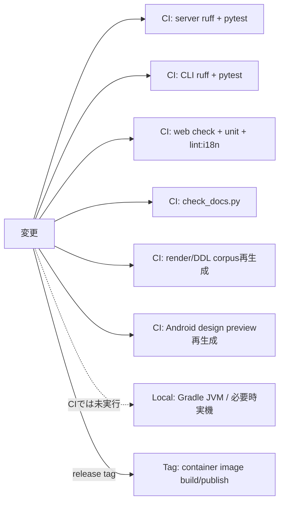

# Change impact map

## 変更領域と検査

| 変更領域 | 仕様・契約 | 主code | 直接test | 参照corpus / 生成物 | 追加確認 |
|---|---|---|---|---|---|
| saijiki語彙 | `SPEC.ja.md` §6, §12–14、語彙single source | `saijiki.py`, `schema.py`, language support | `test_saijiki_golden.py`, `test_reference.py`, `test_saijiki_api.py`, `test_saijiki_kt_is_current.py` | DDL corpus、Web/Android生成snapshot | docs check、Web i18n |
| schema宣言順 | Stage 2 optional field搬送率 | `schema.py`, `composer._score_tool_schema` | `test_thinness_declaration_position.py` | corpusはこのLLM搬送特性を検査しない | 専用test必須 |
| Stage 0.5 | 記述の代替消費者と`sketch_state` | `sketch.py`, `render.py`, Web/CLI/Android sender | `test_stage05_sketch.py`, `test_sketch_state.py`, `test_cli_sender_census.py`, Web sketch test | DDL/render corpus外 | client census、履歴migration |
| plugin文書 | Stage 1直後のcore writing-down | `plugins/document_format.py`, router | plugin format/v2 tests | DDL corpus `A-plugin-*` | plugin CRUD/auth、reference dump |
| Stage 1.5 | 意味非上書き、焦点、明示変奏 | `ddl_expander.py`, language support | expander、variation、staffage fold tests | DDL engine corpus | `check_frozen_corpora.py` |
| coerce | drop/repair、要求配達、hard ceiling、単一の名指し抽象色 | `coerce/normalize.py`, `coerce/compose.py`, `coerce/__init__.py` | composer/coerce/limits/relation tests | DDL engine corpus | `check_frozen_corpora.py` |
| renderer/stroke | 同一Score+seed、engine前進 | `renderer.py`, `stroke_engine.py`, `render_engines/default.py` | renderer各契約、platform stability | Render Engine corpus 606件 | version bump、再生成2回、Linux CI |
| identity/history | `dh1`, `rh3`, legacy `rh2`, DB正本 | `identity.py`, `db.py`, rendering/history router | hash、integrity、lineage acceptance | Android parity fixtures | migrationと既存row互換 |
| API route/model | 96 route、公開3、response shape | `api.py`, `api_core/*` | route auth、module split、API surface baseline | なし | Web/CLI/Android sender census |
| Web設定feature | 3 registry、local/user/payload境界 | `web/src/lib/features/*`, `+page.svelte` | registry unit tests、route source contracts | なし | `npm run check`, `test:unit`, relevant lint |
| Web表示語 | 日英語彙、token | `i18n/*`, component | type/check | なし | `lint:i18n`、必要ならdocs check |
| CLI flag/API field | 公開HTTPのみ、help/manual同時更新 | `cli.py`, CLI README/manual | `cli/tests/test_cli.py`, sender census | bench artifactは別 | CLI経由機能試験 |
| Android移植 | server判定の1対1移植、Room schema | Kotlin pipeline/render/data | JVM tests、manifest parity、必要時instrumentation | Android server_reference版dir | device data backup規則、実機データを消さない |
| Docker/runtime | 2 service、persistent volume、health | compose/Dockerfiles/lockfiles | build/health/persistence | container image | milestone Compose検証 |

## CIとlocal gate

現行CIは通常push/PRで、server（ruff + pytest）、CLI（ruff + pytest）、Web（svelte-check + unit + lint:i18n）、公開文書（`check_docs.py`）、凍結render/DDL corpus再生成、Android design preview再生成を実行する（`checks.yml` は台帳I-192で追加）。AndroidのJVM/instrumentationテストはworkflow上に無く、local検証が必要である。

## 決定的層の特別規則

`coerce/`, `ddl_expander.py`, `renderer.py`, `stroke_engine.py`, `schema.py`, `saijiki.py`, `language_support/` は `server/scripts/check_frozen_corpora.py` の対象である。pytestのreference testは凍結fileとmanifestを読むだけの部分があり、generator再実行の代用にならない。

## 根拠対応

`TEST-SERVER`, `TEST-CORPUS`, `TEST-ANDROID`, `TEST-WEBCLI`, `CI-GATES`。workflowと各package manifest/testを一次根拠とした。
