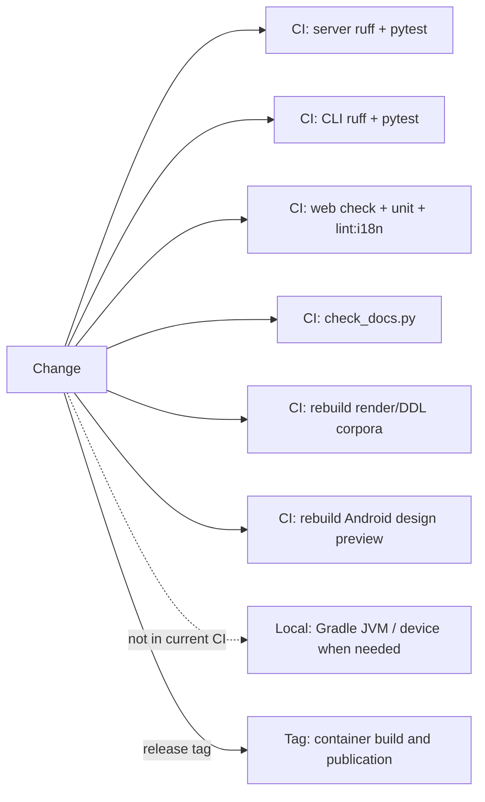

# Change impact map

## Change areas and checks

| Change area | Contract | Main code | Direct checks | Frozen corpus or output | Additional gate |
|---|---|---|---|---|---|
| Saijiki vocabulary | `SPEC.ja.md` §6, §12–14; one vocabulary source | `saijiki.py`, `schema.py`, language support | Saijiki golden/reference/API/Kotlin-current tests | DDL corpus; Web/Android snapshots | Docs and Web terminology |
| Schema declaration order | Delivery rate of optional Stage 2 fields | `schema.py`, `composer._score_tool_schema` | `test_thinness_declaration_position.py` | Corpus does not test this model behavior | Dedicated check required |
| Stage 0.5 | Alternate description consumer and `sketch_state` | `sketch.py`, render router, client senders | Stage 0.5, state, sender-census, Web tests | Outside DDL/render corpora | Client census; history migration |
| Plugin document | Core writing-down immediately after Stage 1 | `plugins/document_format.py`, render router | Plugin format/v2 tests | DDL `A-plugin-*` cases | CRUD/auth and reference dump |
| Stage 1.5 | No semantic overwrite; focus; explicit variation | `ddl_expander.py`, language support | Expander, variation, staffage-fold tests | DDL Engine corpus | `check_frozen_corpora.py` |
| Coerce | Drop/repair, request delivery, ceilings, one named abstract color | `coerce/normalize.py`, `compose.py`, `__init__.py` | Coerce, limit, relation, and named-color tests | DDL Engine corpus | `check_frozen_corpora.py` |
| Renderer/strokes | Same Score+seed; forward-only engine; pure-kernel dependency direction | `default/mark_kernel.py` (scalars and points), `default/marks.py` (SVG emission), `renderer.py` compatibility facade, `stroke_engine.py` | Facade consumer census, kernel dependency gate, renderer contracts, platform stability | 610 Render Engine cases | Version bump; rebuild twice; Linux CI |
| Identity/history | `dh1`, `rh3`, legacy `rh2`, DB canonical data | `identity.py`, `db.py`, rendering/history router | Hash, integrity, lineage acceptance | Android parity fixtures | Migration and stored-row compatibility |
| API route/model | 96 routes, three public paths, response shape | `api.py`, `api_core/*` | Route auth, module split, API baseline | None | Web/CLI/Android sender census |
| Web settings feature | Three registries and local/user/payload boundaries | `web/src/lib/features/*`, `+page.svelte` | Registry unit tests and route-source contracts | None | `npm run check`, unit and relevant lint |
| English Web text | Japanese/English terms and tokens | `i18n/*`, components | Type/check | None | `lint:i18n`; docs check when relevant |
| CLI flag/API field | Public HTTP only; help/manual move together | `cli.py`, CLI docs/manual | CLI tests and sender census | Bench output is separate | Functional test through CLI |
| Android port | One-to-one port of Server decisions; Room schema | Kotlin pipeline/render/data | JVM, manifest parity, device checks as needed | Android Server-reference directories | Preserve device data |
| Docker/runtime | Two services, persistent volume, health | Compose, Dockerfiles, lockfiles | Build, health, persistence | Container output | Milestone Compose verification |

## CI and local gates

On ordinary pushes and pull requests, current workflows run the server suite (ruff + pytest), the CLI suite (ruff + pytest), the Web checks (svelte-check + unit + lint:i18n), the published-document checks (`check_docs.py`), and rebuild the frozen render/DDL corpora and the Android design preview (`checks.yml` was added by ledger I-192). Android JVM/instrumentation tests are not in any workflow and need local verification.

## Special rule for deterministic layers

`coerce/`, `ddl_expander.py`, `render_engines/default/`, `renderer.py`, `stroke_engine.py`, `schema.py`, `saijiki.py`, and `language_support/` are deterministic layers whose changes require rebuilding the corresponding frozen corpus. Reference tests that only compare stored files do not replace running the rebuild.

For `mark_kernel.py`, the no-SVG dependency gate and ownership tests do not by themselves prove drawing identity. Run the direct tests and rebuild the Render Engine corpus so the one-way dependency from `marks.py` into the kernel and byte identity are checked together.

## Evidence map

Evidence: `TEST-SERVER`, `TEST-CORPUS`, `TEST-ANDROID`, `TEST-WEBCLI`, `CI-GATES`.
