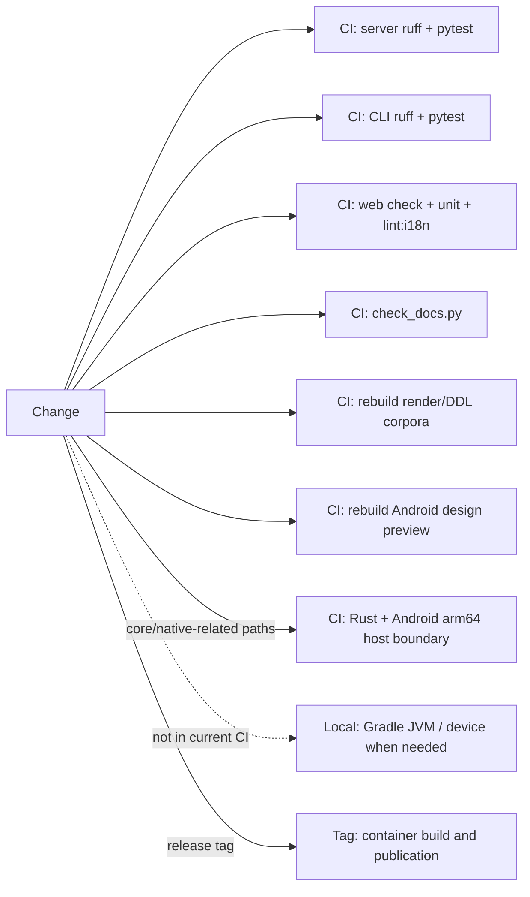

# Change impact map

## Change areas and checks

| Change area | Contract | Main code | Direct checks | Frozen corpus or output | Additional gate |
|---|---|---|---|---|---|
| Saijiki vocabulary | `SPEC.ja.md` §6, §12–14; one vocabulary source | `saijiki.py`, `schema.py`, language support | Saijiki golden/reference/API/Kotlin-current tests | DDL corpus; Web/Android snapshots | Docs and Web terminology |
| Schema declaration order | Delivery rate of optional Stage 2 fields | `schema.py`, `composer._score_tool_schema` | `test_thinness_declaration_position.py` | Corpus does not test this model behavior | Dedicated check required |
| Stage 0.5 | Alternate description consumer and `sketch_state` | `sketch.py`, render router, client senders | Stage 0.5, state, sender-census, Web tests | Outside DDL/render corpora | Client census; history migration |
| Plugin document | Core writing-down immediately after Stage 1 | `plugins/document_format.py`, render router | Plugin format/v2 tests | DDL `A-plugin-*` cases | CRUD/auth and reference dump |
| Stage 1.5 | No semantic overwrite; focus; explicit variation | `ddl_expander.py`, language support | Expander, variation, staffage-fold tests | DDL Engine corpus | `check_frozen_corpora.py` |
| Coerce | Drop/repair, request delivery, ceilings, one named abstract color | `coerce/normalize.py`, `compose.py`, `__init__.py` | Coerce, limit, relation, and named-color tests | DDL Engine corpus | `check_frozen_corpora.py` |
| Render core/strokes | Same Score+seeds+resolved options; forward-only engine; one coarse native boundary | `core/crates/inku-render`; Python/Android bindings; `default/adapter.py`; `AndroidRenderHost` | Rust workspace tests, adapter/JNI contracts, reference API, bounded Android same-version byte sample | 610 current Engine 41 cases; Engine 40 retained as history | Version ruling; rebuild twice for output changes; pinned bindings and Linux/device gates |
| SVG raster presentation | Canonical SVG unchanged; explicit pixel format/stride; allocation bounds | `core/crates/inku-svg-raster`; `inku-render-android`; `RustArtworkRasterizer` | Rust raster unit tests, host/device raw digest, known color/alpha/stride | Bounded three-current plus one-historical sample; no full raster corpus | Android arm64 packaging, off-main execution, cache key, no external resource |
| Identity/history | `dh1`, `rh3`, legacy `rh2`, DB canonical data | `identity.py`, `db.py`, rendering/history router | Hash, integrity, lineage acceptance | Android parity fixtures | Migration and stored-row compatibility |
| API route/model | 96 routes, three public paths, response shape | `api.py`, `api_core/*` | Route auth, module split, API baseline | None | Web/CLI/Android sender census |
| Web route/workflow | One owner per route, no stale result applied to the current work, stateless Paint operation | `+page.svelte`; `features/session/state.svelte.ts`; `features/work/state.svelte.ts`; `features/{batch,demo}/state.svelte.ts`; `features/run/current-work.ts`; `features/canvas/refinement-coordinator.svelte.ts` | Route-composition, current-work, Batch/Demo, and refinement ownership tests | None | Targeted unit tests, `npm run check`, and `npm run build` |
| Web Canvas/history/refinement | Single history/lineage/viewport owners, target identity, focused Canvas views | `features/history/*`; `features/canvas/*`; `components/CanvasPanel.svelte` | History state/action, viewport, refinement, and focused-view tests | None | Targeted unit tests, `npm run check`, and `npm run build` |
| Web Settings | Aggregate constructs four slices once; secrets and drafts stay in focused views; three registry boundaries | `features/settings/*`; `components/SettingsModal.svelte`; `persisted-settings.ts`; `user-settings.ts`; `render-payload.ts` | Settings ownership/slice/focused-view and registry unit tests | None | Targeted unit tests, `npm run check`, and `npm run build`; `lint:i18n` for display text |
| English Web text | Japanese/English terms and tokens | `i18n/*`, components | Type/check | None | `lint:i18n`; docs check when relevant |
| CLI flag/API field | Public HTTP only; help/manual move together | `cli.py`, CLI docs/manual | CLI tests and sender census | Bench output is separate | Functional test through CLI |
| Android host/pipeline | Kotlin Stage 1/1.5/2 and coerce; shared Rust render/raster; Room schema | Kotlin pipeline/data, `AndroidRenderHost`, `RustArtworkRasterizer` | Focused JVM, native CI, device checks as needed | DDL/Score/coerce fixtures only; bounded staging from canonical Server drawing corpus | Preserve device data |
| Docker/runtime | Two services, persistent volume, health | Compose, Dockerfiles, lockfiles | Build, health, persistence | Container output | Milestone Compose verification |

## CI and local gates

On ordinary pushes and pull requests, current workflows run the Server, CLI, Web, published-document, frozen-corpus, and Android design-preview gates. `android-native.yml` runs only when `core/**` or Android native/host/presentation paths change; it checks the Rust workspace and raster unit suite, Android arm64 `.so` packaging, and focused host JVM tests. Device instrumentation remains a local acceptance gate.

## Special rule for deterministic layers

`coerce/`, `ddl_expander.py`, `core/crates/inku-render/`, `core/crates/inku-svg-raster/`, the native request boundary, `render_engines/default/`, `renderer.py`, `schema.py`, `saijiki.py`, and `language_support/` are deterministic layers. A change that can affect Render Engine output requires rebuilding the current frozen corpus; reference tests that only compare stored files do not replace the rebuild. A host-only change proven not to alter the native request or output uses proportionate direct checks and a bounded same-version byte sample.

Rust unit and ownership tests do not by themselves prove drawing identity. Run the direct tests and rebuild the Render Engine corpus for output-affecting core changes so portable algorithm behavior and serialized byte identity are checked together. Native-binding changes also require a pinned wheel build, import and engine-identity checks, and the relevant Linux runtime gate.

## Evidence map

Evidence: `TEST-SERVER`, `TEST-CORPUS`, `TEST-ANDROID`, `TEST-WEBCLI`, `CI-GATES`.
