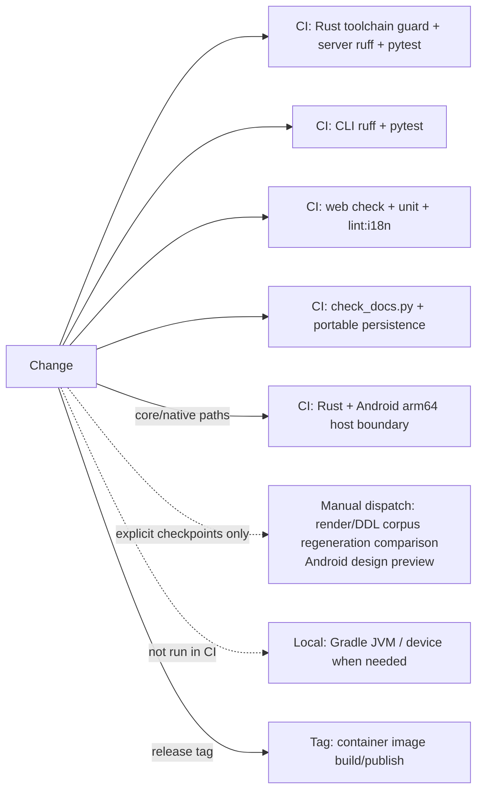

# Change impact map

## Change areas and checks

| Change area | Contract | Main code | Direct checks | Frozen corpus or output | Additional gate |
|---|---|---|---|---|---|
| Saijiki vocabulary | `SPEC.md` §6, §12–14; the vocabulary's source of truth is the shared-core asset | `core/crates/inku-ddl/assets/saijiki-v1.json`, `inku-ddl/src/saijiki.rs`, `server/src/inku_server/saijiki.py`, language support | `inku-ddl/tests/{saijiki_asset,saijiki_derived}.rs`, `test_reference.py`, `test_saijiki_api.py`, `test_saijiki_kt_is_current.py` | Android `SaijikiGenerated.kt` (`gen_saijiki_kt.py`); the work-plan capability matrix | Docs check, Web i18n |
| Stage 1 prompt / work plan | §12.6; the work plan is transient and visible DDL is authoritative | `inku-pipeline/src/prompts.rs`, `inku-ddl/src/work_plan.rs`, `assets/{work-plan-capabilities-v1,prompt-body-templates-v1}.json` | `inku-ddl/tests/{work_plan,prompt_asset}.rs` | The capability matrix is regenerated from the compiler with `examples/work-plan-capabilities.rs` | Japanese/English property tests; provider schema conversion (Server `pipeline_provider.py`, Android `GeminiJsonSchema.kt`) |
| Sketch and color catalog selection | §12.6.1, §12.7.1 | `inku-pipeline/src/{prompts,machine}.rs`, `pipeline_product.py:sketch_request_for`, `sketch.py` | `test_sketch_state.py`, `test_pipeline_product.py`, Web sketch test, Android `SketchChoiceTest` | None | Compatibility of the saved `sketch_state` column with older values |
| Authoring state machine / byte protocol | §12.7.1, §12.8; protocol `1.0.0` / binding `1.1.0` | `core/crates/inku-pipeline`, `core/crates/inku-pipeline-uniffi` | `inku-pipeline` unit tests and `focused_flow.rs`, `test_pipeline_candidate.py`, Android `SharedPipelineHostTest` | Replay of saved executions | A version change updates the expectations of Server `PipelineBinding` and the Android binding together |
| Typed compiler / Stage 1.5 / lowerer | §4.4–4.6, §12.4, §12.11, §18; DDL engine version | `core/crates/inku-ddl`, `server/src/inku_server/layer_versions.py` | `inku-ddl/tests/*` (compiler_lock, stage15_transform, composition_plan, score_lowering, visible_patch, and more) | A DDL engine corpus is created only at an explicit checkpoint (latest: engine 45) | Functional check through the entry point that owns the changed behavior |
| Score schema / resource authority | §18; minimum Score version selection | `core/crates/inku-score`, `server/src/inku_server/schema.py`, `pipeline_defaults.py` | `inku-score/tests/*` (schema_identity, score_boundary, score_0_12, compatibility, and more) | Saved-Score compatibility fixture | Reading older Scores 0.1.0 through 0.9.0; keeping saved budgets |
| Render core/stroke | Same Score + seed + resolved options; engine advances; coarse native boundary | `core/crates/inku-render`; `render_engines/default/adapter.py`; `AndroidRenderHost` | `inku-render/tests/*`, adapter/JNI contracts, reference API, bounded Android same-version byte sample | A Render Engine corpus is created only at an explicit checkpoint (latest: 620 engine 66 cases) | Version ruling, pinned binding, and Linux/device gates |
| SVG raster presentation | Canonical SVG unchanged, explicit pixel format/stride, allocation bound | `core/crates/inku-svg-raster`; `inku-render-android`; `RustArtworkRasterizer` | Rust raster units, host/device raw digest, known color/alpha/stride | Bounded samples only; no full raster corpus | Android arm64 packaging, off-main work, cache key, no external resource |
| Server pipeline host | The host has no semantic branches, performs each effect once, and cannot receive trusted state from a client | `pipeline_{runtime,api,candidate,product,provider,settings,defaults,compat}.py`, `macro_catalog.py` | `test_pipeline_{api,candidate,compat,product,provider}.py`, `test_pipeline_provider_observation_context.py`, `test_macro_catalog.py` | None | Compatibility response shape of `/api/paint` and the others; the current view in a 409 |
| Authority and history links | §12.7.1; CAS; idempotent action acknowledgment; sidecar v2 | `persistence/variation_authority.py`, `persistence/schema.py`, `persistence/migrations.py` | `test_persistence_variation_authority.py`, migration tests | None | Registry version and checksum; `legacy_unknown` for older works |
| Older Score compatibility | Only saved Scores below 0.10; never reads a description or DDL | `saved_score_compat.py`, `coerce/observability.py` | `test_saved_score_compat.py` | The DDL engine 1–26 corpora are historical records | Headers naming the source of colors and limits on `/api/render-score` and `render-svg` |
| Identity/history | `dh1`, `rh3`, legacy `rh2`, canonical DB | `identity.py`, `db.py`, `pipeline_product.py:save_result`, rendering/history routers | Hash, integrity, lineage acceptance | Android parity fixtures | Migration and existing-row compatibility |
| API route/model | 105 routes, three public paths, response shapes | `api.py`, `api_core/*`, `pipeline_api.py` | Route authorization, module split, API surface baseline | None | Web/CLI/Android sender census; when routes or schemas change, update the count constant and regenerate the baseline from the live app |
| Web route/workflow | One owner per route instance; stale results never apply to the current work; stateless Paint operation | `+page.svelte`; `features/session/state.svelte.ts`; `features/work/state.svelte.ts`; `features/{batch,demo}/state.svelte.ts`; `features/run/current-work.ts`; `features/canvas/refinement-coordinator.svelte.ts` | Route composition, current-work, Batch/Demo, and refinement ownership tests | None | Targeted unit, `npm run check`, `npm run build` |
| Web pipeline controller | The Server snapshot and revision are authoritative; only author commands are forwarded; provider effects are never retried | `features/pipeline/{api,controller,diagnostics}.ts`; `components/{PipelineStatus,DdlEditorDialog}.svelte` | `pipeline-state.test.ts`, `diagnostics.test.ts` | None | Targeted unit, `npm run check`; `lint:i18n` when display wording changes |
| Web Canvas/history/refinement | Single owners for history/lineage/viewport, target identity, focused Canvas views | `features/history/*`; `features/canvas/*`; `components/CanvasPanel.svelte` | History state/action, viewport, refinement, and focused-view tests | None | Targeted unit, `npm run check`, `npm run build` |
| Web Settings | The aggregate constructs four slices once; secrets and drafts are not copied outside focused views; three registry boundaries | `features/settings/*`; `components/SettingsModal.svelte`; `persisted-settings.ts`; `user-settings.ts`; `render-payload.ts` | Settings ownership/slice/focused-view and registry unit tests | None | Targeted unit, `npm run check`, `npm run build`; `lint:i18n` when display wording changes |
| Web display terms | Japanese/English vocabulary and tokens | `i18n/*`, components | Type/check | None | `lint:i18n`, docs check when relevant |
| CLI flags/API fields | Public HTTP only; help/manual stay in sync | `cli.py`, CLI README/manual | `cli/tests/test_cli.py`, sender census | Bench artifacts are separate | Functional test through the CLI |
| Android host/pipeline | Shared Rust pipeline, render, and raster; Kotlin is the host; Room schema 12 | `SharedPipelineHost`, `AndroidWorkPipeline`, `NativePipelineBridge`, `SingleAttemptModelEffectProvider`, `RoomSharedPipelineStore`, `AndroidRenderHost`, `RustArtworkRasterizer` | Focused JVM (`SharedPipelineHostTest` and others), native CI, instrumentation when needed (`SharedPipelineDeviceAcceptanceTest`, `NativeRenderDeviceTest`) | Expected rendering comes from the same commit's host core at build time (the frozen corpus supplies Score and raster input) | Device-data backup rules; never erase device data |
| Docker/runtime | Two services, persistent volume, health; the native wheel contains the pipeline and the renderer | Compose/Dockerfiles/lockfiles, `inku-render-python` | Build/health/persistence | Container images | Compose verification at milestones |

## CI and local gates

Current CI runs the Server (with the Rust toolchain guard), CLI, Web, and public-document gates plus the portable persistence verifier on ordinary pushes and pull requests. `android-native.yml` runs the Rust workspace, raster units, Android arm64 `.so` packaging, and focused host JVM tests only when `core/**` or Android native/host/pipeline/presentation paths change. `reference-corpus.yml` (render/DDL corpus regeneration comparison and the Android design preview) starts only through `workflow_dispatch`; it does not run on pushes, pull requests, or engine-version bumps. Device instrumentation is local acceptance.

## Special rule for deterministic layers

`core/crates/inku-ddl/`, `core/crates/inku-pipeline/`, `core/crates/inku-score/`, `core/crates/inku-render/`, `core/crates/inku-svg-raster/`, the native request boundary, `saved_score_compat.py`, `render_engines/default/`, `renderer.py`, `schema.py`, `saijiki.py`, and `language_support/` are deterministic layers.

A frozen corpus is not rebuilt with every version bump. A new version directory is created only at an explicit full-update checkpoint after an overall migration, and saved directories are never overwritten (`server/reference/README.md`). Outside a checkpoint, name the concrete failure the changed behavior could cause and choose the smallest direct check that observes it. Some pytest reference tests only read frozen files and manifests, so they do not replace rerunning a generator.

Rust unit/ownership tests alone do not prove rendering identity. For a core change that can affect output, use a direct test that observes the changed behavior and, only where needed, a bounded same-version byte sample. For a native binding change, also perform a pinned wheel build, import, the binding/protocol/engine identity check, and the relevant Linux runtime gate.

## Evidence map

`TEST-SERVER`, `TEST-CORE`, `TEST-CORPUS`, `TEST-ANDROID`, `TEST-WEBCLI`, `CI-GATES`. Workflows and package manifests/tests are the primary evidence.
