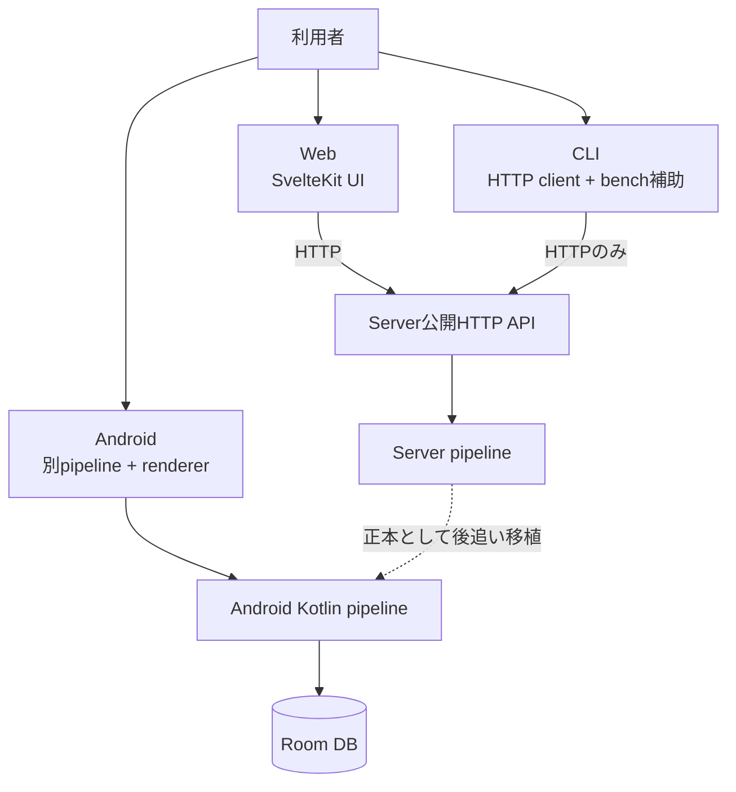
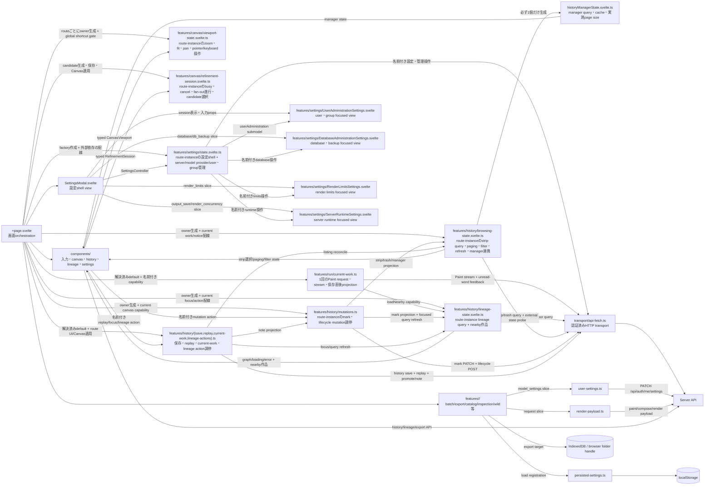

# Client boundaries

## 三clientの責任差

Webはserver作品を操作する参照UI、CLIはserverの公開APIを測るclient、Androidは端末内で全段を動かす別実装である。Androidがserver APIを通常pipelineとして呼ぶ関係は確認できない。

## Web内部

## Webの状態と永続化

| 所有者 | 例 | 境界 |
|---|---|---|
| component/page memory | 描画中のresult、output tab、replay modal/loading、Canvasへのcurrent-work適用 | reloadで消える。server正本ではない。history itemからのfield projectionはstateless history featureが作る |
| stateless run feature | 1回のPaint request、stream進行、保存直後projection | `runCurrentWork`は解決済みdefaultと名前付きcapabilityを受け取る。外側loop、route state、AbortControllerはpageに残る |
| route-instance lineage query owner | lineage graph/loading/error、stale-response identity、branch/overview merge、nearby作品 | routeごとに1個の`LineageQueryState`。query stateをhistory action moduleやpageへ複製しない |
| route-instance history browsing owner | stripのitems/count/offset/選択、filter、paging/resize、stale-response identity、trash summary、external refresh、mark projection、manager連携 | routeごとに1個の`HistoryBrowsingState`が既存`HistoryManagerState`を必ず1個だけ生成する。managerのrequest/cache/page-size意味論は複製しない |
| route-instance history mutation coordinator | star/revision/shareのoptimistic mutation、trash/restore/permanent-deleteのbulk coordination | routeごとに1個の`HistoryMutations`。stateを複製せず、browsing/lineage ownerとpage-owned current canvasへ名前付きprojectionだけを渡す |
| stateless history work operations | 保存用history payload、saved-work replay、history→current-work projection、saved-child/promote/note調停 | `save.ts`、`replay.ts`、`current-work.ts`、`lineage-actions.ts`がtyped inputと名前付きcapabilityだけを受ける。route UI、AbortController、Canvas適用はpageに残る |
| route-instance Canvas viewport owner | zoom、measured fit zoom、pan、pointer capture、keyboardによるzoom/pan | routeごとに1個の`CanvasViewportState`。`CanvasPanel`はtyped ownerを受け、pageはglobal shortcutのeligibilityとwork切替時の`fit()`要求だけを結線する |
| route-instance refinement session owner | single/grid/save busy、elapsed/token、fan-out slot、AbortController、candidate selection | routeごとに1個の`RefinementSessionState`。active controllerだけがprogress/error/finishをcommitし、`CanvasPanel`はtyped ownerへcancel/toggleを送る。candidate request/save/Canvas applyはpageに残る |
| route-instance feature owner | 設定dialogの開閉・tab・詳細度、server管理、model provider管理、user/groupの一覧・status・操作 | `createSettingsController`をrouteごとに1回生成する。focused viewへは`userAdministration`、`database`/`db_backup`、`render_limits`、または`output_save`/`render_concurrency`の必要sliceと名前付き操作だけを渡す |
| focused component memory | 入力中のAPI key、account form/password、user/group選択 | 入力を描くcomponentだけが保持する。account draftは`UserAdministrationSettings.svelte`、API key draftは`SettingsModal.svelte`に留まる |
| localStorage | UI language、設定dialog詳細度、wild、batch retry、result log、export設定、表示向き | browser-local |
| IndexedDB | File System Access APIのfolder handle | structured cloneが必要でlocalStorage外 |
| user server settings | catalog、model inspection等の`model_settings` slice | login user単位、`user-settings.ts`で集約 |
| render payload | catalog/wild等のrequest field | `render-payload.ts`のkind別contributor |
| server DB | 履歴、SVG、Score、系譜 | clientが信頼済みSVGを決めない |

`+page.svelte`は画面orchestratorに留まり、`features/run/current-work.ts`が1回のPaint request、NDJSON進行、直後のnearby history・saved lineage・generation count・unread word effectを所有する。pageは現在設定を解決して狭い名前付きcapabilityを渡す。current result、外側のsubmit/replay/batch/demo/refinement loop、stale result判断、AbortControllerの所有はpageに残る。

Stage 5Aではlineageとnearby作品のquery stateをroute-instanceの`LineageQueryState`へ置く。request identity、loading/error、graph置換、branch/overview merge、reset invalidation、同一historyのneighbor deduplicationをここが所有する。`runCurrentWork`には`loadNearby` methodを直接渡す。

Stage 5Bではhistory browsingをroute-instanceの`HistoryBrowsingState`へ置く。strip/trash query、paging、選択同期、filter、resize時のoffset整列、stale-response identity、外部保存refresh、保存・run後の一覧refresh、mark projectionをここが所有する。既存`HistoryManagerState`を必ず1個だけ生成し、そのrequest suppression・cache・実測page-size規則を複製せずにseed/refreshする。pageはcurrent workとbrowser lifecycleのcapabilityを渡す。

Stage 5Cでは`HistoryMutations`がstar/revision/shareのoptimistic PATCHとrollback、trash/restore/permanent-deleteのbulk POSTとrefresh順を所有する。mutable stateは複製せず、`HistoryBrowsingState`と`LineageQueryState`へnamed projectionを送り、current canvasの再着席だけをpage capabilityへ返す。

Stage 5Dではstatelessな4 moduleが、保存用`POST /api/history` payloadと一覧再同期、saved-work replay request/version比較、history itemからcurrent-workへのtyped projection、saved child・promote・noteの複数owner調停を所有する。pageは解決済みbrowser preference、localized message、route target identityを渡し、modal/tab/loading、AbortController、Svelte assignment、Canvas適用・late SVG、lineageからのdraw/refinement actionを保持する。history moduleは`HistoryBrowsingState`、`HistoryMutations`、`LineageQueryState`のstateを複製しない。

Stage 6Aではroute-instanceの`CanvasViewportState`がzoom、fit zoom、pan、drag origin、pointer capture、keyboard mappingを所有する。`CanvasPanel`は個別state/callback群ではなくtyped ownerを受け、ResizeObserverのmeasurementとwheel/pointer eventをnamed operationへ渡す。pageはinput/modal等を除外するglobal shortcut gateと、work/result切替時にviewportをfitへ戻すcompositionだけを保持する。refinement、variation、current result、Canvas markupはこのStageでは移動しない。

Stage 6Bではroute-instanceの`RefinementSessionState`がsingle/grid/save busy、elapsed/token totals、fan-out waiting/running/done、cancel identity、status、candidate selectionを所有する。target resetはactive controllerをabort/invalidateし、late callbackはidentity checkで新しいsessionへ書けない。`CanvasPanel`は個別session propsではなくtyped ownerを受ける。candidate endpoint/plan、history save、Canvas apply、fallback confirm、target context version、single redraw result mappingはpageに残る。

設定shell、server管理、model provider管理、user/group管理のstate machineはroute-instanceの `features/settings/state.svelte.ts` が所有する。pageはfactoryへ認証利用者、session/user設定refresh、各tabの外部loader、描画用model catalog loader、render同時実行数のsetterを配線する。login/logoutとcurrent actorの正本、および描画時model選択はpageに残る。`SettingsModal.svelte` は設定shellとして1個の `SettingsController` を受け取る。user/group tabは`UserAdministrationSettings.svelte`へ狭い`userAdministration` submodelと必要なsession propsだけを渡し、account form/password draftは入力view内、API key draftはModal内に留める。database/backup tabは`DatabaseAdministrationSettings.svelte`へ`database`/`db_backup` slice、render limits tabは`RenderLimitsSettings.svelte`へ`render_limits` slice、server runtime tabは`ServerRuntimeSettings.svelte`へ`output_save`/`render_concurrency` sliceと、それぞれ必要な名前付き操作だけを渡す。いずれのstatusと操作のownerもroute-instance feature ownerに留める。ownerは秘密値をoperation引数からstate、確認dialog、errorへ複製しない。

## CLI境界

- `ApiClient` は `urllib.request` で `/api/*` と `/health` だけを扱う。
- runtime codeは `inku_server` をimportしない。`inku_analysis` はrasterize/analysis用の共有packageで、server pipelineを迂回するものではない。
- `paint` / `batch` の自然文modeは `/api/paint`、DDL modeは `/api/compose`、保存時は `/api/history` を利用する。
- 機能試験の送信者として `test_cli_sender_census.py` に検査される。CLI testがserver sourceを読む箇所はテスト上の契約照合であり、製品runtime依存ではない。

## Android境界

- `InkuRepository` → `LocalFallbackPipeline` → `DefaultSvgRenderer` → Roomという端末内flow。
- `RoutingModelProvider` はlocal LiteRT-LMとOpenAI-compatible remote providerを選ぶ。
- `CompatibilityConstants.renderEngineVersion` は35。Serverの38とは別版である。
- serverの条件式・schema・seed・参照fixtureを後追い移植する。数字が同じでも自動的な同一実装ではない。

## i18nとUI token

| 正本 | 実装 |
|---|---|
| 日本語/英語UI pack | `web/src/lib/i18n/ja.ts`, `en.ts`, `types.ts` |
| 英語UI用語 | `docs/i18n/glossary.md`（対応表）、`web/src/lib/i18n/GLOSSARY.md`（規則）、`npm run lint:i18n` |
| 歳時記表示 | login後の`GET /api/saijiki`でserver tableからhydrate |
| button寸法・action/accent色 | `web/src/routes/+page.svelte`の`:root` token |

## 根拠対応

`SYS-WEB`, `SYS-CLI`, `SYS-ANDROID`, `WEB-FEATURES`, `WEB-REGISTRY`, `WEB-I18N`。主要pathは図中に記載した。
