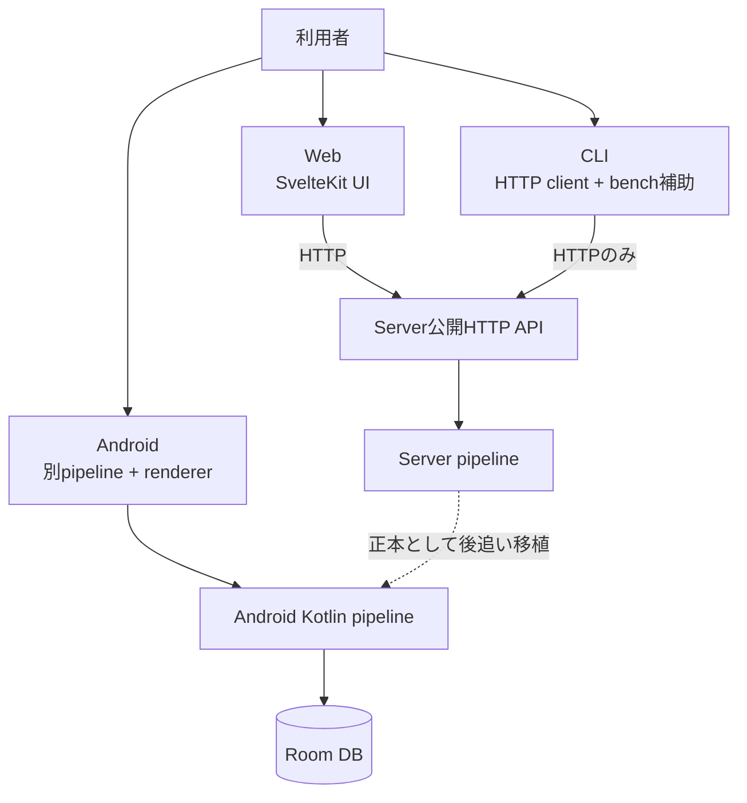
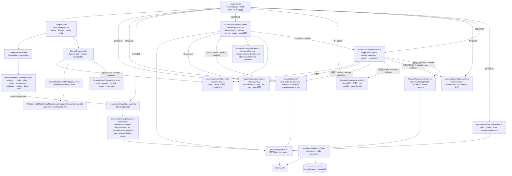

# Client boundaries

## 三clientの責任差

Webはserver作品を操作する参照UI、CLIはserverの公開APIを測るclient、Androidは端末内で全段を動かす別実装である。Androidがserver APIを通常pipelineとして呼ぶ関係は確認できない。

## Web内部

## Webの状態と永続化

| 所有者 | 例 | 境界 |
|---|---|---|
| route shell memory | output tab、modal表示、短い表示用projection、lifecycle配線 | reloadで消える。server正本ではない。domain workflowはrouteごとに1回生成し、routeへ複製しない |
| route-instance Session owner | login/logout、current actor、profile編集、memberのUI/history preference、download folder preference | routeごとに1個の`createSessionState`。認証後処理はnamed boundaryを通り、password値はoperation内に留まる |
| route-instance Work owner | single-work input、submit/replay/stop、current DDL/result/sketch projection、timer/token、Batch/Demoとの1作品Paint調停 | routeごとに1個の`createWorkState`。single-workのAbortControllerとstale-run判断を所有し、requestやstate copyを増やさずstateless Paint operationを呼ぶ |
| route-instance Batch owner | prompt履歴、resume/retry plan、line進行、停止、failure、latest-result follow | routeごとに1個の`BatchState`。private run identityがlate resultを遮断し、Workから1作品Paintとfocused history callbackだけを借りる |
| route-instance Demo owner | demo設定、prompt生成、反復、timeout/stop、token/elapsed、current result保存 | routeごとに1個の`DemoState`。private run identityが停止済みrunの遅延結果を遮断し、Workから1作品Paintとfocused projectionだけを借りる |
| stateless run feature | 1回のPaint request、stream進行、保存直後projection | `runCurrentWork`はWorkから解決済みdefaultと名前付きcapabilityを受ける。route/component stateと外側run ownershipはoperationへ入らない |
| route-instance lineage query owner | lineage graph/loading/error、stale-response identity、branch/overview merge、nearby作品 | routeごとに1個の`LineageQueryState`。query stateをhistory action moduleやpageへ複製しない |
| route-instance history browsing owner | stripのitems/count/offset/選択、filter、paging/resize、stale-response identity、trash summary、external refresh、mark projection、manager連携 | routeごとに1個の`HistoryBrowsingState`が既存`HistoryManagerState`を必ず1個だけ生成する。managerのrequest/cache/page-size意味論は複製しない |
| route-instance history mutation coordinator | star/revision/shareのoptimistic mutation、trash/restore/permanent-deleteのbulk coordination | routeごとに1個の`HistoryMutations`。stateを複製せず、browsing/lineage ownerとcurrent-work capabilityへ名前付きprojectionだけを渡す |
| stateless history work operations | 保存用history payload、saved-work replay、history→current-work projection、saved-child/promote/note調停 | `save.ts`、`replay.ts`、`current-work.ts`、`lineage-actions.ts`がtyped inputと名前付きcapabilityだけを受ける。route UIと該当するWorkまたはRefinement ownerがstateと適用判断を保持する |
| route-instance Canvas viewport owner | zoom、measured fit zoom、pan、pointer capture、keyboardによるzoom/pan | routeごとに1個の`CanvasViewportState`。`CanvasPanel`はtyped ownerを受け、pageはglobal shortcutのeligibilityとwork切替時の`fit()`要求だけを結線する |
| route-instance refinement session owner | single/grid/save busy、elapsed/token、fan-out slot、AbortController、candidate selection | routeごとに1個の`RefinementSessionState`。active controllerだけがprogress/error/finishをcommitし、coordinatorとCanvas viewがtyped ownerを共有する |
| route-instance refinement coordinator | target identity、precondition、candidate request transport、fan-out/session調停、redraw/save adoption、history reseat、Canvas fit | routeごとに1個の`createRefinementCoordinator`。明示的なtyped Work subsetとnamed history/render/catalog capabilityを受け、mutable stateやrequestを複製しない |
| stateless refinement fan-out | 5 kindのcandidate plan、composition seed除外、alternate catalog順序、variation seed割当呼び出し、label、bounded indexed execution | `refinement-fanout.ts`がcoordinatorからtyped snapshot、1個のAbortSignal、named candidate factoryを受ける。route/session stateとHTTP transportは所有しない |
| stateless single-redraw action | touch/layout/readingのseed選択、touch request/result構築、Paint invocation option、current-result field projection | `refinement-redraw.ts`が解決済みinputとnamed transport/seed/Paint capabilityを受ける。target check、session/loading/error、history reseat、reading diff、view選択、viewport適用はcoordinatorが保持する |
| stateless refinement candidate actions | candidate→current Canvas projection、選択snapshotの逐次history保存、stale/identity調停 | `refinement-actions.ts`がtyped candidateとnamed save/context capabilityを受ける。coordinatorがprojectionとsaved identityをcanonical Work ownerへ適用する |
| Canvas current-artwork focused view | current artwork、corner control、status mark、navigation、export、caption、empty motif、zoom表示 | `CanvasArtworkWorkspace.svelte`がtyped display propsと唯一の`CanvasViewportState`を受ける。`CanvasPanel`はtab/overlay compositionと共有work選択を保持する |
| Canvas generation-information focused view | 詳細・prompt・score tab、作品由来情報の表示、drawer固有のscroll element | `CanvasGenerationInfo.svelte`がtyped display propsを受けて描画する。開閉、outside/Escape、tab別scroll memory、共有SVG計測は`CanvasPanel`が所有する |
| Canvas presentation focused view | fullscreen作品画像、caption、navigation・star・caption・close control | `CanvasPresentationOverlay.svelte`がminimal work markとtyped display props/callbacksを受けて描画する。open state、toolbar、Escape、current workとmutationは`CanvasPanel`が所有する |
| Canvas refinement workspace focused views | stateless workspace shellとadjust/model比較/language比較view | `CanvasRefinementWorkspace.svelte`が3個のcapability-local viewをcomposeする。各viewは自分のtyped state/actionだけを受け、共有styleはfeature stylesheet 1個に置く |
| route-instance Settings aggregateとslice | navigation/detail、server/plugin操作、model provider操作、user/group操作 | `createSettingsController`が4個のroute-instance sliceを1回ずつcomposeする。aggregateが唯一のdomain入口で、slice stateを複製しない |
| focused Settings views | model選択/管理、plugin管理、export、appearance、database、runtime、limits、users | `SettingsModal.svelte`はtab shell。各focused viewはlocal draftとmarkupだけを所有し、aggregate全体ではなくtyped sub-capabilityを受ける |
| localStorage | UI language、設定dialog詳細度、wild、batch retry、result log、export設定、表示向き | browser-local |
| IndexedDB | File System Access APIのfolder handle | structured cloneが必要でlocalStorage外 |
| user server settings | catalog、model inspection等の`model_settings` slice | login user単位、`user-settings.ts`で集約 |
| render payload | catalog/wild等のrequest field | `render-payload.ts`のkind別contributor |
| server DB | 履歴、SVG、Score、系譜 | clientが信頼済みSVGを決めない |

`+page.svelte`はroute composition shellとなった。route-instance ownerを各1回生成し、top-level lifecycle、認証画面切替、modal/view表示、build表示、短いcross-owner projection、named capability配線を保持する。`features/work/state.svelte.ts`がcurrent single-work stateとsubmit/replay/stopを所有し、`features/batch/state.svelte.ts`と`features/demo/state.svelte.ts`が各runの非同期lifecycleを所有する。Workは両ownerへ1作品Paintとfocused callbackだけを貸す。`features/run/current-work.ts`はstatelessな1回のPaint operationに留まる。`features/session/state.svelte.ts`が認証とmember preferenceを所有する。`features/canvas/refinement-coordinator.svelte.ts`がtarget identityとrefinement orchestrationを所有し、既存session/action moduleを再利用する。

以下のStage 5〜7の段落は、各cut直後の境界を記録した履歴である。現在の収束後の境界は、上の責務表とStage 10の段落を正とする。

Stage 5Aではlineageとnearby作品のquery stateをroute-instanceの`LineageQueryState`へ置く。request identity、loading/error、graph置換、branch/overview merge、reset invalidation、同一historyのneighbor deduplicationをここが所有する。`runCurrentWork`には`loadNearby` methodを直接渡す。

Stage 5Bではhistory browsingをroute-instanceの`HistoryBrowsingState`へ置く。strip/trash query、paging、選択同期、filter、resize時のoffset整列、stale-response identity、外部保存refresh、保存・run後の一覧refresh、mark projectionをここが所有する。既存`HistoryManagerState`を必ず1個だけ生成し、そのrequest suppression・cache・実測page-size規則を複製せずにseed/refreshする。pageはcurrent workとbrowser lifecycleのcapabilityを渡す。

Stage 5Cでは`HistoryMutations`がstar/revision/shareのoptimistic PATCHとrollback、trash/restore/permanent-deleteのbulk POSTとrefresh順を所有する。mutable stateは複製せず、`HistoryBrowsingState`と`LineageQueryState`へnamed projectionを送り、current canvasの再着席だけをpage capabilityへ返す。

Stage 5Dではstatelessな4 moduleが、保存用`POST /api/history` payloadと一覧再同期、saved-work replay request/version比較、history itemからcurrent-workへのtyped projection、saved child・promote・noteの複数owner調停を所有する。pageは解決済みbrowser preference、localized message、route target identityを渡し、modal/tab/loading、AbortController、Svelte assignment、Canvas適用・late SVG、lineageからのdraw/refinement actionを保持する。history moduleは`HistoryBrowsingState`、`HistoryMutations`、`LineageQueryState`のstateを複製しない。

Stage 6Aではroute-instanceの`CanvasViewportState`がzoom、fit zoom、pan、drag origin、pointer capture、keyboard mappingを所有する。`CanvasPanel`は個別state/callback群ではなくtyped ownerを受け、ResizeObserverのmeasurementとwheel/pointer eventをnamed operationへ渡す。pageはinput/modal等を除外するglobal shortcut gateと、work/result切替時にviewportをfitへ戻すcompositionだけを保持する。refinement、variation、current result、Canvas markupはこのStageでは移動しない。

Stage 6Bではroute-instanceの`RefinementSessionState`がsingle/grid/save busy、elapsed/token totals、fan-out waiting/running/done、cancel identity、status、candidate selectionを所有する。target resetはactive controllerをabort/invalidateし、late callbackはidentity checkで新しいsessionへ書けない。`CanvasPanel`は個別session propsではなくtyped ownerを受ける。candidate endpoint/plan、history save、Canvas apply、fallback confirm、target context version、single redraw result mappingはpageに残る。

Stage 6Cではstatelessな`refinement-actions.ts`がcandidateからcurrent Canvasへのfield projectionと、選択snapshotの逐次history保存payload/orderを所有する。各save直後のpage-owned context predicateでstaleを止め、表示中の同一resultだけがsaved identityを受ける。pageはsession lock/status、target version、history operation、current state代入、history sync、output tab、viewportを保持する。candidate generation transport/plan/fan-outとsingle redraw result mappingはpageに残る。

Stage 6Dではstatelessな`refinement-fanout.ts`が5 kindのcandidate plan、composition seed除外、alternate catalogのshuffle/cycle、server-backed variation seed allocatorの1回の呼び出し、label、factory dispatch、bounded indexed executionを所有する。pageはcurrent snapshot、localized label、1個のAbortSignal、解決済みrender limit、named candidate factoryを渡す。candidate/variation-seedのHTTP transport、input/fallback/target validation、session begin/timer/progress/finish、cancel ownership、token/status処理、current Canvas適用はpageに残る。

Stage 6Eではstatelessな`refinement-redraw.ts`がtouch/layout/readingのsingle redraw seed選択、touchの`render-svg` requestとderivation result identity、layout/readingのPaint option、共通current-result projectionを所有する。pageは解決済みwork/catalog/render inputとnamed transport/seed/Paint capabilityを渡す。precondition、fallback確認、visible lineage parent materialization、single sessionとloading/error state、history reseat、interpretation diff、最終Svelte assignment、output tab、timer、viewport coordinationはpageに残る。candidate grid request transportはこのStageで移動しない。

Stage 7Aでは`CanvasGenerationInfo.svelte`が生成情報drawerの詳細・prompt・score表示、作品由来の表示用projection、drawer固有styleを所有する。`CanvasPanel`は開閉、outside/Escape、active tab、tab別scroll memory、表示中作品からの共有SVG計測を保持し、typed propsとnamed callbackだけを渡す。抽出したviewはroute/session state、HTTP、current-work変更を所有しない。

Stage 7Bでは`CanvasPresentationOverlay.svelte`がfullscreen作品画像、caption、control markup、presentation専用styleを所有する。`CanvasPanel`はopen/close、toolbar、Escape priority、current work、navigation/star/caption mutationを保持し、minimal mark projectionとnamed callbackだけを渡す。抽出したviewはmutable owner、route state、HTTPを持たない。

Stage 7Cでは`CanvasRefinementWorkspace.svelte`がbackdrop、shell、adjust/candidate表示、model/language比較表示、refinement専用styleを所有する。`CanvasPanel`はoutput/view/open state、refinement kindの永続化とDDL-origin補正、amplitude/touch word ownership、Escape/close、current作品画像URL、全operationを保持する。focused viewは既存のtyped refinement-session/model-inspection owner、解決済みdisplay props、named callbackを受け取り、mutable ownerやtransportを追加しない。

Stage 10では行数ではなく変更理由に沿って5つの高変更面を収束させた。refinement workspaceはstateless shell配下の3 focused view、Canvas current-artwork表示は1 focused workspace、Settings stateは1 aggregate配下の4 route-instance slice、Settings表示はtab shell配下のfocused view、route workflowはSession・Work・Refinementの各1 ownerになった。forwardingだけのlayer、rune stateの複製、request、serialization、polling、追加await boundaryは導入しない。

`features/settings/state.svelte.ts`のSettings aggregateはnavigation、server、model provider、user/groupのsliceを各1回生成する。pageはsigned-in actorとnamed external loaderだけを渡す。`SettingsModal.svelte`はmodal/tab compositionだけを行い、focused viewへtyped sub-capabilityを渡す。account/password、API key、plugin、export、appearanceのdraftは描画するfocused view内だけに留まる。秘密値は既存operation境界だけを通り、aggregate state、確認dialog、errorへ複製しない。

## CLI境界

- `ApiClient` は `urllib.request` で `/api/*` と `/health` だけを扱う。
- runtime codeは `inku_server` をimportしない。`inku_analysis` はrasterize/analysis用の共有packageで、server pipelineを迂回するものではない。
- `paint` / `batch` の自然文modeは `/api/paint`、DDL modeは `/api/compose`、保存時は `/api/history` を利用する。
- 機能試験の送信者として `test_cli_sender_census.py` に検査される。CLI testがserver sourceを読む箇所はテスト上の契約照合であり、製品runtime依存ではない。

## Android境界

- `InkuRepository` → `LocalFallbackPipeline` → `SvgRenderer` / `AndroidRenderHost` → JNI → 共有`inku-render` → Roomという端末内flow。
- `RoutingModelProvider` はlocal LiteRT-LMとOpenAI-compatible remote providerを選ぶ。
- engine identityとrenderer referenceは同梱Rust coreから取得し、Kotlinに版literalを持たない。
- preview、thumbnail、refinement、PNG exportは保存済み／現行SVGを`inku-svg-raster`でpixel化する。AndroidSVGとKotlin renderer fallbackは無い。
- Kotlinが引き続き所有するのはStage 1 / 1.5 / 2、Score coerce／repair、host option、Room／history、`rh3` identityである。

## i18nとUI token

| 正本 | 実装 |
|---|---|
| 日本語/英語UI pack | `web/src/lib/i18n/ja.ts`, `en.ts`, `types.ts` |
| 英語UI用語 | `docs/i18n/glossary.md`（対応表）、`web/src/lib/i18n/GLOSSARY.md`（規則）、`npm run lint:i18n` |
| 歳時記表示 | login後の`GET /api/saijiki`でserver tableからhydrate |
| button寸法・action/accent色 | `web/src/routes/+page.svelte`の`:root` token |

## 根拠対応

`SYS-WEB`, `SYS-CLI`, `SYS-ANDROID`, `WEB-FEATURES`, `WEB-REGISTRY`, `WEB-I18N`。主要pathは図中に記載した。
