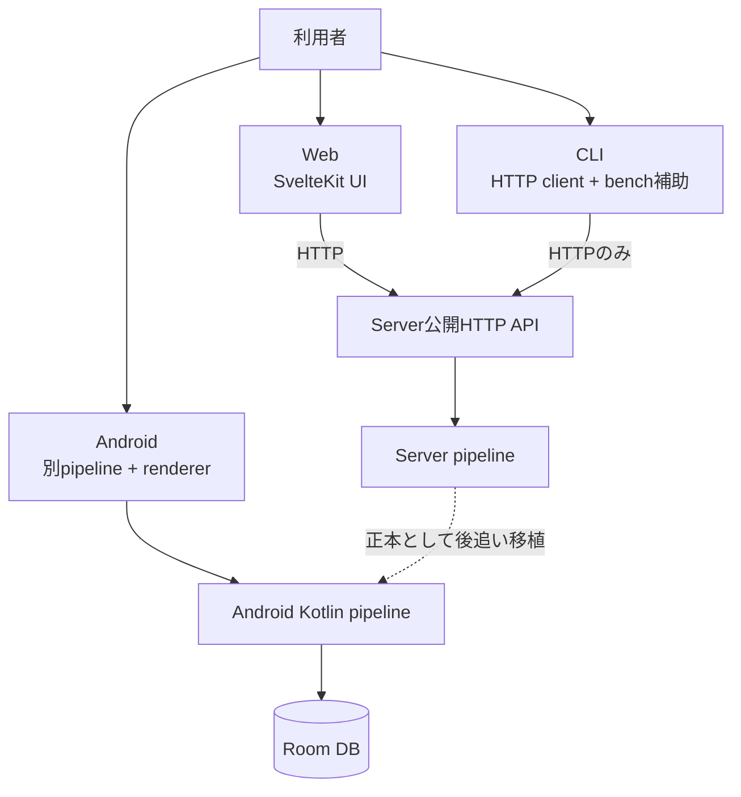
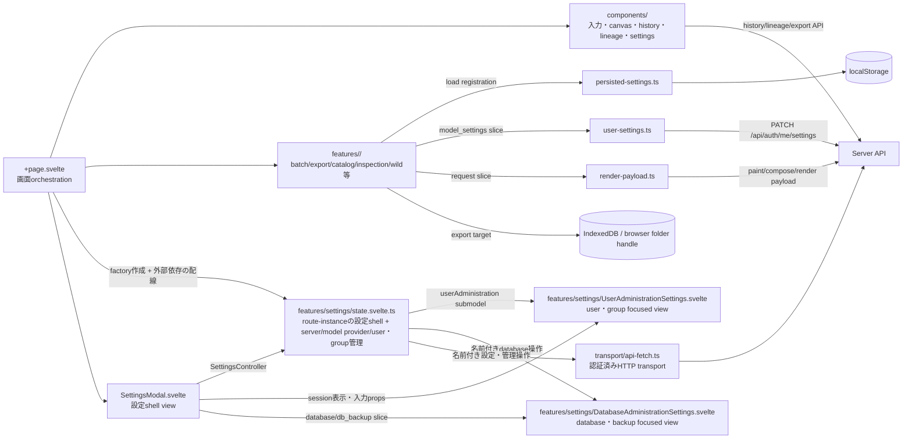

# Client boundaries

## 三clientの責任差

Webはserver作品を操作する参照UI、CLIはserverの公開APIを測るclient、Androidは端末内で全段を動かす別実装である。Androidがserver APIを通常pipelineとして呼ぶ関係は確認できない。

## Web内部

## Webの状態と永続化

| 所有者 | 例 | 境界 |
|---|---|---|
| component/page memory | 描画中のresult、tab、history選択、lineage graph | reloadで消える。server正本ではない |
| route-instance feature owner | 設定dialogの開閉・tab・詳細度、server管理、model provider管理、user/groupの一覧・status・操作 | `createSettingsController`をrouteごとに1回生成する。user/group focused viewへは狭い`userAdministration` submodelだけを渡し、database/backup focused viewへは`database`/`db_backup` status sliceと名前付き操作だけを渡す |
| focused component memory | 入力中のAPI key、account form/password、user/group選択 | 入力を描くcomponentだけが保持する。account draftは`UserAdministrationSettings.svelte`、API key draftは`SettingsModal.svelte`に留まる |
| localStorage | UI language、設定dialog詳細度、wild、batch retry、result log、export設定、表示向き | browser-local |
| IndexedDB | File System Access APIのfolder handle | structured cloneが必要でlocalStorage外 |
| user server settings | catalog、model inspection等の`model_settings` slice | login user単位、`user-settings.ts`で集約 |
| render payload | catalog/wild等のrequest field | `render-payload.ts`のkind別contributor |
| server DB | 履歴、SVG、Score、系譜 | clientが信頼済みSVGを決めない |

`+page.svelte` は依然大きなorchestratorだが、設定shell、server管理、model provider管理、user/group管理のstate machineはroute-instanceの `features/settings/state.svelte.ts` が所有する。pageはfactoryへ認証利用者、session/user設定refresh、各tabの外部loader、描画用model catalog loader、render同時実行数のsetterを配線する。login/logoutとcurrent actorの正本、および描画時model選択はpageに残る。`SettingsModal.svelte` は設定shellとして1個の `SettingsController` を受け取る。user/group tabは`UserAdministrationSettings.svelte`へ狭い`userAdministration` submodelと必要なsession propsだけを渡し、account form/password draftは入力view内、API key draftはModal内に留める。database/backup tabは`DatabaseAdministrationSettings.svelte`へ`database`/`db_backup` status sliceとreload・設定更新・即時backupの名前付き操作だけを渡し、statusと操作のownerはroute-instance feature ownerに留める。ownerは秘密値をoperation引数からstate、確認dialog、errorへ複製しない。

## CLI境界

- `ApiClient` は `urllib.request` で `/api/*` と `/health` だけを扱う。
- runtime codeは `inku_server` をimportしない。`inku_analysis` はrasterize/analysis用の共有packageで、server pipelineを迂回するものではない。
- `paint` / `batch` の自然文modeは `/api/paint`、DDL modeは `/api/compose`、保存時は `/api/history` を利用する。
- 機能試験の送信者として `test_cli_sender_census.py` に検査される。CLI testがserver sourceを読む箇所はテスト上の契約照合であり、製品runtime依存ではない。

## Android境界

- `InkuRepository` → `LocalFallbackPipeline` → `DefaultSvgRenderer` → Roomという端末内flow。
- `RoutingModelProvider` はlocal LiteRT-LMとOpenAI-compatible remote providerを選ぶ。
- `CompatibilityConstants.renderEngineVersion` は35。Serverの38とは別版である。
- serverの条件式・schema・seed・参照fixtureを後追い移植する。数字が同じでも自動的な同一実装ではない。

## i18nとUI token

| 正本 | 実装 |
|---|---|
| 日本語/英語UI pack | `web/src/lib/i18n/ja.ts`, `en.ts`, `types.ts` |
| 英語UI用語 | `docs/i18n/glossary.md`（対応表）、`web/src/lib/i18n/GLOSSARY.md`（規則）、`npm run lint:i18n` |
| 歳時記表示 | login後の`GET /api/saijiki`でserver tableからhydrate |
| button寸法・action/accent色 | `web/src/routes/+page.svelte`の`:root` token |

## 根拠対応

`SYS-WEB`, `SYS-CLI`, `SYS-ANDROID`, `WEB-FEATURES`, `WEB-REGISTRY`, `WEB-I18N`。主要pathは図中に記載した。
