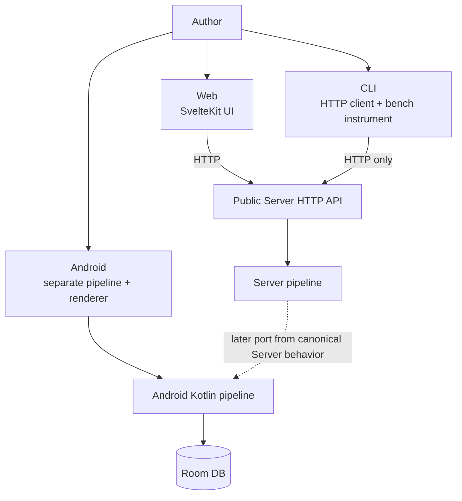
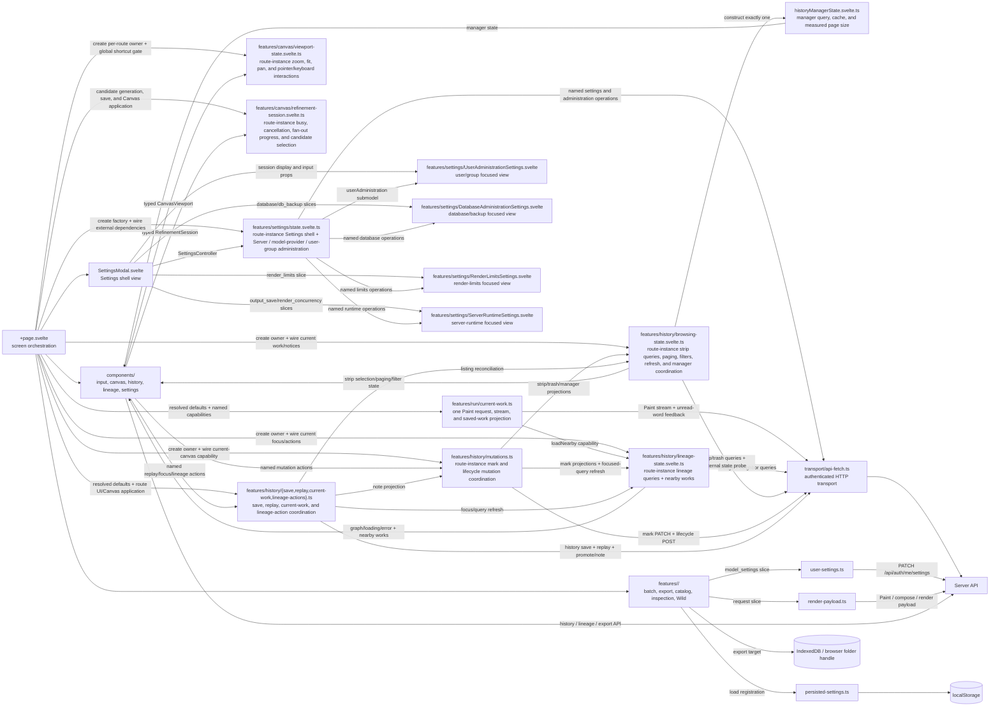

# Client boundaries

## Different responsibilities

Web is the reference UI for Server works. The CLI measures the public API. Android performs every stage on-device as a separate implementation. No ordinary Android path to the Server pipeline was confirmed.

## Web internals

## Web state and persistence

| Owner | Examples | Boundary |
|---|---|---|
| Component/page memory | Current result, output tab, replay modal/loading, and application of current work to Canvas | Lost on reload; not Server-canonical. A stateless history feature builds the field projection from a history item |
| Stateless run feature | One Paint request, stream progress, and immediate saved-work projection | `runCurrentWork` receives resolved defaults and named capabilities; outer loops, route state, and AbortControllers stay with the page |
| Route-instance lineage query owner | Lineage graph/loading/error, stale-response identity, branch/overview merge, and nearby works | One `LineageQueryState` per route; query state is not copied into a history action module or the page |
| Route-instance history browsing owner | Strip items/count/offset/selection, filters, paging/resize, stale-response identity, trash summary, external refresh, mark projections, and manager coordination | One `HistoryBrowsingState` per route constructs exactly one existing `HistoryManagerState`; manager request/cache/page-size semantics are not copied |
| Route-instance history mutation coordinator | Optimistic star/revision/share mutations and bulk trash/restore/permanent-delete coordination | One `HistoryMutations` per route; it duplicates no state and sends only named projections to the browsing/lineage owners and the page-owned current canvas |
| Stateless history work operations | Save-oriented history payload, saved-work replay, history-to-current-work projection, and saved-child/promote/note coordination | `save.ts`, `replay.ts`, `current-work.ts`, and `lineage-actions.ts` receive only typed inputs and named capabilities; route UI, AbortControllers, and Canvas application stay with the page |
| Route-instance Canvas viewport owner | Zoom, measured fit zoom, pan, pointer capture, and keyboard zoom/pan | One `CanvasViewportState` per route; `CanvasPanel` receives the typed owner, while the page wires only global-shortcut eligibility and `fit()` requests when work changes |
| Route-instance refinement session owner | Single/grid/save busy state, elapsed/tokens, fan-out slots, AbortController, and candidate selection | One `RefinementSessionState` per route; only the active controller commits progress/errors/finish, and `CanvasPanel` sends cancel/toggle to the typed owner. Candidate requests, saves, and Canvas application stay with the page |
| Route-instance feature owner | Settings dialog visibility, tab and detail level; Server and model-provider administration; user/group lists, status, and operations | One `createSettingsController` per route; focused views receive only their required `userAdministration`, `database`/`db_backup`, `render_limits`, or `output_save`/`render_concurrency` slices and named operations |
| Focused component memory | Unsaved API keys, account forms and passwords, and user/group selection | Kept only by the component that renders the input: account drafts in `UserAdministrationSettings.svelte`, API-key drafts in `SettingsModal.svelte` |
| localStorage | UI language, Settings detail level, Wild, batch retry, result log, export and orientation settings | Browser-local |
| IndexedDB | File System Access folder handle | Needs structured clone, outside localStorage |
| User Server settings | Catalog and model-inspection `model_settings` slices | Per login user through `user-settings.ts` |
| Render payload | Catalog, Wild, and related request fields | Contributors grouped by request kind in `render-payload.ts` |
| Server DB | History, SVG, Score, lineage | A client does not choose trusted SVG content |

`+page.svelte` remains the screen orchestrator, while `features/run/current-work.ts` owns one Paint request, its NDJSON progress, and the immediate nearby-history, saved-lineage, generation-count, and unread-word effects. The page resolves its current settings and supplies narrow named capabilities; it retains the current result, outer submit/replay/batch/demo/refinement loops, stale-result decisions, and AbortController ownership.

Stage 5A places lineage and nearby-work query state in one route-instance `LineageQueryState`. It owns request identity, loading/error, graph replacement, branch/overview merge, reset invalidation, and same-history neighbor deduplication. `runCurrentWork` receives its `loadNearby` method directly.

Stage 5B places history browsing in one route-instance `HistoryBrowsingState`. It owns strip and trash queries, paging, selection synchronization, filters, resize alignment, stale-response identity, external-save refresh, save/run listing refresh, and mark projections. It constructs exactly one existing `HistoryManagerState` and seeds or refreshes that owner without duplicating its request suppression, cache, or measured page-size rules. The page supplies current-work and browser-lifecycle capabilities.

Stage 5C makes `HistoryMutations` own optimistic star/revision/share PATCH and rollback, plus bulk trash/restore/permanent-delete POST and refresh ordering. It duplicates no mutable state: named projections go to `HistoryBrowsingState` and `LineageQueryState`, while current-canvas reseating returns through a page capability.

Stage 5D assigns four stateless modules the save-oriented `POST /api/history` payload and listing reconciliation, saved-work replay request and version comparison, typed history-item-to-current-work projection, and saved-child/promote/note coordination across existing owners. The page supplies resolved browser preferences, localized messages, and route-target identity. It retains modal/tab/loading state, AbortControllers, Svelte assignments, Canvas application and late-SVG handling, and draw/refinement actions launched from lineage. History modules do not copy state from `HistoryBrowsingState`, `HistoryMutations`, or `LineageQueryState`.

Stage 6A makes one route-instance `CanvasViewportState` own zoom, fit zoom, pan, drag origins, pointer capture, and keyboard mapping. `CanvasPanel` receives the typed owner instead of individual state and callback props, and passes ResizeObserver measurements plus wheel and pointer events to named operations. The page retains the global shortcut gate that excludes inputs and modals, plus composition calls that return the viewport to fit when the work or result changes. Refinement, variations, the current result, and Canvas markup do not move in this Stage.

Stage 6B makes one route-instance `RefinementSessionState` own single/grid/save busy state, elapsed and token totals, fan-out waiting/running/done progress, cancellation identity, status, and candidate selection. A target reset aborts and invalidates the active controller, so late callbacks cannot write into a replacement session. `CanvasPanel` receives the typed owner instead of individual session props. Candidate endpoints and planning, history saves, Canvas application, fallback confirmation, target-context versioning, and single-redraw result mapping stay with the page.

The Settings shell, Server administration, model-provider administration, and user/group administration state machines are owned by the route-instance `features/settings/state.svelte.ts`. The page wires the signed-in actor, session/user-settings refresh, external per-tab loaders, drawing-time model-catalog loader, and render-concurrency setter into the factory. Login/logout, the canonical current actor, and drawing-time model selection stay on the page. `SettingsModal.svelte` receives one `SettingsController` as the Settings shell. The user/group tab passes only the narrow `userAdministration` submodel and required session props to `UserAdministrationSettings.svelte`; account-form/password drafts stay in that input view, while API-key drafts stay in the modal. The database/backup tab passes only `database`/`db_backup` to `DatabaseAdministrationSettings.svelte`, the render-limits tab only `render_limits` to `RenderLimitsSettings.svelte`, and the server-runtime tab only `output_save`/`render_concurrency` to `ServerRuntimeSettings.svelte`, each with required named operations. Status and operation ownership stays in the route-instance feature owner. The owner never copies a secret from an operation argument into state, confirmation, or error output.

## CLI boundary

- `ApiClient` uses `urllib.request` for `/api/*` and `/health`.
- Runtime code does not import `inku_server`. Shared `inku_analysis` is used for rasterization/analysis, not to bypass the Server pipeline.
- Natural-language `paint`/`batch` uses `/api/paint`; DDL mode uses `/api/compose`; history persistence uses `/api/history`.
- `test_cli_sender_census.py` treats the CLI as the functional sender.

## Android boundary

- Flow: `InkuRepository` → `LocalFallbackPipeline` → `DefaultSvgRenderer` → Room.
- `RoutingModelProvider` selects local LiteRT-LM or an OpenAI-compatible remote provider.
- `CompatibilityConstants.renderEngineVersion` is 35; Server is 38.
- Server conditions, schema, seeds, and reference fixtures are ported later. Matching numbers would not by themselves prove identical implementations.

## Language and UI sources

| Source | Implementation |
|---|---|
| Japanese/English UI packs | `web/src/lib/i18n/ja.ts`, `en.ts`, `types.ts` |
| English terminology | `docs/i18n/glossary.md` (correspondence table); `web/src/lib/i18n/GLOSSARY.md` (rules); `npm run lint:i18n` |
| Saijiki display | `GET /api/saijiki` after login |
| Button dimensions and action/accent tokens | `:root` in `web/src/routes/+page.svelte` |

## Evidence map

Evidence: `SYS-WEB`, `SYS-CLI`, `SYS-ANDROID`, `WEB-FEATURES`, `WEB-REGISTRY`, `WEB-I18N`.
