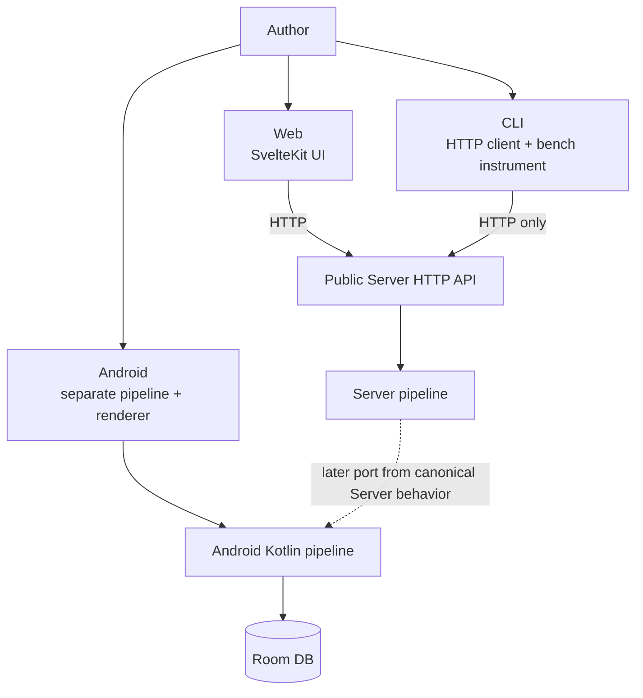
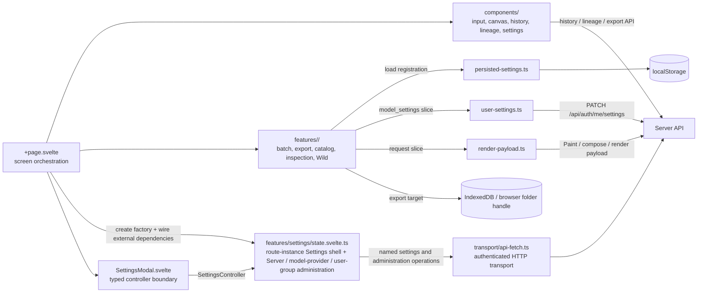

# Client boundaries

## Different responsibilities

Web is the reference UI for Server works. The CLI measures the public API. Android performs every stage on-device as a separate implementation. No ordinary Android path to the Server pipeline was confirmed.

## Web internals

## Web state and persistence

| Owner | Examples | Boundary |
|---|---|---|
| Component/page memory | Current result, tab, selected history, lineage graph | Lost on reload; not Server-canonical |
| Route-instance feature owner | Settings dialog visibility, tab and detail level; Server and model-provider administration; user/group lists, status, and operations | One `createSettingsController` per route, passed to the modal as a typed object; API-key and account-form/password input drafts remain local to the modal |
| localStorage | UI language, Settings detail level, Wild, batch retry, result log, export and orientation settings | Browser-local |
| IndexedDB | File System Access folder handle | Needs structured clone, outside localStorage |
| User Server settings | Catalog and model-inspection `model_settings` slices | Per login user through `user-settings.ts` |
| Render payload | Catalog, Wild, and related request fields | Contributors grouped by request kind in `render-payload.ts` |
| Server DB | History, SVG, Score, lineage | A client does not choose trusted SVG content |

`+page.svelte` remains a large orchestrator, but the Settings shell, Server administration, model-provider administration, and user/group administration state machines are owned by the route-instance `features/settings/state.svelte.ts`. The page wires the signed-in actor, session/user-settings refresh, external per-tab loaders, drawing-time model-catalog loader, and render-concurrency setter into the factory. Login/logout, the canonical current actor, and drawing-time model selection stay on the page. `SettingsModal.svelte` receives one `SettingsController`, rather than individual administration status/callback props or raw transport, and keeps unsaved API-key and account-form/password input drafts local. The owner never copies a secret from an operation argument into state, confirmation, or error output.

## CLI boundary

- `ApiClient` uses `urllib.request` for `/api/*` and `/health`.
- Runtime code does not import `inku_server`. Shared `inku_analysis` is used for rasterization/analysis, not to bypass the Server pipeline.
- Natural-language `paint`/`batch` uses `/api/paint`; DDL mode uses `/api/compose`; history persistence uses `/api/history`.
- `test_cli_sender_census.py` treats the CLI as the functional sender.

## Android boundary

- Flow: `InkuRepository` → `LocalFallbackPipeline` → `DefaultSvgRenderer` → Room.
- `RoutingModelProvider` selects local LiteRT-LM or an OpenAI-compatible remote provider.
- `CompatibilityConstants.renderEngineVersion` is 35; Server is 38.
- Server conditions, schema, seeds, and reference fixtures are ported later. Matching numbers would not by themselves prove identical implementations.

## Language and UI sources

| Source | Implementation |
|---|---|
| Japanese/English UI packs | `web/src/lib/i18n/ja.ts`, `en.ts`, `types.ts` |
| English terminology | `docs/i18n/glossary.md` (correspondence table); `web/src/lib/i18n/GLOSSARY.md` (rules); `npm run lint:i18n` |
| Saijiki display | `GET /api/saijiki` after login |
| Button dimensions and action/accent tokens | `:root` in `web/src/routes/+page.svelte` |

## Evidence map

Evidence: `SYS-WEB`, `SYS-CLI`, `SYS-ANDROID`, `WEB-FEATURES`, `WEB-REGISTRY`, `WEB-I18N`.
