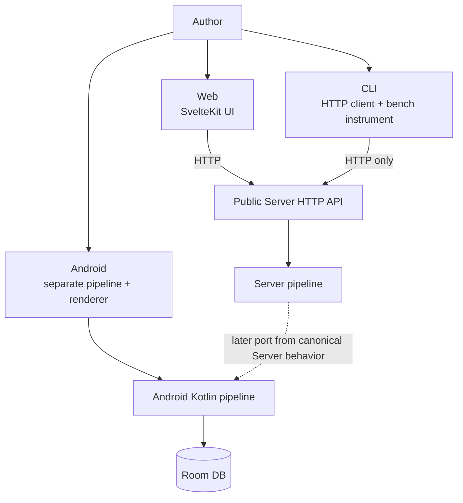

# Client boundaries

## Different responsibilities



Web is the reference UI for Server works. The CLI measures the public API. Android performs every stage on-device as a separate implementation. No ordinary Android path to the Server pipeline was confirmed.

## Web internals

```mermaid
flowchart TB
    PAGE["+page.svelte\nroute lifecycle, shell state, and owner wiring"]
    SESSION["features/session/state.svelte.ts\nlogin, profile, actor, and member preferences"]
    WORK["features/work/state.svelte.ts\nsingle-work input, submit/replay/stop, result, timers, and tokens"]
    BATCH["features/batch/state.svelte.ts\nbatch prompt, resume/retry, run identity, and progress"]
    DEMO["features/demo/state.svelte.ts\ndemo settings, repetition, run identity, and current result"]
    RUN["features/run/current-work.ts\nstateless one-Paint operation and stream projection"]
    HISTORY["features/history/*\nroute-instance browsing, lineage, mutations, and stateless work actions"]
    VIEWPORT["features/canvas/viewport-state.svelte.ts\nroute-instance zoom, fit, pan, and input handling"]
    REFINE_SESSION["features/canvas/refinement-session.svelte.ts\nbusy, cancellation, progress, and candidates"]
    REFINE_COORD["features/canvas/refinement-coordinator.svelte.ts\ntarget identity, redraw, fan-out, adoption, and save orchestration"]
    REFINE_OPS["features/canvas/{refinement-redraw,refinement-fanout,refinement-actions}.ts\nstateless refinement operations"]
    SETTINGS["features/settings/state.svelte.ts\ntyped aggregate"]
    SETTINGS_SLICES["features/settings/{navigation-state,server-administration,model-administration,user-administration}.svelte.ts\nroute-instance Settings owners"]
    COMPONENTS["components/\nroute-facing input, history, lineage, and modal shells"]
    CANVAS_PANEL["CanvasPanel.svelte\nCanvas tab and overlay composition"]
    CANVAS_ART["`CanvasArtworkWorkspace.svelte`\ncurrent work, controls, export, and zoom view"]
    CANVAS_REFINE["CanvasRefinementWorkspace.svelte\nstateless refinement shell"]
    REFINE_VIEWS["Refinement{Adjust,ModelCompare,LanguageCompare}View.svelte\ncapability-local focused views"]
    SETTINGS_MODAL["SettingsModal.svelte\nSettings tab composition"]
    SETTINGS_VIEWS["features/settings/*Settings.svelte\nselection, model, plugin, export, appearance, database, runtime, limits, and users"]
    TRANSPORT["transport/api-fetch.ts\nauthenticated HTTP transport"]
    REGISTRIES["persisted-settings.ts / user-settings.ts / render-payload.ts"]
    LOCAL[("localStorage / IndexedDB")]
    API["Server API"]

    PAGE -->|"construct once"| SESSION
    PAGE -->|"construct once"| WORK
    PAGE -->|"construct once"| BATCH
    PAGE -->|"construct once"| DEMO
    PAGE -->|"construct once"| REFINE_COORD
    PAGE -->|"construct once"| SETTINGS
    PAGE -->|"construct once"| HISTORY
    PAGE -->|"construct once"| VIEWPORT
    PAGE --> COMPONENTS

    WORK -->|"resolved defaults + named capabilities"| RUN
    WORK -->|"one-work Paint + focused callbacks"| BATCH
    WORK -->|"one-work Paint + focused callbacks"| DEMO
    WORK -->|"selection, refresh, and lineage capabilities"| HISTORY
    WORK -->|"fit requests"| VIEWPORT
    WORK --> REFINE_SESSION
    REFINE_COORD -->|"typed Work subset"| WORK
    REFINE_COORD --> REFINE_SESSION
    REFINE_COORD --> REFINE_OPS
    REFINE_COORD -->|"save, reseat, and parent capabilities"| HISTORY
    REFINE_COORD -->|"fit capability"| VIEWPORT

    SETTINGS --> SETTINGS_SLICES
    SETTINGS_SLICES --> TRANSPORT
    SESSION --> TRANSPORT
    RUN --> TRANSPORT
    HISTORY --> TRANSPORT
    REFINE_COORD --> TRANSPORT

    COMPONENTS --> CANVAS_PANEL
    CANVAS_PANEL --> CANVAS_ART
    CANVAS_PANEL --> CANVAS_REFINE
    CANVAS_REFINE --> REFINE_VIEWS
    CANVAS_PANEL -->|"typed owners and named callbacks"| REFINE_SESSION
    COMPONENTS --> SETTINGS_MODAL
    SETTINGS_MODAL --> SETTINGS_VIEWS
    SETTINGS_VIEWS -->|"typed Settings slices"| SETTINGS

    REGISTRIES --> LOCAL
    REGISTRIES --> API
    TRANSPORT --> API
```

## Web state and persistence

| Owner | Examples | Boundary |
|---|---|---|
| Route shell memory | Output tab, modal visibility, short presentation projections, and lifecycle wiring | Lost on reload; not Server-canonical. Domain workflows are constructed once and are not copied back into the route |
| Route-instance Session owner | Login/logout, current actor, profile editing, member UI/history preferences, and download-folder preference | One `createSessionState` per route; authentication callbacks cross a named boundary and password values stay inside the operation |
| Route-instance Work owner | Single-work input, submit/replay/stop, current DDL/result/sketch projection, timer/token totals, and one-work Paint coordination with Batch/Demo | One `createWorkState` per route; it owns single-work AbortControllers and stale-run decisions and calls the stateless Paint operation without adding a request or state copy |
| Route-instance Batch owner | Prompt history, resume/retry plans, line progress, stopping, failures, and latest-result following | One `BatchState` per route; a private run identity rejects late results, and the owner borrows only one-work Paint plus focused history callbacks from Work |
| Route-instance Demo owner | Demo settings, prompt generation, repetition, timeout/stop, token/elapsed totals, and current-result saving | One `DemoState` per route; a private run identity rejects results from stopped runs, and the owner borrows only one-work Paint plus focused projections from Work |
| Stateless run feature | One Paint request, stream progress, and immediate saved-work projection | `runCurrentWork` receives resolved defaults and named capabilities from Work; route/component state and outer run ownership do not enter the operation |
| Route-instance lineage query owner | Lineage graph/loading/error, stale-response identity, branch/overview merge, and nearby works | One `LineageQueryState` per route; query state is not copied into a history action module or the page |
| Route-instance history browsing owner | Strip items/count/offset/selection, filters, paging/resize, stale-response identity, trash summary, external refresh, mark projections, and manager coordination | One `HistoryBrowsingState` per route constructs exactly one existing `HistoryManagerState`; manager request/cache/page-size semantics are not copied |
| Route-instance history mutation coordinator | Optimistic star/revision/share mutations and bulk trash/restore/permanent-delete coordination | One `HistoryMutations` per route; it duplicates no state and sends only named projections to the browsing/lineage owners and the current-work capability |
| Stateless history work operations | Save-oriented history payload, saved-work replay, history-to-current-work projection, and saved-child/promote/note coordination | `save.ts`, `replay.ts`, `current-work.ts`, and `lineage-actions.ts` receive only typed inputs and named capabilities; route UI and the relevant Work or Refinement owner retain state and application decisions |
| Route-instance Canvas viewport owner | Zoom, measured fit zoom, pan, pointer capture, and keyboard zoom/pan | One `CanvasViewportState` per route; `CanvasPanel` receives the typed owner, while the page wires only global-shortcut eligibility and `fit()` requests when work changes |
| Route-instance refinement session owner | Single/grid/save busy state, elapsed/tokens, fan-out slots, AbortController, and candidate selection | One `RefinementSessionState` per route; only the active controller commits progress/errors/finish, and the coordinator and Canvas views share that typed owner |
| Route-instance refinement coordinator | Target identity, preconditions, candidate request transport, fan-out/session coordination, redraw adoption, save adoption, history reseating, and Canvas fit | One `createRefinementCoordinator` per route; it receives an explicit typed Work subset and named history/render/catalog capabilities. No mutable state or request is duplicated |
| Stateless refinement fan-out | Five-kind candidate plans, composition-seed exclusion, alternate-catalog order, variation-seed allocation call, labels, and bounded indexed execution | `refinement-fanout.ts` receives a typed snapshot, one AbortSignal, and named candidate factories from the coordinator. It owns no route/session state or HTTP transport |
| Stateless single-redraw actions | Touch/layout/reading seed selection, touch request/result construction, Paint invocation options, and current-result field projection | `refinement-redraw.ts` receives resolved inputs and named transport, seed, and Paint capabilities. The coordinator retains target checks, session/loading/error, history reseating, reading diff, view selection, and viewport application |
| Stateless refinement candidate actions | Candidate-to-current-Canvas projection, sequential history saves for a selected snapshot, and stale/identity coordination | `refinement-actions.ts` receives typed candidates plus named save/context capabilities. The coordinator applies the projection and saved identity to the canonical Work owner |
| Canvas current-work focused view | Current work, corner controls, status marks, navigation, export, caption, empty motif, and zoom presentation | `CanvasArtworkWorkspace.svelte` receives typed display props and the one `CanvasViewportState`; `CanvasPanel` retains tab/overlay composition and shared work selection |
| Canvas generation-information focused view | Details, prompts, and score tabs; recorded-work presentation; and drawer-local scroll elements | `CanvasGenerationInfo.svelte` renders typed display props. `CanvasPanel` owns open/close, outside/Escape handling, per-tab scroll memory, and the shared SVG measurement |
| Canvas presentation focused view | Fullscreen work image, caption, and navigation, star, caption, and close controls | `CanvasPresentationOverlay.svelte` renders a minimal work mark plus typed display props and callbacks. `CanvasPanel` owns open state, the toolbar, Escape, the current work, and mutations |
| Canvas refinement workspace focused views | Stateless workspace shell plus adjust, model-comparison, and language-comparison views | `CanvasRefinementWorkspace.svelte` composes three capability-local views. Each view receives only its own typed state/actions; shared styles remain one feature stylesheet |
| Route-instance Settings aggregate and slices | Navigation/detail, Server/plugin operations, model-provider operations, and user/group operations | `createSettingsController` composes four route-instance slices once. The aggregate is the only domain entry point and mirrors no slice state |
| Focused Settings views | Model selection/administration, plugin administration, export, appearance, database, runtime, limits, and users | `SettingsModal.svelte` is a tab shell. Each focused view owns only its local drafts and markup and receives a typed sub-capability rather than the whole aggregate |
| localStorage | UI language, Settings detail level, Wild, batch retry, result log, export and orientation settings | Browser-local |
| IndexedDB | File System Access folder handle | Needs structured clone, outside localStorage |
| User Server settings | Catalog and model-inspection `model_settings` slices | Per login user through `user-settings.ts` |
| Render payload | Catalog, Wild, and related request fields | Contributors grouped by request kind in `render-payload.ts` |
| Server DB | History, SVG, Score, lineage | A client does not choose trusted SVG content |

`+page.svelte` is now the route composition shell: it constructs route-instance owners once, keeps top-level lifecycle, authenticated switching, modal/view visibility, build presentation, and short cross-owner projections, and wires named capabilities. `features/work/state.svelte.ts` owns current single-work state plus submit/replay/stop; `features/batch/state.svelte.ts` and `features/demo/state.svelte.ts` own their asynchronous run lifecycles. Work lends each owner only one-work Paint and focused callbacks. `features/run/current-work.ts` remains the stateless one-Paint operation. `features/session/state.svelte.ts` owns authentication and member preferences. `features/canvas/refinement-coordinator.svelte.ts` owns target identity and refinement orchestration while reusing the existing session and stateless action modules.

The following Stage 5-7 paragraphs record the boundary after each historical cut. The Stage 10 paragraph and ownership table above describe the current converged boundary.

Stage 5A places lineage and nearby-work query state in one route-instance `LineageQueryState`. It owns request identity, loading/error, graph replacement, branch/overview merge, reset invalidation, and same-history neighbor deduplication. `runCurrentWork` receives its `loadNearby` method directly.

Stage 5B places history browsing in one route-instance `HistoryBrowsingState`. It owns strip and trash queries, paging, selection synchronization, filters, resize alignment, stale-response identity, external-save refresh, save/run listing refresh, and mark projections. It constructs exactly one existing `HistoryManagerState` and seeds or refreshes that owner without duplicating its request suppression, cache, or measured page-size rules. The page supplies current-work and browser-lifecycle capabilities.

Stage 5C makes `HistoryMutations` own optimistic star/revision/share PATCH and rollback, plus bulk trash/restore/permanent-delete POST and refresh ordering. It duplicates no mutable state: named projections go to `HistoryBrowsingState` and `LineageQueryState`, while current-canvas reseating returns through a page capability.

Stage 5D assigns four stateless modules the save-oriented `POST /api/history` payload and listing reconciliation, saved-work replay request and version comparison, typed history-item-to-current-work projection, and saved-child/promote/note coordination across existing owners. The page supplies resolved browser preferences, localized messages, and route-target identity. It retains modal/tab/loading state, AbortControllers, Svelte assignments, Canvas application and late-SVG handling, and draw/refinement actions launched from lineage. History modules do not copy state from `HistoryBrowsingState`, `HistoryMutations`, or `LineageQueryState`.

Stage 6A makes one route-instance `CanvasViewportState` own zoom, fit zoom, pan, drag origins, pointer capture, and keyboard mapping. `CanvasPanel` receives the typed owner instead of individual state and callback props, and passes ResizeObserver measurements plus wheel and pointer events to named operations. The page retains the global shortcut gate that excludes inputs and modals, plus composition calls that return the viewport to fit when the work or result changes. Refinement, variations, the current result, and Canvas markup do not move in this Stage.

Stage 6B makes one route-instance `RefinementSessionState` own single/grid/save busy state, elapsed and token totals, fan-out waiting/running/done progress, cancellation identity, status, and candidate selection. A target reset aborts and invalidates the active controller, so late callbacks cannot write into a replacement session. `CanvasPanel` receives the typed owner instead of individual session props. Candidate endpoints and planning, history saves, Canvas application, fallback confirmation, target-context versioning, and single-redraw result mapping stay with the page.

Stage 6C makes stateless `refinement-actions.ts` own candidate-to-current-Canvas field projection plus the payload and order for sequentially saving a selected snapshot. A page-owned context predicate stops stale work immediately after each save, and only the exact result still displayed receives the saved identity. The page retains the session lock and status, target version, history operation, current-state assignment, history sync, output tab, and viewport. Candidate-generation transport, planning, fan-out, and single-redraw result mapping stay with the page.

Stage 6D makes stateless `refinement-fanout.ts` own the five candidate-kind plans, composition-seed exclusion, alternate-catalog shuffle/cycle, the one server-backed variation-seed allocation call, labels, factory dispatch, and bounded indexed execution. The page passes current snapshots, localized labels, one AbortSignal, the resolved render limit, and named candidate factories. It retains candidate and variation-seed HTTP transport, input/fallback/target validation, session begin/timer/progress/finish, cancellation ownership, token/status handling, and current-Canvas application.

Stage 6E makes stateless `refinement-redraw.ts` own touch/layout/reading single-redraw seed selection, the touch `render-svg` request and derived result identity, layout/reading Paint options, and the shared current-result projection. The page passes resolved work/catalog/render inputs and named transport, seed, and Paint capabilities. It retains preconditions, fallback confirmation, visible lineage-parent materialization, single-session and loading/error state, history reseating, interpretation diff, final Svelte assignments, output tab, timer, and viewport coordination. Candidate-grid request transport does not move in this Stage.

Stage 7A makes `CanvasGenerationInfo.svelte` own the generation-information drawer's details, prompts, and score presentation, recorded-work display projections, and drawer-local styles. `CanvasPanel` retains open/close, outside/Escape handling, the active tab, per-tab scroll memory, and the shared SVG measurement for the displayed work, and passes only typed props and named callbacks. The extracted view owns no route or session state, HTTP, or current-work mutation.

Stage 7B makes `CanvasPresentationOverlay.svelte` own the fullscreen work image, caption, control markup, and presentation-only styles. `CanvasPanel` retains open/close, the toolbar, Escape priority, the current work, and navigation, star, and caption mutations, and passes only a minimal mark projection plus named callbacks. The extracted view owns no mutable owner, route state, or HTTP.

Stage 7C makes `CanvasRefinementWorkspace.svelte` own the backdrop, shell, adjust and candidate presentation, model and language comparison presentation, and refinement-only styles. `CanvasPanel` retains output/view/open state, refinement-kind persistence and DDL-origin correction, amplitude and touch-word ownership, Escape/close, the current work image URL, and all operations. The focused view receives the existing typed refinement-session and model-inspection owners plus resolved display props and named callbacks; it adds no mutable owner or transport.

Stage 10 converges the five high-change Web surfaces by responsibility rather than size. The refinement workspace has three focused views under one stateless shell; Canvas current-work presentation has one focused workspace; Settings state is four internal route-instance slices behind one aggregate; Settings presentation is a tab shell over focused views; and the route delegates Session, Work, and Refinement workflows to one owner each. The split introduces no forwarding-only layer, copied rune state, request, serialization, polling, or additional await boundary.

The Settings aggregate in `features/settings/state.svelte.ts` constructs navigation, Server, model-provider, and user/group slices once. The page supplies the signed-in actor and named external loaders. `SettingsModal.svelte` now performs only modal/tab composition and passes typed sub-capabilities to focused views. Account/password, API-key, plugin, export, and appearance drafts remain only in the focused view that renders them. Secret values cross only their existing operation boundary and are not copied into aggregate state, confirmation, or error output.

## CLI boundary

- `ApiClient` uses `urllib.request` for `/api/*` and `/health`.
- Runtime code does not import `inku_server`. Shared `inku_analysis` is used for rasterization/analysis, not to bypass the Server pipeline.
- Natural-language `paint`/`batch` uses `/api/paint`; DDL mode uses `/api/compose`; history persistence uses `/api/history`.
- `test_cli_sender_census.py` treats the CLI as the functional sender.

## Android boundary

- Flow: `InkuRepository` → `LocalFallbackPipeline` → `DefaultSvgRenderer` → Room.
- `RoutingModelProvider` selects local LiteRT-LM or an OpenAI-compatible remote provider.
- `CompatibilityConstants.renderEngineVersion` is 35; Server is 41, and the shared Rust core is not yet integrated into Android.
- Server conditions, schema, seeds, and reference fixtures are ported later. Matching numbers would not by themselves prove identical implementations.

## Language and UI sources

| Source | Implementation |
|---|---|
| Japanese/English UI packs | `web/src/lib/i18n/ja.ts`, `en.ts`, `types.ts` |
| English terminology | `docs/i18n/glossary.md` (correspondence table); `web/src/lib/i18n/GLOSSARY.md` (rules); `npm run lint:i18n` |
| Saijiki display | `GET /api/saijiki` after login |
| Button dimensions and action/accent tokens | `:root` in `web/src/routes/+page.svelte` |

## Evidence map

Evidence: `SYS-WEB`, `SYS-CLI`, `SYS-ANDROID`, `WEB-FEATURES`, `WEB-REGISTRY`, `WEB-I18N`.
