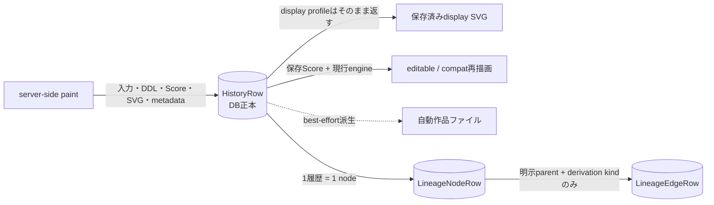
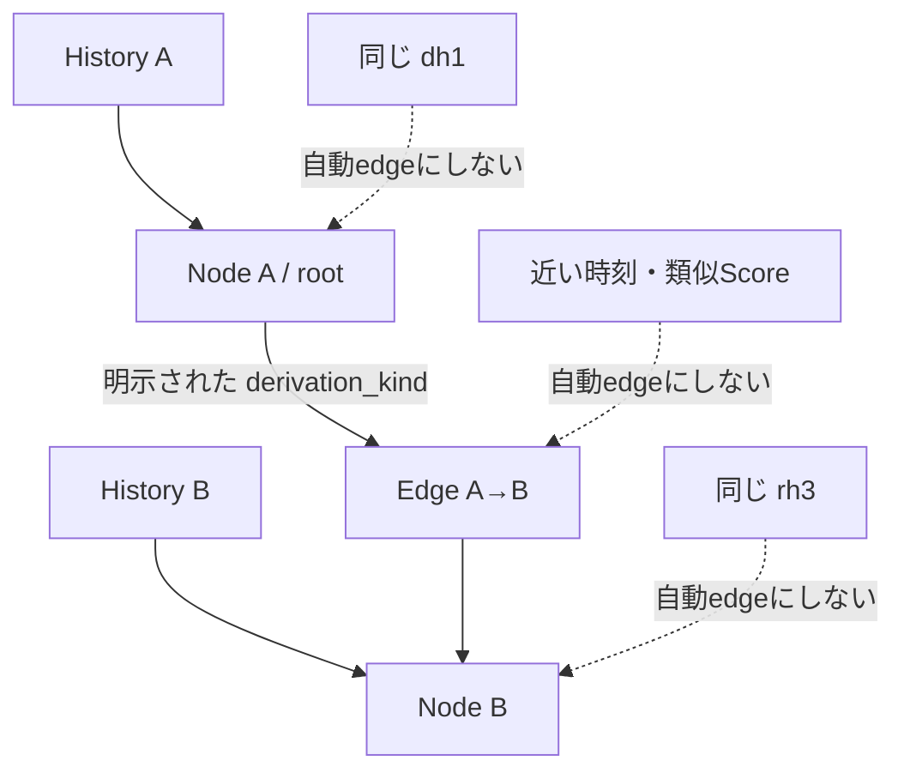
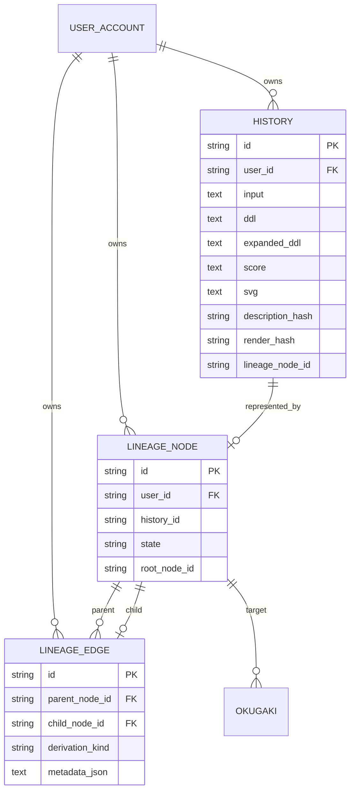

# Data, history, lineage

## 正本と派生物

DB rowには入力、Stage 1側DDL、effective DDL、Score、server生成SVG、model/版/seed/色/時間/token、mark、表示状態が入る。さらに写生（`sketch_text` / `sketch_grain` / `sketch_state`）と、各層のfallbackの記録（Stage 1 = `interpret_fallback`、Stage 2 = `compose_fallback`）を列として持つ。`compose_fallback`は「fallbackだった（理由文字列）」「fallbackでない（`none`）」「記録なし（列導入前の作品）」の3値で、記録なしをfallbackでないと混同しない。backfillはしない。自動作品ファイルを無効化またはqueue overflowしてもDB履歴は残る。

## 移植可能な永続化境界

ServerはSQLAlchemy/SQLite、AndroidはRoom/SQLiteを物理ownerとして持ち、将来iOS adapterを作る場合も自身の物理schemaを持つ。共通意味とhost mappingの正本は[`persistence/README.md`](../../persistence/README.md)と[`persistence/contract.json`](../../persistence/contract.json)であり、同じDB file、table名、column配置を要求しない。Server専用の認証・管理tableと端末専用のprovider・model・cache tableはhost extensionであってparity gapではない。保存済みSVG、Score、hash、NULLの意味はこのmappingによって変えない。

## 4種類のID

| ID | 何を識別するか | 同じでも別になりうるもの | 実装 |
|---|---|---|---|
| history ID | 1件のDB履歴row | 同じ記述・同じeditionの別保存 | `HistoryRow.id` |
| `dh1` | NFC・改行・外側空白を正規化した記述 | history、render、lineage node | `identity.py:description_hash` |
| `rh3` | Score + render seed + wild + engine ID/version + catalog ID | 記述、SVG文字列、build、composition seed | `db.py:render_hash_for_item` |
| legacy `rh2` | 旧payload規則のedition ID | `rh3`とは再計算規則が異なる | `db.py:_legacy_render_hash_for_item` |
| lineage node ID | 系譜graphの1 node | history ID、`dh1`、`rh3` | `LineageNodeRow.id` |

`rh2` rowは保持し、欠損hashだけを`rh3`でbackfillする。`render_hash_short`は表示用の末尾4文字であり、独立した同一性ではない。

## 系譜

`db.add_item` はparentがあるのにkindが無い場合、またはkindだけの場合を拒否する。parentがあれば同じuserの非tombstone nodeを確認し、history、node、edgeを1 transactionで書く。類似度、時刻、hash一致からedgeは作らない。

## 保存済みSVGと再描画

| 操作 | source | engine |
|---|---|---|
| history display SVG | DBに保存した`HistoryRow.svg` | 当時生成済み。再描画しない |
| editable / compat export | 保存Scoreと作品自身の保存色map | 現行engine |
| replay / render-score | 保存Scoreと明示seed等 | 現行engine |
| PNG | SVGのrasterize派生 | Render Engineの版ではなくrasterizer |

`GET /api/history/{item_id}/svg?profile=display` が保存SVGを返し、他profileだけ `_render_score_svg` を呼ぶ。過去engineを選択するregistry/APIは確認できない。

Androidも同じ原則に従う。Roomに保存したcanonical SVGを再描画せず、preview、thumbnail、PNGでは
`inku-svg-raster`からpixel派生を作る。raster APIは作品identityとRender Engine版を所有しない。

## 実在schema

図は `HistoryRow`、`LineageNodeRow`、`LineageEdgeRow`、`OkugakiRow` に実在する属性だけを載せた。

## 根拠対応

`SYS-DB`, `SYS-FILES`, `DATA-DH1`, `DATA-RH3`, `DATA-RH2`, `DATA-LINEAGE`。実装根拠は `db.py`, `identity.py`, `routers/history.py`, `test_lineage_acceptance.py`, `test_render_hash.py`。
