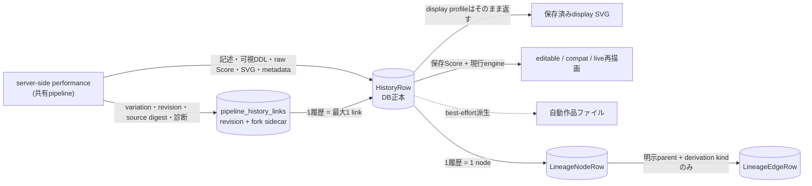
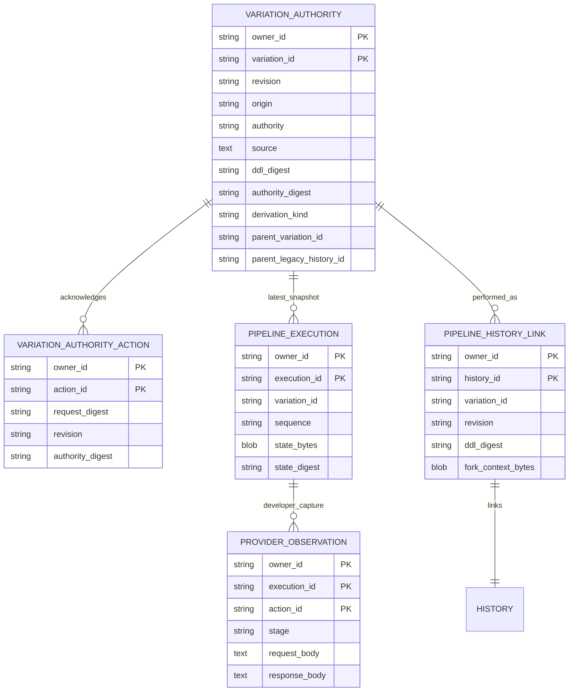
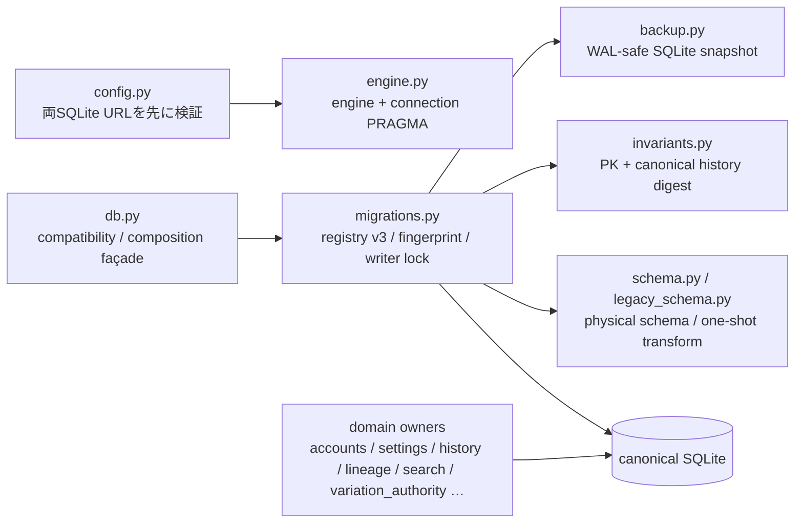
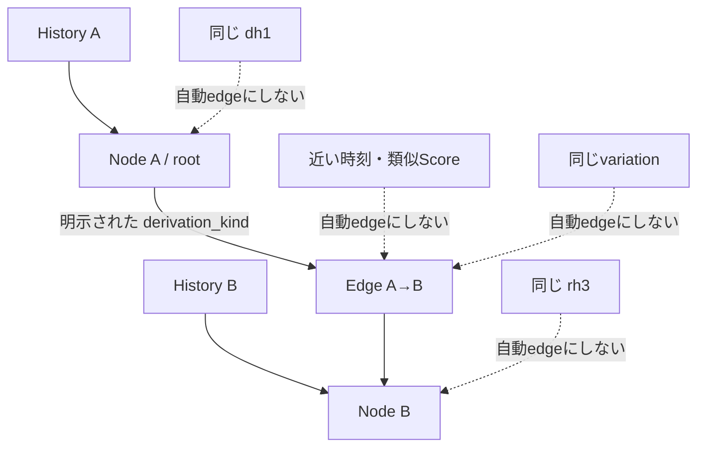
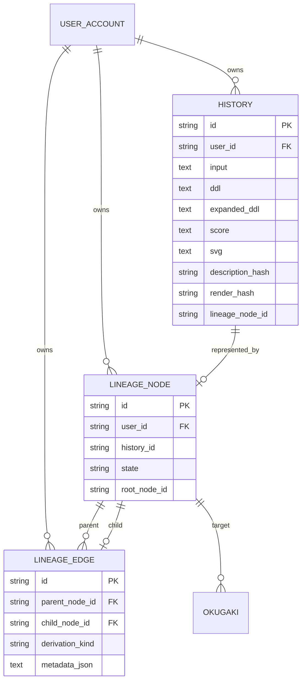

# Data, history, lineage

## 正本と派生物

DB rowには入力、可視DDL、Score、server生成SVG、model/版/seed/色/時間、mark、表示状態が入る。共有pipelineで描いた作品では、`ddl`は保存・ACKされた可視DDL、`score`は共有lowererが作ったraw compact Scoreであり、`render_limits`は作品のoperational budgetから導いた既存4上限の写しである。写生は`sketch_text` / `sketch_state`（`supplemented` / `not_needed` / `fallback` / `off`）に残る。旧Stage 1 / 2のfallback列（`interpret_fallback` / `compose_fallback`）と`expanded_ddl`、`score_pre_coerce`、`coerce_trace`は旧作品のために残り、新作は書かない（NULL）。Webの読みでは新作の`compose_fallback`は「記録なし」となり、fallbackの印は出ない。backfillはしない。自動作品ファイルを無効化またはqueue overflowしてもDB履歴は残る。

## 共有pipelineの状態

共有pipelineの状態は履歴rowと別の表に置き、`persistence/variation_authority.py:VariationAuthorityStore`が所有する。

- **variation authority** — variationごとの現在のsource、origin（`stage1_generated` / `user_authored_ddl`）、authority（`description_authoritative` / `ddl_authoritative` / `legacy_unknown`）、decimal-stringのrevision。変更はcoreが提案した次状態を期待revisionのcompare-and-setで保存したときだけ進み、authorityは単調にしか進まない。
- **action ACK** — 1つのlogical commit actionの結果を記録する。同じactionの再送は2回目のrevision変更を起こさず、同じ結果を返す。
- **実行snapshot** — coreのsnapshotとhost contextを不透明なbytesとしてsequenceのcompare-and-setで保存する。これはvariationの最新状態であり、過去のrevisionを復元する材料ではない。
- **history link** — 保存した1演奏をvariation・revision・source digestへ結び、その時点のconfig、host context、Macro定義、4種の診断、renderer診断、`resource_execution`をfork用sidecar（v2）として不変に保存する。過去の作品を選ぶと、このsidecarを正として派生し、同じvariationの最新snapshotで置き換えない。v1 sidecarは診断を持たない。sidecarが壊れていてもその作品だけに警告を出し、保存DDL・Score・SVGの表示を続ける。
- **provider観測** — developer modeで要求した実行だけ、provider送受信の原文を所有者・execution・action単位で保存する。通常の履歴・応答・logへは入らない。

旧作品（linkを持たない履歴）は`legacy_unknown`として扱い、origin・authorityを本文から推測しない。旧作品からの派生は元行を変えず、`parent_legacy_history_id`を持つ新しいvariationになる。

## 移植可能な永続化境界

ServerはSQLAlchemy/SQLite、AndroidはRoom/SQLiteを物理ownerとして持ち、将来iOS adapterを作る場合も自身の物理schemaを持つ。共通意味とhost mappingの正本は[`persistence/README.md`](../../persistence/README.md)と[`persistence/contract.json`](../../persistence/contract.json)であり、同じDB file、table名、column配置を要求しない。Server専用の認証・管理tableと端末専用のprovider・model・cache tableはhost extensionであってparity gapではない。保存済みSVG、Score、hash、NULLの意味はこのmappingによって変えない。AndroidもRoom側に共有pipelineの状態（authority、action ACK、実行snapshot、履歴revisionの不変context）を持つ（`SharedPipelineEntities.kt`、`RoomSharedPipelineStore.kt`）。

## Server SQLite lifecycle

`db.py`は既存のimportとcall shapeを保つfaçadeで、直接SQLやmigrationのownerではない。`persistence/`の19 owner module（これにpackage初期化を加える）が、設定・engine・schema・migration・backup・invariantと、access、account、group、session、identity、settings、history、search、lineage、奥書、feedback、variation authorityの変更理由ごとに分かれる。

起動時の経路は次のとおりである。fresh DBはschemaとregistryを1 transactionで作る。current registry（version 3 `developer_provider_observations`）のDBは版とchecksumを検査して通常起動し、legacy repair scanを繰り返さない。前版registry（version 1 `legacy_baseline`、version 2 `candidate_authoring_sidecars`）のDBと、registry導入前で明示されたschema fingerprintとFTS状態を満たすDBは、検証済みsnapshot作成後に単一writer transactionで一度だけ移行する。未知・部分状態・未来版・checksum不一致は変更前に拒否する。移行中はprimary key identityと履歴の`id/input/score/svg` byteをstreamingで照合し、SQLite quick checkとforeign-key checkも要求する。

Android Room v12は同じ論理契約を別の物理schemaで満たす。v10→v11で既存作品を保持したまま共有pipelineの状態を加え、v11→v12で履歴に要求時の`catalog_mode`を加えた。v1–9限定resetは旧DBと派生thumbnailを捨てるがmodel fileを残す。未来版や読めないDBは変更しない。このlifecycle差はportable contractのgapではなくhost adapterの明示的な所有範囲である。

## 4種類のID

| ID | 何を識別するか | 同じでも別になりうるもの | 実装 |
|---|---|---|---|
| history ID | 1件のDB履歴row | 同じ記述・同じeditionの別保存 | `HistoryRow.id` |
| `dh1` | NFC・改行・外側空白を正規化した記述 | history、render、lineage node | `identity.py:description_hash` |
| `rh3` | Score + render seed + wild + engine ID/version + catalog ID | 記述、SVG文字列、build、composition seed | `db.py:render_hash_for_item` |
| legacy `rh2` | 旧payload規則のedition ID | `rh3`とは再計算規則が異なる | `db.py:_legacy_render_hash_for_item` |
| lineage node ID | 系譜graphの1 node | history ID、`dh1`、`rh3` | `LineageNodeRow.id` |
| variation ID / revision | 共有pipelineの編集可能な作品単位と、そのsourceの版 | 同じvariationの複数の演奏（history） | `VariationAuthorityRow` |

`rh2` rowは保持し、欠損hashだけを`rh3`でbackfillする。`render_hash_short`は表示用の末尾4文字であり、独立した同一性ではない。variationは演奏の同一性ではなく、同じsourceとauthorityを共有する編集の単位である。1つのvariation・revisionから複数の演奏（異なるrender seed等）が別のhistoryとして保存されうる。

## 系譜

`db.add_item` はparentがあるのにkindが無い場合、またはkindだけの場合を拒否する。parentがあれば同じuserの非tombstone nodeを確認し、history、node、edgeを1 transactionで書く。類似度、時刻、hash一致、同じvariationであることからedgeは作らない。共有pipelineの派生（記述fork、DDL fork、旧作品からのfork）は、元作品のlineage nodeを明示parentとして渡したときだけedgeになり、kindを明示しなければ`description_edit`または`ddl_edit`になる。

## 保存済みSVGと再描画

| 操作 | source | engine |
|---|---|---|
| history display SVG | DBに保存した`HistoryRow.svg` | 当時生成済み。再描画しない |
| editable / compat / live export | 保存Scoreと作品自身の保存色map | 現行engine |
| replay / render-score（compact Score） | 保存Score、保存資源policy、明示seed等 | 現行engine（`render_saved`） |
| replay / render-score（0.10未満） | 保存Scoreに構造互換を当てたもの、明示seed等 | 現行engine（従来のchecked performance） |
| PNG | SVGのrasterize派生 | Render Engineの版ではなくrasterizer |

`GET /api/history/{item_id}/svg?profile=display` が保存SVGを返し、他profileだけ `_render_score_svg` を呼ぶ。過去engineを選択するregistry/APIは確認できない。

Androidも同じ原則に従う。Roomに保存したcanonical SVGを再描画せず、preview、thumbnail、PNGでは
`inku-svg-raster`からpixel派生を作る。raster APIは作品identityとRender Engine版を所有しない。

## 実在schema

図は `HistoryRow`、`LineageNodeRow`、`LineageEdgeRow`、`OkugakiRow` に実在する属性だけを載せた。共有pipelineの表は上の「共有pipelineの状態」の図にある。

## 根拠対応

`SYS-DB`, `SYS-FILES`, `DATA-AUTHORITY`, `DATA-MIGRATION`, `DATA-DH1`, `DATA-RH3`, `DATA-RH2`, `DATA-LINEAGE`, `DATA-FALLBACK`。実装根拠は `db.py`, `identity.py`, `persistence/schema.py`, `persistence/variation_authority.py`, `persistence/migrations.py`, `pipeline_product.py:save_result`, `routers/history.py`, `test_lineage_acceptance.py`, `test_render_hash.py`, `test_persistence_variation_authority.py`。
