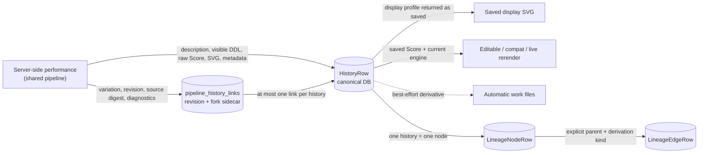
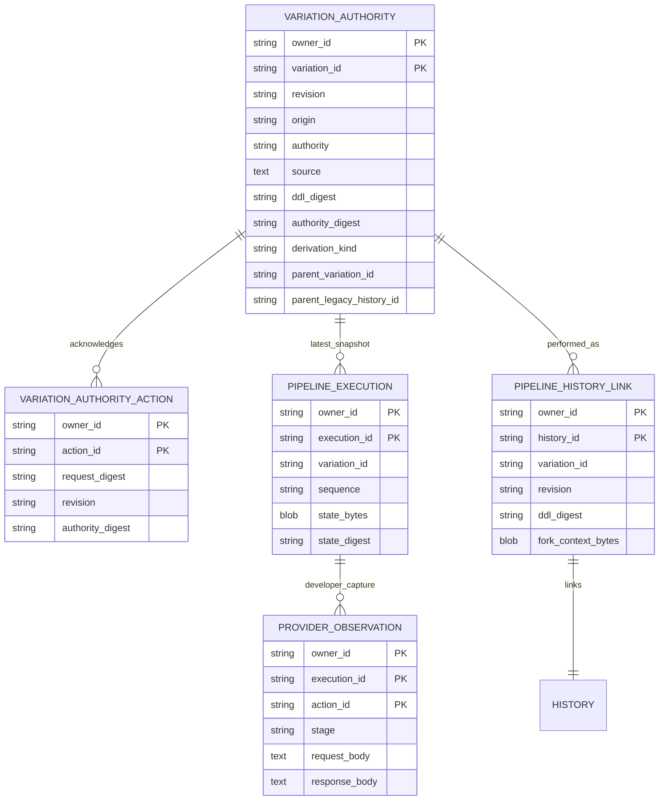
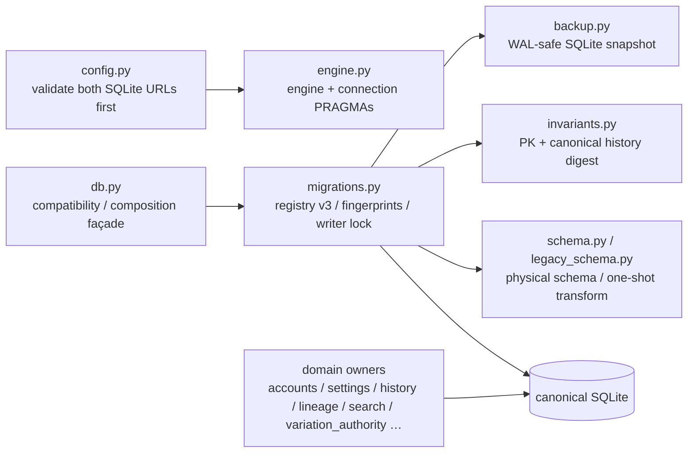
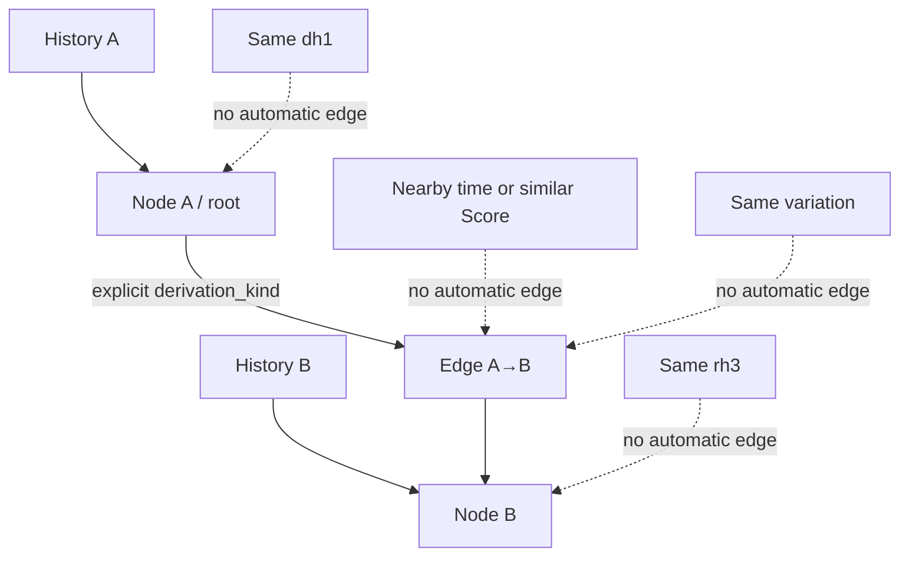
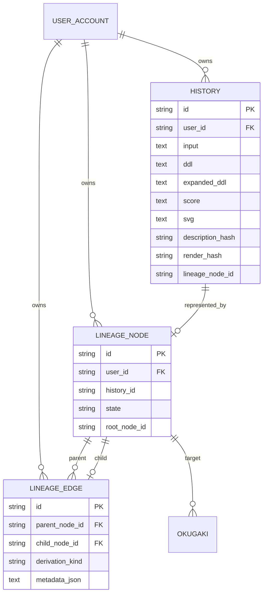

# Data, history, and lineage

## Canonical data and derivatives

A DB row stores the input, visible DDL, Score, Server SVG, model/version/seed/color/time metadata, marks, and display state. For a work drawn through the shared pipeline, `ddl` is the saved and acknowledged visible DDL, `score` is the raw compact Score produced by the shared lowerer, and `render_limits` is a copy of the four existing limits derived from the work's operational budget. The sketch stays in `sketch_text` / `sketch_state` (`supplemented` / `not_needed` / `fallback` / `off`). The old Stage 1 / 2 fallback columns (`interpret_fallback` / `compose_fallback`), `expanded_ddl`, `score_pre_coerce`, and `coerce_trace` remain for older works; new works do not write them (NULL). In Web's reading, a new work's `compose_fallback` is "unrecorded", so no fallback mark appears. Nothing is backfilled. Disabling automatic files or overflowing their queue does not remove DB history.

## Shared pipeline state

Shared-pipeline state lives in tables separate from the history row, owned by `persistence/variation_authority.py:VariationAuthorityStore`.

- **Variation authority** — each variation's current source, origin (`stage1_generated` / `user_authored_ddl`), authority (`description_authoritative` / `ddl_authoritative` / `legacy_unknown`), and decimal-string revision. It changes only when the next state proposed by the core is saved by compare-and-set on the expected revision, and authority only moves forward.
- **Action acknowledgment** — records the result of one logical commit action. A resend of the same action causes no second revision change and returns the same result.
- **Execution snapshot** — saves the core snapshot and host context as opaque bytes by compare-and-set on the sequence. It is the latest state of a variation, not material for restoring an earlier revision.
- **History link** — ties one saved performance to its variation, revision, and source digest, and immutably keeps that moment's configuration, host context, Macro definitions, the four diagnostic channels, renderer diagnostics, and `resource_execution` as the fork sidecar (v2). Selecting a past work derives from this sidecar and never replaces it with the latest snapshot of the same variation. A v1 sidecar carries no diagnostics. A corrupt sidecar shows a warning on that work only, and the saved DDL, Score, and SVG stay visible.
- **Provider observation** — only for an execution run in developer mode with capture requested, keeps the raw provider traffic per owner, execution, and action. It never enters ordinary history, responses, or logs.

An older work (history without a link) is treated as `legacy_unknown`; origin and authority are never inferred from its text. A derivation from an older work leaves the original row unchanged and becomes a new variation with `parent_legacy_history_id`.

## Portable persistence boundary

The Server's physical owner is SQLAlchemy/SQLite and Android's is Room/SQLite; a future iOS adapter would own its own physical schema too. The canonical shared meaning and host mapping live in [`persistence/README.md`](../../persistence/README.md) and [`persistence/contract.json`](../../persistence/contract.json), which do not require the same database file, table names, or column placement. Server-only authentication/administration tables and device-only provider/model/cache tables are host extensions, not parity gaps. This mapping does not change the meaning of saved SVG, Score, hashes, or NULL. Android also holds shared-pipeline state on the Room side (authority, action acknowledgments, execution snapshots, and the immutable context of history revisions; `SharedPipelineEntities.kt`, `RoomSharedPipelineStore.kt`).

## Server SQLite lifecycle

`db.py` preserves existing import and call shapes; it does not own direct SQL or migrations. The 19 owner modules in `persistence/` (plus package initialization) are divided by reason for change: configuration, engine, schema, migration, backup, and invariants, and then access, accounts, groups, sessions, identities, settings, history, search, lineage, colophon, feedback, and variation authority.

Startup takes these paths. A fresh DB creates schema and registry in one transaction. A DB at the current registry (version 3, `developer_provider_observations`) verifies version and checksum and starts without repeating the legacy repair scan. A DB at a previous registry (version 1 `legacy_baseline`, version 2 `candidate_authoring_sidecars`), or a pre-registry DB matching an explicit schema fingerprint and FTS state, migrates once in a single-writer transaction after a verified snapshot. Unknown, partial, future-version, and checksum-mismatched states are rejected before mutation. Migration streams primary-key identity and history `id/input/score/svg` bytes and requires SQLite quick and foreign-key checks.

Android Room v12 satisfies the same logical contract with a different physical schema. v10→v11 added shared-pipeline state while keeping existing works, and v11→v12 added the requested `catalog_mode` to history. The bounded v1–9 reset discards old DBs and derived thumbnails but preserves model files. Future or unreadable DBs remain untouched. This lifecycle difference is explicit host-adapter ownership, not a portable contract gap.

## Identity values

| ID | Identifies | May differ even when related | Implementation |
|---|---|---|---|
| History ID | One DB history row | Separate saves of the same description or edition | `HistoryRow.id` |
| `dh1` | Description after NFC, line-ending, and outer-whitespace normalization | History, render, lineage node | `identity.py:description_hash` |
| `rh3` | Score + render seed + wild + engine ID/version + catalog ID | Description, SVG string, build, composition seed | `db.py:render_hash_for_item` |
| Legacy `rh2` | Older edition payload | Recalculated differently from `rh3` | `db.py:_legacy_render_hash_for_item` |
| Lineage node ID | One node in the lineage graph | History ID, `dh1`, `rh3` | `LineageNodeRow.id` |
| Variation ID / revision | The editable unit of work in the shared pipeline and the version of its source | Several performances (histories) of the same variation | `VariationAuthorityRow` |

`rh2` rows are preserved, and only missing hashes are backfilled with `rh3`. `render_hash_short` is a four-character display suffix, not an independent identity. A variation is not a performance identity; it is the unit of editing that shares one source and authority. One variation and revision can be saved as several performances (different render seeds and so on), each as its own history.

## Lineage

`db.add_item` rejects a parent without a kind and a kind without a parent. With a parent, it checks for a same-user non-tombstoned node and writes history, node, and edge in one transaction. Similarity, time, hash equality, or belonging to the same variation never creates an edge. A shared-pipeline derivation (description fork, DDL fork, fork from an older work) becomes an edge only when the original work's lineage node is passed as an explicit parent; without an explicit kind it becomes `description_edit` or `ddl_edit`.

## Stored SVG and a new performance

| Operation | Source | Engine |
|---|---|---|
| History display SVG | Saved `HistoryRow.svg` | Already generated; not rerendered |
| Editable / compat / live export | Saved Score plus the work's own saved color map | Current engine |
| Replay / render-score (compact Score) | Saved Score, saved resource policy, explicit seeds, and so on | Current engine (`render_saved`) |
| Replay / render-score (below 0.10) | Saved Score after structural compatibility, explicit seeds, and so on | Current engine (the established checked performance) |
| PNG | Raster derivative of SVG | Rasterizer, not a Render Engine version |

`GET /api/history/{item_id}/svg?profile=display` returns the saved SVG; only other profiles call `_render_score_svg`. No past-engine registry or selection API was found.

Android follows the same rule: it does not rerender Room-saved canonical SVG for preview, thumbnail, or PNG, and derives pixels through
`inku-svg-raster`. The raster API owns neither work identity nor Render Engine versioning.

## Implemented schema

The diagram contains only attributes present in `HistoryRow`, `LineageNodeRow`, `LineageEdgeRow`, and `OkugakiRow`. The shared-pipeline tables appear in the "Shared pipeline state" diagram above.

## Evidence map

`SYS-DB`, `SYS-FILES`, `DATA-AUTHORITY`, `DATA-MIGRATION`, `DATA-DH1`, `DATA-RH3`, `DATA-RH2`, `DATA-LINEAGE`, `DATA-FALLBACK`. Implementation evidence: `db.py`, `identity.py`, `persistence/schema.py`, `persistence/variation_authority.py`, `persistence/migrations.py`, `pipeline_product.py:save_result`, `routers/history.py`, `test_lineage_acceptance.py`, `test_render_hash.py`, `test_persistence_variation_authority.py`.
