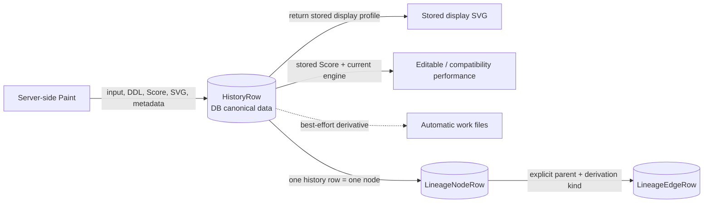
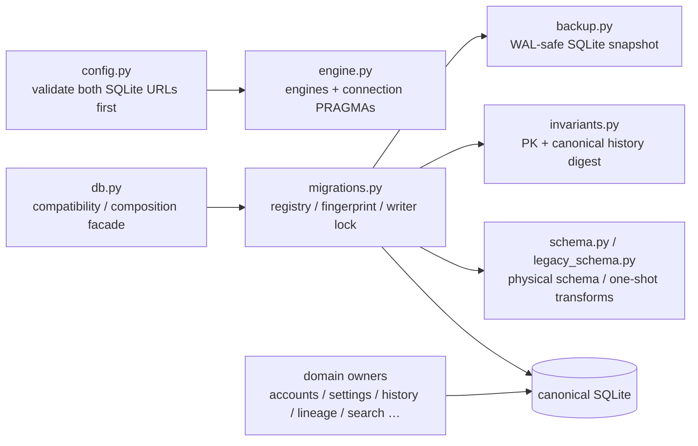
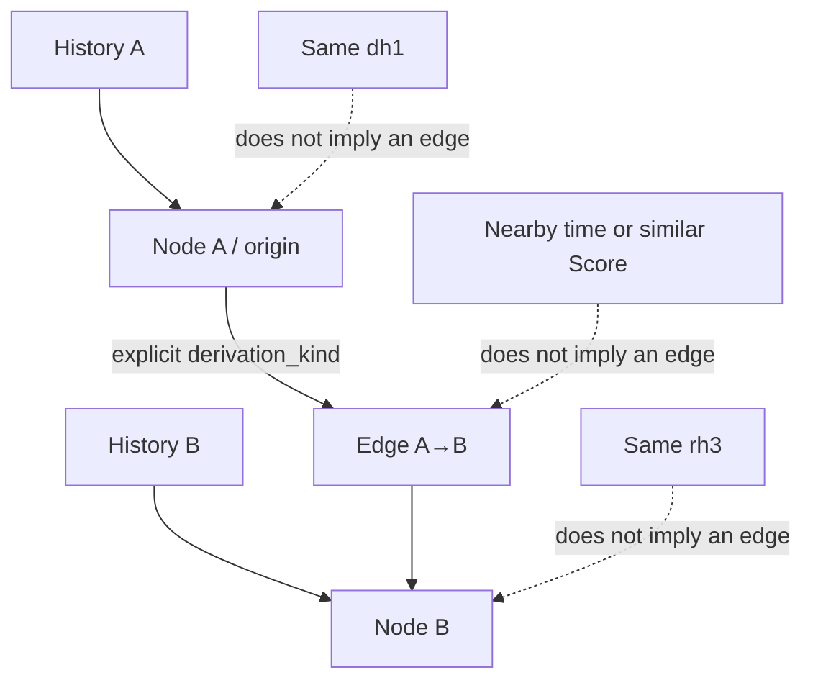
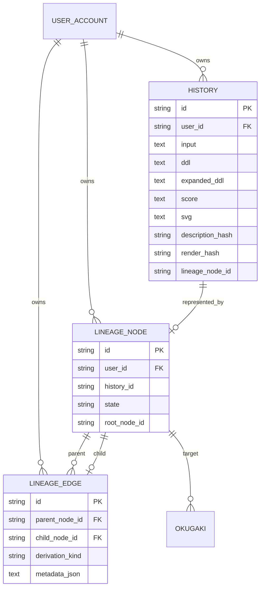

# Data, history, and lineage

## Canonical data and derivatives

A DB row stores the input, Stage 1 DDL, effective DDL, JSON Score, Server SVG, model/version/seed/color/time/token metadata, marks, and display state. It also carries the sketch columns (`sketch_text` / `sketch_grain` / `sketch_state`) and each layer's fallback record (Stage 1 = `interpret_fallback`, Stage 2 = `compose_fallback`). `compose_fallback` has three readings — fell (a reason string), held (`none`), and unrecorded (works older than the column) — and unrecorded is never read as "not a fallback". Nothing is backfilled. Disabling automatic files or overflowing their queue does not remove DB history.

## Portable persistence boundary

The Server physically owns SQLAlchemy/SQLite, Android owns Room/SQLite, and a
possible future iOS adapter would own its own physical schema. Canonical shared
meaning and host mappings live in
[`persistence/README.md`](../../persistence/README.md) and
[`persistence/contract.json`](../../persistence/contract.json); they do not
require one database file, table name, or column layout. Server-only
authentication and administration tables and device-only provider, model, and
cache tables are host extensions rather than parity gaps. This mapping does not
change the meaning of stored SVG, Score, hashes, or NULL values.

## Server SQLite lifecycle

`db.py` preserves existing imports and call shapes as a facade; it does not own
direct SQL or migration behavior. Eighteen owner modules under `persistence/`,
plus package initialization, separate
configuration, engines, schema, migration, backup, and invariants from the
change reasons for access, accounts, groups, sessions, identities, settings,
history, search, lineage, colophons, and feedback.

Startup has three paths. A fresh database creates schema and registry in one
transaction. A registered database verifies its version and checksum and starts
without repeating legacy repair scans. A pre-registry database migrates once,
in a single-writer transaction after a verified snapshot, only when its schema
fingerprint and FTS state are explicitly accepted. Unknown, partial, future, or
checksum-mismatched states fail before mutation. Migration streams primary-key
identity and canonical `id/input/score/svg` history bytes and also requires
SQLite quick check and foreign-key check.

Android Room v10 satisfies the same logical contract through a different
physical schema. The v1–9-only reset discards the old database and derived
thumbnails, retains model files and existing v10, and leaves future or
unreadable databases untouched. That lifecycle difference is an explicit host
adapter boundary, not a portable-contract gap.

## Identity values

| ID | Identifies | May differ even when this is equal | Implementation |
|---|---|---|---|
| History ID | One DB history row | Another save of the same description and edition | `HistoryRow.id` |
| `dh1` | Description after NFC, newline, and outer-space normalization | History row, performance, lineage node | `identity.py:description_hash` |
| `rh3` | Score + render seed + Wild + engine ID/version + color catalog ID | Description, SVG string, Build, composition seed | `db.py:render_hash_for_item` |
| Legacy `rh2` | Edition under the older payload rule | Recalculation under `rh3` | `db.py:_legacy_render_hash_for_item` |
| Lineage node ID | One graph node | History ID, `dh1`, `rh3` | `LineageNodeRow.id` |

Rows with `rh2` remain. Only missing hashes are backfilled as `rh3`. `render_hash_short` is the final four characters for display, not another identity.

## Lineage

`db.add_item` rejects a parent without a kind and a kind without a parent. With a parent, it confirms a same-user, non-tombstone node and writes history, node, and edge in one transaction. Similarity, time, and hash equality do not establish parentage.

## Stored SVG and a new performance

| Operation | Source | Engine |
|---|---|---|
| History display SVG | Stored `HistoryRow.svg` | Already performed; no replay |
| Editable / compatibility export | Stored Score and the work’s stored color map | Current engine |
| Replay / render-score | Stored Score and explicit seeds | Current engine |
| PNG | Rasterized SVG derivative | Rasterizer, not a Render Engine version |

`GET /api/history/{item_id}/svg?profile=display` returns the stored SVG. Other profiles call `_render_score_svg`. No old-engine selection registry or API was found.

Android follows the same principle: it does not replay canonical SVG stored in Room. Preview,
thumbnails, and PNG create pixel derivatives through `inku-svg-raster`; the raster API owns neither
work identity nor the Render Engine version.

## Implemented schema

The diagram lists only attributes present on `HistoryRow`, `LineageNodeRow`, `LineageEdgeRow`, and `OkugakiRow`. Internal identifier names remain unchanged even where the English display term is “colophon.”

## Evidence map

Evidence: `SYS-DB`, `SYS-FILES`, `DATA-DH1`, `DATA-RH3`, `DATA-RH2`, `DATA-LINEAGE`.
