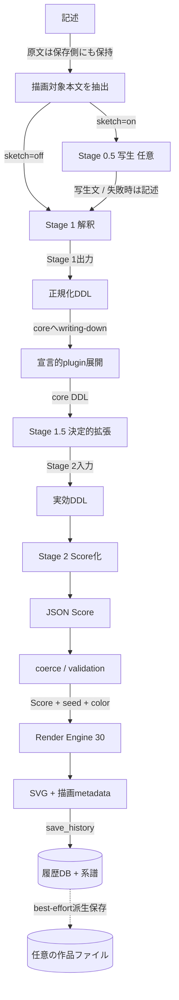
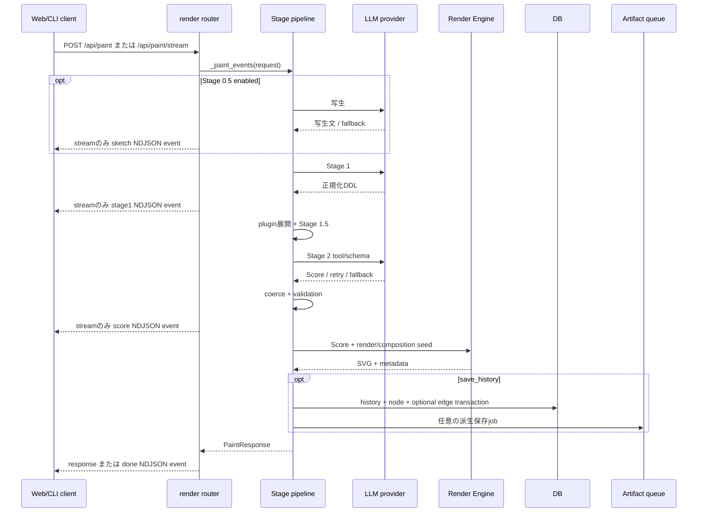

# DDL処理pipeline

## 段階と所有者

| 段階 | 入力 → 出力 | 決定性・fallback | 所有module |
|---|---|---|---|
| 記述 | 作者の文 → 保存用原文とpipeline用本文 | label/commentは描画pipelineから除外、原文は保持 | `description_labels.py`; `render.py` |
| Stage 0.5 | 記述 → 写生文 | 任意、LLM。失敗時は記述へfallbackし`sketch_state`記録 | `sketch.py`; `render.py:_resolved_sketch` |
| Stage 1 | 記述/写生文 → 正規化DDL | LLM、空/timeout等にfallback | `interpreter.py`; `render.py:_call_interpret_detail` |
| plugin展開 | 正規化DDL → core DDL + optional instructions | 文書検証後、seedつき決定的writing-down | `plugins/document_format.py`; `_call_compose_detail` |
| Stage 1.5 | core DDL → effective DDL | 決定的。現行は焦点書換えのみ、明示変奏時だけ軸を動かす | `ddl_expander.py` |
| Stage 2 | effective DDL → JSON Score | LLM tool/schema。空・timeout・retry後に決定的fallback | `composer.py`; `render.py:_call_compose_detail` |
| coerce/validation | Score → renderable Score | 不正relation等はdrop。要求配達とhard ceilingを行い、記述が抽象色を一つだけ名指す条件ではcolor cycleをその色へ畳む | `coerce/` |
| Render Engine | Score + seeds + color map → SVG + metadata | 同一Score・同一render seed・同一条件で再現 | `render_engines/default.py`; `renderer.py` |
| 履歴・系譜 | pipeline生成物 → DB row/node/edge | DB transaction。edgeは明示parent+kindのみ | `rendering.py`; `db.py` |

## 通常描画

## `/api/paint` とstreaming

## 設計契約の実装位置

| 契約 | 実装での保持 |
|---|---|
| Stage 1 / Stage 2分離 | `interpret_detail`と`compose`は別関数・別model解決。`/api/compose`はStage 1を通らない |
| Stage 1.5は意味を上書きしない | 現行`_expand_ja/_expand_en`は焦点のreframeだけで新しい文を追加しない |
| pluginはStage 1直後 | `_call_compose_detail`: `manager.expand` → `expand_intermediate_for_lang` → `compose` |
| 後段はplugin namespace非依存 | plugin文書はcore DDL/instructionへ閉じ、未知参照をdrop。provenanceだけmetadataへ残す |
| drop-only優先 | invalid relationは`_drop_invalid_relations`。ただしcoerceは要求配達repairと、単一の名指し色だけを残す決定的規則も持つため、完全なdrop-onlyではない |
| 再現性 | `renderer.py`のseed派生と凍結corpus。暗黙のfresh seedを採った回はそのseedをmetadata/DBへ保存 |
| 過去engineを選び直さない | `current_render_engine()`は現行1 engine。履歴のdisplay SVGは保存済みを返す |
| 歳時記single source | `saijiki.py`からprompt、markers、relation literals、API表示、referenceを導出 |

## 図の根拠

`PIPE-SKETCH`、`PIPE-S1`、`PIPE-PLUGIN`、`PIPE-S15`、`PIPE-S2`、`PIPE-COERCE`、`PIPE-RENDER`、`PIPE-HISTORY`。主なcall siteは `server/src/inku_server/api_core/routers/render.py:_paint_events` と `_call_compose_detail`。
