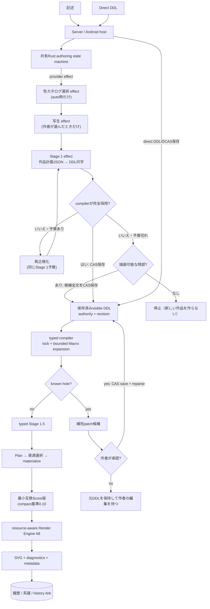
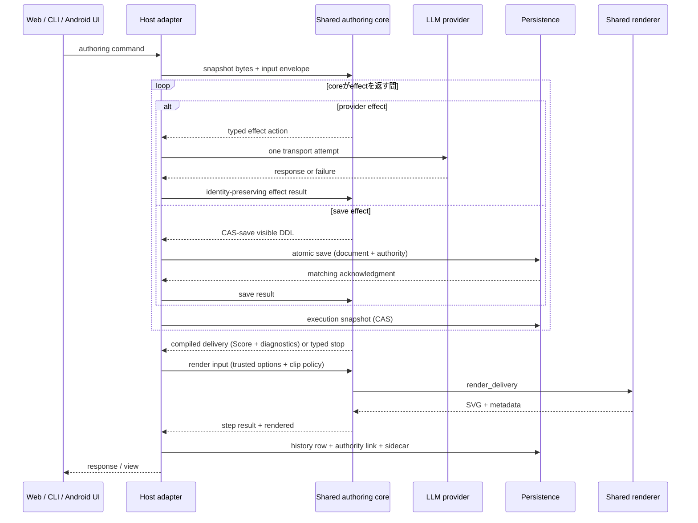

# DDL処理pipeline

通常Server／WebとAndroidは、同じ共有Rust authoring state machine、typed compiler、lowerer、rendererを使用する。旧Python / KotlinのStage 1・Stage 1.5・Stage 2・coerceは2026-09-14のcutoverで新作経路から外れ、runtime selectorやPython fallbackは無い。

## 段階と所有者

| 段階 | 入力 → 出力 | 契約 | 所有module |
|---|---|---|---|
| Host入力 | 記述またはdirect DDL → typed command | 記述起点だけLLM段を要求する。記述は行頭の連番と角括弧のコメントを切ってからcoreへ渡し、作品には書いたままを残す（Server）。Direct DDLは自然文へ戻さない | Server pipeline host / Android pipeline host |
| Authoring state machine | snapshot + command/effect result → next snapshot + event + 最大1 effect | 決定的。provider transportと保存はtyped effectとして外出しし、再試行・fallback・authority遷移はcoreが決める | `core/crates/inku-pipeline` |
| 色カタログ選択 effect（任意） | 記述 + カタログ候補 → カタログID | `catalog_mode=auto`の記述起点だけ。失敗・予算切れは`default`へ落とし`auto_fallback_default`を記録して続行する | `inku-pipeline` prompt/action; host provider adapter |
| 写生 effect（任意） | 記述 → 場所と光の補足文 | 作者が「あり」を選んだときだけ。記述を書き換えず、失敗しても`fallback`として記述だけで続行する | `inku-pipeline` prompt/action; host provider adapter |
| Stage 1 effect | 記述（+ 写生文）→ 作品計画JSON → visible normalized DDL候補 | LLMはDDL文字列を書かず、閉じた型の作品計画だけを返す。coreが範囲外の値をfield単位で落とし、要求言語のDDLへ決定的に印字する。Scoreを書かず、Macro本文やhidden meaningを受け取らない | `inku-pipeline/src/prompts.rs`; `inku-ddl/src/work_plan.rs`; host provider adapter |
| Stage 1の再正規化・残部採用 | compilerが完全採用しない候補 → 置換DDL要求、または描画可能な残部 | 同じStage 1予算の中で、原文・未採用DDL・理由とspanを添えた新しいactionとして再要求する。予算が尽きたら、sealed execution projectionが描画可能な残部を持つ場合だけ候補全文をそのまま保存へ提案する | `inku-pipeline/src/machine.rs` (`correct_stage1`, `residual_execution_preflight`) |
| CAS保存 | DDL候補 + revision → 保存済みvisible DDL | 一致するatomic save acknowledgment後だけsourceとauthorityを進め、exact saved bytesを再parseする | authority store / pipeline host |
| Typed compiler | visible DDL + definition locks → verified meaning + diagnostics | source、provenance、Macro definitionをlock検証し、bounded expansionする。曖昧さをfirst/nearest/lastで推測しない。lockは`canonical_ready` / `incomplete_known_hole` / `blocked_conflict` / `blocked_diagnostic`のいずれか | `core/crates/inku-ddl` |
| Hole補完（Stage 2） | known hole → patch候補 → 作者承認 | known holeだけをspanとdigestに閉じて自動要求する。HoleなしではStage 2 LLMを呼ばない。承認patchもCAS保存後に再parseする。辞退・失敗は保存済みDDLを保って作者の編集を待つ | shared state machine + host provider/store |
| Typed Stage 1.5 | verified meaning + composition/variation seed → effective meaning | LLMを使わずfocusと明示変奏だけを決定的に変換する。原文の意味や明示属性を上書きしない | `core/crates/inku-ddl` |
| Plan・資源選択・materialize | verified effective meaning → symbolic Plan → compact Score recipe | 一度だけ下ろし、個体化前にhard policyとoperational budgetで需要を検査する。表現に必要な最小Score版を選び、compact基準は0.10、鏡写しrelationを持つ作品だけが0.15を必要とする | `core/crates/inku-ddl`; `core/crates/inku-score` |
| Render Engine | Score + 保存policy + seeds + 解決済みhost option → SVG + metadata | compileに使ったoptionと一致するときだけ演奏する。recipeからsamplingし、clip不能な単位は元source全体を省略して再演奏する。同じScore、seed、条件は同じ演奏を再現する | `core/crates/inku-render` |
| 履歴・系譜 | DDL / Score / SVG / authority context → DB row/node/edge + history link | Historyは当該revisionのsource、config、seed、catalog、budget、definition lock、4種の診断を保持し、親子を類似性から推測しない | Server DB / Android Room |

判定単位の詳細は [SPEC.ja.md](../../SPEC.ja.md) §12.6–§12.8が正本である。1件ずつの判定の道筋は`description-to-svg.ja.md`が持つ。

## 通常authoring

Provider patchは候補にすぎず、hostが直接採用しない。Hostは一つのeffectにつきproviderを一度だけ呼び、失敗結果をcoreへ返す。次のeffectまたは有限な終了はcoreが決める。残部採用で保存したrevisionからはknown-hole補完を始めず、`complete_with_omissions`と元の診断を保存まで運ぶ。holeがあってScoreも成立する場合、Serverは補完の要求より先に安全な演奏を保存する。

## APIとplatform境界

ServerのPython adapterとAndroidのKotlin/JNI adapterはhost処理を行う薄い境界で、意味を別実装しない。Androidの通常UIは`InkuRepository` → `AndroidWorkPipeline` → `SharedPipelineHost` → JNIで共有coreへ到達する。WebとCLIは既存HTTP APIを通してServerの同じpipeline serviceを使う。`/api/interpret`は保存済みDDLまで、`/api/compose`はdirect DDLから演奏まで、`/api/paint`は記述から演奏（`save_history`指定時は履歴保存）までを1回の応答へ投影する。補完案の承認が要る場合、これらの互換routeは409と現在のviewを返し、作者の操作は`/api/pipeline/executions/{id}/commands`へ移る。

## 再入点

| 操作 | 保つもの | 再開点 |
|---|---|---|
| 読み取りを変える | 元作品と明示parent relation | 保存済みcontextから新しい記述起点variation（`fork-description`） |
| DDL編集 | authoring origin、CAS、元history | 同じ設定なら作者DDLのCAS保存後にcompilerへ再入。設定が変わるなら親付きのdirect-DDL variation |
| 補完案の承認・辞退 | base revisionとproposal digest | 承認はbaseを再検証してCAS保存。辞退は保存済みDDLのまま |
| 別の構図 | 保存済みvisible DDL、元meaning、描画属性 | 新しい`composition_seed`でtyped Stage 1.5／lowerer |
| 明示変奏 | 保存済みvisible DDL、構図族、色、タッチ、個数 | amplitude + `variation_seed`でtyped Stage 1.5／lowerer |
| 別の演奏 | 保存Scoreとauthoring revision | 新しい`render_seed`でrendererだけ |
| catalog / canvas変更 | 元variationを変更しない | 現在optionsを持つ親付きnew variation |
| 旧作品からの派生 | 元history行を変更しない | `legacy/{history_id}/fork`で`legacy_description_fork` / `legacy_ddl_fork`の新variation |

過去historyを選んだときは、そのrevisionに保存されたcontextを使う。同じvariationの最新snapshotから推測せず、壊れたsidecarも再compileで補わない。

## 保存互換とplatform境界

- 保存済みSVGは当時の表示の正本であり、旧Scoreと旧artifactはread compatibilityを保つ。
- 新しい作品の意味は共有Rustが決定する。旧作品は保存済みScore／SVGと保存時のcontextを優先し、旧DDLを再解釈して置き換えない。
- 保存済みScoreの再演は版で分かれる。compact Score（0.10〜0.15）は共有coreの`render_saved`へ、保存時の資源policyと再計算した需要を渡す。0.10未満の旧Scoreは`saved_score_compat.py`の構造互換（欠けたgeometryの既定、fill表記の橋渡し、解決不能relationの除去、記録上限）を当ててから従来のchecked performanceで演奏する。どちらも記述やDDLを読まない。
- AndroidのカメラDDL promptも共有RustのStage 1語彙projectionを使う。履歴は保存された記述・DDL・model情報を表示し、記録されていない送信promptを後から推測しない。
- Serverは配布用の同じnative wheelにauthoring pipelineとrendererを含める。Androidは同じ共有coreへJNIで接続する。
- iOS接続はAndroid受入の範囲外で、別途保留する。

## 生成条件と同一性

`rh3`の直接材料はScore、render seed、wild、engine identity、render color catalog IDである。その他の設定は、Scoreまたは直接材料を変える場合にedition同一性へ効く。

| 条件 | 解決する層 | 保存先 |
|---|---|---|
| visible DDL source / authority / revision | authoring state machine + CAS store | snapshot / history link |
| Macro definition / catalog / canvas identity | compiler inputとしてlock検証、host optionとして解決 | definition lock / config / history |
| 色カタログ（auto選択を含む） | 色カタログ選択effectとhost palette解決 | `catalog_id` / `catalog_mode` / `render_color_map` |
| 写生文 | 写生effect、または作者・保存済みの写生文 | snapshotの`sketch`記録 / `sketch_text` / `sketch_state` |
| `composition_seed` / variation | typed Stage 1.5 + lowerer | config / render metadata |
| resource policy / operational budget | materializer + checked performance | Score policy / history |
| `render_seed` / `wild` / concrete color map | Render Engine | render metadata / history |
| model choice | 各provider effectのhost transport | effect metadata / history |

## 実装位置

| 境界 | 主な実装 |
|---|---|
| Shared state machine / byte protocol | `core/crates/inku-pipeline`, `core/crates/inku-pipeline-uniffi` |
| Typed compiler / 作品計画 / Stage 1.5 / lowerer | `core/crates/inku-ddl` |
| Score schema / compatibility / resource policy | `core/crates/inku-score` |
| SVG performance | `core/crates/inku-render` |
| Server host | `server/src/inku_server/pipeline_runtime.py`, `pipeline_api.py`, `pipeline_candidate.py`, `pipeline_product.py`, `pipeline_provider.py`, `pipeline_compat.py` |
| 旧Score互換 | `server/src/inku_server/saved_score_compat.py`, `render_engines/default/adapter.py` |
| Android host | `android/.../pipeline/SharedAuthoringPipeline.kt`, `SharedPipelineHost.kt`, `AndroidWorkPipeline.kt`, `NativePipelineBridge.kt` |
| Product contract | [SPEC.ja.md](../../SPEC.ja.md) §12.6–§12.8、§12.11、§18 |
