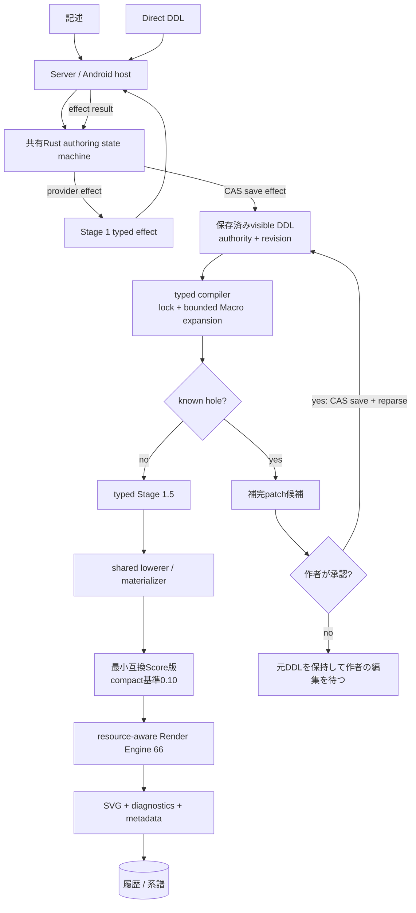
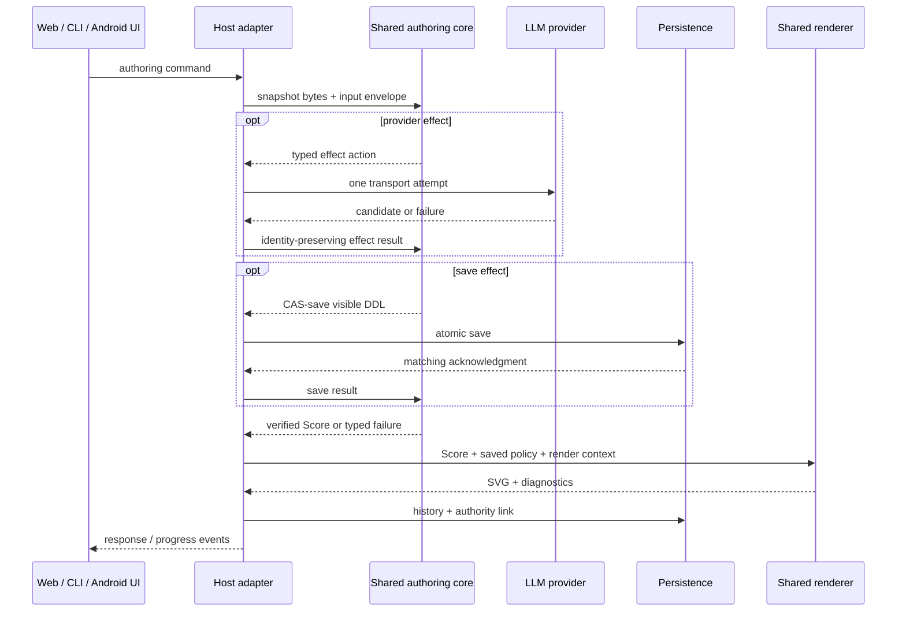

# DDL処理pipeline

通常Server／WebとAndroidは、同じ共有Rust authoring state machine、typed compiler、lowerer、rendererを使用する。

## 段階と所有者

| 段階 | 入力 → 出力 | 契約 | 所有module |
|---|---|---|---|
| Host入力 | 記述またはdirect DDL → typed command | 記述起点だけStage 1を要求する。Direct DDLは自然文へ戻さない | Server pipeline host / Android pipeline host |
| Authoring state machine | snapshot + command/effect result → next snapshot + event + 最大1 effect | 決定的。provider transportと保存はtyped effectとして外出しし、再試行とauthority遷移はcoreが決める | `core/crates/inku-pipeline` |
| Stage 1 effect | 記述 → visible normalized DDL候補 | LLMはDDL候補だけを返す。Scoreを書かず、Macro本文やhidden meaningを受け取らない | shared core prompt/action; host provider adapter |
| CAS保存 | DDL候補 + revision → 保存済みvisible DDL | 一致するatomic save acknowledgment後だけsourceとauthorityを進め、exact saved bytesを再parseする | authority store / pipeline host |
| Typed compiler | visible DDL + definition locks → verified meaning + diagnostics | source、provenance、Macro definitionをlock検証し、bounded expansionする。曖昧さをfirst/nearest/lastで推測しない | `core/crates/inku-ddl` |
| Hole補完 | known hole → patch候補 → 作者承認 | known holeだけをspanとdigestに閉じて要求する。HoleなしではStage 2 LLMを呼ばない。承認patchもCAS保存後に再parseする | shared state machine + host provider/store |
| Typed Stage 1.5 | verified meaning + composition/variation seed → effective meaning | LLMを使わずfocusだけを決定的に変換する。原文の意味や明示属性を上書きしない | `core/crates/inku-ddl` |
| Lowering/materialization | verified effective meaning → actual Score / compact recipe | 一度だけ下ろし、表現に必要な最小Score版を選ぶ。Compact基準は0.10、鏡写しrelationを持つ作品だけが0.15を必要とする | `core/crates/inku-ddl`; `core/crates/inku-score` |
| Resource check / Render Engine | Score + saved policy + seeds + resolved host options → SVG + metadata | 個体化前に需要を検査し、超過した一sourceまたはcoordinated placement全体を局所省略する。同じScore、seed、条件は同じ演奏を再現する | `core/crates/inku-render` |
| 履歴・系譜 | DDL / Score / SVG / authority context → DB row/node/edge | Historyは当該revisionのsource、config、seed、catalog、budget、definition lockを保持し、親子を類似性から推測しない | Server DB / Android Room |

判定単位の詳細は [SPEC.ja.md](../../SPEC.ja.md) §12.7.1が正本である。

## 通常authoring

Provider patchは候補にすぎず、hostが直接採用しない。Hostは一つのeffectにつきproviderを一度だけ呼び、失敗結果をcoreへ返す。次のeffectまたは有限な終了はcoreが決める。

## APIとplatform境界

ServerのPython adapterとAndroidのKotlin/JNI adapterはhost処理を行う薄い境界で、意味を別実装しない。Androidの通常UIは`InkuRepository` → `AndroidWorkPipeline` → JNIで共有coreへ到達する。Webは既存HTTP APIを通してServerの同じpipeline serviceを使う。

## 再入点

| 操作 | 保つもの | 再開点 |
|---|---|---|
| 読み取りを変える | 元作品と明示parent relation | 保存済みcontextから新しいStage 1 command |
| DDL編集 | authoring origin、CAS、元history | 作者DDL候補のCAS保存後にcompilerへ再入 |
| 別の構図 | 保存済みvisible DDL、元meaning、描画属性 | 新しい`composition_seed`でtyped Stage 1.5／lowerer |
| 明示変奏 | 保存済みvisible DDL、構図族、色、タッチ、個数 | amplitude + `variation_seed`でtyped Stage 1.5／lowerer |
| 別の演奏 | 保存Scoreとauthoring revision | 新しい`render_seed`でrendererだけ |
| catalog / canvas変更 | 元variationを変更しない | 現在optionsを持つ親付きnew variation |

過去historyを選んだときは、そのrevisionに保存されたcontextを使う。同じvariationの最新snapshotから推測せず、壊れたsidecarも再compileで補わない。

## 保存互換とplatform境界

- 保存済みSVGは当時の表示の正本であり、旧Scoreと旧artifactはread compatibilityを保つ。
- 新しい作品の意味は共有Rustが決定する。旧作品は保存済みScore／SVGと保存時のcontextを優先し、旧DDLを再解釈して置き換えない。
- AndroidのカメラDDL promptも共有RustのStage 1語彙projectionを使う。履歴は保存された記述・DDL・model情報を表示し、記録されていない送信promptを後から推測しない。
- Serverは配布用の同じnative wheelにauthoring pipelineとrendererを含める。Androidは同じ共有coreへJNIで接続する。
- iOS接続はAndroid受入の範囲外で、別途保留する。

## 生成条件と同一性

`rh3`の直接材料はScore、render seed、wild、engine identity、render color catalog IDである。その他の設定は、Scoreまたは直接材料を変える場合にedition同一性へ効く。

| 条件 | 解決する層 | 保存先 |
|---|---|---|
| visible DDL source / authority / revision | authoring state machine + CAS store | snapshot / history link |
| Macro definition / catalog / canvas identity | compiler inputとしてlock検証、host optionとして解決 | definition lock / config / history |
| `composition_seed` / variation | typed Stage 1.5 + lowerer | config / render metadata |
| resource policy / operational budget | materializer + checked performance | Score policy / history |
| `render_seed` / `wild` / concrete color map | Render Engine | render metadata / history |
| model choice | Stage 1またはknown-hole effectのhost transport | effect metadata / history |

## 実装位置

| 境界 | 主な実装 |
|---|---|
| Shared state machine / byte protocol | `core/crates/inku-pipeline`, `core/crates/inku-pipeline-uniffi` |
| Typed compiler / Stage 1.5 / lowerer | `core/crates/inku-ddl` |
| Score schema / compatibility / resource policy | `core/crates/inku-score` |
| SVG performance | `core/crates/inku-render` |
| Server host | `server/src/inku_server/pipeline_runtime.py`, `pipeline_product.py`, `pipeline_provider.py` |
| Android host | `android/.../pipeline/SharedAuthoringPipeline.kt`, `AndroidWorkPipeline.kt`, `NativePipelineBridge.kt` |
| Product contract | [SPEC.ja.md](../../SPEC.ja.md) §12.7.1、§12.11、§18 |
