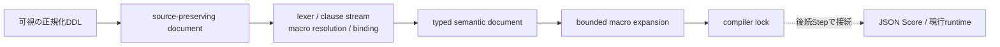
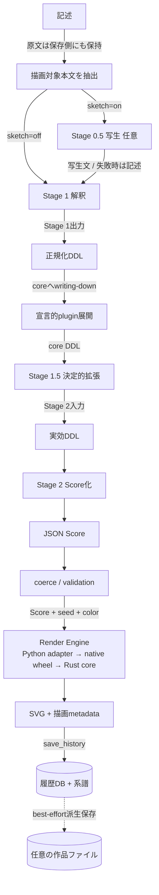
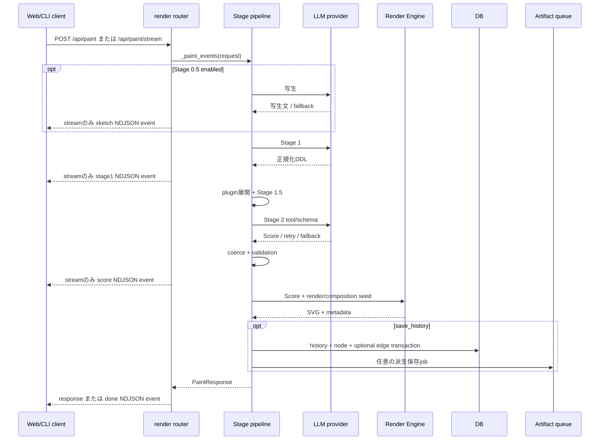
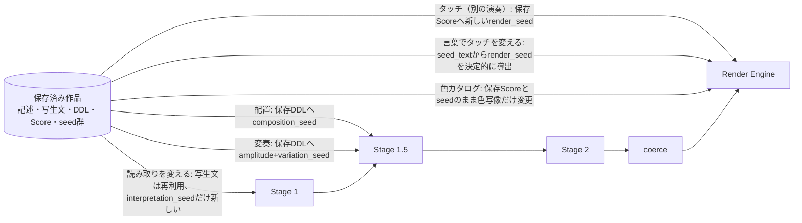

# DDL処理pipeline

## 段階と所有者

| 段階 | 入力 → 出力 | 決定性・fallback | 所有module |
|---|---|---|---|
| 記述 | 作者の文 → 保存用原文とpipeline用本文 | 行頭番号・括弧注記は描画pipelineから切除、原文は保持。切除後が空なら400 | `description_labels.py`; `render.py` |
| Stage 0.5 | 記述 → 写生文 | 任意、LLM。requestが写生文を持てばそのまま再利用しLLMを呼ばない。失敗（timeout・provider例外・空出力）時は記述へfallbackし`sketch_state`記録 | `sketch.py`; `render.py:_resolved_sketch` |
| Stage 1 | 記述/写生文 → 正規化DDL | LLM、空/timeout等にfallback。プラグイン語だけの入力（純粋呼出し）はStage 1を飛ばして転写 | `interpreter.py`; `render.py:_call_interpret_detail` |
| plugin展開 | 正規化DDL → core DDL + optional instructions | 文書検証後、seedつき決定的writing-down。seedは記述のhash | `plugins/document_format.py`; `_call_compose_detail` |
| Stage 1.5 | core DDL → effective DDL | 決定的。現行は焦点書換えのみ、明示変奏時だけ軸を動かす | `ddl_expander.py` |
| Stage 2 | effective DDL → JSON Score | LLM tool/schema。空・短すぎる出力は理由つきで1回retryし、timeout・空retry後は決定的fallback（`compose_fallback`へ記録） | `composer.py`; `render.py:_call_compose_detail` |
| coerce/validation | Score → renderable Score | `auto_repair`時のみ。不正relation等はdrop。要求配達とhard ceilingを行い、記述が抽象色を一つだけ名指す条件ではcolor cycleをその色へ畳む。分岐の発火は`coerce_branch_counts`（trace時） | `coerce/` |
| Render Engine | Score + seeds + 解決済みhost option → SVG + metadata | 同一Score・seed・条件で再現。runtime fallbackなしの粗いnative 1-call境界 | registry `render_engines/__init__.py`; 薄いadapter `default/adapter.py`; binding `inku-render-python`; portable core `core/crates/inku-render`; 別入口 `renderer.py`（SVG-only互換facade） |
| 履歴・系譜 | pipeline生成物 → DB row/node/edge | DB transaction。edgeは明示parent+kindのみ | `rendering.py`; `db.py` |

判定単位の詳細（どの条件で・何が起き・何が記録されるか）は `description-to-svg.ja.md` が持つ。

## 受入済みのTyped DDL経路（runtime未接続）

Step 8で、利用者に見える正規化DDLからtyped semantic documentとcompiler lockまでを
作るshared Rust基盤を`core/crates/inku-ddl`へ受け入れた。

この経路は、Stage 1が生成したDDLと利用者が直接書いたDDLを同じ可視本文から扱う。
自然文や非表示の背景情報をcompilerへ迂回させず、canvas metadataや未決定の描画既定値を
DDLの意味として挿入しない。複数の読みが残る場合はfirst / nearest / lastで決めず、
source spanと候補をtyped issueへ保存してfail closedする。

`compile_typed_ddl`の呼出しは現時点で`inku-ddl` crate内とそのtestだけにあり、server・
Web・Androidの製品pipelineには未接続である。したがって、以下の通常描画図は現在の
runtimeを、上図は受入済みの次期compiler境界を表す。

## 通常描画

## `/api/paint` とstreaming

## 推敲の再入点

推敲は「pipelineをもう一度最初から」ではない。各操作は保存済みの生成物から、決まった層へ再入する。矢印の注記は**保たれるもの**である。

- 再入した層より上流は変わらない。「読み取りを変える」は写生をやり直さず（確定済み写生文を`sketch_text`で渡し、Stage 0.5のLLMは呼ばれない）、「配置」「変奏」は解釈（DDL）を変えず、「タッチ」「色カタログ」はScoreを変えない。
- 再入した層より下流は再走する。「配置」「変奏」はStage 2のLLMを通り直すので、構図族の選択は決定的でも、Scoreの充填はモデル依存で揺れうる。
- AI自律推敲は上の5種（`reinterpretation` / `layout_change` / `variation` / `touch_change` / `catalog_change`）から各世代1種を選ぶ反復で、Visionの助言は次世代への入力になるだけである（`autonomous_refine.py:ALLOWED_KINDS`）。

## 設計契約の実装位置

| 契約 | 実装での保持 |
|---|---|
| Stage 1 / Stage 2分離 | `interpret_detail`と`compose`は別関数・別model解決。`/api/compose`はStage 1を通らない |
| Stage 1.5は意味を上書きしない | 現行`_expand_ja/_expand_en`は焦点のreframeだけで新しい文を追加しない |
| pluginはStage 1直後 | `_call_compose_detail`: `manager.expand` → `expand_intermediate_for_lang` → `compose` |
| 後段はplugin namespace非依存 | plugin文書はcore DDL/instructionへ閉じ、未知参照をdrop。provenanceだけmetadataへ残す |
| drop-only優先 | invalid relationは`_drop_invalid_relations`。ただしcoerceは要求配達repairと、単一の名指し色だけを残す決定的規則も持つため、完全なdrop-onlyではない |
| 再現性 | 決定的なseed派生はRustが所有し、Engine 41凍結corpusが描画byteを固定する。Python `seeds.py` はhostのfresh entropy発行だけを所有する。`renderer.py`は `render` だけを公開し、採用したfresh seedはmetadata/DBへ保存 |
| 過去engineを選び直さない | `current_render_engine()`は現行1 engine。履歴のdisplay SVGは保存済みを返す |
| 歳時記single source | `saijiki.py`からprompt、markers、relation literals、API表示、referenceを導出 |

## 生成パラメータの注入点

生成を変えるパラメータは、それぞれ決まった層に注入される。**rh3列が本表の要点である** — edition同一性 `rh3` の直接材料は「Score・render seed・wild・engine ID/版・色カタログID」だけで、それ以外はScoreを変えることを通じてのみ同一性に効く。直接材料に触れる変更は、同じ作品を別のeditionにする。

| パラメータ | 注入される層 | rh3への効き方 | 記録先 |
|---|---|---|---|
| 色カタログ（`catalog_id` / `catalog_mode`） | Renderの色写像 | **直接材料**（`render_color_catalog_id`） | render metadata・履歴列。`auto`はmodeも記録 |
| `render_seed` | Render Engine | **直接材料** | render metadata |
| `seed_text`（言葉でタッチを変える） | `render_seed`を決定的に導出してRender Engineへ | render_seedを通じて直接材料 | `seed_text`と導出seedの両方 |
| `wild`（暴れる） | Render Engine | **直接材料**（`render_wild`） | render metadata |
| `canvas_aspect` | Stage 2 prompt + Scoreの`canvas` | Score経由 | Score・`render_canvas_aspect_*`列 |
| `composition_seed` | Stage 1.5の構図族選択 | Score経由（直接材料ではない） | render metadata |
| `variation_amplitude` / `variation_seed` | Stage 1.5の明示変奏 | Score経由 | render metadata・`variation_moved_axes` |
| `interpretation_seed` | Stage 1 | DDL→Score経由 | render metadata |
| 写生設定（on/off・grain） | Stage 0.5 | 写生文→DDL→Score経由 | `sketch_text` / `sketch_grain` / `sketch_state`列 |
| 制限値（limits） | Stage 1/2 promptに明記＋coerceが適用 | Score経由 | `render_limits`と`render_limits_source`、超過は`render_limit_notes` |
| model選択（Stage 0.5/1/2） | 各LLM呼出し | Score経由（材料ではない） | `stage1_model` / `stage2_model`列 |

## 図の根拠

`PIPE-SKETCH`、`PIPE-S1`、`PIPE-PLUGIN`、`PIPE-S15`、`PIPE-S2`、`PIPE-COERCE`、`PIPE-RENDER`、`PIPE-HISTORY`、`PIPE-LIMITS`、`DATA-RH3`、`DATA-FALLBACK`。主なcall siteは `server/src/inku_server/api_core/routers/render.py:_paint_events` と `_call_compose_detail`。
