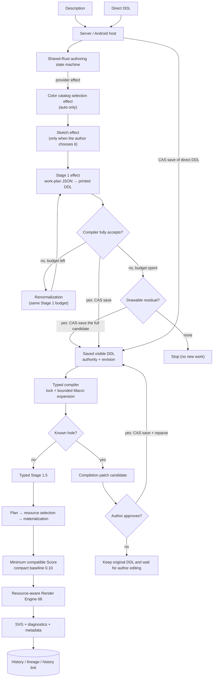
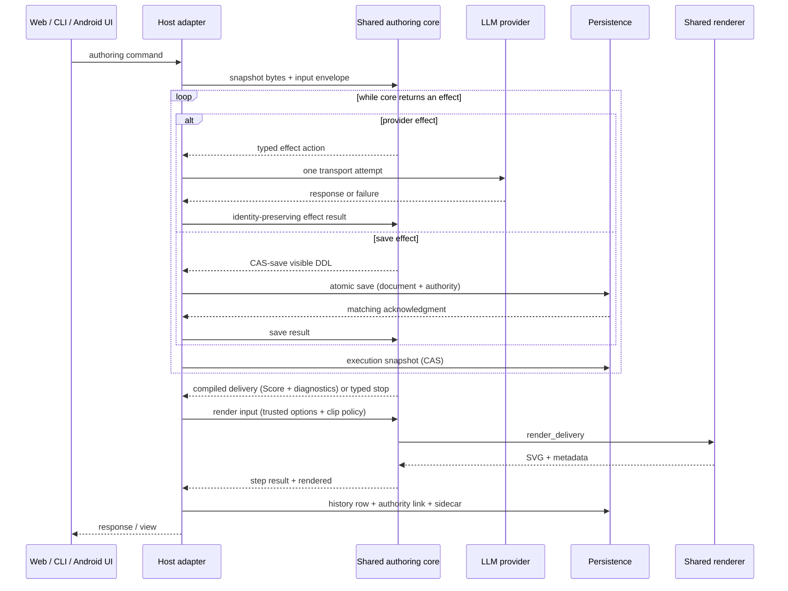

# DDL processing pipeline

The normal Server, Web, and Android paths use the same shared-Rust authoring state machine, typed compiler, lowerer, and renderer. The 2026-09-14 cutover removed the old Python/Kotlin Stage 1, Stage 1.5, Stage 2, and coerce from the path of new works; there is no runtime selector and no Python fallback.

## Stages and owners

| Stage | Input → output | Contract | Owning module |
|---|---|---|---|
| Host input | Description or direct DDL → typed command | Only a description start requests model stages. The description reaches the core with leading numbers and bracketed comments cut, while the work keeps it as written (Server). Direct DDL is never sent back through prose | Server pipeline host / Android pipeline host |
| Authoring state machine | Snapshot + command/effect result → next snapshot + event + at most one effect | Deterministic. Provider transport and persistence leave core as typed effects; core decides retry, fallback, and authority transitions | `core/crates/inku-pipeline` |
| Color catalog selection effect (optional) | Description + catalog candidates → catalog ID | Only for a description start with `catalog_mode=auto`. Failure or an exhausted budget falls back to `default`, records `auto_fallback_default`, and continues | `inku-pipeline` prompt/action; host provider adapter |
| Sketch effect (optional) | Description → a supplement about place and light | Only when the author chooses it. It never rewrites the description; a failure continues as `fallback` with the description alone | `inku-pipeline` prompt/action; host provider adapter |
| Stage 1 effect | Description (+ sketch) → work-plan JSON → visible normalized DDL candidate | The model writes no DDL string; it returns only a closed-typed work plan. Core drops out-of-range values field by field and prints the plan deterministically as DDL in the requested language. The model does not write Score or receive Macro bodies or hidden meaning | `inku-pipeline/src/prompts.rs`; `inku-ddl/src/work_plan.rs`; host provider adapter |
| Stage 1 renormalization / residual adoption | A candidate the compiler does not fully accept → a replacement request, or a drawable residual | Within the same Stage 1 budget, core asks again with a new action carrying the description, the rejected DDL, and the reasons and spans. Once the budget is spent, the full candidate is proposed for saving unchanged only if the sealed execution projection has a drawable residual | `inku-pipeline/src/machine.rs` (`correct_stage1`, `residual_execution_preflight`) |
| CAS persistence | DDL candidate + revision → saved visible DDL | Source and authority advance only after a matching atomic save acknowledgment; core reparses the exact saved bytes | Authority store / pipeline host |
| Typed compiler | Visible DDL + definition locks → verified meaning + diagnostics | Verifies source, provenance, and Macro definitions, then performs bounded expansion. Ambiguity is not guessed by first/nearest/last. The lock is one of `canonical_ready` / `incomplete_known_hole` / `blocked_conflict` / `blocked_diagnostic` | `core/crates/inku-ddl` |
| Hole completion (Stage 2) | Known hole → patch candidate → author approval | Requested automatically, closed over the hole's span and digests. With no hole there is no Stage 2 LLM call. An approved patch is reparsed only after CAS save. A decline or failure keeps the saved DDL and waits for the author's edit | Shared state machine + host provider/store |
| Typed Stage 1.5 | Verified meaning + composition/variation seed → effective meaning | Deterministic and model-free; changes only focus and explicit variation and does not overwrite source meaning or explicit attributes | `core/crates/inku-ddl` |
| Plan, resource selection, materialization | Verified effective meaning → symbolic Plan → compact Score recipe | Lowers once and checks demand against the hard policy and the operational budget before any instance is made. Selects the minimum Score version the work needs; compact output starts at 0.10, and only a work carrying a mirror relation requires 0.15 | `core/crates/inku-ddl`; `core/crates/inku-score` |
| Render Engine | Score + saved policy + seeds + resolved host options → SVG + metadata | Performs only when the options match those used for compilation. Samples from the recipe; a unit that cannot be clipped is omitted as its whole source and the performance is repeated. The same Score, seeds, and conditions reproduce the same performance | `core/crates/inku-render` |
| History/lineage | DDL / Score / SVG / authority context → DB row/node/edge + history link | History retains that revision's source, config, seeds, catalog, budget, definition locks, and the four diagnostic channels; lineage is never inferred from similarity | Server DB / Android Room |

The decision-level contract is canonical in [SPEC.md](../../SPEC.md) §12.6–§12.8. The decision path of a single request lives in `description-to-svg.md`.

## Normal authoring

A provider patch remains a candidate; a host never adopts it directly. The host attempts provider transport once for each effect and returns the failure to core. Core decides the next effect or a finite stop. A revision saved by residual adoption never starts known-hole completion; it carries `complete_with_omissions` and the original diagnostics through to the save. When there is a hole and a Score also exists, the Server saves the safe performance before requesting completion.

## API and platform boundary

The Server's Python adapter and Android's Kotlin/JNI adapter are thin host boundaries and do not reimplement meaning. Android's normal UI reaches the shared core through `InkuRepository` → `AndroidWorkPipeline` → `SharedPipelineHost` → JNI. Web and the CLI use the Server's same pipeline service through the existing HTTP APIs. `/api/interpret` projects the path up to the saved DDL, `/api/compose` from direct DDL to the performance, and `/api/paint` from the description to the performance (and a history save when `save_history` is set) into one response. When a completion proposal needs approval, these compatibility routes answer 409 with the current view, and the author's command moves to `/api/pipeline/executions/{id}/commands`.

## Reentry points

| Operation | Preserved | Reentry |
|---|---|---|
| Reinterpretation | Original work and explicit parent relation | A new description-origin variation from saved context (`fork-description`) |
| DDL edit | Authoring origin, CAS, and original history | With unchanged settings, the compiler after CAS-saving the author DDL. With changed settings, a parent-linked direct-DDL variation |
| Approve or decline a proposal | Base revision and proposal digest | Approval revalidates the base and CAS-saves. A decline keeps the saved DDL |
| Another composition | Saved visible DDL, source meaning, and drawing attributes | Typed Stage 1.5 / lowerer with a new `composition_seed` |
| Explicit variation | Saved visible DDL, composition family, color, touch, and count | Typed Stage 1.5 / lowerer with amplitude + `variation_seed` |
| Another performance | Saved Score and authoring revision | Renderer only with a new `render_seed` |
| Catalog / canvas change | Original variation remains unchanged | A parent-linked new variation with current options |
| Derivation from an older work | The original history row is never changed | A new `legacy_description_fork` / `legacy_ddl_fork` variation through `legacy/{history_id}/fork` |

Selecting old history uses the context saved for that revision. It never infers from the latest snapshot of the same variation, and a corrupt sidecar is not repaired by recompiling.

## Saved compatibility and platform boundaries

- Saved SVG is canonical for the original display; saved Scores and artifacts retain read compatibility.
- Shared Rust determines the meaning of new work. Old works use their saved Score, SVG, and context; they are not replaced by reinterpreting old DDL.
- Replay of a saved Score depends on its version. A compact Score (0.10 through 0.15) goes to the shared core's `render_saved` with the resource policy saved with it and a recomputed demand. An older Score below 0.10 first receives the structural compatibility of `saved_score_compat.py` (defaults for omitted geometry, a bridge between the fill spellings, removal of unresolvable relations, the recorded limits) and is then performed through the established checked performance. Neither reads a description or DDL.
- Android camera DDL uses the shared Rust Stage 1 vocabulary projection. History displays saved description, DDL, and model information without inferring an unrecorded prompt.
- The Server distribution includes the authoring pipeline and renderer in the same native wheel. Android connects to the same shared core through JNI.
- iOS integration is outside Android acceptance and remains pending.

## Generation conditions and identity

The direct inputs to `rh3` are Score, render seed, wild, engine identity, and the render color catalog ID. Other settings affect edition identity when they change Score or one of those direct inputs.

| Condition | Resolving layer | Persistence |
|---|---|---|
| Visible DDL source / authority / revision | Authoring state machine + CAS store | Snapshot / history link |
| Macro definitions / catalog / canvas identity | Compiler lock input and resolved host options | Definition lock / config / history |
| Color catalog (including automatic selection) | Color catalog selection effect and host color resolution | `catalog_id` / `catalog_mode` / `render_color_map` |
| Sketch | The sketch effect, or a sketch the author supplied or one already saved | The snapshot's `sketch` record / `sketch_text` / `sketch_state` |
| `composition_seed` / variation | Typed Stage 1.5 + lowerer | Config / render metadata |
| Resource policy / operational budget | Materializer + checked performance | Score policy / history |
| `render_seed` / `wild` / concrete color map | Render Engine | Render metadata / history |
| Model choice | Host transport for each provider effect | Effect metadata / history |

## Implementation locations

| Boundary | Main implementation |
|---|---|
| Shared state machine / byte protocol | `core/crates/inku-pipeline`, `core/crates/inku-pipeline-uniffi` |
| Typed compiler / work plan / Stage 1.5 / lowerer | `core/crates/inku-ddl` |
| Score schema / compatibility / resource policy | `core/crates/inku-score` |
| SVG performance | `core/crates/inku-render` |
| Server host | `server/src/inku_server/pipeline_runtime.py`, `pipeline_api.py`, `pipeline_candidate.py`, `pipeline_product.py`, `pipeline_provider.py`, `pipeline_compat.py` |
| Older Score compatibility | `server/src/inku_server/saved_score_compat.py`, `render_engines/default/adapter.py` |
| Android host | `android/.../pipeline/SharedAuthoringPipeline.kt`, `SharedPipelineHost.kt`, `AndroidWorkPipeline.kt`, `NativePipelineBridge.kt` |
| Product contract | [SPEC.md](../../SPEC.md) §12.6–§12.8, §12.11, and §18 |
