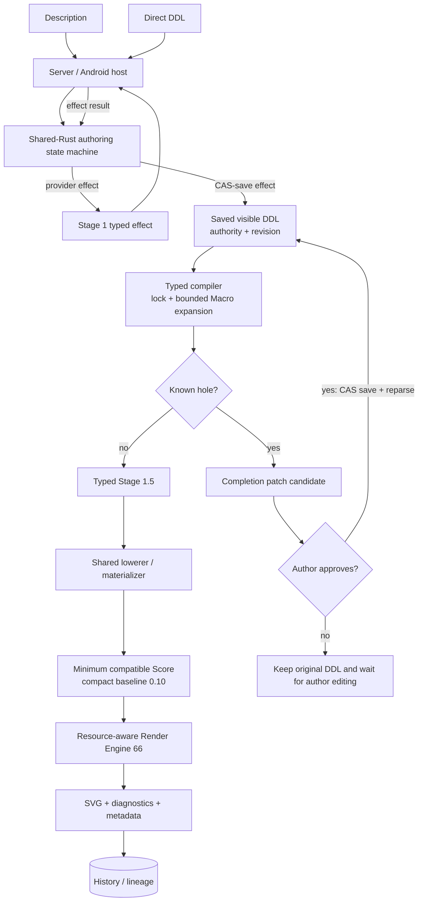
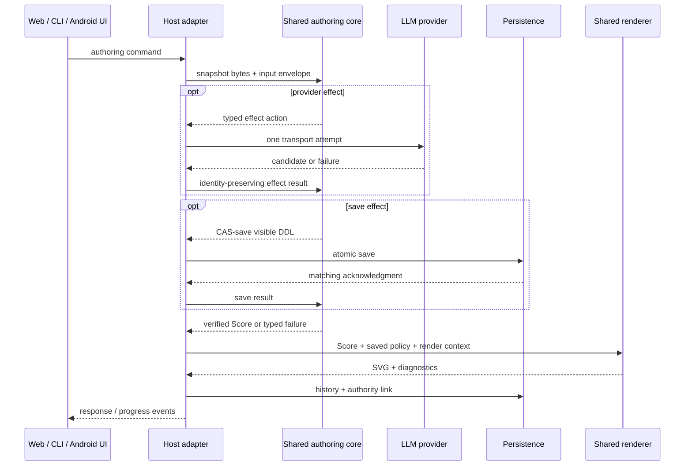

# DDL processing pipeline

The normal Server, Web, and Android paths use the same shared-Rust authoring state machine, typed compiler, lowerer, and renderer.

## Stages and owners

| Stage | Input → output | Contract | Owning module |
|---|---|---|---|
| Host input | Description or direct DDL → typed command | Only a description start requests Stage 1. Direct DDL is never sent back through prose | Server pipeline host / Android pipeline host |
| Authoring state machine | Snapshot + command/effect result → next snapshot + event + at most one effect | Deterministic. Provider transport and persistence leave core as typed effects; core decides retry and authority transitions | `core/crates/inku-pipeline` |
| Stage 1 effect | Description → visible normalized DDL candidate | The model returns DDL only. It does not write Score or receive Macro bodies or hidden meaning | Shared-core prompt/action; host provider adapter |
| CAS persistence | DDL candidate + revision → saved visible DDL | Source and authority advance only after a matching atomic save acknowledgment; core reparses the exact saved bytes | Authority store / pipeline host |
| Typed compiler | Visible DDL + definition locks → verified meaning + diagnostics | Verifies source, provenance, and Macro definitions, then performs bounded expansion. Ambiguity is not guessed by first/nearest/last | `core/crates/inku-ddl` |
| Hole completion | Known hole → patch candidate → author approval | Only a known hole is closed over its span and digests. With no hole there is no Stage 2 LLM call. An approved patch is reparsed only after CAS save | Shared state machine + host provider/store |
| Typed Stage 1.5 | Verified meaning + composition/variation seed → effective meaning | Deterministic and model-free; changes focus only and does not overwrite source meaning or explicit attributes | `core/crates/inku-ddl` |
| Lowering/materialization | Verified effective meaning → actual Score / compact recipe | Lowers once and selects the minimum compatible Score version. Compact output starts at 0.10; only a work carrying a mirror relation requires 0.15 | `core/crates/inku-ddl`; `core/crates/inku-score` |
| Resource check / Render Engine | Score + saved policy + seeds + resolved host options → SVG + metadata | Checks demand before instance materialization and locally omits one excessive source or coordinated placement. The same Score, seeds, and conditions reproduce the same performance | `core/crates/inku-render` |
| History/lineage | DDL / Score / SVG / authority context → DB row/node/edge | History retains that revision's source, config, seeds, catalog, budget, and definition locks; lineage is never inferred from similarity | Server DB / Android Room |

The decision-level contract is canonical in [SPEC.md](../../SPEC.md) §12.7.1.

## Normal authoring

A provider patch remains a candidate; a host never adopts it directly. The host attempts provider transport once for each effect and returns the failure to core. Core decides the next effect or a finite stop.

## API and platform boundary

The Server's Python adapter and Android's Kotlin/JNI adapter are thin host boundaries without separate meaning implementations. The normal Android UI reaches core through `InkuRepository` → `AndroidWorkPipeline` → JNI. Web uses the same Server pipeline service through the existing HTTP API.

## Re-entry points

| Operation | Preserved | Re-entry |
|---|---|---|
| Reinterpretation | Original work and explicit parent relation | A new Stage 1 command from saved context |
| DDL edit | Authoring origin, CAS, and original history | Compiler after CAS-saving the author DDL candidate |
| Another composition | Saved visible DDL, source meaning, and drawing attributes | Typed Stage 1.5 / lowerer with a new `composition_seed` |
| Explicit variation | Saved visible DDL, composition family, color, touch, and count | Typed Stage 1.5 / lowerer with amplitude + `variation_seed` |
| Another performance | Saved Score and authoring revision | Renderer only with a new `render_seed` |
| Catalog / canvas change | Original variation remains unchanged | A parent-linked new variation with current options |

Selecting old history uses the context saved for that revision. It never infers from the latest snapshot of the same variation, and a corrupt sidecar is not repaired by recompiling.

## Saved compatibility and platform boundaries

- Saved SVG is canonical for the original display; saved Scores and artifacts retain read compatibility.
- Shared Rust determines the meaning of new work. Old works use their saved Score, SVG, and context; they are not replaced by reinterpreting old DDL.
- Android camera DDL uses the shared Rust Stage 1 vocabulary projection. History displays saved description, DDL, and model information without inferring an unrecorded prompt.
- The Server distribution includes the authoring pipeline and renderer in the same native wheel. Android connects to the same shared core through JNI.
- iOS integration is outside Android acceptance and remains pending.

## Generation conditions and identity

The direct inputs to `rh3` are Score, render seed, wild, engine identity, and the render color catalog ID. Other settings affect edition identity when they change Score or one of those direct inputs.

| Condition | Resolving layer | Persistence |
|---|---|---|
| Visible DDL source / authority / revision | Authoring state machine + CAS store | Snapshot / history link |
| Macro definitions / catalog / canvas identity | Compiler lock input and resolved host options | Definition lock / config / history |
| `composition_seed` / variation | Typed Stage 1.5 + lowerer | Config / render metadata |
| Resource policy / operational budget | Materializer + checked performance | Score policy / history |
| `render_seed` / `wild` / concrete color map | Render Engine | Render metadata / history |
| Model choice | Host transport for Stage 1 or a known-hole effect | Effect metadata / history |

## Implementation locations

| Boundary | Main implementation |
|---|---|
| Shared state machine / byte protocol | `core/crates/inku-pipeline`, `core/crates/inku-pipeline-uniffi` |
| Typed compiler / Stage 1.5 / lowerer | `core/crates/inku-ddl` |
| Score schema / compatibility / resource policy | `core/crates/inku-score` |
| SVG performance | `core/crates/inku-render` |
| Server host | `server/src/inku_server/pipeline_runtime.py`, `pipeline_product.py`, `pipeline_provider.py` |
| Android host | `android/.../pipeline/SharedAuthoringPipeline.kt`, `AndroidWorkPipeline.kt`, `NativePipelineBridge.kt` |
| Product contract | [SPEC.md](../../SPEC.md) §12.7.1, §12.11, and §18 |
