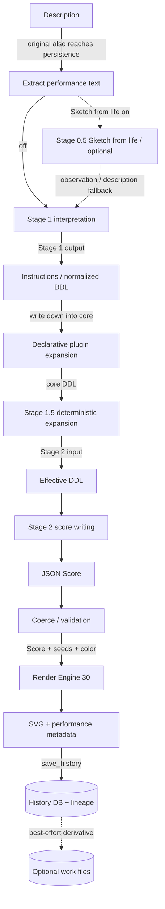
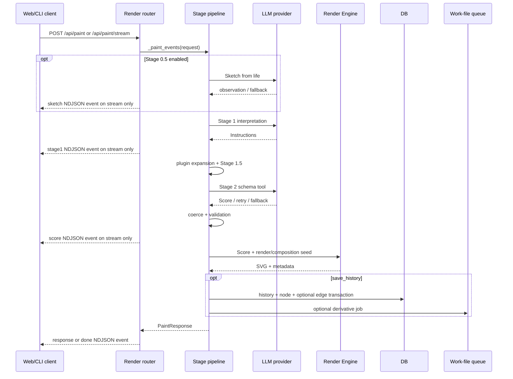

# DDL processing pipeline

## Stages and owners

| Stage | Input → output | Determinism and fallback | Owning module |
|---|---|---|---|
| Description | Author’s sentence → stored original and pipeline text | Labels/comments leave the performance pipeline; original remains | `description_labels.py`; `render.py` |
| Stage 0.5 | Description → Sketch from life text | Optional LLM; falls back to the description and records `sketch_state` | `sketch.py`; `render.py:_resolved_sketch` |
| Stage 1 | Description/Sketch from life → Instructions (normalized DDL) | LLM with empty/timeout fallback | `interpreter.py`; `render.py:_call_interpret_detail` |
| Plugin expansion | Instructions → core DDL + optional instructions | Validated document, deterministic writing-down with a seed | `plugins/document_format.py`; `_call_compose_detail` |
| Stage 1.5 | Core DDL → effective DDL | Deterministic focus rewrite; explicit variation moves one axis | `ddl_expander.py` |
| Stage 2 | Effective DDL → JSON Score | LLM tool/schema; deterministic fallback after empty output, timeout, or retry | `composer.py`; `render.py:_call_compose_detail` |
| Coerce/validation | Score → performable Score | Drops invalid relations, delivers requests, enforces ceilings, and retains one explicitly named abstract color | `coerce/` |
| Render Engine | Score + seeds + color catalog → SVG + metadata | Same Score, render seed, and conditions reproduce the same work | `render_engines/default.py`; `renderer.py` |
| History/lineage | Pipeline outputs → DB row/node/edge | One DB transaction; an edge needs an explicit parent and kind | `rendering.py`; `db.py` |

## Normal Paint path

## `/api/paint` and streaming

## Where the contracts are held

| Contract | Implementation |
|---|---|
| Stage 1 / Stage 2 separation | `interpret_detail` and `compose` are separate functions with separate model resolution; `/api/compose` skips Stage 1 |
| Stage 1.5 does not overwrite meaning | `_expand_ja/_expand_en` reframe focus and add no sentence of their own |
| Plugin immediately after Stage 1 | `_call_compose_detail`: `manager.expand` → `expand_intermediate_for_lang` → `compose` |
| Later stages ignore plugin namespaces | Plugin documents close into core DDL/instructions; unknown references drop; metadata retains provenance only |
| Drop-only preference | `_drop_invalid_relations` drops invalid relations; coerce also has request-delivery repairs and the deterministic single-named-color rule |
| Reproducibility | Seed derivation in `renderer.py` and frozen corpora; any fresh seed used by a run is stored in metadata/DB |
| No old-engine selector | `current_render_engine()` exposes one current engine; history display returns the stored SVG |
| Saijiki source | `saijiki.py` supplies prompts, markers, relation literals, API display, and references |

## Diagram evidence

Evidence IDs: `PIPE-SKETCH`, `PIPE-S1`, `PIPE-PLUGIN`, `PIPE-S15`, `PIPE-S2`, `PIPE-COERCE`, `PIPE-RENDER`, `PIPE-HISTORY`. Main call sites: `server/src/inku_server/api_core/routers/render.py:_paint_events` and `_call_compose_detail`.
