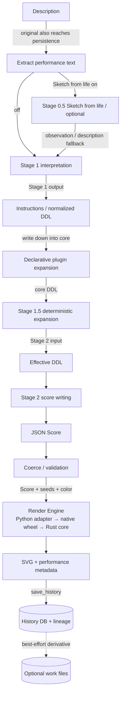
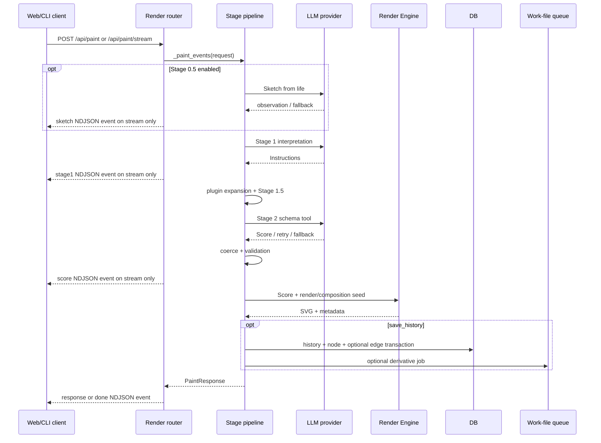
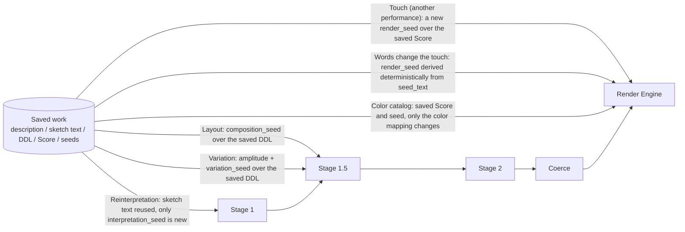

# DDL processing pipeline

## Stages and owners

| Stage | Input → output | Determinism and fallback | Owning module |
|---|---|---|---|
| Description | Author’s sentence → stored original and pipeline text | Leading numbers and bracketed comments are cut from the performance pipeline; the original remains. A cut that leaves nothing answers 400 | `description_labels.py`; `render.py` |
| Stage 0.5 | Description → Sketch from life text | Optional LLM; a request that carries a sketch text reuses it verbatim without calling the model. A failure (timeout, provider error, empty output) falls back to the description and records `sketch_state` | `sketch.py`; `render.py:_resolved_sketch` |
| Stage 1 | Description/Sketch from life → Instructions (normalized DDL) | LLM with empty/timeout fallback. An input made of nothing but qualified plugin terms (a pure invocation) skips Stage 1 and is transcribed | `interpreter.py`; `render.py:_call_interpret_detail` |
| Plugin expansion | Instructions → core DDL + optional instructions | Validated document, deterministic writing-down; the seed is a hash of the description | `plugins/document_format.py`; `_call_compose_detail` |
| Stage 1.5 | Core DDL → effective DDL | Deterministic focus rewrite; explicit variation moves one axis | `ddl_expander.py` |
| Stage 2 | Effective DDL → JSON Score | LLM tool/schema; an empty or too-short answer retries once with a stated reason, and a timeout or empty retry ends in the deterministic fallback (recorded in `compose_fallback`) | `composer.py`; `render.py:_call_compose_detail` |
| Coerce/validation | Score → performable Score | Only with `auto_repair`. Drops invalid relations, delivers requests, enforces ceilings, and retains one explicitly named abstract color. Branch firings land in `coerce_branch_counts` when tracing | `coerce/` |
| Render Engine | Score + seeds + resolved host options → SVG + metadata | Same Score, seeds, and conditions reproduce the same work; one coarse native call with no runtime fallback | Registry `render_engines/__init__.py`; thin adapter `default/adapter.py`; binding `inku-render-python`; portable core `core/crates/inku-render`; separate entrypoint `renderer.py` (SVG-only compatibility facade) |
| History/lineage | Pipeline outputs → DB row/node/edge | One DB transaction; an edge needs an explicit parent and kind | `rendering.py`; `db.py` |

The decision-level detail — under which condition each judgment fires, what happens, and what is recorded — lives in `description-to-svg.md`.

## Normal Paint path

## `/api/paint` and streaming

## Refinement re-entry points

Refinement is not the pipeline run again from the top. Each operation re-enters a fixed layer from the saved outputs. The edge notes name **what is preserved**.

- Everything upstream of the re-entry point is preserved. Reinterpretation does not redo the sketch (the settled sketch text travels as `sketch_text`, and the Stage 0.5 model is not called), layout and variation keep the interpretation (DDL), and touch and catalog keep the Score.
- Everything downstream re-runs. Layout and variation pass through Stage 2's LLM again, so even though the compositional-family choice is deterministic, the Score's filling can move with the model.
- Autonomous refinement is a bounded loop over the same five kinds (`reinterpretation` / `layout_change` / `variation` / `touch_change` / `catalog_change`), and Vision's advice is only input to the next generation (`autonomous_refine.py:ALLOWED_KINDS`).

## Where the contracts are held

| Contract | Implementation |
|---|---|
| Stage 1 / Stage 2 separation | `interpret_detail` and `compose` are separate functions with separate model resolution; `/api/compose` skips Stage 1 |
| Stage 1.5 does not overwrite meaning | `_expand_ja/_expand_en` reframe focus and add no sentence of their own |
| Plugin immediately after Stage 1 | `_call_compose_detail`: `manager.expand` → `expand_intermediate_for_lang` → `compose` |
| Later stages ignore plugin namespaces | Plugin documents close into core DDL/instructions; unknown references drop; metadata retains provenance only |
| Drop-only preference | `_drop_invalid_relations` drops invalid relations; coerce also has request-delivery repairs and the deterministic single-named-color rule |
| Reproducibility | Rust owns deterministic seed derivation and Engine 41 frozen corpus pins rendering bytes. Python `seeds.py` only issues fresh host entropy. `renderer.py` exports only `render`; any fresh seed used by a run is stored in metadata/DB |
| No old-engine selector | `current_render_engine()` exposes one current engine; history display returns the stored SVG |
| Saijiki source | `saijiki.py` supplies prompts, markers, relation literals, API display, and references |

## Where generation parameters are injected

Every parameter that changes a generation is injected into one fixed layer. **The rh3 column is the point of this table** — the direct materials of the edition identity `rh3` are only the Score, the render seed, Wild, the engine ID/version, and the color catalog ID; everything else reaches the identity only by changing the Score. A change that touches a direct material makes the same work a different edition.

| Parameter | Injected into | How it reaches rh3 | Recorded in |
|---|---|---|---|
| Color catalog (`catalog_id` / `catalog_mode`) | The render-time color mapping | **Direct material** (`render_color_catalog_id`) | Render metadata and history columns; `auto` also records the mode |
| `render_seed` | Render Engine | **Direct material** | Render metadata |
| `seed_text` (words change the touch) | Deterministically derives `render_seed` for the Render Engine | Direct material through the render seed | Both `seed_text` and the derived seed |
| `wild` | Render Engine | **Direct material** (`render_wild`) | Render metadata |
| `canvas_aspect` | Stage 2 prompt + the Score's `canvas` | Through the Score | Score and the `render_canvas_aspect_*` columns |
| `composition_seed` | Stage 1.5 compositional-family choice | Through the Score (not a direct material) | Render metadata |
| `variation_amplitude` / `variation_seed` | Stage 1.5 explicit variation | Through the Score | Render metadata and `variation_moved_axes` |
| `interpretation_seed` | Stage 1 | Through DDL, then the Score | Render metadata |
| Sketch settings (on/off, grain) | Stage 0.5 | Through the sketch text, DDL, then the Score | The `sketch_text` / `sketch_grain` / `sketch_state` columns |
| Limits | Stated in the Stage 1/2 prompts and applied by coerce | Through the Score | `render_limits` and `render_limits_source`; overruns in `render_limit_notes` |
| Model choice (Stage 0.5/1/2) | Each LLM call | Through the Score (not a material) | The `stage1_model` / `stage2_model` columns |

## Diagram evidence

Evidence IDs: `PIPE-SKETCH`, `PIPE-S1`, `PIPE-PLUGIN`, `PIPE-S15`, `PIPE-S2`, `PIPE-COERCE`, `PIPE-RENDER`, `PIPE-HISTORY`, `PIPE-LIMITS`, `DATA-RH3`, `DATA-FALLBACK`. Main call sites: `server/src/inku_server/api_core/routers/render.py:_paint_events` and `_call_compose_detail`.
