# 記述からSVGまで — 判定の道筋

`ddl-processing-pipeline.ja.md` が層の並びを示すのに対し、本書は**判定**を追う — 入力された記述がどの条件でどう扱われ、どこで何が決まり、失敗がどう吸収され、何が記録されるかを、実装の関数単位で記す。一次根拠はServerでは`pipeline_compat.py`（`/api/paint`・`/api/paint/stream`・`/api/interpret`・`/api/compose`の互換投影）、`pipeline_api.py:PipelineService`、`pipeline_product.py:ProductPipelineEffects`、共有coreでは`core/crates/inku-pipeline/src/machine.rs`と`inku-ddl/src/compiler_execution.rs`である。Androidも同じ共有coreを通るため、host固有の部分を除いて同じ判定をたどる。snapshotと版は `README.ja.md` と `evidence-inventory.ja.md` が持つ。

## 全体の流れ

```mermaid
flowchart TD
    REQ["POST /api/paint(/stream)"]
    BLANK{"空白だけ?"}
    E422["422"]
    LABEL{"札を切ると空?"}
    E400["400: label-only"]
    IDEM{"Idempotency-Key一致の保存済み作品?"}
    REPLAY["保存済み作品をそのまま返す"]
    PREP["host準備\noptions検証・言語・Macro catalog・canvas・seed・色"]
    AUTO{"catalog_mode=auto?"}
    CAT["色カタログ選択 effect"]
    CATF["default へ落とす\nauto_fallback_default"]
    SK{"写生あり?"}
    SKE["写生 effect"]
    SKF["記述だけで続行\nsketch_state=fallback"]
    S1["Stage 1 effect\n作品計画JSON"]
    PRINT["作品計画の正規化と印字\n→ visible DDL候補"]
    LOCK1{"候補がcanonical_ready?"}
    CORR{"Stage 1予算が残る?"}
    RESID{"描画可能な残部?"}
    S1F["停止: stage1_failed"]
    CAS["可視DDLとauthorityのCAS保存"]
    COMP["typed compile\n+ Stage 1.5 + Plan + 資源選択 + materialize"]
    HOLE{"known hole?"}
    SAFE["Scoreが成立すれば\n先に安全な演奏を保存"]
    HREQ["hole補完 effect"]
    APPR{"作者の承認?"}
    E409["互換routeは409\n作者操作は /api/pipeline へ"]
    SCORE{"Scoreあり?"}
    EDIT["needs_user_edit"]
    RENDER["render_delivery\nRender Engine 68"]
    SAVE{"save_history?"}
    ROW["履歴row + lineage\n+ history link sidecar"]
    QUEUE["作品ファイル・thumbnail queue\n（best-effort）"]
    RESP["PaintResponse / done event"]

    REQ --> BLANK
    BLANK -->|"はい"| E422
    BLANK -->|"いいえ"| IDEM
    IDEM -->|"はい"| REPLAY
    IDEM -->|"いいえ"| LABEL
    LABEL -->|"はい"| E400
    LABEL -->|"いいえ: 切った記述をcoreへ、原文は作品へ"| PREP --> AUTO
    AUTO -->|"はい"| CAT
    CAT -->|"失敗・予算切れ"| CATF --> SK
    CAT -->|"選択"| SK
    AUTO -->|"いいえ"| SK
    SK -->|"on"| SKE
    SKE -->|"失敗・予算切れ"| SKF --> S1
    SKE -->|"補足あり / not_needed"| S1
    SK -->|"off / 作者の写生文"| S1
    S1 -->|"schema違反・transport失敗は予算内で再試行"| PRINT --> LOCK1
    LOCK1 -->|"はい"| CAS
    LOCK1 -->|"いいえ"| CORR
    CORR -->|"はい: 理由とspanを添えて再要求"| S1
    CORR -->|"いいえ"| RESID
    RESID -->|"あり"| CAS
    RESID -->|"なし"| S1F
    CAS --> COMP --> HOLE
    HOLE -->|"あり"| SAFE --> HREQ --> APPR
    APPR -->|"承認待ち"| E409
    HOLE -->|"なし"| SCORE
    SCORE -->|"なし"| EDIT
    SCORE -->|"あり"| RENDER --> SAVE
    SAVE -->|"はい"| ROW --> QUEUE --> RESP
    SAVE -->|"いいえ"| RESP
```

## 入口で決まること

描画の入口は4つある。`/api/paint`（1応答）、`/api/paint/stream`（同じ生成を、層が落ち着くたびのNDJSON eventつきで返す）、`/api/interpret`（保存済みDDLまで）、`/api/compose`（受け取ったDDLから始め、作品数を数えない）。4つとも`pipeline_compat.py`が要求を共有pipelineのoptionへ写し、`PipelineService.start`を呼び、executionが落ち着くまで保存済み状態を読み直してから`view["result"]`を投影する。応答にはpipelineのvariation ID、execution ID、revisionが加わる。

最初のLLM呼び出しの前に、requestとhostから次が確定する。

- **空白だけの記述** — `PaintRequest`のvalidatorが422で断る。
- **札の切除** — 行頭の連番と角括弧のコメントは作者の文書であって記述ではない。`PipelineService.start`が`description_labels.pipeline_description`で一度だけ切り、切った記述だけが写生・色カタログ選択・Stage 1と指示文言語の判定へ届く。作品と表示には書いたままの記述が残る。記述が空でないのに切ると空になる入力は、どの層も走らせる前に400で断る。記述からの再生成（`generate_from_description`）も同じ規則を通る。
- **冪等な再送** — `Idempotency-Key`が同じ利用者の保存済み作品に一致すれば、新しいvariationを作らずその作品を返す。記述が異なれば409で断る。
- **受理するoption** — `RunOptions`が`extra="forbid"`で検証する。旧requestの`stage1_input`、`include_thinking`、`auto_repair`、`sketch_grain`はrequest modelに残るが、互換投影はpipelineへ渡さない。
- **指示文言語** — 記述そのものから`_resolve_instruction_lang`が自動判定し、信号が無ければUI言語へ落とす。
- **model** — Stage 1（写生と色カタログ選択も同じmodel）とStage 2（hole補完）を`resolved_stage_model`がそれぞれ解決する。優先順はrequest指定 → 利用者のStage設定 → manifestの既定。
- **Macro catalog** — 新しい作品だけ、有効なplugin文書から新作用のMacro定義とlocalized summaryを`resolve_new_work_macro_catalog`が解決する。保存済みconfigからの派生はその定義をそのまま使う。
- **資源上限** — manifestのhard policyとoperational budget（既存4上限 + 新6上限）に管理者の上限設定を重ね、保存済み作品からの派生はその作品のbudgetを保つ。
- **色カタログ** — `fixed`は明示ID、`random`は現在以外から1つ、`auto`は色カタログ選択effectへ委ねる。全カタログの色をrender seedでpaletteへ解決しておき、選ばれたものだけを使う。
- **seed** — `seed_text`（言葉でタッチを変える）があれば`render_seed`を決定的に導出する。無ければ明示の`render_seed`、それも無ければ63 bitの新しいseedを採り、必ず記録する。`composition_seed`は明示されたときだけ設定する。
- **明示変奏** — `variation_amplitude`と`variation_seed`は組でだけ受け、片方だけなら`variation_pair_required`で断る。変奏はその操作だけに効き、派生作品へ継承しない。
- **再試行予算** — 色カタログ選択とhole補完は既定1回120秒・4回まで、Stage 1は1回300秒・合計540秒・4回まで（`INKU_LLM_*`で上書き）。写生は専用予算が無ければ色カタログ選択の予算を使う。developer modeでは`developer_disable_llm_retries`で全段を1回に限定できる。

## 色カタログの自動選択

`catalog_mode=auto`の記述起点だけ、Stage 1の前に1回のeffectが走る。LLMは候補の中からカタログIDだけを返し、coreが候補にあるIDかを検査する。schema違反やtransport失敗は予算内で再試行し、予算が尽きるか拒否されたら`default`を選び`auto_fallback_default`を記録して、描画を続ける。

## 写生

作者が「あり」を選んだときだけ、Stage 1の前に`generate_sketch` effectが1回走る（prompt `inku.sketch-supplement-prompt.v1`）。結果は3通りに分かれ、どれも描画を止めない。

1. **補足あり** — `supplemented`。写生文は記述の横に置かれ、Stage 1は両方を読む。記述は書き換えない。
2. **補うものが無い** — `not_needed`。記述だけでStage 1へ進む。
3. **失敗・予算切れ** — `fallback`。記述だけでStage 1へ進む。

作者が編集した写生文、または保存済みの写生文を渡すと（`supplied`）、LLMを呼ばずにそのまま使う。旧Stage 0.5の`fine` / `coarse`は保存済み作品の表示のためだけに残る（`sketch.py`）。

## Stage 1 — 作品計画と印字

Stage 1のLLMは可視DDLの文字列を書かず、閉じた型の**作品計画JSON**を返す（prompt `inku.typed-stage1-work-plan-prompt.v1`）。promptは歳時記から導出した有限語彙、解決済みcanvas・catalog identity、検証済みMacroのsignatureとlocalized summaryだけを持ち、Macro本文や展開後DDLを渡さない。

- **正規化** — `normalize_work_plan`が各値を受理行列（`work-plan-capabilities-v1.json`、compilerへ一文ずつ問い合わせて生成したもの）と照合し、範囲外の値はfield単位で未指定に、形の無い層はその層だけを除く。層が1つも残らなければschema違反として予算内で再試行する。
- **印字** — `print_work_plan`が要求言語の可視DDLへ決定的に印字する。compilerへ渡るのはこの文字列だけで、作品計画は一時物である。
- **保存済み実行の再生** — `normalized_ddl`を持つ旧応答はそのまま読む。

## 再正規化と残部採用

印字したDDLは保存前に一度compileされ、lockが`canonical_ready`でなければ次の順に判定する。

1. **再正規化** — Stage 1の予算（回数と合計時間）が残るなら、原文、未採用DDL、compilerの理由とsource span、対応する原文断片を添えて完全な置換DDLを要求する。payloadが変わるので新しいaction identityになるが、予算は同じStage 1のものを消費する。
2. **残部採用** — 予算が尽き、`residual_execution_preflight`でsealed execution projectionが描画可能な残部を持つなら、候補全文を変えずにCAS保存へ提案する（保存理由`stage1_residual_execution`）。lockは`canonical_ready`へ変わらず、このrevisionからhole補完は始めない。
3. **停止** — どちらでもなければ`stage1_failed`で停止し、新しい作品を作らない。

provider拒否（`provider_rejected`）とsemantic違反は再試行しない。transport不能・timeout・rate limit・不正payload・schema違反だけが予算内で次のattemptを使う。

## 可視DDLの保存とauthority

coreは可視DDLとauthorityの次状態を1つのCAS保存effectとしてhostへ渡す。hostは期待revisionが一致する場合だけ文書とauthorityを1 transactionで保存し、DDL digest・新revision・authority digestを返す。coreは一致を検査してから、保存されたbytesだけを再parseする。

- 記述起点のvariationは`stage1_generated` / `description_authoritative`で始まる。作者がexact source bytesの変わるDDLを初めて確定するとDDL authorityへlockされ、元へ戻しても記述authorityへ戻らない。
- direct DDLは最初から`user_authored_ddl` / `ddl_authoritative`である。
- hostの保存失敗は`host_commit_failed`で停止し、直前に確認された文書とauthorityを保つ。
- 同じaction identityの保存再送は2回目のrevision変更を起こさない（action ACKの冪等性）。

## typed compile — lockの4状態

`compile_committed`は保存済み文書を一度だけcompileし、source digest、semantic digest、compiler lock、Score、需要、4種の診断をdeliveryへ残す。compiler lockの状態は4つで、次の扱いになる。

| lock状態 | 意味 | 次 |
|---|---|---|
| `canonical_ready` | 全体がcanonicalなmeaningになった | Stage 1.5へ |
| `incomplete_known_hole` | compilerがexactな境界を確定できる未解決句がある | hole補完。ただし独立した残りはsealed projectionで描画できる |
| `blocked_conflict` | 意味の衝突がある | sealed projectionで独立した残りだけを描画。補完対象にしない |
| `blocked_diagnostic` | integrity等の診断で止まる | sealed projectionで描画できなければ停止 |

曖昧な参照、候補の無い参照、複数候補はfirst / nearest / lastで推測せず、typed issueとしてfail closedする。`canonical_ready`でない場合も、`execution_projection`が確立済みの局所単位を省略して独立した命令を届け、省略を上流診断に残す。描画単位の全省略とintegrity不良は停止する。

## known-hole補完（Stage 2）

保存済みDDLのlockがknown holeを持つと、coreは別の作者操作を待たずにhole補完effectを要求する（prompt `inku.visible-ddl-hole-completion-prompt.v3`）。Serverはこの要求の前に、Scoreが成立していれば安全な演奏を保存する。

- 要求は対象の原文、確定済みtyped fact、有限語彙と受理構文だけを持ち、description、無関係なclause、Score、renderer指示を持たない。
- 応答は短い対象IDごとの修正候補か未解決理由で、coreがIDの一致・重複・欠落を検査し、保存済み要求とlockから実hole ID、許可span、digestを復元する。
- 候補は全体を再compileして範囲外の意味と診断を照合する。独立性を証明できた単位だけを部分採用の候補にする。
- 有効な候補は`awaiting_patch_approval`で作者を待つ。承認はbase revisionとproposal digestを再検証してCAS保存し、辞退は保存済みDDLを変えない。どちらも同じrevisionへの自動再要求はしない。
- 補完要求の失敗・予算切れは`needs_user_edit`になり、保存済みDDLを保つ。

互換route（`/api/paint`等）は承認待ちに達すると409と現在のviewを返し、承認・辞退は`/api/pipeline/executions/{id}/commands`で行う。

## Stage 1.5 — 焦点と明示変奏

LLMを呼ばない。`canonical_ready`のmeaningだけを入力とし（それ以外はsealed projectionを経る）、`place:center`を閉じた6つの焦点候補の1つへ写すことと、明示変奏（amplitude + `variation_seed`の組）で焦点だけを動かすことだけを行う。焦点の選択はlock検証済みのpre / expanded meaning digestとattested optional `composition_seed`に束縛し、render seedやsource spellingを混ぜない。同じ入力と同じseedは同じeffective meaningを生む。

## Plan・資源選択・materialize

- **Plan** — `plan_verified_stage15_with_policy`がinstructionと宣言済みMacro Emitごとに1件のsymbolic Planを作る。exact count、解決済み寸法・外観・angle・位置・layout式とoriginを持ち、個体配列やScore命令の複製は作らない。成立しないfield・relation・coordinationは最小単位で省略し、診断に残す。
- **資源選択** — `select_composition_plan_resources`が個体化の前に、hard policyとoperational budgetの両方で需要を検査する。単独primitiveの明示countが超える場合はsource順の先頭から安全に実行できる最大数を届け、要求数・実行数・理由を資源診断に残す。部分実行が構造を壊すcoordinated placementやMacroは単位全体を省略し、独立した後続を続ける。
- **materialize** — `materialize_selected_composition`がPlanを再演可能なcompact recipeへ写す。Score 0.10を基準に、追加fieldを持つ作品だけが後続版（接続位置の数値0.11、端点指定や墨の広がり0.12、途中への接続0.13、member cycle 0.14、鏡写し0.15）を使う。Scoreは資源policyのsnapshotを持つが、需要の自己申告は持たない。
- **結果** — 省略が無ければ`complete`、あれば`complete_with_omissions`。省略の結果、描く内容（instructionまたは地）が残らなければ`stopped`とし、背景だけの空作品を成功にしない。

## 演奏 — Render Engine

hostは信頼済みのrender option（解決済みcolor map、render seed、wild、canvas、profile、clip policy）を渡し、coreの`render_delivery`がcompileに使ったcompiler option、canvas registry、catalog、palette、Score digest、資源authorityの一致を検査してから`render_with_resources`を呼ぶ。

- compact Scoreは`finalize_saved_score`で保存policyに照らして需要を再計算し、typed performanceがrecipeからsamplingして個体を作る。個体座標はScoreに無い。
- 塗りの境界clipが不能または上限超過になった単位は、元sourceまたはcoordinated group全体を省略して演奏をやり直す。countの一部だけを残さない。
- Render Engine 68はServerとAndroidで同じ。**同じScore・seed・描画条件は同じ作品を再現する。** runtime fallbackや過去engine selectorは無く、履歴のdisplay SVGは保存済みを返す。

## 同一性と保存

- `dh1` — 正規化した記述のhash。
- `rh3` — editionの同一性。材料は**Score・render seed・wild・engine ID/版・色カタログID**だけ（`db.py:render_hash_for_item`）。SVG文字列・記述・DDL・生のLLM応答は入らない。
- 保存は`save_result`が行う。`save_history`なら`db.add_item`で履歴rowとlineage node（明示parentと`derivation_kind`があるときだけedge）を書き、`VariationAuthorityStore.link_history`がvariation・revision・source digestとfork用sidecar（config、host context、4種の診断、renderer診断、`resource_execution`）を結ぶ。そのあと作品ファイルとthumbnailのjobをbest-effort queueへ出す。
- 冪等keyはrequestの`Idempotency-Key`、無ければvariation・revision・`rh3`から導いた値である。一致する再送は新しいrowを作らず、linkが別のvariation・revisionを指せば`idempotency_conflict`で断る。
- `save_history`でなければ履歴を書かず、`count_generation`が偽でない限り作品数だけを数える。

## 応答と診断

`PaintResponse`（streamでは`done` event）は、絵と一緒に判定の記録を返す — 使用model、seed群、色カタログと実際の色、canvas、制限値、DDL版とengine版、`rh3`、写生の状態、そして`compiler_outcome`と`pipeline_diagnostics`（上流・下流・資源省略・relation省略・renderer診断・`resource_execution`）。

- 診断は履歴sidecarにも保存され、履歴を開き直すと当該revisionの診断が戻る。sidecarが壊れていても、その作品だけに警告を出し、保存DDL・Score・SVGの表示を続ける。
- logには`pipeline_compiler_outcome`として、診断の件数と安全な投影（source本文を含まない）だけが出る。
- providerとの送受信の原文は、developer modeで`developer_capture_provider_io`を指定した実行だけ、所有者限定の記録として残り、`/api/pipeline/executions/{id}/provider-observations`で読める。通常の履歴・応答・logには入らない。
- Stage 1（作品計画）とhole completion（Stage 2）がproviderへ送ったsystem promptは、実行ごとに各Stageの最後の送信だけを実行のcontextに残す（再試行ではcompilerの指摘を含む最後の送信）。所有者だけが`/api/pipeline/variations/{id}/system-prompts`で読み、Webの生成情報のプロンプトタブが表示する。modelを呼ばなかったStageはnull、この記録より前の実行は`recorded: false`になる。
- streamは実行を読み直し、`sketch`（写生を通した場合）・`stage1`（保存したDDL）・`score`（instruction数）・`done`（通常応答）の順に知らせる。最初のeventより前の失敗はHTTPの状態そのもので届き、最初のeventが出た後の失敗（補完案の承認待ちを含む）は本文の`error` eventで届く。token数は共有pipelineが数えないためnullである。

## 判定の一覧

| # | どこで | 条件 | 帰結 | 記録 |
|---|---|---|---|---|
| 1 | 入口 | 空白だけの記述 | 422、何も走らない | — |
| 1a | 入口 | 札を切ると空になる記述 | 400、何も走らない | — |
| 2 | 入口 | `Idempotency-Key`が保存済み作品に一致 | 保存済み作品を返す（記述が違えば409） | — |
| 3 | 入口 | 変奏の組が片方だけ | 422 `variation_pair_required` | — |
| 4 | 入口 | `seed_text`あり | `render_seed`を決定的に導出 | 両方を記録 |
| 5 | pool | 保持runが上限で全て実行中 | 429 `pipeline_capacity_reached` | — |
| 6 | 色カタログ | 選択失敗・予算切れ | `default`で続行 | `catalog_mode=auto_fallback_default` |
| 7 | 写生 | 要求の失敗・予算切れ | 記述だけで続行 | `sketch_state=fallback` |
| 8 | 写生 | 補うものが無い | 記述だけで続行 | `sketch_state=not_needed` |
| 9 | Stage 1 | transport・schema失敗 | 予算内で再試行 | `retry_scheduled` event |
| 10 | Stage 1 | provider拒否・予算切れ | 停止、作品を作らない | `stage1_failed`、provider失敗の分類 |
| 11 | Stage 1 | compilerが完全採用しない・予算あり | 理由とspanを添えて再正規化 | `retry_scheduled`（`semantic_violation`） |
| 12 | Stage 1 | 同上・予算切れ・残部あり | 候補全文を保存、残部だけ描画 | `complete_with_omissions`、上流診断 |
| 13 | 保存 | CAS不一致・保存失敗 | 停止、直前の文書とauthorityを保つ | `host_commit_failed` |
| 14 | compile | known holeあり | 安全な演奏を先に保存し、補完を要求 | `typed_ddl_parsed`、hole ID |
| 15 | 補完 | 候補が有効 | 作者の承認待ち（互換routeは409） | `awaiting_patch_approval` |
| 16 | 補完 | 失敗・辞退 | 保存済みDDLのまま作者の編集待ち | `needs_user_edit` |
| 17 | lower | 一部が成立しない | 最小単位を省略して続行 | 下流診断、`complete_with_omissions` |
| 18 | 資源 | 単独primitiveのcountが上限超過 | 先頭から実行可能な最大数を届ける | 資源診断（要求数・実行数・理由） |
| 19 | 資源 | coordinated単位が上限超過 | 単位全体を省略 | 資源省略 |
| 20 | lower | 描く内容が残らない | 停止 | `stopped`、`needs_user_edit` |
| 21 | 演奏 | 塗りのclip不能・上限超過 | 元source全体を省略して再演奏 | renderer診断 |
| 22 | 保存 | queue満杯 | fileだけskip、DBは書く | — |
| 23 | 保存 | 冪等keyが一致 | 新しいrowを作らない | `_idempotent_replay` |
| 24 | stream | 最初のevent後の失敗 | HTTPでなく`error` event | status・detail |

## 旧Scoreの再演

`/api/render-score`と`/api/render-svg`は、保存済みまたは外部のScoreを演奏し直す入口であり、記述もDDLも読まない。

- **compact Score（0.10〜0.15）** — `ProductPipelineEffects.replay`が共有coreの`render_saved`を呼ぶ。資源policyは、Serverが所有するhistory linkを持つ作品だけ保存済みのものを使い、それ以外はinstallationの既定を使う。Score自身は予算を自己申告できない。
- **0.10未満の旧Score** — `saved_score_compat.py:coerce_saved_score`が構造互換（欠けたgeometryの既定、solid fillの2つの旧表記の橋渡し、解決不能relationの除去、記録された4上限）だけを当て、従来のchecked performanceで演奏する。旧coerceの配達・様式補修は行わない。
- どちらも、作品を名指せば（`work_id`）その作品の色snapshot（`render_color_map`）と上限を使い、カタログの今日の定義を読まない。

## 図の根拠

`PIPE-HOST`、`PIPE-MACHINE`、`PIPE-CATALOG`、`PIPE-SKETCH`、`PIPE-S1`、`PIPE-TYPED-DDL`、`PIPE-HOLE`、`PIPE-S15`、`PIPE-LOWER`、`PIPE-LIMITS`、`PIPE-RENDER`、`PIPE-COMPAT`、`PIPE-HISTORY`、`DATA-AUTHORITY`、`API-LIMIT`、`DATA-DH1`、`DATA-RH3`、`DATA-FALLBACK`。一次根拠は `pipeline_compat.py:{paint,paint_events}`、`description_labels.py`、`pipeline_api.py:PipelineService`、`pipeline_product.py:{prepare,provider_for,render_options,save_result,replay}`、`inku-pipeline/src/machine.rs:{description,stage1,llm_response,failure_with_detail,accept_result}`、`protocol.rs:RetryPolicy`、`inku-ddl/src/compiler_execution.rs:execute_compilation_with_resources`、`inku-render/src/render.rs:render_with_resources`、`saved_score_compat.py`、`db.py:render_hash_for_item`。
