# 記述からSVGまで — 判定の道筋

`ddl-processing-pipeline.ja.md` が層の並びを示すのに対し、本書は**判定**を追う — 入力された記述がどの条件でどう扱われ、どこで何が決まり、失敗がどう吸収され、何が記録されるかを、実装の関数単位で記す。一次根拠は `server/src/inku_server/api_core/routers/render.py` の `_paint_events`（`/api/paint` と `/api/paint/stream` の両方が消費する単一のgenerator）と、各層のmodule。snapshotと版は `README.ja.md` と `evidence-inventory.ja.md` が持つ。

## 全体の流れ

```mermaid
flowchart TD
    REQ["POST /api/paint(/stream)"]
    CUT["行頭番号・括弧注記の切除"]
    EMPTY{"切除後が空?"}
    E400["400: label-only"]
    LANG["指示文言語の解決"]
    SKETCH{"写生文あり? / 0.5 on?"}
    S05["Stage 0.5 LLM"]
    S05F{"失敗?"}
    PURE{"純粋呼出し?\n(プラグイン語だけ)"}
    S1["Stage 1 LLM"]
    S1F{"timeout / 空?"}
    FDDL["定型の代替DDL"]
    PLUGIN["plugin展開（決定的）"]
    S15["Stage 1.5（決定的）"]
    S2["Stage 2 LLM"]
    RETRY{"空 / 短すぎ?"}
    S2R["理由つきretry 1回"]
    S2F{"timeout / retryも空?"}
    FSCORE["決定的fallback Score"]
    AR{"auto_repair?"}
    COERCE["coerce（配達・統治・天井）"]
    MERGE["plugin転写instructionの合流"]
    RENDER["Render Engine 演奏"]
    HASH["dh1 / rh3 の計算"]
    SAVE{"save_history?"}
    ROW["履歴row + lineage node/edge\n（1 transaction）"]
    QUEUE["作品ファイルqueue（best-effort）"]
    RESP["PaintResponse / done event"]

    REQ --> CUT --> EMPTY
    EMPTY -->|"はい"| E400
    EMPTY -->|"いいえ"| LANG --> SKETCH
    SKETCH -->|"文あり: 再利用しLLMを呼ばない"| PURE
    SKETCH -->|"on"| S05 --> S05F
    S05F -->|"はい: 記述のまま続行 sketch_state=fallback"| PURE
    S05F -->|"いいえ: 写生文が記述の代役"| PURE
    SKETCH -->|"off"| PURE
    PURE -->|"はい: 転写（Stage 1を呼ばない）"| PLUGIN
    PURE -->|"いいえ"| S1 --> S1F
    S1F -->|"はい"| FDDL --> PLUGIN
    S1F -->|"いいえ"| PLUGIN
    PLUGIN --> S15 --> S2 --> RETRY
    RETRY -->|"はい"| S2R --> S2F
    RETRY -->|"いいえ"| AR
    S2F -->|"はい"| FSCORE --> AR
    S2F -->|"いいえ"| AR
    AR -->|"はい"| COERCE --> MERGE
    AR -->|"いいえ"| MERGE
    MERGE --> RENDER --> HASH --> SAVE
    SAVE -->|"はい"| ROW --> QUEUE --> RESP
    SAVE -->|"いいえ"| RESP
```

## 入口で決まること

描画の入口は3つある。`/api/paint`（1応答）、`/api/paint/stream`（同じ生成をNDJSONの実況つきで返す）、`/api/compose`（Stage 1を通らず、受け取ったDDLから始める）。前2つは同じ `_paint_events` を消費するので、応答の中身は乖離しない。

最初のLLM呼び出しの前に、requestから次が確定する。

- **本文の切除** — 行頭番号と括弧注記は作者の文書であって記述ではない。`pipeline_description` が一度だけ切り、以後どの層もclientも読めない。原文は保存・表示用に保たれる。記述が空でないのに切除後が空になった入力は400で拒否される（編集画面を持たないclient — CLIや後発の実装 — に対する最後の門）。
- **指示文言語** — 記述そのものから自動判定し、言語の信号が無ければUI言語へfallbackする。写生文から読み直すことはしない（0.5は指示された言語で書くので、読み返すと循環する）。
- **model** — Stage 0.5/1はStage 1のmodel解決を共有し、Stage 2は別に解決する。優先順はrequest指定 → 利用者のStage設定。
- **制限値** — `_limits_for_render` が保存済み設定を読み、requestは**下げる方向にだけ**上書きできる。Stage 1/2のprompt・coerce・展開が全部同じ数字を読む（`limits.py` の `Limits`）。
- **色カタログ** — 明示IDか、`auto`（serverが本文から選ぶ）。実際に使ったIDとmodeの両方が記録される。
- **seed** — `seed_text`（言葉でタッチを変える）があれば `render_seed` を決定的に導出する。無ければ明示の `render_seed`、それも無ければ新しく採り、採ったseedは必ず記録される。

## Stage 0.5 — 写生

`_resolved_sketch` の判定は3択で、この順に読む。

1. **requestが写生文を持つ** — 作者が編集した文か、保存済み作品の再描画。そのまま使い、**LLMを呼ばない**。
2. **0.5がon** — 指定のgrain（`fine` / `coarse`、既定 `fine`）でLLMを1回呼ぶ。
3. **どちらでもない** — 層は動かず、記述がそのまま下流へ行く。

失敗は3種（hard timeout・provider例外・空出力）で、**どれも描画を止めない** — 記述そのものが下流へ行き、`fallback_used` と理由が記録される。層の結果は `sketch_state` に一元化される（`fallback` / 実行時のgrain値 / `not_applicable` / `off`。NULLは「列より古い行」だけが持つ）。streamでは、層が何かを担った回だけ `sketch` eventが先行する。

失敗した回の写生文は**保存しない** — 保存すると層が書いた文に見え、「どの作品が層を通ったか」という2列の存在理由が壊れる。

## Stage 1 — 解釈

- **純粋呼出しのbypass** — 入力がプラグインの名前空間つき語だけでできているなら、解釈ではなく**転写**する（`DOCUMENT_PLUGIN_MANAGER.is_pure_invocation`）。Stage 1へ送るとmodelが語を書き換える危険があるため、LLMを呼ばない。
- 通常はLLMを1回呼ぶ。**hard timeout**（`INKU_STAGE1_HARD_TIMEOUT_SECONDS`）と**空出力**は同じ失敗として扱い、定型の代替DDL（`_fallback_ddl_from_text`）で続行する — 空を素通しすると展開層が空を返し、記述を持たない作品が保存されるからである。理由は `interpret_fallback_reasons`（`stage1_hard_timeout` / `stage1_empty_output`）に残り、保存時は先頭の理由が `interpret_fallback` 列に入る。
- 成功したDDLは配置語のsanitizeを通り、promptのdigest（内容ではなく指紋）とともに `stage1` eventで実況される。ここで流れるDDLは**展開前**で、`done` の `ddl` は展開後 — 別物である。

## プラグイン展開

Stage 1の直後、Stage 1.5の前に、宣言的プラグイン文書のwriting-downが走る（`plugins/document_format.py`）。

- **発火の判定は散文が持つ** — `source_text`（写生文または記述）が語の指示対象を明示したときだけ解決する。DDL直書きの作品は記述を持たず、**発火のためだけに記述を与えることはしない**。
- **seedは記述のhash** — 反復しても同じ入力が同じ展開を生む。`seed_text` は言語として読まれない。
- 展開の失敗は修復せずdropし、通常のcore近似へ戻したことを `plugin_warnings` に記す。何が発火したかは `plugin_provenance` に残り、Score・DB正本・rh3には入らない。
- 決定的転写が返したinstructionは、coerceの**後**でScoreへ合流する（`_score_with_plugin_instructions`）。制限値はここでも同じ数字を読む。

## Stage 1.5 — 決定的展開

LLMを呼ばない。焦点の書き換えだけを行い、新しい文を足さない。`composition_seed`（構図族の選択）と、明示変奏（`variation_amplitude` + `variation_seed`。動いた軸は `variation_moved_axes` に記録）だけが結果を動かす。同じ入力と同じseedは同じ実効DDLを生む。

## Stage 2 — Score化

実効DDLをschema tool（`_score_tool_schema`）つきでLLMへ渡し、JSON Scoreを受け取る。

- **retryの判定** — instructionが空、または出力が短すぎる場合、理由（`compose_retry_reasons`）を明示した専用promptで**1回だけ**retryする。
- **fallbackの判定** — hard timeout（`INKU_STAGE2_HARD_TIMEOUT_SECONDS`）、またはretry後も空なら、決定的fallback（`_fallback_score_from_ddl`）がDDLからScoreを書く。この作品は言葉から作曲されていない。事実は `compose_fallback_used`（応答）と `compose_fallback` 列（保存時。落ちた理由 / `none` / NULL=列より古い）に残る。
- Scoreが確定しcoerceが済んだ時点で `score` eventが実況される — 残りの待ちは演奏だけである。

## coerce — 配達と統治

`auto_repair` が真のときだけ走る（`coerce_score`）。先に `ensure_renderable_score` が「描けるinstructionが1つも無いScore」を拒む。

分岐は約30種で、仕事は4群に分かれる。

| 群 | 例 | 性質 |
|---|---|---|
| 正規化・修復 | `coerce_instruction`、構造的重複の修復、閉形状のsurface | 欠損・不正フィールドを描ける形に直す |
| drop | `drop_invalid_relations`、明示region外の支え | 不正なものは補完せず落とす |
| 要求配達 | `with_ddl_coverage`、色・形・複合モチーフのdelivery repair、述べた個数の忠実 | **記述に在ってScoreに届かなかったものを届ける**。発明はしない（発明する6分岐はv2.11.0で添景水準ごと畳んだ） |
| 統治 | 密度予算（命令ごと・全体）、文脈密度、hard ceiling | 描画量を天井の内側へ収める。天井は**最後**に1回だけ当たる |

- 発火は `branch_report` に「中身を変えた命令の数」で数えられ、traceの `coerce_branch_counts` として読める（観測のみ。生成を分岐させない）。
- `INKU_COERCE_DISABLE` は**様式の補修だけ**を切る。記述への忠実（述べた個数・述べた大きさ・頼んでいない色環の畳み込み）と描画可能性（fillの正規化・hard ceiling）は、そのexitでも残る。
- 天井が個数を切り詰めたら `render_limit_notes` に注記が積まれ、応答でclientへ届く。

## 演奏 — Render Engine

確定したScoreと、`render_seed`・`wild`・色カタログの写像・`canvas`（Scoreの中）から、registryが選ぶ`render_engines/default/adapter.py`を介してcanonical `render_engines/default/engine.py`がSVGと演奏metadataを作る。`renderer.py`は既存のSVG-only呼出し向け互換facadeである。**同じScore・同じrender seed・同じ描画条件は同じ作品を再現する** — これが凍結corpusが守る契約である。過去のengineを選び直すAPIは無く、履歴のdisplay SVGは保存済みを返す。

## 同一性と保存

- `dh1` — 正規化した記述のhash。
- `rh3` — editionの同一性。材料は**Score・render seed・wild・engine ID/版・色カタログID**だけ（`db.py:render_hash_for_item`）。SVG文字列・記述・DDL・生のLLM応答は入らない。
- 保存の判定は2段ある。`save_history` なら履歴row＋lineage node（＋明示parentと`derivation_kind`があるときだけedge）を**1 transaction**で書き、そのあと作品ファイルのjobをbest-effort queueへ出す（queueが満杯ならfileだけskipし、DBは守られる）。`save_history` でなく `save_artifacts` だけならfileのみ。どちらでもなければ何も書かない。
- `Idempotency-Key` が一致する再送は新しいrowを作らず、既存の保存を返す。

## 応答と鏡

`PaintResponse`（streamでは `done` event）は、絵と一緒に判定の記録を返す — 各層のfallbackフラグと理由、retry回数、実使用model、seed群、制限値とその出どころ、`render_limit_notes`、色カタログ、写生の3列ぶん、そして系譜の識別子。

- `carriage_warnings` は搬送契約の**鏡（検査のみ）**で、生成を止めない。
- `include_trace` 時だけ、RAW trace（写生の生文・Stage 1の生応答・展開前後のDDL・coerce前のScore・`coerce_branch_counts`・Stage 2の試行ごとの生文）が付く。traceの収集失敗は警告になり、生成を壊さない。
- streamの失敗規約 — 最初のeventより前の失敗はHTTPの状態そのもの（label-onlyの400等）で届き、最初のeventが出た後の失敗は本文の `error` eventで届く。0.5がeventを書くようになった分、境界は1層ぶん早い。

## 判定の一覧

| # | どこで | 条件 | 帰結 | 記録 |
|---|---|---|---|---|
| 1 | 入口 | 切除後の本文が空 | 400、何も走らない | — |
| 2 | 入口 | `seed_text` あり | `render_seed` を決定的に導出 | 両方を記録 |
| 3 | Stage 0.5 | requestが写生文を持つ | 再利用、LLMを呼ばない | `sketch_state`=grain値 |
| 4 | Stage 0.5 | timeout / 例外 / 空 | 記述のまま続行 | `sketch_state`=`fallback`、理由 |
| 5 | Stage 1 | 純粋呼出し | 転写、LLMを呼ばない | trace の `stage1_ddl` |
| 6 | Stage 1 | timeout / 空出力 | 定型の代替DDL | `interpret_fallback` 列、理由 |
| 7 | plugin | 検証違反の文書 | 文書全体を理由つきで拒否（load時） | — |
| 8 | plugin | 展開の失敗 | dropしてcore近似へ | `plugin_warnings` |
| 9 | Stage 2 | 空 / 短すぎる出力 | 理由つきretry 1回 | `compose_retry_reasons` |
| 10 | Stage 2 | timeout / retryも空 | 決定的fallback Score | `compose_fallback_used`、`compose_fallback` 列 |
| 11 | coerce | `auto_repair` 偽 | coerceを通らない | — |
| 12 | coerce | instructionが0本 | 502（描けない） | — |
| 13 | coerce | 不正relation | 補完せずdrop | `coerce_relation_dropped_count` |
| 14 | coerce | 天井超過 | 個数を切り詰め | `render_limit_notes` |
| 15 | 保存 | queue満杯 | fileだけskip、DBは書く | — |
| 16 | 保存 | `Idempotency-Key` 一致 | 再送は既存rowを返す | `_idempotent_replay` |
| 17 | stream | 最初のevent後の失敗 | HTTPでなく `error` event | status・detail |

## 図の根拠

`PIPE-SKETCH`、`PIPE-S1`、`PIPE-PLUGIN`、`PIPE-S15`、`PIPE-S2`、`PIPE-COERCE`、`PIPE-RENDER`、`PIPE-HISTORY`、`PIPE-LIMITS`、`API-LIMIT`、`DATA-DH1`、`DATA-RH3`、`DATA-FALLBACK`。一次根拠は `render.py:_paint_events` / `_call_interpret_detail` / `_call_compose_detail` / `_resolved_sketch`、`sketch.py:sketch_state_of`、`coerce/__init__.py:coerce_score`、`limits.py`、`db.py:render_hash_for_item`、`web/src/lib/composeFallback.ts`。
