# From a description to an SVG — the road of judgments

Where `ddl-processing-pipeline.md` shows the order of the layers, this document follows the **judgments** — under which condition an entered description is treated which way, what is decided where, how failures are absorbed, and what gets recorded, at the level of the implementing functions. On the Server, the primary evidence is `pipeline_compat.py` (with `paint_events` for the stream, the compatibility projection behind `/api/paint`, `/api/paint/stream`, `/api/interpret`, and `/api/compose`), `pipeline_api.py:PipelineService`, and `pipeline_product.py:ProductPipelineEffects`; in the shared core it is `core/crates/inku-pipeline/src/machine.rs` and `inku-ddl/src/compiler_execution.rs`. Android goes through the same shared core, so apart from host-specific parts it follows the same judgments. The snapshot and versions live in `README.md` and `evidence-inventory.md`.

## Overall flow

```mermaid
flowchart TD
    REQ["POST /api/paint(/stream)"]
    BLANK{"Whitespace only?"}
    E422["422"]
    LABEL{"Empty once labels are cut?"}
    E400["400: label-only"]
    IDEM{"Idempotency-Key matches a saved work?"}
    REPLAY["Return the saved work as it is"]
    PREP["Host preparation\noptions, language, Macro catalog, canvas, seeds, colors"]
    AUTO{"catalog_mode=auto?"}
    CAT["Color catalog selection effect"]
    CATF["Fall back to default\nauto_fallback_default"]
    SK{"Sketch on?"}
    SKE["Sketch effect"]
    SKF["Continue with the description alone\nsketch_state=fallback"]
    S1["Stage 1 effect\nunderdrawing JSON"]
    PRINT["Normalize and print the underdrawing\n→ visible DDL candidate"]
    LOCK1{"Candidate is canonical_ready?"}
    CORR{"Stage 1 budget left?"}
    RESID{"Drawable residual?"}
    S1F["Stop: stage1_failed"]
    CAS["CAS save of visible DDL and authority"]
    COMP["Typed compile\n+ Stage 1.5 + Plan + resource selection + materialization"]
    HOLE{"Known hole?"}
    SAFE["If a Score exists,\nsave the safe performance first"]
    HREQ["Hole completion effect"]
    APPR{"Author approval?"}
    E409["Compatibility routes answer 409\nauthor commands move to /api/pipeline"]
    SCORE{"Score exists?"}
    EDIT["needs_user_edit"]
    RENDER["render_delivery\nRender Engine 68"]
    SAVE{"save_history?"}
    ROW["History row + lineage\n+ history-link sidecar"]
    QUEUE["Work-file and thumbnail queues\n(best-effort)"]
    RESP["PaintResponse / done event"]

    REQ --> BLANK
    BLANK -->|"yes"| E422
    BLANK -->|"no"| IDEM
    IDEM -->|"yes"| REPLAY
    IDEM -->|"no"| LABEL
    LABEL -->|"yes"| E400
    LABEL -->|"no: cut text to the core, original to the work"| PREP --> AUTO
    AUTO -->|"yes"| CAT
    CAT -->|"failure / budget spent"| CATF --> SK
    CAT -->|"selected"| SK
    AUTO -->|"no"| SK
    SK -->|"on"| SKE
    SKE -->|"failure / budget spent"| SKF --> S1
    SKE -->|"supplement / not_needed"| S1
    SK -->|"off / sketch from the author"| S1
    S1 -->|"schema and transport failures retry within the budget"| PRINT --> LOCK1
    LOCK1 -->|"yes"| CAS
    LOCK1 -->|"no"| CORR
    CORR -->|"yes: ask again with reasons and spans"| S1
    CORR -->|"no"| RESID
    RESID -->|"yes"| CAS
    RESID -->|"no"| S1F
    CAS --> COMP --> HOLE
    HOLE -->|"yes"| SAFE --> HREQ --> APPR
    APPR -->|"awaiting approval"| E409
    HOLE -->|"no"| SCORE
    SCORE -->|"no"| EDIT
    SCORE -->|"yes"| RENDER --> SAVE
    SAVE -->|"yes"| ROW --> QUEUE --> RESP
    SAVE -->|"no"| RESP
```

## What the entry point settles

There are four drawing entry points: `/api/paint` (one response), `/api/paint/stream` (the same generation with an NDJSON event as each layer settles), `/api/interpret` (up to the saved DDL), and `/api/compose` (starts from the DDL it receives and does not count a work). All four let `pipeline_compat.py` map the request to shared-pipeline options, call `PipelineService.start`, re-read the saved state until the execution settles, and project `view["result"]`. The response also carries the pipeline's variation ID, execution ID, and revision.

Before the first LLM call, the request and the host settle the following.

- **Whitespace-only description** — the `PaintRequest` validator rejects it with 422.
- **Cutting labels** — leading numbers and bracketed comments are the author's document, not the description. `PipelineService.start` cuts them once with `description_labels.pipeline_description`, and only the cut description reaches the sketch, color catalog selection, Stage 1, and instruction-language detection. The work and its display keep the description as written. Input that is not empty but becomes empty once cut is refused with 400 before any layer runs. Regeneration from a description (`generate_from_description`) follows the same rule.
- **Idempotent resend** — when `Idempotency-Key` matches a work the same user already saved, that work is returned without creating a new variation. A different description is rejected with 409.
- **Accepted options** — `RunOptions` validates with `extra="forbid"`. The old request fields `stage1_input`, `include_thinking`, `auto_repair`, and `sketch_grain` remain in the request model, but the compatibility projection does not pass them to the pipeline.
- **Instruction language** — `_resolve_instruction_lang` detects it from the description itself and falls back to the UI language when there is no signal.
- **Models** — `resolved_stage_model` resolves Stage 1 (the sketch and color catalog selection use the same model) and Stage 2 (hole completion) separately. The order is the request, then the user's Stage setting, then the manifest default.
- **Macro catalog** — for a new work only, `resolve_new_work_macro_catalog` resolves the Macro definitions and localized summaries from the enabled plugin documents. A derivation from a saved configuration uses that configuration's definitions unchanged.
- **Resource limits** — the manifest's hard policy and operational budget (four existing limits plus six new ones) are combined with the administrator's limit settings; a derivation from a saved work keeps that work's budget.
- **Color catalog** — `fixed` uses the explicit ID, `random` picks one other than the current one, and `auto` delegates to the color catalog selection effect. Every catalog's colors are resolved with the render seed in advance, and only the selected one is used.
- **Seeds** — with `seed_text` (words that change the touch), `render_seed` is derived deterministically. Otherwise an explicit `render_seed` is used, or a new 63-bit seed is drawn; either way it is recorded. `composition_seed` is set only when given.
- **Explicit variation** — `variation_amplitude` and `variation_seed` are accepted only as a pair; one alone is rejected as `variation_pair_required`. The variation applies to that operation only and is not inherited by derived works.
- **Retry budgets** — color catalog selection and hole completion default to 120 seconds per attempt and up to 4 attempts; Stage 1 to 300 seconds per attempt, 540 seconds in total, and up to 4 attempts (overridable with `INKU_LLM_*`). The sketch uses the color catalog budget unless it has its own. In developer mode, `developer_disable_llm_retries` limits every stage to one attempt.

## Automatic color catalog selection

Only for a description start with `catalog_mode=auto`, one effect runs before Stage 1. The model returns only a catalog ID among the candidates, and core checks that the ID is one of them. Schema violations and transport failures retry within the budget; when the budget is spent or the provider rejects, core selects `default`, records `auto_fallback_default`, and continues the drawing.

## Sketch

Only when the author chooses it, one `generate_sketch` effect runs before Stage 1 (prompt `inku.sketch-supplement-prompt.v1`). The result is one of three, and none stops the drawing.

1. **A supplement** — `supplemented`. The sketch sits beside the description, and Stage 1 reads both. The description is never rewritten.
2. **Nothing to supplement** — `not_needed`. Stage 1 proceeds with the description alone.
3. **Failure or budget spent** — `fallback`. Stage 1 proceeds with the description alone.

A sketch the author edited, or one already saved, is used as it stands without a model call (`supplied`). The old Stage 0.5 `fine` / `coarse` remain only to display saved works (`sketch.py`).

## Stage 1 — underdrawing and printing

The Stage 1 model writes no visible DDL string; it returns a closed-typed **underdrawing JSON** (prompt `inku.typed-stage1-work-plan-prompt.v1`). The prompt carries only the finite vocabulary derived from the saijiki, the resolved canvas and catalog identities, and the signatures and localized summaries of validated Macros. It never passes Macro bodies or expanded DDL.

- **Normalization** — `normalize_work_plan` checks each value against the capability matrix (`work-plan-capabilities-v1.json`, generated by asking the compiler one sentence at a time). An out-of-range value becomes unspecified field by field, and a layer without a form is dropped alone. When no layer remains, it counts as a schema violation and retries within the budget.
- **Printing** — `print_work_plan` prints the plan deterministically as visible DDL in the requested language. Only that string reaches the compiler; the underdrawing is transient.
- **Replay of saved executions** — an older response that carries `normalized_ddl` is read unchanged.

## Renormalization and residual adoption

The printed DDL is compiled once before it is saved. When the lock is not `canonical_ready`, the following order applies.

1. **Renormalization** — while the Stage 1 budget (attempts and total time) remains, core asks for a complete replacement DDL, attaching the description, the rejected DDL, the compiler's reasons and source spans, and the corresponding source excerpts. The changed payload gives it a new action identity, but it spends the same Stage 1 budget.
2. **Residual adoption** — once the budget is spent, if `residual_execution_preflight` finds a drawable residual in the sealed execution projection, the full candidate is proposed for CAS save unchanged (save reason `stage1_residual_execution`). The lock does not become `canonical_ready`, and hole completion never starts from this revision.
3. **Stop** — otherwise the run stops as `stage1_failed` and creates no new work.

A provider rejection (`provider_rejected`) or a semantic violation is never retried. Only unavailable transport, timeouts, rate limits, malformed payloads, and schema violations use the next attempt within the budget.

## Saving visible DDL and authority

Core hands the host the visible DDL and the next authority state as one CAS save effect. The host saves the document and the authority in one transaction only when the expected revision matches, and returns the DDL digest, the new revision, and the authority digest. Core checks the match and then reparses only the saved bytes.

- A description-origin variation starts as `stage1_generated` / `description_authoritative`. The first author confirmation that changes the exact source bytes locks it to DDL authority, and reverting the text does not unlock it.
- Direct DDL is `user_authored_ddl` / `ddl_authoritative` from the start.
- A host save failure stops as `host_commit_failed` and keeps the last acknowledged document and authority.
- A resend of the same action identity causes no second revision change (idempotent action acknowledgment).

## Typed compile — the four lock states

`compile_committed` compiles the saved document once and leaves the source digest, semantic digest, compiler lock, Score, demand, and four diagnostic channels in the delivery. The compiler lock has four states, handled as follows.

| Lock state | Meaning | Next |
|---|---|---|
| `canonical_ready` | The whole document became canonical meaning | Stage 1.5 |
| `incomplete_known_hole` | There is an unresolved phrase whose exact bounds the compiler can fix | Hole completion. The independent remainder can still be drawn through the sealed projection |
| `blocked_conflict` | There is a conflict of meaning | Only the independent remainder is drawn through the sealed projection. Not sent for completion |
| `blocked_diagnostic` | Stopped by a diagnostic such as integrity | Stops unless the sealed projection can draw something |

An ambiguous reference, a reference with no candidate, or several candidates are never guessed by first/nearest/last; they fail closed as typed issues. When the state is not `canonical_ready`, `execution_projection` still delivers independent instructions by omitting established local units, and records the omissions as upstream diagnostics. Omitting every drawing unit, or an integrity failure, stops.

## Known-hole completion (Stage 2)

When the lock of the saved DDL carries known holes, core requests the hole completion effect without waiting for a separate author command (prompt `inku.visible-ddl-hole-completion-prompt.v3`). Before that request, the Server saves the safe performance if a Score exists.

- The request carries only the target source text, confirmed typed facts, the finite vocabulary, and the accepted syntax. It carries no description, unrelated clauses, Score, or renderer instructions.
- The response is one correction or unresolved reason per short target ID. Core checks that the IDs match, with no duplicates or omissions, and restores the actual hole IDs, allowed spans, and digests from the saved request and the lock.
- A candidate is recompiled as a whole and checked against meaning and diagnostics outside its range. Only units proven independent can be adopted partially.
- A valid candidate waits for the author in `awaiting_patch_approval`. Approval revalidates the base revision and the proposal digest and CAS-saves; a decline leaves the saved DDL unchanged. Neither repeats the request automatically on the same revision.
- A failed or exhausted completion request becomes `needs_user_edit` and keeps the saved DDL.

A compatibility route (such as `/api/paint`) answers 409 with the current view when it reaches the approval wait; approval and decline go through `/api/pipeline/executions/{id}/commands`.

## Stage 1.5 — focus and explicit variation

No model call. It takes only `canonical_ready` meaning (anything else goes through the sealed projection) and does only two things: maps `place:center` to one of six closed focus candidates, and moves only the focus for an explicit variation (the pair of amplitude and `variation_seed`). The focus choice is bound to the lock-verified pre and expanded meaning digests and the attested optional `composition_seed`; it never mixes in the render seed or the source spelling. The same input and the same seeds give the same effective meaning.

## Plan, resource selection, materialization

- **Plan** — `plan_verified_stage15_with_policy` makes one symbolic Plan per instruction and per declared Macro Emit. It carries the exact count, resolved size, appearance, angle, position, layout formula, and origin, and makes no instance arrays or copies of Score instructions. A field, relation, or coordination that cannot hold is omitted at its smallest unit and recorded as a diagnostic.
- **Resource selection** — `select_composition_plan_resources` checks demand against both the hard policy and the operational budget before any instance is made. When an explicit count on a single primitive exceeds it, the largest safely executable prefix in source order is delivered, and the requested count, the executed count, and the reason go into the resource diagnostic. A coordinated placement or Macro whose partial execution would break its structure is omitted as a whole unit, and independent successors continue.
- **Materialization** — `materialize_selected_composition` writes the Plan as a replayable compact recipe. From the Score 0.10 baseline, only works with additional fields use later versions (a numeric attachment position 0.11, an endpoint target or ink spread 0.12, attachment partway 0.13, member cycles 0.14, mirroring 0.15). The Score carries a snapshot of the resource policy but no self-declared demand.
- **Outcome** — `complete` with no omissions, `complete_with_omissions` with some. If the omissions leave nothing to draw (no instruction and no ground), the outcome is `stopped`; a background-only empty work is never a success.

## Performance — Render Engine

The host supplies trusted render options (resolved color map, render seed, wild, canvas, profile, clip policy). The core's `render_delivery` checks that the compiler options used for compilation, the canvas registry, the catalog, the resolved colors, the Score digest, and the resource authority all match before it calls `render_with_resources`.

- For a compact Score, `finalize_saved_score` recomputes demand against the saved policy, and typed performance samples instances from the recipe. The Score holds no instance coordinates.
- A unit whose fill boundary cannot be clipped, or exceeds the clip limits, is omitted as its whole source or coordinated group, and the performance is repeated. No part of a count is left behind.
- Render Engine 68 is the same on the Server and Android. **The same Score, seeds, and drawing conditions reproduce the same work.** There is no runtime fallback or past-engine selector, and history display SVG returns the saved copy.

## Identity and persistence

- `dh1` — the hash of the normalized description.
- `rh3` — the edition identity. Its inputs are **Score, render seed, wild, engine ID/version, and color catalog ID** only (`db.py:render_hash_for_item`). The SVG string, the description, the DDL, and the raw model response are not included.
- `save_result` saves. With `save_history`, `db.add_item` writes the history row and the lineage node (and an edge only when an explicit parent and `derivation_kind` exist), and `VariationAuthorityStore.link_history` ties the variation, revision, and source digest to the fork sidecar (configuration, host context, the four diagnostic channels, renderer diagnostics, `resource_execution`). Then the work-file and thumbnail jobs go to best-effort queues.
- The idempotency key is the request's `Idempotency-Key`, or else a value derived from the variation, the revision, and `rh3`. A matching resend creates no new row; if the link points to another variation or revision, the resend is rejected as `idempotency_conflict`.
- Without `save_history`, no history is written; the work count still increases unless `count_generation` is false.

## Response and diagnostics

`PaintResponse` (the `done` event in the stream) returns the record of judgments along with the picture — the models used, the seeds, the color catalog and the actual colors, the canvas, the limits, the DDL and engine versions, `rh3`, the sketch state, and `compiler_outcome` with `pipeline_diagnostics` (upstream, downstream, resource omissions, relation omissions, renderer diagnostics, `resource_execution`).

- The diagnostics are also saved in the history sidecar, so reopening the history restores that revision's diagnostics. If a sidecar is corrupt, only that work shows a warning, and the saved DDL, Score, and SVG stay visible.
- The log receives only `pipeline_compiler_outcome`: diagnostic counts and a safe projection that excludes the source text.
- Raw provider traffic is kept only for an execution run in developer mode with `developer_capture_provider_io`, as an owner-scoped record readable through `/api/pipeline/executions/{id}/provider-observations`. It never enters ordinary history, responses, or logs.
- The system prompts that Stage 1 (the work plan) and hole completion (Stage 2) sent to the provider are kept in the execution's context, the last send of each stage per execution (on a retry, the last send with the compiler's feedback). Only the owner reads them through `/api/pipeline/variations/{id}/system-prompts`, and the Web provenance drawer's Prompts tab shows them. A stage that called no model is null, and an execution saved before this record reads `recorded: false`.
- The stream re-reads the execution and reports, in order, `sketch` (when the sketch ran), `stage1` (the saved DDL), `score` (the instruction count), and `done` (the ordinary response). A failure before the first event arrives as its HTTP status, and a failure after it (including an approval wait for a completion proposal) as an in-band `error` event. Token counts are null because the shared pipeline does not count them.

## The judgments, in one table

| # | Where | Condition | Consequence | Record |
|---|---|---|---|---|
| 1 | Entry | Whitespace-only description | 422; nothing runs | — |
| 1a | Entry | Description that is empty once labels are cut | 400; nothing runs | — |
| 2 | Entry | `Idempotency-Key` matches a saved work | Returns the saved work (409 if the description differs) | — |
| 3 | Entry | Only one half of the variation pair | 422 `variation_pair_required` | — |
| 4 | Entry | `seed_text` present | Derives `render_seed` deterministically | Both recorded |
| 5 | Pool | Retained runs at the limit and all busy | 429 `pipeline_capacity_reached` | — |
| 6 | Color catalog | Selection failure or budget spent | Continues with `default` | `catalog_mode=auto_fallback_default` |
| 7 | Sketch | Request failure or budget spent | Continues with the description alone | `sketch_state=fallback` |
| 8 | Sketch | Nothing to supplement | Continues with the description alone | `sketch_state=not_needed` |
| 9 | Stage 1 | Transport or schema failure | Retries within the budget | `retry_scheduled` event |
| 10 | Stage 1 | Provider rejection or budget spent | Stops; no work is created | `stage1_failed`, provider failure class |
| 11 | Stage 1 | Compiler does not fully accept; budget left | Renormalizes with reasons and spans | `retry_scheduled` (`semantic_violation`) |
| 12 | Stage 1 | Same, budget spent, residual exists | Saves the full candidate; draws only the residual | `complete_with_omissions`, upstream diagnostics |
| 13 | Save | CAS mismatch or save failure | Stops; keeps the last document and authority | `host_commit_failed` |
| 14 | Compile | Known holes present | Saves the safe performance first, then requests completion | `typed_ddl_parsed`, hole IDs |
| 15 | Completion | Valid candidate | Waits for the author (409 on compatibility routes) | `awaiting_patch_approval` |
| 16 | Completion | Failure or decline | Keeps the saved DDL and waits for the author's edit | `needs_user_edit` |
| 17 | Lower | Part cannot hold | Omits the smallest unit and continues | Downstream diagnostics, `complete_with_omissions` |
| 18 | Resources | A single primitive's count exceeds the limit | Delivers the largest executable prefix | Resource diagnostic (requested, executed, reason) |
| 19 | Resources | A coordinated unit exceeds the limit | Omits the whole unit | Resource omission |
| 20 | Lower | Nothing left to draw | Stops | `stopped`, `needs_user_edit` |
| 21 | Performance | Fill cannot be clipped or exceeds clip limits | Omits the whole source and performs again | Renderer diagnostics |
| 22 | Save | Queue full | Skips the file only; the DB is written | — |
| 23 | Save | Idempotency key matches | Creates no new row | `_idempotent_replay` |
| 24 | Stream | Failure after the first event | An `error` event rather than HTTP | Status and detail |

## Replaying older Scores

`/api/render-score` and `/api/render-svg` perform a saved or external Score again; they read neither a description nor DDL.

- **Compact Score (0.10 through 0.15)** — `ProductPipelineEffects.replay` calls the shared core's `render_saved`. The saved resource policy is used only for a work with a Server-owned history link; otherwise the installation default applies. A Score cannot declare its own budget.
- **Older Score below 0.10** — `saved_score_compat.py:coerce_saved_score` applies only structural compatibility (defaults for omitted geometry, a bridge between the two old spellings of a solid fill, removal of unresolvable relations, the four recorded limits), and the established checked performance plays it. The delivery and style repair of the old coerce do not run.
- Either way, naming a work (`work_id`) uses that work's color snapshot (`render_color_map`) and limits, never today's catalog definition.

## Diagram evidence

`PIPE-HOST`, `PIPE-MACHINE`, `PIPE-CATALOG`, `PIPE-SKETCH`, `PIPE-S1`, `PIPE-TYPED-DDL`, `PIPE-HOLE`, `PIPE-S15`, `PIPE-LOWER`, `PIPE-LIMITS`, `PIPE-RENDER`, `PIPE-COMPAT`, `PIPE-HISTORY`, `DATA-AUTHORITY`, `API-LIMIT`, `DATA-DH1`, `DATA-RH3`, `DATA-FALLBACK`. The primary evidence is `pipeline_compat.py:{paint,paint_events}`, `description_labels.py`, `pipeline_api.py:PipelineService`, `pipeline_product.py:{prepare,provider_for,render_options,save_result,replay}`, `inku-pipeline/src/machine.rs:{description,stage1,llm_response,failure_with_detail,accept_result}`, `protocol.rs:RetryPolicy`, `inku-ddl/src/compiler_execution.rs:execute_compilation_with_resources`, `inku-render/src/render.rs:render_with_resources`, `saved_score_compat.py`, and `db.py:render_hash_for_item`.
