# From a description to an SVG — the road of judgments

Where `ddl-processing-pipeline.md` shows the order of the layers, this document follows the **judgments** — under which condition an entered description is treated which way, what is decided where, how failures are absorbed, and what gets recorded, at the level of the implementing functions. The primary evidence is `_paint_events` in `server/src/inku_server/api_core/routers/render.py` (the single generator both `/api/paint` and `/api/paint/stream` consume) and the layer modules. The snapshot and versions live in `README.md` and `evidence-inventory.md`.

## Overall flow

```mermaid
flowchart TD
    REQ["POST /api/paint(/stream)"]
    CUT["Cut leading numbers and bracketed comments"]
    EMPTY{"Nothing left?"}
    E400["400: label-only"]
    LANG["Resolve instruction language"]
    SKETCH{"Sketch text given? / 0.5 on?"}
    S05["Stage 0.5 LLM"]
    S05F{"Failed?"}
    PURE{"Pure invocation?\n(plugin terms only)"}
    S1["Stage 1 LLM"]
    S1F{"Timeout / empty?"}
    FDDL["Fixed fallback DDL"]
    PLUGIN["Plugin expansion (deterministic)"]
    S15["Stage 1.5 (deterministic)"]
    S2["Stage 2 LLM"]
    RETRY{"Empty / too short?"}
    S2R["One retry with a stated reason"]
    S2F{"Timeout / retry empty too?"}
    FSCORE["Deterministic fallback Score"]
    AR{"auto_repair?"}
    COERCE["Coerce (delivery, governing, ceiling)"]
    MERGE["Merge transcribed plugin instructions"]
    RENDER["Render Engine performance\nadapter → engine → kernel / SVG emission"]
    HASH["Compute dh1 / rh3"]
    SAVE{"save_history?"}
    ROW["History row + lineage node/edge\n(one transaction)"]
    QUEUE["Work-file queue (best-effort)"]
    RESP["PaintResponse / done event"]

    REQ --> CUT --> EMPTY
    EMPTY -->|"yes"| E400
    EMPTY -->|"no"| LANG --> SKETCH
    SKETCH -->|"text given: reused, model not called"| PURE
    SKETCH -->|"on"| S05 --> S05F
    S05F -->|"yes: continue from the description, sketch_state=fallback"| PURE
    S05F -->|"no: the observation stands in for the description"| PURE
    SKETCH -->|"off"| PURE
    PURE -->|"yes: transcribed (Stage 1 not called)"| PLUGIN
    PURE -->|"no"| S1 --> S1F
    S1F -->|"yes"| FDDL --> PLUGIN
    S1F -->|"no"| PLUGIN
    PLUGIN --> S15 --> S2 --> RETRY
    RETRY -->|"yes"| S2R --> S2F
    RETRY -->|"no"| AR
    S2F -->|"yes"| FSCORE --> AR
    S2F -->|"no"| AR
    AR -->|"yes"| COERCE --> MERGE
    AR -->|"no"| MERGE
    MERGE --> RENDER --> HASH --> SAVE
    SAVE -->|"yes"| ROW --> QUEUE --> RESP
    SAVE -->|"no"| RESP
```

## What the entry point settles

Painting has three entrances: `/api/paint` (one response), `/api/paint/stream` (the same generation with a running NDJSON commentary), and `/api/compose` (skips Stage 1 and starts from a given DDL). The first two consume the same `_paint_events`, so their contents cannot drift apart.

Before the first LLM call, the request settles the following.

- **Cutting the text** — leading numbers and bracketed comments are the author's document, not their description. `pipeline_description` cuts them once; no layer and no client can read them afterwards. The original is kept for saving and display. An input that was not empty but has nothing left after the cut is refused with 400 (the last gate for a client that has no editor of its own — the CLI, or anything written later).
- **Instruction language** — detected from the description itself, with the UI language as the fallback when the text carries no language signal. The sketch text is never read back for this (Stage 0.5 writes in the language it is told to, so reading it back would be circular).
- **Models** — Stages 0.5 and 1 share the Stage 1 model resolution; Stage 2 resolves separately. Request choice wins over the user's per-stage settings.
- **Limits** — `_limits_for_render` reads the stored settings; the request can only override them **downwards**. The Stage 1/2 prompts, coerce, and the expansions all read the same numbers (`Limits` in `limits.py`).
- **Color catalog** — an explicit ID, or `auto` (the server chooses from the text). Both the ID actually used and the mode are recorded.
- **Seeds** — a `seed_text` (words change the touch) derives `render_seed` deterministically. Otherwise an explicit `render_seed` is used; otherwise a fresh one is drawn, and a drawn seed is always recorded.

## Stage 0.5 — Sketch from life

`_resolved_sketch` decides among three cases, read in this order.

1. **The request carries a sketch text** — the author edited it, or a saved work is being redrawn. It is used verbatim and **the model is not called**.
2. **0.5 is on** — one LLM call at the requested grain (`fine` / `coarse`, default `fine`).
3. **Neither** — the layer does not run, and the description travels on as it always did.

There are three failures (hard timeout, provider error, empty output), and **none of them stops the painting** — the description itself travels on, with `fallback_used` and the reason recorded. What the layer did is named in one place, `sketch_state` (`fallback` / the grain it ran at / `not_applicable` / `off`; NULL belongs only to rows older than the column). On the stream, a `sketch` event leads only on requests where the layer contributed something.

The sketch text of a failed run is **not stored** — storing it would make it look like prose the layer wrote, and which works went through the layer is the thing the two columns exist to answer.

## Stage 1 — interpretation

- **The pure-invocation bypass** — an input made of nothing but qualified plugin terms is **transcribed**, not interpreted (`DOCUMENT_PLUGIN_MANAGER.is_pure_invocation`). Sending the term through Stage 1 risks the model rewriting it, so the LLM is not called.
- Otherwise one LLM call. A **hard timeout** (`INKU_STAGE1_HARD_TIMEOUT_SECONDS`) and an **empty output** are the same failure: the fixed fallback DDL (`_fallback_ddl_from_text`) continues the run — passing an empty answer through would make the expansion return empty and save a work with no description behind it. The reasons stay in `interpret_fallback_reasons` (`stage1_hard_timeout` / `stage1_empty_output`), and on save the first reason lands in the `interpret_fallback` column.
- A successful DDL passes the placement-word sanitizer and is announced in the `stage1` event together with the prompt digests (fingerprints, not contents). The DDL flowing here is **pre-expansion**; the `ddl` in `done` is post-expansion — a different thing.

## Plugin expansion

Right after Stage 1 and before Stage 1.5, the declarative plugin documents are written down (`plugins/document_format.py`).

- **Prose decides the firing** — a term resolves only when `source_text` (the sketch text or the description) states it as the subject. A work authored straight in DDL has no description and **is never given one just to make a plugin expand**.
- **The seed is a hash of the description** — the same input chooses the same expansion across repetitions. `seed_text` is never read as language.
- A failed expansion is dropped without repair, and the return to the ordinary core approximation is noted in `plugin_warnings`. What fired stays in `plugin_provenance` and enters neither the Score, the canonical DB data, nor rh3.
- Instructions returned by the deterministic transcription join the Score **after** coerce (`_score_with_plugin_instructions`), under the same limits.

## Stage 1.5 — deterministic expansion

No LLM. It reframes focus and adds no sentence of its own. Only `composition_seed` (the compositional-family choice) and explicit variation (`variation_amplitude` + `variation_seed`; the moved axes are recorded in `variation_moved_axes`) move the result. The same input and the same seeds produce the same effective DDL.

## Stage 2 — writing the Score

The effective DDL goes to the LLM with a schema tool (`_score_tool_schema`), and a JSON Score comes back.

- **The retry judgment** — an empty instruction list, or an answer too short, retries **once** with a prompt that states the reason (`compose_retry_reasons`).
- **The fallback judgment** — a hard timeout (`INKU_STAGE2_HARD_TIMEOUT_SECONDS`), or an empty retry, ends in the deterministic fallback (`_fallback_score_from_ddl`) writing a Score from the DDL. Such a work was not composed from the words. The fact survives in `compose_fallback_used` (response) and the `compose_fallback` column (on save: the reason it fell / `none` / NULL = older than the column).
- Once the Score is settled and coerce is done, the `score` event is announced — the rest of the wait is the performance.

## Coerce — delivery and governing

Runs only when `auto_repair` is true (`coerce_score`). Before it, `ensure_renderable_score` refuses a Score with no drawable instruction at all.

There are about thirty branches, in four families.

| Family | Examples | Nature |
|---|---|---|
| Normalization and repair | `coerce_instruction`, structural-duplicate repair, surface on a closed shape | Turns missing or invalid fields into a drawable form |
| Drop | `drop_invalid_relations`, support outside an explicit region | What is invalid is dropped, never completed |
| Request delivery | `with_ddl_coverage`, color/shape/complex-motif delivery repairs, stated-count fidelity | **Delivers what the description asked for and the Score failed to carry.** Nothing is invented (the six inventing branches were folded away with the staffage level in v2.11.0) |
| Governing | Density budgets (per instruction and total), context density, the hard ceiling | Keeps the drawing volume inside the ceilings. The ceiling has the **last** word, exactly once |

- Firings are counted in `branch_report` as "instructions the branch changed" and are readable as `coerce_branch_counts` in the trace (observation only; they never branch the generation).
- `INKU_COERCE_DISABLE` switches off **only the style repairs**. Fidelity to the description (stated counts, stated sizes, folding back an unrequested color cycle) and drawability (fill normalization, the hard ceiling) hold on that exit too.
- When the ceiling trims a count, a note lands in `render_limit_notes` and reaches the client in the response.

## Performance — Render Engine

From the settled Score plus `render_seed`, `wild`, the color-catalog mapping, and `canvas` (inside the Score), canonical `render_engines/default/engine.py` orchestrates rendering through the registry-selected `render_engines/default/adapter.py`. Geometry in `mark_kernel.py` returns only scalars and point collections; `marks.py` consumes it in one direction to construct SVG attributes and elements. The canonical path returns the SVG and performance metadata together. `renderer.py` does not own that path: it is a compatibility facade that delegates existing SVG-only callers to `engine.render_result().svg`. The detailed module dependency diagram lives in `server-components.md`. **The same Score, the same render seed, and the same conditions reproduce the same work** — the contract the frozen corpora guard. There is no API to choose a past engine; history display returns the stored SVG.

## Identity and persistence

- `dh1` — the hash of the normalized description.
- `rh3` — the edition identity. Its materials are only the **Score, render seed, Wild, engine ID/version, and color catalog ID** (`db.py:render_hash_for_item`). The SVG text, the description, the DDL, and raw LLM answers are not among them.
- Saving decides in two steps. With `save_history`, the history row and the lineage node (plus an edge only when an explicit parent and `derivation_kind` are present) are written in **one transaction**, and then a work-file job goes to the best-effort queue (a full queue skips the file only; the DB is protected). With `save_artifacts` alone, only files. With neither, nothing is written.
- A resend with a matching `Idempotency-Key` creates no new row and returns the existing save.

## Response and mirrors

`PaintResponse` (the `done` event on the stream) returns the record of the judgments along with the picture — each layer's fallback flags and reasons, the retry count, the models actually used, the seeds, the limits and their source, `render_limit_notes`, the color catalog, the three sketch columns, and the lineage identifiers.

- `carriage_warnings` is a **mirror (inspection only)** of the carriage contract; it never stops a generation.
- Only with `include_trace`, the RAW trace travels too (the sketch's raw text, Stage 1's raw answer, the DDL before and after expansion, the pre-coerce Score, `coerce_branch_counts`, and Stage 2's raw text per attempt). A trace-collection failure becomes a warning and never breaks the generation.
- The stream's failure rule — a failure before the first event arrives as the HTTP status it is (the label-only 400, for one), and a failure after the first event arrives as an in-band `error` event. Since Stage 0.5 writes an event, the boundary sits one layer earlier than it used to.

## The judgments, in one table

| # | Where | Condition | Consequence | Record |
|---|---|---|---|---|
| 1 | Entry | Nothing left after the cut | 400, nothing runs | — |
| 2 | Entry | `seed_text` present | `render_seed` derived deterministically | Both recorded |
| 3 | Stage 0.5 | The request carries a sketch text | Reused; the model is not called | `sketch_state` = grain |
| 4 | Stage 0.5 | Timeout / error / empty | Continue from the description | `sketch_state` = `fallback`, reasons |
| 5 | Stage 1 | Pure invocation | Transcribed; the LLM is not called | `stage1_ddl` in the trace |
| 6 | Stage 1 | Timeout / empty output | Fixed fallback DDL | `interpret_fallback` column, reasons |
| 7 | Plugin | A document that fails validation | The whole document refused with reasons (at load) | — |
| 8 | Plugin | A failed expansion | Dropped; back to the core approximation | `plugin_warnings` |
| 9 | Stage 2 | Empty / too-short answer | One retry with a stated reason | `compose_retry_reasons` |
| 10 | Stage 2 | Timeout / empty retry | Deterministic fallback Score | `compose_fallback_used`, `compose_fallback` column |
| 11 | Coerce | `auto_repair` false | Coerce not entered | — |
| 12 | Coerce | Zero instructions | 502 (nothing drawable) | — |
| 13 | Coerce | Invalid relation | Dropped, never completed | `coerce_relation_dropped_count` |
| 14 | Coerce | Over the ceiling | Count trimmed | `render_limit_notes` |
| 15 | Save | Queue full | File skipped only; the DB is written | — |
| 16 | Save | Matching `Idempotency-Key` | The resend returns the existing row | `_idempotent_replay` |
| 17 | Stream | Failure after the first event | An `error` event, not HTTP | status, detail |

## Diagram evidence

`PIPE-SKETCH`, `PIPE-S1`, `PIPE-PLUGIN`, `PIPE-S15`, `PIPE-S2`, `PIPE-COERCE`, `PIPE-RENDER`, `PIPE-HISTORY`, `PIPE-LIMITS`, `API-LIMIT`, `DATA-DH1`, `DATA-RH3`, `DATA-FALLBACK`. Primary sources: `render.py:_paint_events` / `_call_interpret_detail` / `_call_compose_detail` / `_resolved_sketch`, `sketch.py:sketch_state_of`, `coerce/__init__.py:coerce_score`, `limits.py`, `db.py:render_hash_for_item`, and `web/src/lib/composeFallback.ts`.
