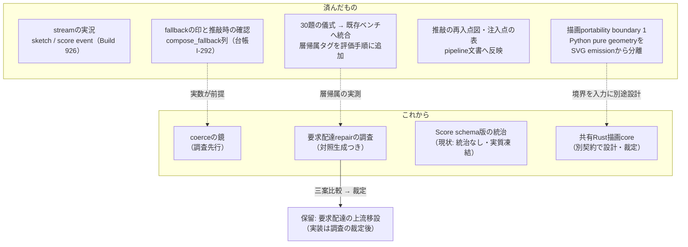

# 生成アーキテクチャの改修計画

2026-08-16に `ddl-processing-pipeline.ja.md` のレビューから生成アーキテクチャの改善提案が起草され、2026-08-17に別のセッションが提案の前提を実装と突き合わせ、作者が採否を裁定した。本書はその**裁定後の計画**を図示する — 提案のうち、測ってみたら既に実装済みだったもの、実測が前提を裏返したもの、形を変えて採られたもの、保留されたものを区別して記す。

計画は生きた文書である。各項目が実装されたら、本書は「これから」から「済んだもの」へ行を移す。

## 全項目に共通の原則

1. **描画を1バイトも変えない。** 計画の大半は観測・表示・文書である。portabilityの前準備はRenderer内部の所有境界だけを変え、Score・seed・SVGを変えない。唯一の挙動変更候補（要求配達の移設）は独立の裁定を経る。
2. **rh3の材料に触れない。** edition同一性の材料（`ddl-processing-pipeline.ja.md` の注入点の表）を動かす項目は計画に無い。
3. **鏡はゲートにしない。** 新設する記録は観測専用で、生成の分岐・回数・Score・履歴の正本を変えない。
4. **backfillで新しい値を書かない。** 記録なきものは記録なしと表示する。「記録なし」と「該当しない」を混同しない。
5. **鏡を足すときは、記録・読み手・点呼を同じ版で足す。** `carriage_warnings` はserverにしか無く、webもCLIも読んでいない — 「記録したが誰も見ない鏡」の先例である。沈黙する送り手は誰も検査していない。

## 現在地

## 済んだもの

- **streamの実況** — `/api/paint/stream` は `stage1` と `done` の2 eventしか持たなかった。Build 926で `sketch`（写生の確定時）と `score`（Score確定時）が加わり、3連LLMの待ち時間が「どの層が働いているか」の実況になった。既存eventの形は変えていない。
- **fallbackの印** — Stage 2の決定的fallbackは応答にしか出ず、保存すると消えていた。`compose_fallback` 列（落ちた理由 / `none` / 記録なしの3値）が加わり、言葉との対応が切れた作品は印を持ち、そこから推敲を続けるときは一度だけ確認を出す（台帳I-292）。過去の作品へはbackfillしない — 印が付くのは列の導入から先である。
- **儀式の二重帳簿の回避** — 「30題を固定条件で描き、署名可否と層帰属を記入する」という提案は、**既存の30題ベンチマークと同じもの**だった。既存側には失敗から学んだ判定規則が3巡ぶん書き込まれており、作り直すとそれを失う。新設はせず、層帰属タグ（`sketch / interpret / expand / score / coerce / render`）を既存の評価手順へ追加した。
- **文書の補完** — 推敲の再入点の図と、生成パラメータの注入点×rh3該否の表を `ddl-processing-pipeline.ja.md` へ、判定単位の全経路を `description-to-svg.ja.md` へ収めた（本書群・日英同時）。
- **描画portability boundary 1** — `renderer.py` をSVG-only互換入口へ縮め、`default/mark_kernel.py` にscalarと点列だけを返す決定的な幾何計算を分離した。`marks.py` はkernelを一方向に消費してSVGを組み立てる。Engine 40のbyte出力、Score、seed、APIは変えていない。

## 別契約で検討するもの — 共有Rust描画core

作者方針は、Androidへの移植性と将来のiOS移植性のため、描画coreをRustで共有できる構造へ進むことである。今回できたのはPython内のportability boundaryまでで、Rust crate、Scene IR / DTO、FFI、JNI、UniFFI、Swift binding、Android/iOS統合はまだ存在しない。

次の契約では、`mark_kernel.py` のどの値境界を共有coreへ移すか、Score入力と描画出力の表現、Python/Rust差分test、端末ごとのbinding、失敗時fallback、性能とbinary sizeをまとめて裁定する。既存の610件corpusを同一性の根拠にし、移植都合でserverの意味論を曲げない。

## これから 1 — coerceの鏡（調査先行）

**目的**: coerceの介入をStage 2にも利用者にも見える1行にし、「介入は減っているか」を測れるようにする。

- 分類はもう在る — coerceは約30分岐が「中身を変えた命令の数」を `coerce_branch_counts` として数えており、trace要求時に読める。**足りないのは分類ではなく粒度（どの命令に何をしたか）と読み手である。**
- ただし記録の新設より先に**調査を1本**置く: 既存の鏡3枚（`coerce_branch_counts`・`carriage_warnings`・`render_limit_notes`）のうち利用者に届いているのは `render_limit_notes` だけである。届いていない2枚の帰趨を決めずに4枚目を足さない。
- 足すと決まったら、記録（`{kind, instruction_index, summary}`）・生成情報ドロワーの表示・送り手の点呼テストを**同じ版**で入れる。summaryは語彙と数値だけで書き、評価語を使わない。

## これから 2 — 要求配達repairの調査

**目的**: 「書かれたものを届ける」責務が境界層（coerce）に置かれ続けるべきかを、実測で決められるようにする。

- **「coerceを縮小する」を目標に据える前に、実測が逆を示したことを記録しておく** — 述べた個数の到達はStage 2単独では半分に届かず、coerceの配達分岐が差を埋め、その際に壊した実測例は無かった。また痕の大半を置くのは展開の配置である。coerceは「捨てる仕事」だけをしているのではない。
- 調査は、要求配達repairの発火実績（何を書き換えたか・**無効化した対照生成では絵がどうなったか**）を並べ、①決定的転写層へ移設 ②Stage 2プロンプト強化+coerce縮退 ③現状維持+鏡のみ、の三案に実測を添える。
- **述べた数の句をプラグイン展開が読む改修は2026-08-11に入っており、移設の一部は既に済んでいる。** 調査はその後の残りを測る。

## これから 3 — Score schema版の統治

`schema.py` の `ScoreVersion` は `Literal["0.1.0"]` であり、**上げる手順を持つ者がいない** — render corpusが実質これを凍結している。統治が無いこと自体を記録し（本書がその記録である）、layer_versions方式へ編入するか「corpusが固定している」と明記して終えるかは裁定事項として残る。

## 保留 — 要求配達の上流移設の実装

計画の中で唯一、描画結果が変わりうる。調査（これから2）の三案比較を見てから裁定し、採る場合もcoerce側の該当規則は削除ではなく**縮退**（発火しないことをテストで固定）から始め、1版置いて削除する。描画が変わるならengine版上げの規則に従い、参照corpusを焼き直す。

## 実測が前提を変えた記録

提案から裁定までの間に、次の前提が実測で裏返った。計画を読み直すときは、まずここを読む。

| 提案の前提 | 実測（2026-08-17） |
|---|---|
| coerceの介入点は棚卸しが要る | 既に約30分岐・全数が計数済み。問題は粒度と読み手 |
| `carriage_warnings` と同じ系譜で表示すればよい | `carriage_warnings` は誰も読んでいない。先例は「見えない鏡」 |
| fallbackの印は既存の記録から導出できる | Stage 2のfallbackは保存されていなかった（本番でも記録0件）。列の新設が先で、過去分には付かない |
| 写生文の再利用は新機能 | APIが既に持っていた（`sketch_text` を渡せば0.5を呼ばない） |
| 30題の儀式は新設する | 同じものが既存ベンチとして在り、失敗の型が3つ書き込まれていた |
| coerceは長期的に縮小する | 配達分岐は述べた個数の到達の約半分を担い、壊した実測例は無い。「何が残るか」を先に決める |

## 図の根拠

`PIPE-COERCE`、`PIPE-S2`、`DATA-FALLBACK`、`DATA-RH3`、`CI-GATES`。実装済み分の一次根拠は `api_core/routers/render.py:_paint_events`（stream event）、`db.py:HistoryRow.compose_fallback`、`web/src/lib/composeFallback.ts` / `fallbackRefineGate.ts`。鏡の読み手の実測は `web/src` / `cli/src` に対する検索（`carriage_warnings` の読み手0件、2026-08-17）。
