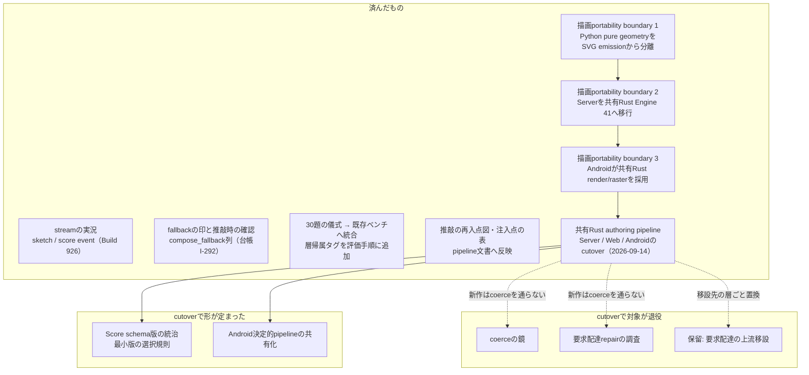

# 生成アーキテクチャの改修計画

2026-08-16に `ddl-processing-pipeline.ja.md` のレビューから生成アーキテクチャの改善提案が起草され、2026-08-17に別のセッションが提案の前提を実装と突き合わせ、作者が採否を裁定した。本書はその**裁定後の計画**を図示する — 提案のうち、測ってみたら既に実装済みだったもの、実測が前提を裏返したもの、形を変えて採られたもの、保留されたものを区別して記す。

計画は生きた文書である。各項目が実装されたら、本書は「これから」から「済んだもの」へ行を移す。

2026-09-13〜14に、Server／WebとAndroidは共有Rustのauthoring pipeline（typed compiler、Stage 1.5、lowerer、Render Engine）へ切り替わり、旧Python／KotlinのStage 1・Stage 1.5・Stage 2・coerceは新作経路から外れた（`ddl-processing-pipeline.ja.md`）。本書の「これから」の多くはcoerceとStage 2を対象にしていたため、cutoverで対象の層が退役した。以下では各項目の現状だけを記し、新しい計画は加えない。cutover後の新しい改修計画は裁定されていない。

## 全項目に共通の原則

1. **描画を1バイトも変えない。** 計画の大半は観測・表示・文書である。portabilityの前準備はRenderer内部の所有境界だけを変え、Score・seed・SVGを変えない。唯一の挙動変更候補（要求配達の移設）は独立の裁定を経る。
2. **rh3の材料に触れない。** edition同一性の材料（`ddl-processing-pipeline.ja.md` の注入点の表）を動かす項目は計画に無い。
3. **鏡はゲートにしない。** 新設する記録は観測専用で、生成の分岐・回数・Score・履歴の正本を変えない。
4. **backfillで新しい値を書かない。** 記録なきものは記録なしと表示する。「記録なし」と「該当しない」を混同しない。
5. **鏡を足すときは、記録・読み手・点呼を同じ版で足す。** 「記録したが誰も見ない鏡」を作らない。

## 現在地

## 済んだもの

- **streamの実況** — `/api/paint/stream` は `stage1` と `done` の2 eventしか持たなかった。Build 926で `sketch`（写生の確定時）と `score`（Score確定時）が加わった。cutover後の互換streamは一時期`done` 1行だけになったが、2026-09-25に共有pipelineの実行を読み直して同じ順に知らせる形へ戻した。2026-09-26には、modelの呼出しの試行を知らせる`attempt`が加わった。
- **fallbackの印** — Stage 2の決定的fallbackは応答にしか出ず、保存すると消えていた。`compose_fallback` 列（落ちた理由 / `none` / 記録なしの3値）が加わり、言葉との対応が切れた作品は印を持ち、そこから推敲を続けるときは一度だけ確認を出す（台帳I-292）。過去の作品へはbackfillしない。cutover後の新作はStage 2のfallbackを持たず、この列を書かない。
- **儀式の二重帳簿の回避** — 「30題を固定条件で描き、署名可否と層帰属を記入する」という提案は、**既存の30題ベンチマークと同じもの**だった。新設はせず、層帰属タグ（`sketch / interpret / expand / score / coerce / render`）を既存の評価手順へ追加した。
- **文書の補完** — 推敲の再入点の図と、生成パラメータの注入点×rh3該否の表を `ddl-processing-pipeline.ja.md` へ、判定単位の全経路を `description-to-svg.ja.md` へ収めた（本書群・日英同時）。
- **描画portability boundary 1** — `renderer.py` をSVG-only互換入口へ縮め、決定的な幾何計算をSVG組立てから分離した。Engine 40のbyte出力、Score、seed、APIは変えていない。
- **描画portability boundary 2** — Engine 41でplanning、geometry、mark、surface、layer、SVG serialize、決定的seed派生、演奏metadataをplatform-independentなRust crate `inku-render` へ移した。Serverは粗い1 requestの`inku-render-python`境界から呼び、runtime fallbackを持たない。
- **描画portability boundary 3** — Androidは`inku-render-android`の粗いJNI境界から同じEngineを呼び、保存済み／現行SVGをhost-neutralな`inku-svg-raster`でpixel化する。Kotlin Engine 35とAndroidSVGはretireした。
- **共有Rust authoring pipeline** — 2026-09-13にServer／WebとAndroidを共有Rustのauthoring state machine（`inku-pipeline`）、typed compiler・Stage 1.5・lowerer（`inku-ddl`）、Render Engineへ接続し、2026-09-14に旧決定層を退役させた。旧Python／KotlinのStage 1・Stage 1.5・Stage 2・coerceは新作経路から外れ、runtime selectorやPython fallbackは持たない。旧作品の表示と保存Score／SVGの再演は維持する。

## cutoverで対象が退役した項目

- **coerceの鏡** — 目的は、coerceの介入をStage 2にも利用者にも見える1行にし、介入が減っているかを測れるようにすることだった。新作はcoerceを通らない。代わりに共有compilerは、局所省略ごとにowner・span・理由・実処置を持つtyped診断（上流・下流・資源省略・relation省略）とrenderer診断を返し、Serverはそれを応答・履歴sidecar・Webの`PipelineStatus`へ届け、logへは件数と安全な投影だけを出す。旧鏡のうち`coerce_branch_counts`と`carriage_warnings`はresponse modelのfieldとしてだけ残る。
- **要求配達repairの調査** — 目的は、「書かれたものを届ける」責務が境界層（coerce）に置かれ続けるべきかを実測で決めることだった。新作では、明示内容の配達は共有lowererが一度だけ行い、届かない意味を別のfieldへ補正せず、成立しない最小単位を診断付きで省略する（`SPEC.ja.md` §12.7、§12.8）。
- **保留: 要求配達の上流移設** — 移設先として想定した層（決定的転写層・Stage 2プロンプト）ごと、cutoverで共有compilerへ置き換わった。

これら3項目は、旧作品と旧Scoreの互換経路（`saved_score_compat.py`）に対しては意味を持たない。互換経路は旧coerceの配達・様式補修を行わず、構造的な既定と記録上限だけを当てる。

## cutoverで形が定まった項目

- **Score schema版の統治** — 旧計画の時点では`ScoreVersion`が`Literal["0.1.0"]`で、上げる手順を持つ者がいなかった。現在の`ScoreVersion`は0.1.0から0.15.0までを持ち、共有lowererが表現に必要な最小版を選ぶ規則をSPECが持つ（compact基準0.10、追加fieldに応じて0.11〜0.15、flat互換0.9）。保存済みの旧版は`inku-score`の互換readerが読む。
- **Android決定的pipelineの共有化** — Androidも共有Rustのauthoring pipelineを使い、Kotlinの独自Stage 1・1.5・2とcoerceはretireした。Androidに残るのはhost責任（UI、provider通信、Room、`rh3`の計算、カメラ前処理）である。

## 実測が前提を変えた記録

提案から裁定までの間に、次の前提が実測で裏返った。以下は2026-08-17時点の記録であり、cutover前のcoerce・Stage 2を対象にしている。

| 提案の前提 | 実測（2026-08-17） |
|---|---|
| coerceの介入点は棚卸しが要る | 既に約30分岐・全数が計数済み。問題は粒度と読み手 |
| `carriage_warnings` と同じ系譜で表示すればよい | `carriage_warnings` は誰も読んでいない。先例は「見えない鏡」 |
| fallbackの印は既存の記録から導出できる | Stage 2のfallbackは保存されていなかった（本番でも記録0件）。列の新設が先で、過去分には付かない |
| 写生文の再利用は新機能 | APIが既に持っていた（`sketch_text` を渡せば0.5を呼ばない） |
| 30題の儀式は新設する | 同じものが既存ベンチとして在り、失敗の型が3つ書き込まれていた |
| coerceは長期的に縮小する | 配達分岐は述べた個数の到達の約半分を担い、壊した実測例は無い。「何が残るか」を先に決める |

## 図の根拠

`PIPE-MACHINE`、`PIPE-LOWER`、`PIPE-COMPAT`、`PIPE-HOLE`、`DATA-FALLBACK`、`DATA-RH3`、`CI-GATES`。cutoverの一次根拠は`2ad24df9`（Server／Web接続）、`12390c01`（Android接続）、`03bbd686`（旧決定層の退役）、`pipeline_runtime.py`、`pipeline_compat.py`、`core/crates/inku-pipeline`、`core/crates/inku-ddl/src/compiler_execution.rs`、`server/src/inku_server/schema.py:ScoreVersion`。旧計画の一次根拠は`db.py:HistoryRow.compose_fallback`、`web/src/lib/composeFallback.ts` / `fallbackRefineGate.ts`。
