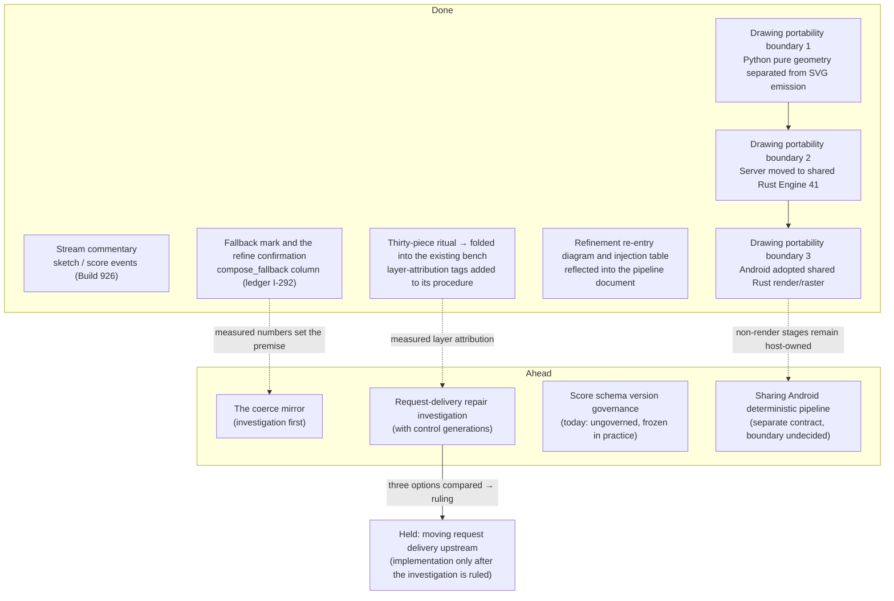

# The generation-architecture improvement plan

On 2026-08-16 a review of `ddl-processing-pipeline.md` produced a set of improvement proposals for the generation architecture; on 2026-08-17 another session checked the proposals' premises against the implementation, and the author ruled on each. This document illustrates the **plan as ruled** — keeping apart what turned out to be already implemented, what measurement overturned, what was adopted in a changed form, and what is held.

The plan is a living document. As an item ships, its row moves from "ahead" to "done".

## Principles shared by every item

1. **Not one byte of the drawing changes.** Most of the plan is observation, display, and documents. The portability preparation changes only ownership boundaries inside the Renderer, not the Score, seeds, or SVG. The only candidate behavior change (moving request delivery upstream) passes through its own ruling.
2. **The rh3 materials are untouched.** No item moves a material of the edition identity (see the injection table in `ddl-processing-pipeline.md`).
3. **A mirror is never a gate.** New records are observation only and change no branch, no count, no Score, and no canonical history.
4. **No backfill writes new values.** What was never recorded is shown as unrecorded. "Unrecorded" and "not applicable" are never confused.
5. **A mirror ships with its record, its reader, and its roll call in the same release.** `carriage_warnings` exists only on the server, and neither the Web nor the CLI reads it — the precedent of a mirror nobody looks at. A silent sender is a sender nobody tests.

## Where things stand

## Done

- **Stream commentary** — `/api/paint/stream` used to carry only the `stage1` and `done` events. Build 926 added `sketch` (when the observation settles) and `score` (when the Score settles), turning the three-LLM wait into a commentary that names the layer actually working. The existing events did not change shape.
- **The fallback mark** — Stage 2's deterministic fallback appeared only in one response and vanished the moment the work was saved. The `compose_fallback` column (a reason / `none` / unrecorded) now exists; a work whose words were not what composed it carries a mark, and continuing a refinement from one asks once for confirmation (ledger I-292). Nothing is backfilled — the mark exists only from the column onward.
- **No second ledger for the ritual** — the proposal to "draw thirty fixed pieces under fixed conditions and note signability with a layer attribution" turned out to be **the same thing as the existing thirty-piece benchmark**, whose procedure carries three rounds' worth of judgment rules learned from failures; rebuilding it would lose them. Nothing new was built: the layer-attribution tags (`sketch / interpret / expand / score / coerce / render`) were added to the existing evaluation procedure.
- **The document complement** — the refinement re-entry diagram and the injection-point × rh3 table went into `ddl-processing-pipeline.md`, and the full decision-level road into `description-to-svg.md` (this document set, both languages at once).
- **Drawing portability boundary 1** — `renderer.py` was contracted to the SVG-only compatibility entrypoint, while `default/mark_kernel.py` now owns deterministic geometry that returns only scalars and point collections. `marks.py` consumes the kernel in one direction and constructs SVG. Engine 40 bytes, the Score, seeds, and the API did not change.
- **Drawing portability boundary 2** — Engine 41 moved planning, geometry, marks, surfaces, layers, SVG serialization, deterministic seed derivation, and performance metadata into the platform-independent `inku-render` Rust crate. The Server calls it through one coarse `inku-render-python` request, with no runtime fallback. The accepted Engine 41 corpus pins the current bytes; the Python Engine 40 implementation has been retired.
- **Drawing portability boundary 3** — Android calls the same Engine 41 through the coarse `inku-render-android` JNI boundary and rasterizes saved/current SVG through host-neutral `inku-svg-raster`. Kotlin Engine 35 and AndroidSVG are retired, with no runtime fallback. Score, DDL, Room, saved format, and `rh3` did not move.

## Completed under a separate contract — shared Rust drawing core

The Server now performs through the platform-independent `inku-render` Rust crate. A thin independent `inku-render-python` wheel carries one canonical JSON request and response across the Python boundary; the Server package keeps its `uv_build` backend. The Rust core has no Python, database, filesystem, network, or host-platform dependency, and no generic Scene IR was added ahead of a consumer need.

Android adoption is also complete: the Server Python binding and Android JNI binding use the same `inku-render`, while Android presentation uses the separate `inku-svg-raster` and SVG remains canonical storage. An iOS binding, Server raster adoption, and sharing Android Stage 1.5/coerce semantics are future separate contracts; none may bend Engine 41 or `rh3` semantics for port convenience.

## Ahead 1 — the coerce mirror (investigation first)

**Goal**: make coerce's interventions one readable line for Stage 2 and for the user, so "are the interventions shrinking?" becomes measurable.

- The classification already exists — about thirty coerce branches count "instructions this branch changed" into `coerce_branch_counts`, readable when a trace is requested. **What is missing is not the classification but the granularity (what was done to which instruction) and a reader.**
- Before any new record, one investigation comes first: of the three existing mirrors (`coerce_branch_counts`, `carriage_warnings`, `render_limit_notes`), only `render_limit_notes` reaches the user. A fourth mirror is not added before the fate of the two unread ones is decided.
- If the record is adopted, the record (`{kind, instruction_index, summary}`), its display in the provenance drawer, and the sender roll-call test ship in **the same release**. A summary is written in vocabulary and numbers, never in judgment words.

## Ahead 2 — the request-delivery repair investigation

**Goal**: decide from measurement whether "delivering what was written" should keep living in the boundary layer (coerce).

- **Before "shrink coerce" becomes a goal, the measurement that pointed the other way is on record** — stated-count delivery reaches only about half by Stage 2 alone; coerce's delivery branches close the gap, with no measured case of breaking anything; and most marks are placed by the expansion's arrangement. Coerce is not only doing disposable work.
- The investigation lays out the delivery repairs' actual firings (what they rewrote, and **what the picture became in a control generation with the repair disabled**), and attaches measurements to three options: move into the deterministic transcription layer; strengthen the Stage 2 prompt and let coerce recede; keep as is with a mirror only.
- **Part of the move already happened**: the change that lets the plugin expansion read stated-count phrases was ruled and merged on 2026-08-11. The investigation measures what remains after it.

## Ahead 3 — Score schema version governance

`ScoreVersion` in `schema.py` is `Literal["0.1.0"]`, and **nobody holds a procedure for raising it** — the render corpus freezes it in practice. That there is no governance is itself recorded (this document is that record); whether to fold it into the layer-versions scheme or to state "the corpus pins it" and stop remains a ruling to be made.

## Held — implementing the upstream move of request delivery

The only item in the plan that can change a drawn result. It waits for the three-option comparison (Ahead 2), and even if adopted, the affected coerce rules begin with **recession** (tests pinning that they no longer fire), not deletion, with deletion one version later. If the drawing changes, the engine-version rules apply and the reference corpus is rebaked.

## What measurement overturned

Between the proposal and the ruling, the following premises were overturned by measurement. Reread this first when rereading the plan.

| The proposal assumed | Measured (2026-08-17) |
|---|---|
| Coerce's intervention points need an inventory | About thirty branches are already counted, in full. The problem is granularity and a reader |
| Display it the way `carriage_warnings` is displayed | Nobody reads `carriage_warnings`. The precedent is an invisible mirror |
| The fallback mark can be derived from existing records | Stage 2 fallbacks were never stored (zero records in production). The column comes first, and older works never get the mark |
| Sketch-text reuse is a new feature | The API already had it (pass `sketch_text` and 0.5 is not called) |
| The thirty-piece ritual is to be built | The same thing already exists as the bench, with three failure patterns written into its procedure |
| Coerce shrinks over time | The delivery branches carry about half of stated-count delivery, with no measured breakage. Decide first what remains |

## Diagram evidence

`PIPE-COERCE`, `PIPE-S2`, `DATA-FALLBACK`, `DATA-RH3`, `CI-GATES`. Primary sources for the shipped part: `api_core/routers/render.py:_paint_events` (stream events), `db.py:HistoryRow.compose_fallback`, `web/src/lib/composeFallback.ts` / `fallbackRefineGate.ts`. The mirror-reader measurement is a search over `web/src` / `cli/src` (zero readers of `carriage_warnings`, 2026-08-17).
