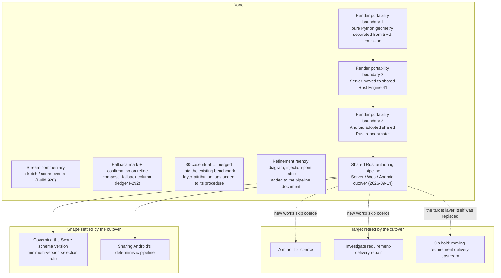

# The generation-architecture improvement plan

On 2026-08-16 a review of `ddl-processing-pipeline.md` drafted proposals to improve the generation architecture; on 2026-08-17 a separate session checked the proposals' premises against the implementation, and the author ruled on what to adopt. This document charts the **plan as ruled** — distinguishing the proposals that turned out to be already implemented, those whose premise the measurements overturned, those adopted in a changed form, and those put on hold.

The plan is a living document. As each item lands, its row moves from "next" to "done".

On 2026-09-13–14, the Server/Web and Android switched to the shared Rust authoring pipeline (typed compiler, Stage 1.5, lowerer, Render Engine), and the old Python/Kotlin Stage 1, Stage 1.5, Stage 2, and coerce left the path of new works (`ddl-processing-pipeline.md`). Most "next" items in this document targeted coerce and Stage 2, so the cutover retired the layers they were about. The sections below record only each item's current state and add no new plan. No new improvement plan after the cutover has been ruled.

## Principles common to every item

1. **Change the drawing by not one byte.** Most of the plan is observation, display, and documentation. Portability preparation changes only Renderer-internal ownership boundaries and leaves Score, seeds, and SVG unchanged. The one candidate for a behavior change (relocating requirement delivery) goes through its own ruling.
2. **Do not touch the inputs to rh3.** No item moves an input to edition identity (the injection-point table in `ddl-processing-pipeline.md`).
3. **A mirror is never a gate.** New records are observation-only; they do not change the generation's branches, counts, Score, or the canonical history.
4. **Do not write new values by backfill.** What was never recorded is shown as unrecorded. "Unrecorded" and "not applicable" are not conflated.
5. **When adding a mirror, add the record, the reader, and the roll call in the same version.** Do not build "a mirror that records but that no one looks at".

## Where the plan stands

## Done

- **Stream commentary** — `/api/paint/stream` had only two events, `stage1` and `done`. Build 926 added `sketch` (when the sketch is settled) and `score` (when the Score is settled). After the cutover the compatibility stream was briefly a single `done` line; on 2026-09-25 it returned to re-reading the shared-pipeline execution and reporting in the same order.
- **The fallback mark** — Stage 2's deterministic fallback appeared only in the response and vanished on save. The `compose_fallback` column (three readings: a reason / `none` / unrecorded) was added; a work whose link to the words broke carries a mark, and continuing to refine from it raises a confirmation once (ledger I-292). Older works are not backfilled. New works after the cutover have no Stage 2 fallback and do not write this column.
- **Avoiding a double ledger for the ritual** — the proposal to "draw 30 cases under fixed conditions and record sign-off and layer attribution" turned out to be **the same thing as the existing 30-case benchmark**. Nothing new was created; layer-attribution tags (`sketch / interpret / expand / score / coerce / render`) were added to the existing evaluation procedure.
- **Filling in the documents** — the refinement reentry diagram and the table of parameter injection points versus rh3 went into `ddl-processing-pipeline.md`, and the full decision path into `description-to-svg.md` (this documentation set, Japanese and English together).
- **Render portability boundary 1** — `renderer.py` narrowed to an SVG-only compatibility entry, and deterministic geometry was separated from SVG assembly. Engine 40 byte output, Score, seeds, and APIs did not change.
- **Render portability boundary 2** — Engine 41 moved planning, geometry, marks, surfaces, layers, SVG serialization, deterministic seed derivation, and render metadata into the platform-independent Rust crate `inku-render`. The Server calls it through the coarse one-request `inku-render-python` boundary with no runtime fallback.
- **Render portability boundary 3** — Android calls the same engine through the coarse `inku-render-android` JNI boundary and rasterizes saved/current SVG through the host-neutral `inku-svg-raster`. Kotlin Engine 35 and AndroidSVG are retired.
- **Shared Rust authoring pipeline** — on 2026-09-13 the Server/Web and Android were connected to the shared Rust authoring state machine (`inku-pipeline`), the typed compiler, Stage 1.5, and lowerer (`inku-ddl`), and the Render Engine; on 2026-09-14 the old decision layers were retired. The old Python/Kotlin Stage 1, Stage 1.5, Stage 2, and coerce left the path of new works, with no runtime selector or Python fallback. Display of older works and replay of saved Scores/SVG are preserved.

## Items whose target the cutover retired

- **A mirror for coerce** — the goal was to make coerce's interventions a single line visible to both Stage 2 and the author, and to measure whether interventions decrease. New works do not go through coerce. Instead, the shared compiler returns typed diagnostics carrying owner, span, reason, and the action taken for each local omission (upstream, downstream, resource omissions, relation omissions) along with renderer diagnostics; the Server delivers them to the response, the history sidecar, and Web's `PipelineStatus`, and logs only their counts and a safe projection. Of the old mirrors, `coerce_branch_counts` and `carriage_warnings` survive only as fields of the response model.
- **Investigating requirement-delivery repair** — the goal was to decide by measurement whether the duty of "delivering what was written" should stay in a boundary layer (coerce). For new works, the shared lowerer delivers explicit content once, never corrects an undeliverable meaning into another field, and omits the smallest unit that cannot hold with a diagnostic (`SPEC.md` §12.7, §12.8).
- **On hold: moving requirement delivery upstream** — the layers envisioned as destinations (a deterministic transcription layer, the Stage 2 prompt) were themselves replaced by the shared compiler in the cutover.

These three items have no bearing on the compatibility path for older works and Scores (`saved_score_compat.py`). The compatibility path performs none of the old coerce's delivery or style repair; it applies only structural defaults and the recorded limits.

## Items whose shape the cutover settled

- **Governing the Score schema version** — at the time of the old plan, `ScoreVersion` was `Literal["0.1.0"]` and no one had a procedure for raising it. The current `ScoreVersion` spans 0.1.0 through 0.15.0, and the SPEC holds the rule by which the shared lowerer selects the minimum version a work needs (compact baseline 0.10, 0.11 through 0.15 according to additional fields, flat compatibility 0.9). The compatibility reader in `inku-score` reads older saved versions.
- **Sharing Android's deterministic pipeline** — Android also uses the shared Rust authoring pipeline, and Kotlin's own Stage 1, 1.5, and 2 and coerce are retired. What remains on Android is host responsibility (UI, provider transport, Room, the `rh3` computation, camera preparation).

## Where measurement overturned a premise

Between proposal and ruling, these premises were overturned by measurement. This is a record as of 2026-08-17 and concerns the pre-cutover coerce and Stage 2.

| Premise of the proposal | Measurement (2026-08-17) |
|---|---|
| coerce's intervention points need an inventory | Already about 30 branches, all counted. The problem is granularity and a reader |
| Display it in the same lineage as `carriage_warnings` | No one reads `carriage_warnings`. The precedent is "an invisible mirror" |
| The fallback mark can be derived from existing records | Stage 2's fallback was never saved (zero records even in production). The column had to come first, and it does not reach past works |
| Reusing sketch text is a new feature | The API already had it (passing `sketch_text` skips 0.5) |
| The 30-case ritual should be created | The same thing existed as the benchmark, with three failure patterns written into it |
| coerce should shrink over time | The delivery branches carry about half of stated-count arrival, with no measured case of harm. Decide "what remains" first |

## Diagram evidence

`PIPE-MACHINE`, `PIPE-LOWER`, `PIPE-COMPAT`, `PIPE-HOLE`, `DATA-FALLBACK`, `DATA-RH3`, `CI-GATES`. The primary evidence for the cutover is `2ad24df9` (Server/Web connection), `12390c01` (Android connection), `03bbd686` (retirement of the old decision layers), `pipeline_runtime.py`, `pipeline_compat.py`, `core/crates/inku-pipeline`, `core/crates/inku-ddl/src/compiler_execution.rs`, and `server/src/inku_server/schema.py:ScoreVersion`. The primary evidence for the old plan is `db.py:HistoryRow.compose_fallback` and `web/src/lib/composeFallback.ts` / `fallbackRefineGate.ts`.
