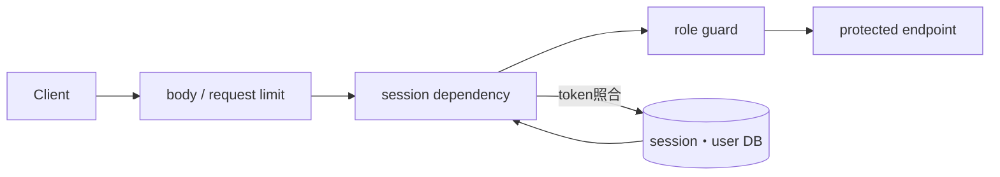
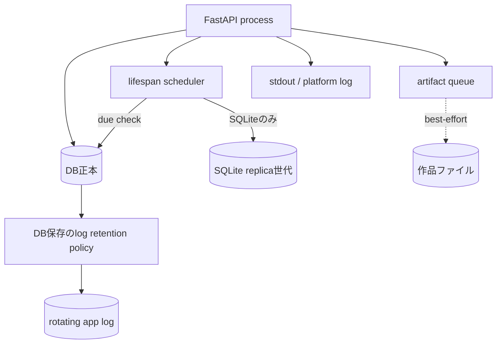

# Operations and security

## 認証・認可

- loginはlocal authが有効な場合に、client識別子とusernameをkeyにしたsliding-window rate limitを通る。
- passwordはsalt付きPBKDF2-SHA256。存在しないuserにもdummy hashを計算し、単純なtiming差を減らす。
- session tokenはDBへhash保存され、clientはBearerまたは`HttpOnly` cookieで提示する。cookieは`SameSite=Lax`、secure属性は環境設定。
- 権限グループは`admins`、`leaders`、`users`の3つで、1 userが複数に属せる。`_current_user`、`_user_manager`、`_admin_user`でrouteを保護し、guardは所属を1本の述語へ尋ねる。`role`列は所属から導出した写しとして残るが、どの判定も読まない。
- 82 endpointのうちguardなしは理由付きallowlist 6 pathだけで、live routeをtestが列挙する。
- request body上限、process-wide request concurrency、render concurrencyを別々に持つ。

## worker、queue、保存優先順位

| 所有者 | 容量 | 満杯・timeout時 |
|---|---|---|
| HTTP middleware | in-flight request上限 | 503、`Retry-After` |
| render capacity | 同時render上限、DB設定でruntime変更 | 503、即時拒否 |
| Stage executor | Stage 1/2共有workersとbounded slots | deterministic fallback。timeout thread終了までslot保持 |
| artifact executor | file保存workersとbounded slots | DBを守り、file jobだけskip |

## DB backup・log・output

- schedulerはlifespanが所有し、粗いtickで`ensure_scheduled_db_backup`を呼ぶ。手動backupと自動世代は別扱い。
- file DB以外ではreplica backupをunsupportedとして扱う。
- log retentionはapp自身が実行し、stdoutも残す。Composeのdaemon log上限は別層。
- output保存は入力、DDL、Score+metadata、SVG、PNGを作る。絶対pathや実運用値は本書へ載せない。

## 公開リポジトリから確認できる配布境界

ローカル開発環境への配備方法は環境固有であり、本書の対象外とする。公開sourceから確認できる責任は次のとおり。

1. 公開sourceはGitが正本である。
2. ComposeはAPI/Webの2 serviceとAPI側の永続volumeを定義する。
3. ComposeはWebとAPIのhealth checkを持つ。
4. tag時release workflowがAPI/Web imageをmulti-architecture buildし、tag push時だけregistryへpublishする。

## 環境変数名の分類

値は調査していない。構造上確認した名前だけを分類する。

| 分類 | 名前の例 |
|---|---|
| DB・backup | `INKU_DB_URL`, `INKU_DB_BACKUP_DIR`, `INKU_DB_BACKUP_SCHEDULER` |
| output・log | `INKU_OUTPUT_DIR`, `INKU_OUTPUT_SAVE_WORKERS`, `INKU_LOG_DIR` |
| 容量 | `INKU_MAX_CONCURRENT_REQUESTS`, `INKU_RENDER_CONCURRENCY`, `INKU_STAGE_WORKERS`, `INKU_STAGE_QUEUE_LIMIT` |
| auth | `INKU_SESSION_COOKIE_SECURE`, `INKU_LOGIN_RATE_ATTEMPTS`, `INKU_REDIS_URL` |
| provider | providerごとのAPI key/base URL名（値は対象外） |

## 根拠対応

`API-AUTH`, `API-LIMIT`, `SYS-BACKUP`, `SYS-LOG`, `SYS-FILES`, `OPS-COMPOSE`。主な実装は `deps.py`, `auth.py`, `security.py`, `state.py`, `db.py`, `logging_setup.py`, `compose.yaml`。
