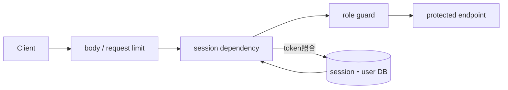
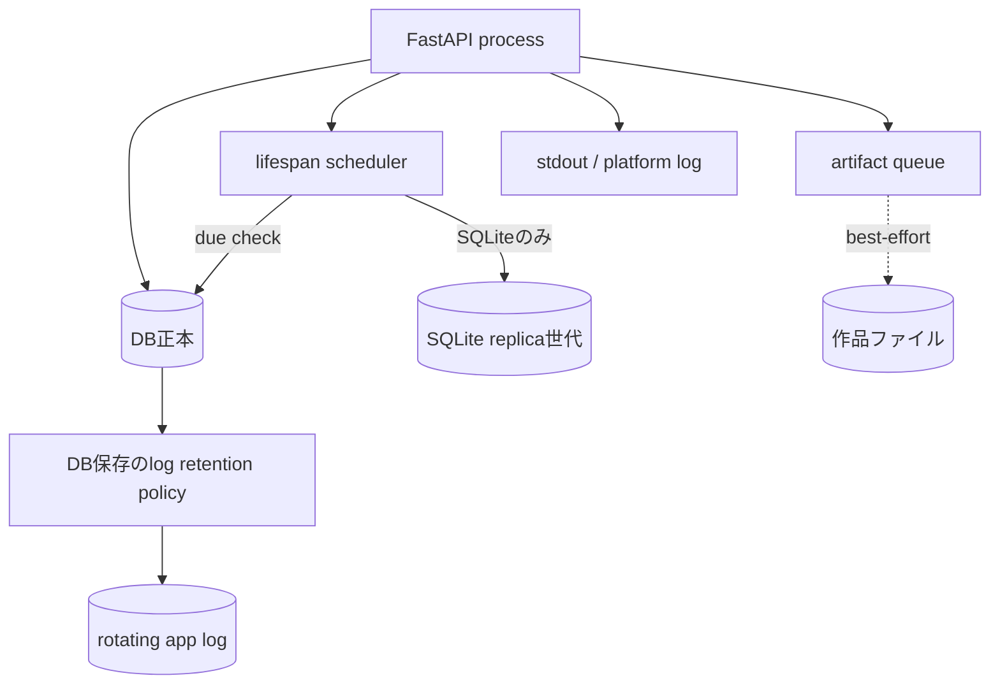

# Operations and security

## 認証・認可

- loginはlocal authが有効な場合に、client識別子とusernameをkeyにしたsliding-window rate limitを通る。
- passwordはsalt付きPBKDF2-SHA256。存在しないuserにもdummy hashを計算し、単純なtiming差を減らす。
- session tokenはDBへhash保存され、clientはBearerまたは`HttpOnly` cookieで提示する。cookieは`SameSite=Lax`、secure属性は環境設定。
- 権限グループは`admins`、`leaders`、`users`の3つで、1 userが複数に属せる。`_current_user`、`_user_manager`、`_admin_user`でrouteを保護し、guardは所属を1本の述語へ尋ねる。`role`列は所属から導出した写しとして残るが、どの判定も読まない。
- 106 endpointのうちguardなしは理由付きallowlist 3 pathだけで、live routeをtestが列挙する。共有pipelineの`/api/pipeline/*`は各routeで`_current_user`を要求し、認証済みの利用者をexecution・variation・historyの所有者として全操作へ渡す。他人のexecutionやhistory linkは所有者の不一致で見えない。
- clientはsnapshot、authority sidecar、effect結果、資源policy、`render` commandを送れない。資源上限はinstallationのmanifestと管理者設定から解決し、作品の保存済みbudgetは上げられない。保存済みScoreも自分の予算を自己申告できず、Serverが所有するhistory linkを持つ作品だけが保存policyで再演される。
- `INKU_DEVELOPER_MODE`が有効なときだけ、要求は`developer_disable_llm_retries`（全LLM段を1回に限定）と`developer_capture_provider_io`（provider送受信の原文を記録）を指定できる。記録は送信前に作れた場合だけ送信し、URL・header・credential・接続設定・例外文を持たず、同じ所有者だけが`/api/pipeline/executions/{id}/provider-observations`で読む。developer mode外の指定は拒否する。
- request body上限、process-wide request concurrency、render concurrencyを別々に持つ。

## worker、queue、保存優先順位

| 所有者 | 容量 | 満杯・timeout時 |
|---|---|---|
| HTTP middleware | in-flight request上限 | 503、`Retry-After` |
| render capacity | 同時render上限、DB設定でruntime変更。保存Scoreの再演も同じ上限を通る | 503、即時拒否 |
| pipeline worker pool | `max_workers`（既定4）のthread、保持run `max_retained_runs`（既定8）、1回の実行で進めるeffect `max_effect_steps`（既定32） | 保持runが全て実行中なら429 `pipeline_capacity_reached`。effect段数の上限は`pipeline_effect_limit`で止める（再試行の代わりではない） |
| pipeline envelope | 入力16 MiB、snapshot 32 MiB、出力64 MiB、provider応答1 MiB | 上限超過はcoreがstate変更前に拒否 |
| thumbnail pool | spawnした子processのpool（`INKU_THUMBNAIL_WORKERS`）とbounded queue | 受け付けられない・失敗した作品は焼かず、一覧は保存SVGで描く。書込みは親process |
| artifact executor | file保存workersとbounded slots | DBを守り、file jobだけskip |

## DB backup・log・output

- schedulerはlifespanが所有し、粗いtickで`ensure_scheduled_db_backup`を呼ぶ。手動backupと自動世代は別扱い。
- file DB以外ではreplica backupをunsupportedとして扱う。
- log retentionはapp自身が実行し、stdoutも残す。Composeのdaemon log上限は別層。
- 共有pipelineのcompiler結果はlogへ`pipeline_compiler_outcome`として、診断の件数と、ASCIIの短い識別子に限った安全な投影だけを出す。source本文、provider応答、promptは書かない。
- output保存は入力、DDL、Score+metadata、SVG、PNGを作る。絶対pathや実運用値は本書へ載せない。

## 公開リポジトリから確認できる配布境界

ローカル開発環境への配備方法は環境固有であり、本書の対象外とする。公開sourceから確認できる責任は次のとおり。

1. 公開sourceはGitが正本である。
2. ComposeはAPI/Webの2 serviceとAPI側の永続volumeを定義する。
3. ComposeはWebとAPIのhealth checkを持つ。
4. tag時release workflowがAPI/Web imageをmulti-architecture buildし、tag push時だけregistryへpublishする。

## 環境変数名の分類

値は調査していない。構造上確認した名前だけを分類する。

| 分類 | 名前の例 |
|---|---|
| DB・backup | `INKU_DB_URL`, `INKU_DB_BACKUP_DIR`, `INKU_DB_BACKUP_SCHEDULER` |
| output・log | `INKU_OUTPUT_DIR`, `INKU_OUTPUT_SAVE_WORKERS`, `INKU_LOG_DIR` |
| 容量 | `INKU_MAX_CONCURRENT_REQUESTS`, `INKU_RENDER_CONCURRENCY`, `INKU_THUMBNAIL_WORKERS`, `INKU_THUMBNAIL_QUEUE_LIMIT` |
| pipeline | `INKU_PIPELINE_CONFIG`, `INKU_DEVELOPER_MODE`, `INKU_LLM_REQUEST_TIMEOUT_SECONDS`, `INKU_LLM_RETRY_ATTEMPTS`, `INKU_LLM_RETRY_BASE_DELAY`, `INKU_LLM_STAGE1_ATTEMPT_TIMEOUT_SECONDS`, `INKU_LLM_STAGE1_TOTAL_TIMEOUT_SECONDS` |
| auth | `INKU_SESSION_COOKIE_SECURE`, `INKU_LOGIN_RATE_ATTEMPTS`, `INKU_REDIS_URL` |
| provider | providerごとのAPI key/base URL名（値は対象外） |

## 根拠対応

`API-AUTH`, `API-LIMIT`, `PIPE-HOST`, `PIPE-LIMITS`, `SYS-BACKUP`, `SYS-LOG`, `SYS-FILES`, `OPS-COMPOSE`。主な実装は `deps.py`, `auth.py`, `security.py`, `state.py`, `pipeline_api.py`, `pipeline_defaults.py`, `pipeline_product.py`, `provider_observation.py`, `db.py`, `logging_setup.py`, `compose.yaml`。
