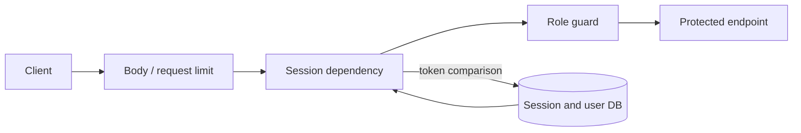
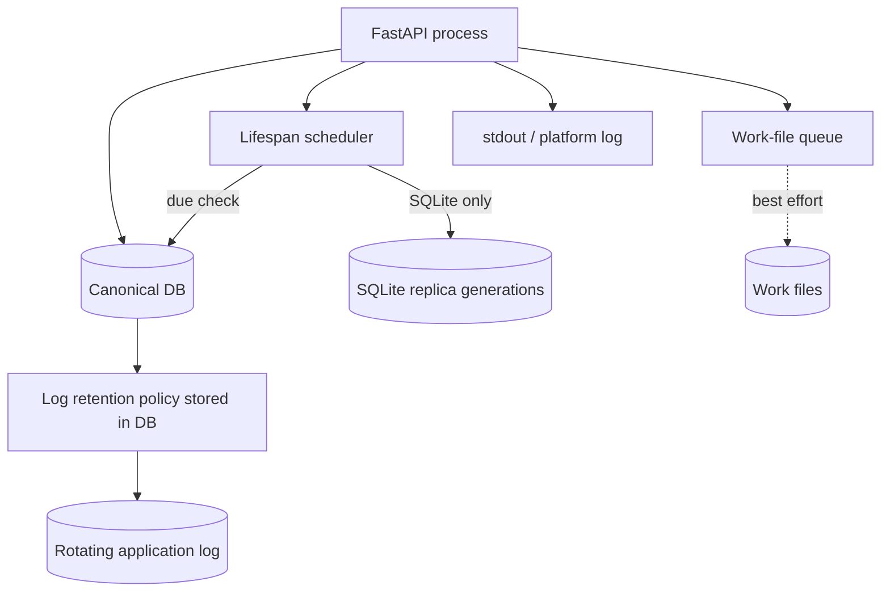

# Operations and security

## Authentication and authorization

- When local authentication is enabled, login passes a sliding-window rate limit keyed by client identifier and username.
- Passwords use salted PBKDF2-SHA256. A missing user still runs a dummy hash to reduce a simple timing distinction.
- The DB stores a session-token hash. Clients present a Bearer token or `HttpOnly`, `SameSite=Lax` cookie; the secure flag is configured by environment.
- The permission groups are `admins`, `leaders`, and `users`, and one user may hold several. `_current_user`, `_user_manager`, and `_admin_user` guard routes, and each guard asks a single predicate about membership. The `role` column remains as a mirror derived from the memberships and is read by no decision.
- Of 106 endpoints, only the reasoned three-path allowlist has no guard; a live-route test enumerates it. The shared pipeline's `/api/pipeline/*` requires `_current_user` on each route and passes the authenticated user to every operation as the owner of the execution, variation, and history. Another user's executions and history links are invisible because the owner does not match.
- A client cannot send snapshots, authority sidecars, effect results, resource policies, or the `render` command. Resource limits resolve from the installation manifest and administrator settings, and a work's saved budget cannot be raised. A saved Score cannot declare its own budget either; only a work with a Server-owned history link is replayed under its saved policy.
- Only with `INKU_DEVELOPER_MODE` enabled can a request set `developer_disable_llm_retries` (limits every LLM stage to one attempt) and `developer_capture_provider_io` (records raw provider traffic). The request is sent only if its record could be created first; the record holds no URL, header, credential, connection configuration, or exception text, and only the same owner reads it through `/api/pipeline/executions/{id}/provider-observations`. Outside developer mode these options are rejected.
- Request-body, process-wide request, and render concurrency limits are independent.

## Workers, queues, and persistence priority

| Owner | Capacity | On full queue or timeout |
|---|---|---|
| HTTP middleware | In-flight request limit | 503 with `Retry-After` |
| Render capacity | Concurrent render limit, mutable through DB settings. Replay of saved Scores goes through the same limit | Immediate 503 |
| Pipeline worker pool | `max_workers` threads (default 4), retained runs `max_retained_runs` (default 8), effects advanced per run `max_effect_steps` (default 32) | 429 `pipeline_capacity_reached` when every retained run is busy. The effect-step cap stops as `pipeline_effect_limit` (it is not a replacement retry policy) |
| Pipeline envelope | 16 MiB input, 32 MiB snapshot, 64 MiB output, 1 MiB provider response | The core rejects oversize input before any state change |
| Thumbnail pool | A pool of spawned child processes (`INKU_THUMBNAIL_WORKERS`) and a bounded queue | A work that is not accepted or fails is not baked; the listing draws the saved SVG. The parent process writes |
| Work-file executor | Bounded workers and slots | Preserve DB history; skip only the file job |

## DB backup, logs, and output

- Lifespan owns the scheduler and periodically calls `ensure_scheduled_db_backup`; manual and scheduled generations remain distinct.
- Replica backup is unsupported for non-file DBs.
- The application applies log retention and also keeps stdout; container-daemon limits are another layer.
- The shared pipeline's compiler results go to the log as `pipeline_compiler_outcome`, with only diagnostic counts and a safe projection limited to short ASCII identifiers. Source text, provider responses, and prompts are never written.
- Work-file output covers description, DDL, Score with metadata, SVG, and PNG. This document does not record actual deployment paths or values.

## Distribution visible in the public repository

Environment-specific local deployment is outside this document. Public sources confirm that:

1. Git is canonical for public source.
2. Compose defines API/Web services and API persistence.
3. Compose carries Web and API health checks.
4. A release-tag workflow builds both services for multiple architectures and publishes only on a tag push.

## Environment-variable categories

Values were not examined.

| Category | Examples of names |
|---|---|
| DB and backup | `INKU_DB_URL`, `INKU_DB_BACKUP_DIR`, `INKU_DB_BACKUP_SCHEDULER` |
| Output and logs | `INKU_OUTPUT_DIR`, `INKU_OUTPUT_SAVE_WORKERS`, `INKU_LOG_DIR` |
| Capacity | `INKU_MAX_CONCURRENT_REQUESTS`, `INKU_RENDER_CONCURRENCY`, `INKU_THUMBNAIL_WORKERS`, `INKU_THUMBNAIL_QUEUE_LIMIT` |
| Pipeline | `INKU_PIPELINE_CONFIG`, `INKU_DEVELOPER_MODE`, `INKU_LLM_REQUEST_TIMEOUT_SECONDS`, `INKU_LLM_RETRY_ATTEMPTS`, `INKU_LLM_RETRY_BASE_DELAY`, `INKU_LLM_STAGE1_ATTEMPT_TIMEOUT_SECONDS`, `INKU_LLM_STAGE1_TOTAL_TIMEOUT_SECONDS` |
| Auth | `INKU_SESSION_COOKIE_SECURE`, `INKU_LOGIN_RATE_ATTEMPTS`, `INKU_REDIS_URL` |
| Providers | Provider API-key/base-URL variable names only; never values |

## Evidence map

Evidence: `API-AUTH`, `API-LIMIT`, `PIPE-HOST`, `PIPE-LIMITS`, `SYS-BACKUP`, `SYS-LOG`, `SYS-FILES`, `OPS-COMPOSE`; implementation in `deps.py`, `auth.py`, `security.py`, `state.py`, `pipeline_api.py`, `pipeline_defaults.py`, `pipeline_product.py`, `provider_observation.py`, `db.py`, `logging_setup.py`, and `compose.yaml`.
