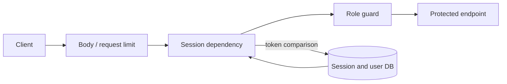
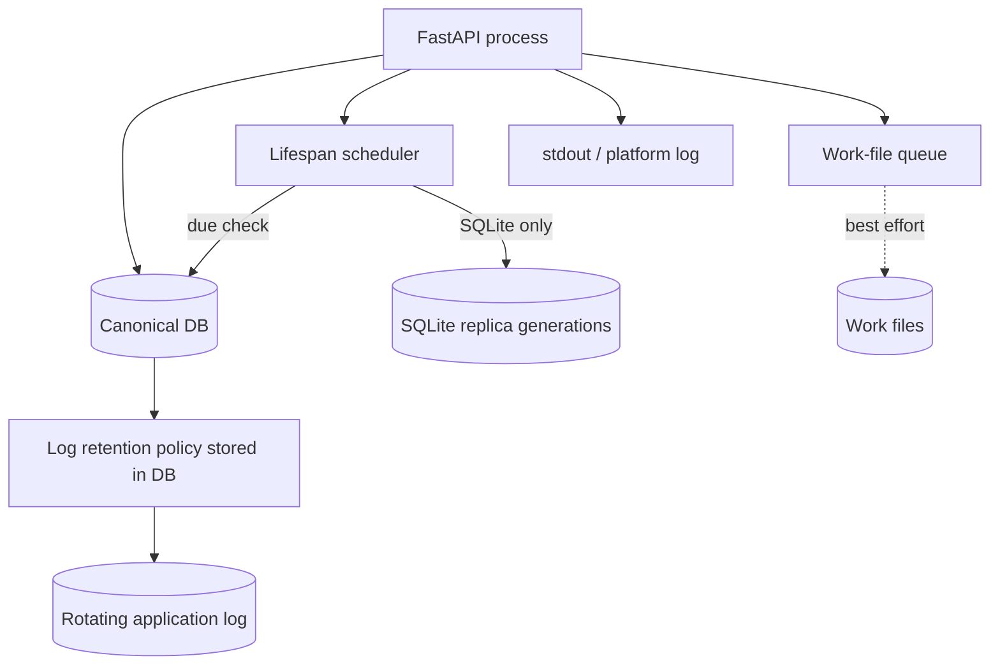

# Operations and security

## Authentication and authorization

- When local authentication is enabled, login passes a sliding-window rate limit keyed by client identifier and username.
- Passwords use salted PBKDF2-SHA256. A missing user still runs a dummy hash to reduce a simple timing distinction.
- The DB stores a session-token hash. Clients present a Bearer token or `HttpOnly`, `SameSite=Lax` cookie; the secure flag is configured by environment.
- The permission groups are `admins`, `leaders`, and `users`, and one user may hold several. `_current_user`, `_user_manager`, and `_admin_user` guard routes, and each guard asks a single predicate about membership. The `role` column remains as a mirror derived from the memberships and is read by no decision.
- Of 96 endpoints, only the reasoned three-path allowlist has no guard; a live-route test enumerates it.
- Request-body, process-wide request, and render concurrency limits are independent.

## Workers, queues, and persistence priority

| Owner | Capacity | On full queue or timeout |
|---|---|---|
| HTTP middleware | In-flight request limit | 503 with `Retry-After` |
| Render capacity | Concurrent render limit, mutable through DB settings | Immediate 503 |
| Stage executor | Shared workers and bounded slots for Stages 1/2 | Deterministic fallback; slot remains until timed-out thread exits |
| Work-file executor | Bounded workers and slots | Preserve DB history; skip only the file job |

## DB backup, logs, and output

- Lifespan owns the scheduler and periodically calls `ensure_scheduled_db_backup`; manual and scheduled generations remain distinct.
- Replica backup is unsupported for non-file DBs.
- The application applies log retention and also keeps stdout; container-daemon limits are another layer.
- Work-file output covers description, DDL, Score with metadata, SVG, and PNG. This document does not record actual deployment paths or values.

## Distribution visible in the public repository

Environment-specific local deployment is outside this document. Public sources confirm that:

1. Git is canonical for public source.
2. Compose defines API/Web services and API persistence.
3. Compose carries Web and API health checks.
4. A release-tag workflow builds both services for multiple architectures and publishes only on a tag push.

## Environment-variable categories

Values were not examined.

| Category | Examples of names |
|---|---|
| DB and backup | `INKU_DB_URL`, `INKU_DB_BACKUP_DIR`, `INKU_DB_BACKUP_SCHEDULER` |
| Output and logs | `INKU_OUTPUT_DIR`, `INKU_OUTPUT_SAVE_WORKERS`, `INKU_LOG_DIR` |
| Capacity | `INKU_MAX_CONCURRENT_REQUESTS`, `INKU_RENDER_CONCURRENCY`, `INKU_STAGE_WORKERS`, `INKU_STAGE_QUEUE_LIMIT` |
| Auth | `INKU_SESSION_COOKIE_SECURE`, `INKU_LOGIN_RATE_ATTEMPTS`, `INKU_REDIS_URL` |
| Providers | Provider API-key/base-URL variable names only; never values |

## Evidence map

Evidence: `API-AUTH`, `API-LIMIT`, `SYS-BACKUP`, `SYS-LOG`, `SYS-FILES`, `OPS-COMPOSE`; implementation in `deps.py`, `auth.py`, `security.py`, `state.py`, `db.py`, `logging_setup.py`, and `compose.yaml`.
