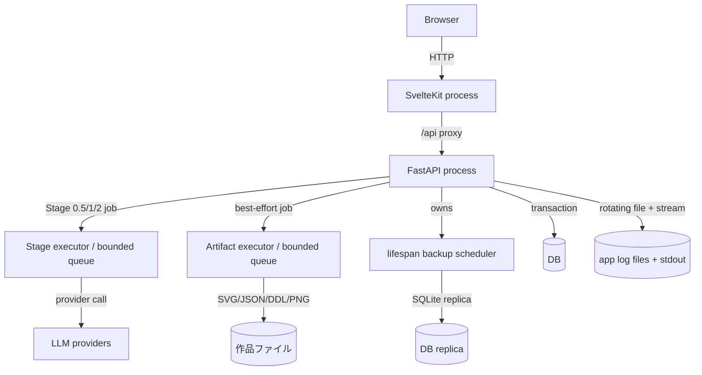
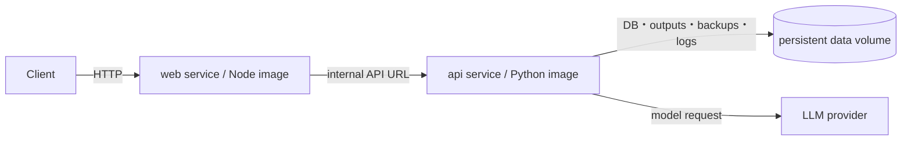

# Runtime containers

「container」はC4の実行単位の意味とDocker Composeの意味を分けて扱う。開発時の実行単位はWeb processとFastAPI processであり、DB・出力・backup・logはbackendが所有する。配布時Composeは同じ2 serviceを別imageにし、APIの永続領域だけをvolumeへ置く。

## 論理実行単位

## 配布時Compose

## 開発時と配布時

| 観点 | 開発時 | Compose配布時 | 根拠 |
|---|---|---|---|
| Web | Vite/SvelteKit process、`/api`をbackendへproxy | adapter-node buildをNodeで実行 | `vite.config.ts`; `web/Dockerfile` |
| API | `inku-server` / uvicorn | Python imageの`inku-server` | `server/pyproject.toml`; `server/Dockerfile` |
| DB | `INKU_DB_URL`、既定SQLite。PostgreSQL指定もコード上可能 | volume上のSQLiteを明示 | `db.py`; `server/Dockerfile` |
| 永続化 | 環境ごとのDB・出力先 | 1 persistent volume配下 | Dockerfileと`compose.yaml` |
| 配備 | 環境固有のため本書の対象外 | release tagでimage build/publish | `.github/workflows/release.yml` |

## 根拠対応

| 図要素 | Evidence ID | 実装 |
|---|---|---|
| Web/API process | `SYS-WEB`, `SYS-API` | `hooks.server.ts`, `api.py` |
| Stage/save pool | `API-LIMIT`, `SYS-FILES` | `api_core/state.py`, `rendering.py` |
| Backup/log | `SYS-BACKUP`, `SYS-LOG` | `api.py:_lifespan`, `db.py`, `logging_setup.py` |
| Compose | `OPS-COMPOSE` | `compose.yaml`, Dockerfiles |
