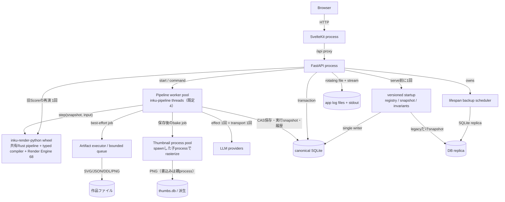
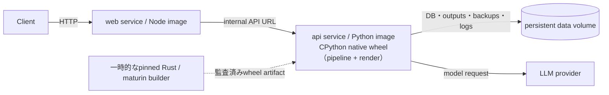

# Runtime containers

「container」はC4の実行単位の意味とDocker Composeの意味を分けて扱う。開発時の実行単位はWeb processとFastAPI processであり、DB・出力・backup・logはbackendが所有する。配布時Composeは同じ2 serviceを別imageにし、APIの永続領域だけをvolumeへ置く。

## 論理実行単位

通常の描画要求（`/api/paint`、`/api/paint/stream`、`/api/interpret`、`/api/compose`、`/api/pipeline/*`）は`PipelineService`のthread poolで実行される。1つのexecutionへのcallは直列化され、workerはcoreが返したeffectを`max_effect_steps`（既定32）まで順に実行する。実行snapshotはeffectごとにDBへcompare-and-setで保存されるため、worker交代後も保存済みsnapshotから再開できる。保持するexecution数が`max_retained_runs`（既定8）に達し、すべてが実行中なら新しい開始は429になる。互換HTTP routeはexecutionが落ち着くまで短い間隔で保存済み状態を読み直してから応答する。

旧Scoreの再演（`/api/render-score`、`/api/render-svg`で0.10未満のScore）は、pipeline poolを通らず、requestのthreadからrender capacityの下でnative wheelを1回呼ぶ。compact Score（0.10〜0.15）の再演は同じrequestのthreadから共有coreの`render_saved`を呼ぶ。

## 配布時Compose

## 開発時と配布時

| 観点 | 開発時 | Compose配布時 | 根拠 |
|---|---|---|---|
| Web | Vite/SvelteKit process、`/api`をbackendへproxy | adapter-node buildをNodeで実行 | `vite.config.ts`; `web/Dockerfile` |
| API | `inku-server` / uvicornとlocal buildしたnative wheel | build済みCPython native wheelを持つPython imageの`inku-server` | `server/pyproject.toml`; `server/Dockerfile`; `core/crates/inku-render-python` |
| native artifact | pinned RustとmaturinがServer package backend外でwheelをbuildする。wheelは`inku-pipeline-uniffi`経由で共有pipelineとrendererの両方を含む | 一時builderがwheelをbuild・監査し、runtime imageには受入済みwheelだけを入れてtoolchainを残さない | `rust-toolchain.toml`; `core/crates/inku-render-python/Cargo.toml`; `server/Dockerfile` |
| pipeline設定 | 既定manifestは`pipeline_defaults.py`が組み立てる。`INKU_PIPELINE_CONFIG`で明示のJSON manifestへ置き換えられる | 同じ | `pipeline_runtime.py`; `pipeline_defaults.py` |
| DB | `INKU_DB_URL`はSQLite URLだけを受理。非SQLiteはengine作成前に拒否 | volume上のSQLiteを明示 | `persistence/config.py`; `server/Dockerfile` |
| 永続化 | 環境ごとのDB・出力先 | 1 persistent volume配下 | Dockerfileと`compose.yaml` |
| 配備 | 環境固有のため本書の対象外 | release tagでimage build/publish | `.github/workflows/release.yml` |

Serverの物理ownerはSQLAlchemy/SQLite、Androidの物理ownerはRoom/SQLiteであり、将来iOS adapterを作る場合も自身の物理schemaを持つ。共通なのはfile名やtable名ではなく、[`persistence/README.md`](../../persistence/README.md)と[`persistence/contract.json`](../../persistence/contract.json)が定める言語非依存の論理契約である。Server専用の認証・管理tableと端末専用のprovider・model・cache tableはhost extensionであり、parity gapではない。

FastAPIはversioned startupが完了するまで通常requestを受け付けない。current registryは版とchecksumだけを検証し、legacy全件scanを通常起動へ戻さない。受け入れたpre-registry DBと前版registryのDBだけがWAL-safe snapshotとsingle-writer migrationを通り、失敗時はserveせずsnapshotを残す。pipeline serviceとそのmanifestは最初のpipeline要求まで組み立てない。native wheel自体はServerの必須runtimeで、無ければ起動できない。

## 根拠対応

| 図要素 | Evidence ID | 実装 |
|---|---|---|
| Web/API process | `SYS-WEB`, `SYS-API` | `hooks.server.ts`, `api.py` |
| Pipeline worker pool | `PIPE-HOST`, `API-LIMIT` | `pipeline_api.py:PipelineService`, `pipeline_runtime.py`, `pipeline_defaults.py` |
| native境界 | `PIPE-MACHINE`, `PIPE-RENDER` | `pipeline_candidate.py:PipelineBinding`, `inku-render-python`, `inku-pipeline-uniffi` |
| save/thumbnail pool | `API-LIMIT`, `SYS-FILES` | `api_core/state.py`, `rendering.py`, `api_core/thumbnails.py` |
| Migration/backup/log | `DATA-MIGRATION`, `SYS-BACKUP`, `SYS-LOG` | `persistence/{migrations,backup,invariants}.py`、`api.py:_db.init_db`（migration）、`api.py:_lifespan`（backup scheduler）、`logging_setup.py` |
| Compose | `OPS-COMPOSE` | `compose.yaml`, Dockerfiles |
