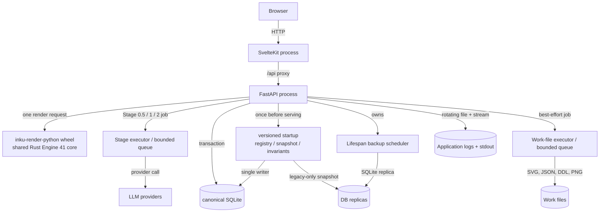
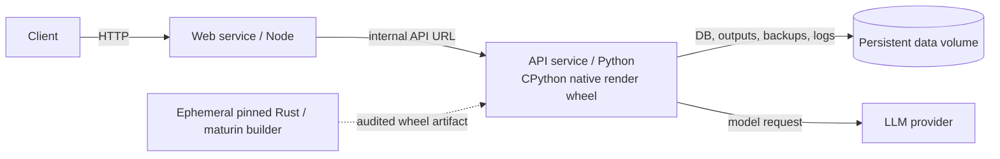

# Runtime containers

“Container” is used here in two senses: a logical C4 runtime unit and a Docker Compose service. In development, Web and FastAPI are separate processes. The backend owns the DB, output, backups, and logs. Compose packages the same two services and places API persistence on a volume.

## Logical runtime units

## Compose distribution

## Development and Compose

| View | Development | Compose | Evidence |
|---|---|---|---|
| Web | Vite/SvelteKit process proxies `/api` | adapter-node build under Node | `vite.config.ts`; `web/Dockerfile` |
| API | `inku-server` / uvicorn with the locally built native render wheel | Python service runs `inku-server` with a prebuilt CPython native wheel | `server/pyproject.toml`; `server/Dockerfile`; `core/crates/inku-render-python` |
| Native render artifact | Pinned Rust and maturin build the wheel outside the Server package backend | An ephemeral builder creates and audits the wheel; the runtime image contains the accepted wheel, not the toolchain | `rust-toolchain.toml`; `core/crates/inku-render-python/pyproject.toml`; `server/Dockerfile` |
| DB | `INKU_DB_URL` accepts SQLite URLs only; non-SQLite is rejected before engine creation | Explicit SQLite on the volume | `persistence/config.py`; `server/Dockerfile` |
| Persistence | Environment-specific DB and output paths | One persistent volume | Dockerfiles; `compose.yaml` |
| Distribution | Environment-specific and outside this document | Release tag builds and publishes containers | `.github/workflows/release.yml` |

The Server physically owns a SQLAlchemy/SQLite schema, Android owns a
Room/SQLite schema, and a possible future iOS adapter would own its own physical
schema. They share language-neutral meaning through
[`persistence/README.md`](../../persistence/README.md) and
[`persistence/contract.json`](../../persistence/contract.json), not file or
table names. Server-only authentication and administration tables and
device-only provider, model, and cache tables are host extensions, not parity
gaps.

FastAPI accepts normal requests only after versioned startup completes. A
current registry verifies only version and checksum; it does not bring legacy
whole-database scans back into normal startup. Only an accepted pre-registry
database passes through a WAL-safe snapshot and single-writer migration. A
failure prevents serving and retains the snapshot.

## Evidence map

| Diagram element | Evidence ID | Implementation |
|---|---|---|
| Web/API processes | `SYS-WEB`, `SYS-API` | `hooks.server.ts`, `api.py` |
| Native render boundary | `PIPE-RENDER` | `default/adapter.py`, `inku-render-python`, `inku-render` |
| Stage/file pools | `API-LIMIT`, `SYS-FILES` | `api_core/state.py`, `rendering.py` |
| Migration/backups/logs | `DATA-MIGRATION`, `SYS-BACKUP`, `SYS-LOG` | `persistence/{migrations,backup,invariants}.py`, `api.py:_db.init_db` (migration), `api.py:_lifespan` (backup scheduler), `logging_setup.py` |
| Compose | `OPS-COMPOSE` | `compose.yaml`, Dockerfiles |
