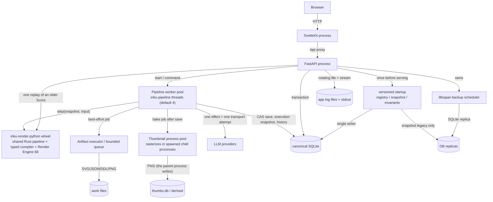
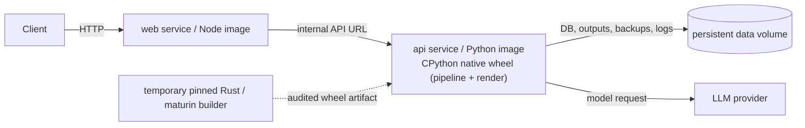

# Runtime containers

"Container" separates the C4 meaning of an execution unit from the Docker Compose meaning. During development, the execution units are the Web process and the FastAPI process; the backend owns the DB, outputs, backups, and logs. The distribution Compose file places those same two services in separate images and puts only the API's persistent area on a volume.

## Logical execution units

Ordinary drawing requests (`/api/paint`, `/api/paint/stream`, `/api/interpret`, `/api/compose`, `/api/pipeline/*`) run in the thread pool of `PipelineService`. Calls for one execution are serialized, and a worker performs the effects the core returns in order, up to `max_effect_steps` (default 32). The execution snapshot is saved to the DB by compare-and-set after each effect, so a replacement worker resumes from the saved snapshot. When the number of retained executions reaches `max_retained_runs` (default 8) and all of them are busy, a new start answers 429. The compatibility HTTP routes re-read the saved state at a short interval until the execution settles, then respond.

Replay of an older Score (a Score below 0.10 on `/api/render-score` or `/api/render-svg`) does not go through the pipeline pool: the request thread calls the native wheel once under render capacity. Replay of a compact Score (0.10 through 0.15) calls the shared core's `render_saved` from the same request thread.

## Distribution Compose

## Development and distribution

| Aspect | Development | Compose distribution | Evidence |
|---|---|---|---|
| Web | Vite/SvelteKit process proxies `/api` to the backend | Node runs the adapter-node build | `vite.config.ts`; `web/Dockerfile` |
| API | `inku-server` / Uvicorn with a locally built native wheel | `inku-server` in a Python image with a built CPython native wheel | `server/pyproject.toml`; `server/Dockerfile`; `core/crates/inku-render-python` |
| Native artifact | Pinned Rust and maturin build the wheel outside the Server package backend. Through `inku-pipeline-uniffi`, the wheel contains both the shared pipeline and the renderer | A temporary builder builds and audits the wheel; the runtime image receives only the accepted wheel and keeps no toolchain | `rust-toolchain.toml`; `core/crates/inku-render-python/Cargo.toml`; `server/Dockerfile` |
| Pipeline configuration | `pipeline_defaults.py` assembles the default manifest. `INKU_PIPELINE_CONFIG` replaces it with an explicit JSON manifest | Same | `pipeline_runtime.py`; `pipeline_defaults.py` |
| DB | `INKU_DB_URL` accepts only a SQLite URL; non-SQLite URLs are rejected before engine creation | SQLite on the volume is explicit | `persistence/config.py`; `server/Dockerfile` |
| Persistence | Environment-specific DB and output locations | Under one persistent volume | Dockerfiles and `compose.yaml` |
| Deployment | Environment-specific and outside this document | Image build/publish on release tags | `.github/workflows/release.yml` |

The Server's physical owner is SQLAlchemy/SQLite and Android's is Room/SQLite; a future iOS adapter would own its own physical schema too. What they share is not file or table names but the language-neutral logical contract in [`persistence/README.md`](../../persistence/README.md) and [`persistence/contract.json`](../../persistence/contract.json). Server-only authentication/administration tables and device-only provider/model/cache tables are host extensions, not parity gaps.

FastAPI does not accept ordinary requests until versioned startup completes. A current registry verifies only version and checksum and does not reintroduce a full legacy scan into normal startup. Only an accepted pre-registry DB or a DB at the previous registry version goes through the WAL-safe snapshot and single-writer migration; on failure the service does not serve and the snapshot remains. The pipeline service and its manifest are not assembled until the first pipeline request. The native wheel itself is a required Server runtime; the Server cannot start without it.

## Evidence mapping

| Diagram element | Evidence ID | Implementation |
|---|---|---|
| Web/API process | `SYS-WEB`, `SYS-API` | `hooks.server.ts`, `api.py` |
| Pipeline worker pool | `PIPE-HOST`, `API-LIMIT` | `pipeline_api.py:PipelineService`, `pipeline_runtime.py`, `pipeline_defaults.py` |
| Native boundary | `PIPE-MACHINE`, `PIPE-RENDER` | `pipeline_candidate.py:PipelineBinding`, `inku-render-python`, `inku-pipeline-uniffi` |
| Save/thumbnail pools | `API-LIMIT`, `SYS-FILES` | `api_core/state.py`, `rendering.py`, `api_core/thumbnails.py` |
| Migration/backup/log | `DATA-MIGRATION`, `SYS-BACKUP`, `SYS-LOG` | `persistence/{migrations,backup,invariants}.py`; `api.py:_db.init_db` (migration); `api.py:_lifespan` (backup scheduler); `logging_setup.py` |
| Compose | `OPS-COMPOSE` | `compose.yaml`, Dockerfiles |
