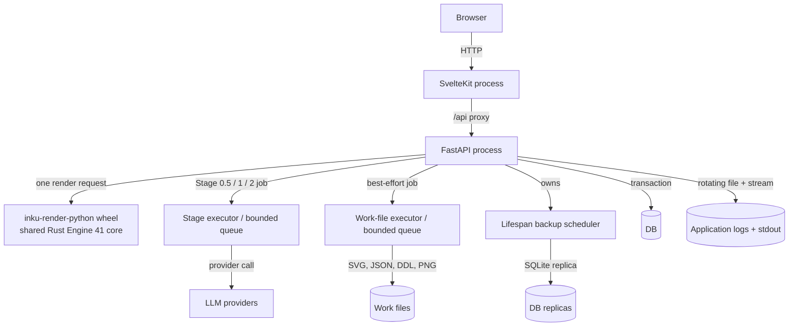
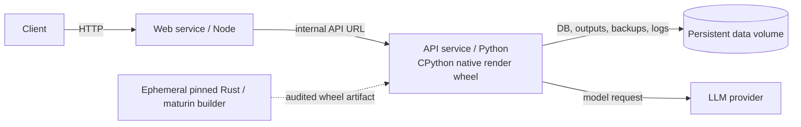

# Runtime containers

“Container” is used here in two senses: a logical C4 runtime unit and a Docker Compose service. In development, Web and FastAPI are separate processes. The backend owns the DB, output, backups, and logs. Compose packages the same two services and places API persistence on a volume.

## Logical runtime units

## Compose distribution

## Development and Compose

| View | Development | Compose | Evidence |
|---|---|---|---|
| Web | Vite/SvelteKit process proxies `/api` | adapter-node build under Node | `vite.config.ts`; `web/Dockerfile` |
| API | `inku-server` / uvicorn with the locally built native render wheel | Python service runs `inku-server` with a prebuilt CPython native wheel | `server/pyproject.toml`; `server/Dockerfile`; `core/crates/inku-render-python` |
| Native render artifact | Pinned Rust and maturin build the wheel outside the Server package backend | An ephemeral builder creates and audits the wheel; the runtime image contains the accepted wheel, not the toolchain | `rust-toolchain.toml`; `core/crates/inku-render-python/pyproject.toml`; `server/Dockerfile` |
| DB | `INKU_DB_URL`; SQLite by default, PostgreSQL supported in code | Explicit SQLite on the volume | `db.py`; `server/Dockerfile` |
| Persistence | Environment-specific DB and output paths | One persistent volume | Dockerfiles; `compose.yaml` |
| Distribution | Environment-specific and outside this document | Release tag builds and publishes containers | `.github/workflows/release.yml` |

## Evidence map

| Diagram element | Evidence ID | Implementation |
|---|---|---|
| Web/API processes | `SYS-WEB`, `SYS-API` | `hooks.server.ts`, `api.py` |
| Native render boundary | `PIPE-RENDER` | `default/adapter.py`, `inku-render-python`, `inku-render` |
| Stage/file pools | `API-LIMIT`, `SYS-FILES` | `api_core/state.py`, `rendering.py` |
| Backup/logs | `SYS-BACKUP`, `SYS-LOG` | `api.py:_lifespan`, `db.py`, `logging_setup.py` |
| Compose | `OPS-COMPOSE` | `compose.yaml`, Dockerfiles |
