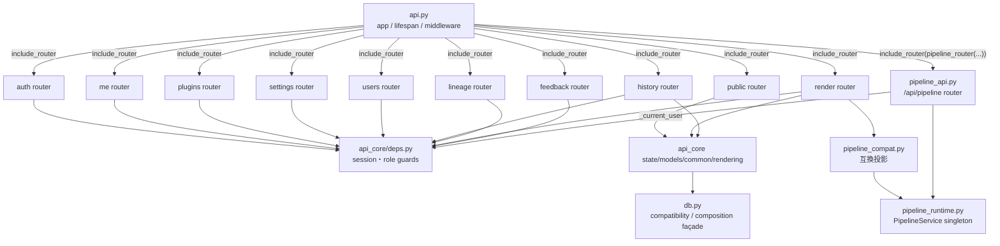
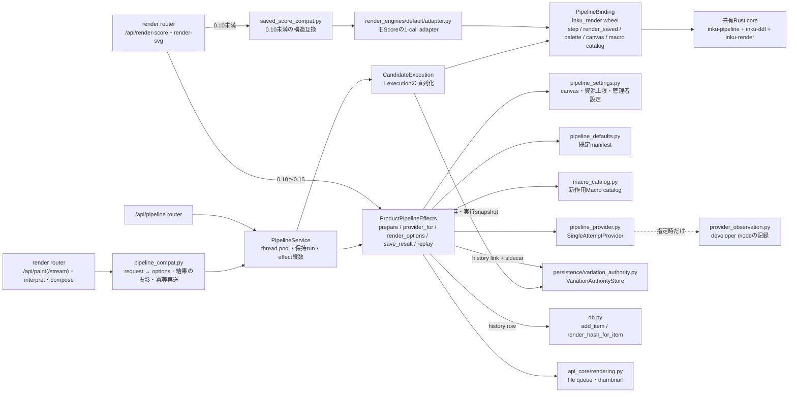
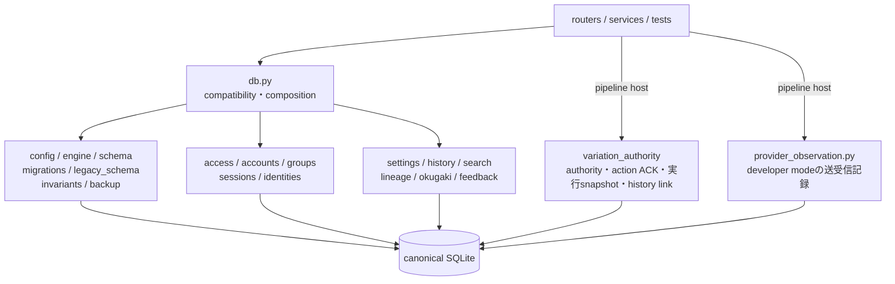
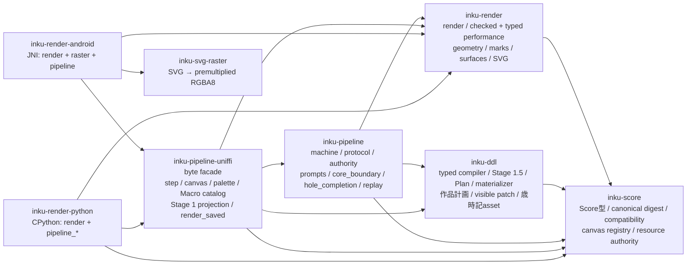

# Server components

## API面

`api.py` はprocess-wideな組立てを持ち、endpoint本体は10 routerと共有pipeline routerへ分かれる。router-level default dependencyと個別dependencyの両方が認可を作る。`test_route_module_split.py` はlive routeの`endpoint.__module__`を検査し、endpointが`api.py`へ戻る退行を防ぐ。

依存方向は `api.py → routers → api_core共有module / domain module` である。`server/src/inku_server/api_core/routers/` から `inku_server.api` へのimport検索は0件だった。共有pipelineのserviceは`pipeline_runtime.py`が遅延生成するprocess内のsingletonで、render routerの互換経路と`/api/pipeline` routerの両方が同じserviceを使う。

## 処理面

正規経路は、router → `pipeline_compat.py`（またはHTTPの`/api/pipeline`）→ `PipelineService` → `CandidateExecution` → native wheelの`step` である。`CandidateExecution`は1 executionのcallを直列化し、coreが返したeffectを`ProductPipelineEffects`へ渡して1回ずつ実行し、結果をcoreへ返す。effectごとの次snapshotは`VariationAuthorityStore`へcompare-and-setで保存され、worker交代後も保存済みsnapshotから再開できる。clientはsnapshot、authority sidecar、effect結果、資源policyを送れず、`render` commandも直接は受けない（hostが信頼済みoptionを付けた`perform`だけ）。

`ProductPipelineEffects`は意味を決めない5つのhost責任を持つ。`prepare`はoption検証、指示文言語、Macro catalog、canvas、seed、色カタログとpaletteの解決、stage modelの解決を行う。`provider_for`はcoreが要求したactionを`SingleAttemptProvider`で1回だけ送り、経過時間とprovider失敗を実行contextへ記録する。`render_options`は保存済みsnapshotから信頼済みrender optionを組む。`save_result`は演奏を履歴rowとhistory linkへ保存する。`replay`はcompact Scoreを保存policyで演奏し直す。

0.10未満の旧Scoreの再演だけは`saved_score_compat.py`の構造互換を通り、`api_core/rendering.py` → `render_engines` registry → `default/adapter.py` → native wheelの`render`を1回呼ぶ。`renderer.py`はSVGだけを必要とする既存callerの互換facadeで、同じregistryへ委譲する。旧`interpreter.py`、`composer.py`、`ddl_expander.py`、`coerce/compose.py`、`coerce/normalize.py`は削除済みで、`coerce/`に残るのは保存済み観測記録の互換（`observability.py`）だけである。

## 永続化面

`db.py`は既存callerを一度に書き換えないためのpublic compatibility façadeであり、同時にcall-time dependencyを組み立てるcomposition seamである。`persistence/schema.py`がORM schema、`config.py`と`engine.py`がSQLite-only設定とconnection PRAGMA、`migrations.py`がversioned registryと起動判定、`backup.py`と`invariants.py`がsnapshotとdata-loss guardを所有する。domain CRUDとqueryは変更理由ごとのmoduleが所有する。共有pipelineの状態（variation authority、action ACK、実行snapshot、history link）は`persistence/variation_authority.py`が、developer modeのprovider送受信記録は`provider_observation.py`が、façadeを通らずに所有する。

現在の`db.py`に直接SQL、transaction、migration session、metadata create、commit、flushの実装ownerは残らない。compatibility re-exportと薄いdelegateは意図したboundaryであり、readerがゼロと証明されたものだけを削除する。新しい永続化処理をfaçadeへ戻さないことは、単なる行数削減より優先する。

## Rust core内部

8 crateのうち5つのhost非依存crateは`#![forbid(unsafe_code)]`で、残る3つのbinding crateは薄いadapterである。依存は一方向である。`inku-score`が最下層でScore型と資源authorityを持ち、`inku-ddl`と`inku-render`は互いに依存しない。`inku-pipeline`だけが両者を結び、compileしたdeliveryを同じcompiler optionでだけ演奏する。`inku-pipeline-uniffi`は所有したUTF-8 JSON byte bufferだけを受け渡すfacadeで、Python・JNI adapterはこの上に薄く載り、意味分岐を複製しない。panicはplatform例外ではなく安定した`internal_invariant` error envelopeへ閉じる。

```mermaid
flowchart LR
    SRC["document / parser / clause\nsource-preserving lexeme・clause"]
    EVID["noun_phrase / phrase / attachment\nrelation_reference / opaque_head\n意味中立のevidence"]
    MACRO["macro_resolution / macro_parameter_binding\nmacro_expansion / macro_seed / macro_definition"]
    SEM["semantic_association / semantic_instruction\nsemantic_document / composition\ngeometry / shape_constraint / fluctuation"]
    LOCK["compiler_lock\ncanonical meaning・4状態のlock"]
    PROJ["execution_projection\n非canonical時のsealed projection"]
    S15["stage15_transform\n焦点・明示変奏"]
    PLAN["composition_plan / group_quantity\nplan_reference_extent"]
    RES["plan_resources\nhard policy + operational budget"]
    MAT["score_materialization / score_lowering\nscore_angle → compact Score"]
    AUX["work_plan / visible_patch / prompt / saijiki\nauthoring補助とasset"]

    SRC --> EVID --> MACRO --> SEM --> LOCK
    LOCK -->|"canonical_ready"| S15
    LOCK -->|"それ以外"| PROJ --> S15
    S15 --> PLAN --> RES --> MAT
    AUX -.->|"Stage 1印字・hole patch・語彙"| SRC
```

`inku-ddl`の入口は`compile_ddl_to_score_with_resources`（`compiler_execution.rs`）で、元の`NormalizedDdlDocument`を一度だけcompileしてから、Stage 1.5、Plan、資源選択、materializeを順に行う。source・provenance・Macro definitionの照合はlock構築時に済ませ、Stage 1.5へ渡すのはlock検証済みのmeaningだけである。

`inku-render`では`render.rs`が唯一の全体統率で、`render_with_resources`は`checked_performance`でScoreの版を見分け、compact Scoreを`typed_performance`（recipeからの個体化と`arrangement_performance`）へ、旧Scoreを従来の`anchor_execution`（`anchor_schedule`による依存順）へ振り分ける。geometry群（`geometry`、`affine`、`affine_geometry`、`arc`、`cloudform`、`contact`、`fill_geometry`、`surface_geometry`）は副作用のない点列計算、material群（`marks`、`mark_paths`、`stroke`、`fills`、`accepted_fills`、`surfaces`、`support`、`materials`、`ink_spread`）はmark／stroke／surfaceとsupportの相互作用、canvas群（`ground`、`ground_patterns`、`layers`、`palette`）はground／presence／色割当、`compat_clip`と`render_fill_scopes`は塗りの境界clipとpaint順、`svg.rs`は小さいdocument treeと最終serializeを所有する。`determinism.rs`は横断的に使われるがhost entropyは作らない。

## Router分類

| Router | endpoint数 | 主責任 | default guard |
|---|---:|---|---|
| `public` | 9 | health、info、catalog、models、saijiki、plugin preview、reference、client config、demo | なし。`/health`と`/api/info`以外は個別guard |
| `auth` | 4 | auth config、login/logout | なし。login以外は個別guard |
| `me` | 13 | profile、user settings、各user storage | `_current_user` |
| `plugins` | 8 | plugin閲覧・検証・CRUD・enable | `_current_user`、変更はadmin |
| `settings` | 16 | server-wide settings、backup | `_admin_user` |
| `users` | 8 | user/group管理 | `_user_manager` |
| `history` | 17 | 履歴、SVG、thumbnail、mark、trash、共有、artifact再作成、animation・card書き出し | `_current_user` |
| `lineage` | 8 | lineage graph/group、promote、colophon | `_current_user` |
| `render` | 8 | variation seed、compose、interpret、render-score/svg、paint、paint stream、vision advice | `_current_user` |
| `feedback` | 3 | unread words | `_current_user` |
| `pipeline` | 11 | canvas形式、variationの開始・取得・fork、execution command、author DDL、history link・fork、旧作品の読取・fork、provider観測 | 各routeで`_current_user`。provider観測はさらにdeveloper modeだけ |

合計105。公開allowlistは `/health`、`/api/info`、`/api/auth/login` の3 pathである（`test_route_authorization.py`）。ログインに要らないものは残さない、が基準である。

**⚠ router別の件数は手で写したもので、赤くする検査は無い。** 合計の正本は`test_route_authorization.py`の`EXPECTED_ROUTE_COUNT`（105）で、live appのOpenAPIから作った`tests/data/api-surface-baseline.json`も105 operationを記録する。

## 主要flow

- `/api/paint`、`/api/paint/stream`、`/api/interpret`、`/api/compose`は`pipeline_compat.py`を通って同じ`PipelineService`を使う。streamは実行を読み直して`sketch`・`stage1`・`score`・`done`を順に知らせ、最初のeventの後の失敗を本文の`error` eventで返す。補完案の承認が要る場合、stream以外の3つは409と現在のviewを返し、streamは最初のeventより前なら409、後なら`error` eventを返す。記述起点の開始は札を切った記述だけをcoreへ渡し、札だけの記述を400で断る。
- `/api/pipeline/variations`は記述またはdirect DDLからvariationを始め、`/executions/{id}/commands`が作者の操作（承認・辞退・補完要求・再生成・演奏・取消し）を、`/executions/{id}/author-ddl`がDDL編集を受ける。設定が変わるDDL編集は元を変えず親付きのvariationを新設する。
- `/api/pipeline/history/{id}`は共有pipelineで保存した作品のvariation・revisionを返し、`/history/{id}/fork`はその時点のconfig・host context・Macro定義から派生する。`/legacy/{id}`と`/legacy/{id}/fork`はlinkを持たない旧作品を読み、元行を変えずに派生する。
- `/api/render-score`と`/api/render-svg`はScoreの版で分かれ、compact Scoreは`ProductPipelineEffects.replay`、0.10未満は`saved_score_compat.py`を通る。
- provider/modelはrequest指定、userのStage設定、manifestの既定を`resolved_stage_model`で解決する。

## 根拠対応

| 図要素 | Evidence ID | 根拠 |
|---|---|---|
| app/router/deps | `SYS-API`, `API-ROUTERS`, `API-AUTH` | `api.py`, `api_core/routers`, `pipeline_api.py:pipeline_router`, `deps.py` |
| pipeline host | `PIPE-HOST`, `PIPE-LIMITS`, `API-LIMIT` | `pipeline_runtime.py`, `pipeline_api.py`, `pipeline_candidate.py`, `pipeline_product.py`, `pipeline_settings.py`, `pipeline_defaults.py` |
| 共有Rust core | `SYS-CORE`, `PIPE-MACHINE`, `PIPE-TYPED-DDL`, `PIPE-LOWER`, `PIPE-RENDER` | `core/Cargo.toml`, 各crateの`lib.rs` |
| 旧Score互換 | `PIPE-COMPAT` | `saved_score_compat.py`, `render_engines/default/adapter.py` |
| persistence | `PIPE-HISTORY`, `SYS-DB`, `DATA-MIGRATION`, `DATA-AUTHORITY` | `pipeline_product.py:save_result`, `db.py`, `persistence/*`, `provider_observation.py` |
| shared rasterizer | `SYS-FILES` | `shared/src/inku_analysis/rasterizer.py`, `api_core/thumbnails.py` |
