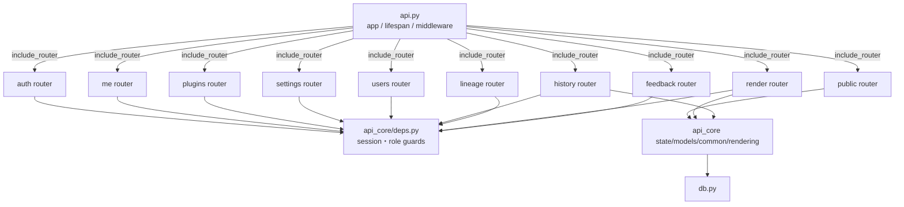
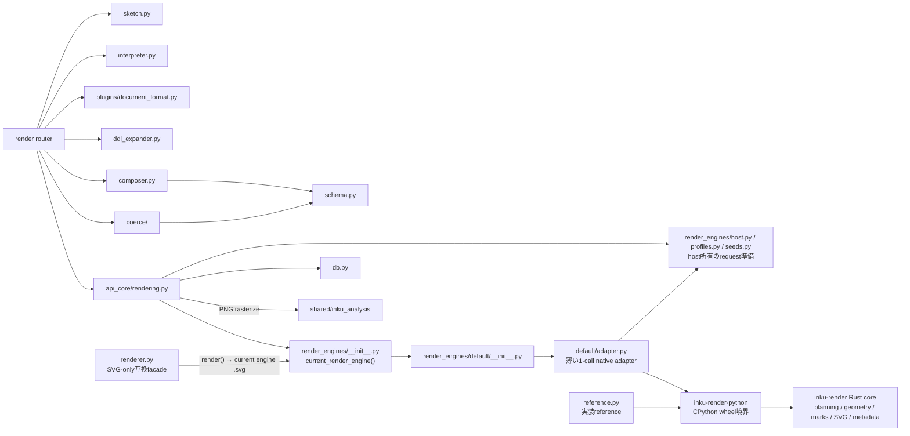
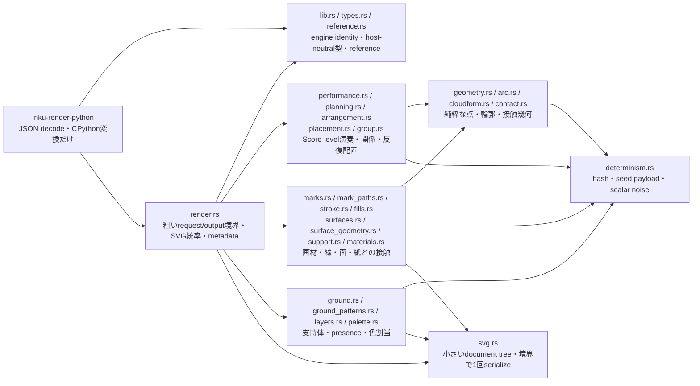

# Server components

## API面

`api.py` はprocess-wideな組立てを持ち、endpoint本体は10 routerへ分かれる。router-level default dependencyと個別dependencyの両方が認可を作る。`test_route_module_split.py` はlive routeの`endpoint.__module__`を検査し、endpointが`api.py`へ戻る退行を防ぐ。

依存方向は `api.py → routers → api_core共有module / domain module` である。`server/src/inku_server/api_core/routers/` から `inku_server.api` へのimport検索は0件だった。

## 処理面

正規経路は `api_core/rendering.py → render_engines` registry → `default/adapter.py` → 独立した `inku-render-python` wheel → platform-independentな `inku-render` core である。adapterはhost所有のcanvas/profileを解決し、正規requestを1回serializeして、SVGとmetadataを1回のcallで受け取る。`renderer.py` はSVG-only互換facadeとして残り、同じregistryへ委譲する。

Stage 6でPython Engine 40の統率、planning、mark、surface、layer、SVG emission、stroke moduleを削除した。`default/` に残るのはpackage exportと薄いRust adapterだけである。`/api/reference` も第二のPython実装をimportせず、renderer所有の表をnative coreから読む。Androidはまだ履歴上のKotlin rendererを使っており、このRust coreの採用は次のportability boundaryである。

## Rust core内部

`types.rs`はPython schemaの代替ではなく、検証・coerce済みの正規Scoreと解決済みhost optionだけを受ける。`render.rs`が唯一の全体統率で、planningは作品レベルの演奏と配置、geometryは副作用のない点列計算、material群はmark／stroke／surfaceとsupportの相互作用、canvas群はground／presence／palette、`svg.rs`は小さいdocument treeと最終serializeを所有する。`determinism.rs`は横断的に使われるがhost entropyは作らない。CPython bindingはこの公開面を粗く呼ぶだけで、内部moduleごとのPython往復やhost SDK依存を入れない。

## Router分類

| Router | endpoint数 | 主責任 | default guard |
|---|---:|---|---|
| `public` | 10 | health、info、catalog、models、saijiki、reference、prompts、demo | なし。`/health` と `/api/info` 以外は個別guard |
| `auth` | 4 | auth config、login/logout | なし。login以外は個別guard |
| `me` | 13 | profile、user settings、各user storage | `_current_user` |
| `plugins` | 8 | plugin閲覧・検証・CRUD・enable | `_current_user`、変更はadmin |
| `settings` | 16 | server-wide settings、backup | `_admin_user` |
| `users` | 8 | user/group管理 | `_user_manager` |
| `history` | 18 | 履歴、SVG、thumbnail、mark、trash、共有、artifact再作成 | `_current_user` |
| `lineage` | 8 | lineage graph/group、promote、colophon | `_current_user` |
| `render` | 8 | variation、compose、interpret、render、paint、vision | `_current_user` |
| `feedback` | 3 | unread words | `_current_user` |

合計96。公開allowlistは `/health`、`/api/info`、`/api/auth/login` の3 pathである（`test_route_authorization.py`）。ログインに要らないものは残さない、が基準である。

**⚠ この表の件数は手で写したもので、赤くする検査は無い**（allowlistの3 pathだけが検査に載っている）。件数の正本は `test_route_authorization.py` の `EXPECTED_ROUTE_COUNT` である。

## 主要flow

- `/api/paint` と `/api/paint/stream` は同じ `_paint_events` generatorを消費する。streamだけ層の完了を先行eventとして返す（`sketch`・`stage1`・`score` の3つ。`sketch` は写生層が動いた回だけ）。**先行eventが1つでも出た後の失敗は、HTTPではなく本文の `error` eventで届く。**
- `/api/compose` はStage 1を通らず、受け取ったDDLからplugin → Stage 1.5 → Stage 2 → coerce → renderへ進む。
- provider/modelはrequest指定、userのStage設定、provider catalogを `provider_for_model` / `_resolved_stage_model` で解決する。
- `api_core/rendering.py` がScore/renderとhistory/file保存の継ぎ目である。

## 根拠対応

| 図要素 | Evidence ID | 根拠 |
|---|---|---|
| app/router/deps | `SYS-API`, `API-ROUTERS`, `API-AUTH` | `api.py`, `api_core/routers`, `deps.py` |
| pipeline components | `PIPE-*` | `render.py:_call_compose_detail`, `_paint_events` |
| persistence | `PIPE-HISTORY`, `SYS-FILES` | `rendering.py`, `db.py` |
| shared rasterizer | `SYS-FILES` | `shared/src/inku_analysis/rasterizer.py` |
