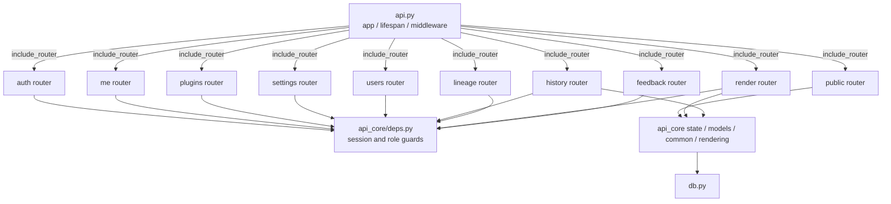
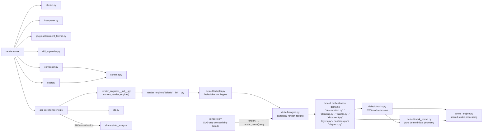

# Server components

## API surface

`api.py` owns process-wide assembly; endpoint bodies live in ten routers. Router defaults and endpoint dependencies both contribute authorization. `test_route_module_split.py` checks live `endpoint.__module__` values so endpoint ownership cannot drift back into `api.py` unnoticed.

The dependency direction is `api.py → routers → shared api_core/domain modules`. A search under `server/src/inku_server/api_core/routers/` found no import from `inku_server.api`.

## Processing surface

The canonical path is `api_core/rendering.py → render_engines` registry → `default` adapter → canonical `engine.render_result()`. `renderer.py` is the compatibility facade for existing SVG-only callers; `renderer.render()` delegates to the canonical result's `.svg`. Repository-owned executable code uses only `render` from the facade, while `api_core/rendering.py` reads profiles and seeds directly from their canonical owners.

`mark_kernel.py` owns deterministic geometry that returns only scalars and point collections and creates no SVG object. `marks.py` consumes that kernel to construct SVG attributes and elements. This dependency direction is a boundary at which a future shared Rust core can be evaluated; the current implementation remains Python-only.

## Router groups

| Router | Endpoints | Main responsibility | Default guard |
|---|---:|---|---|
| `public` | 10 | Health, info, catalogs, models, Saijiki, references, prompts, demo | None; every route but `/health` and `/api/info` adds its own guard |
| `auth` | 4 | Auth configuration, login/logout | None; every route but login adds its own guard |
| `me` | 13 | Profile, user settings, user storage | `_current_user` |
| `plugins` | 8 | Browse, validate, CRUD, enable plugins | `_current_user`; admin for changes |
| `settings` | 16 | Server-wide settings and backup | `_admin_user` |
| `users` | 8 | User/group management | `_user_manager` |
| `history` | 18 | History, SVG, thumbnails, mark, trash, sharing, derivative rebuild | `_current_user` |
| `lineage` | 8 | Lineage graph/group, promote, colophon | `_current_user` |
| `render` | 8 | Variation, compose, interpret, render, Paint, vision | `_current_user` |
| `feedback` | 3 | Unread words | `_current_user` |

Total: 96. The three-path public allowlist is `/health`, `/api/info`, and `/api/auth/login` (`test_route_authorization.py`). The rule is that nothing logging in does not need stays on it.

**⚠ The counts in this table are copied by hand, and no gate reddens for them** (only the three allowlist paths are held by a check). The canonical count is `EXPECTED_ROUTE_COUNT` in `test_route_authorization.py`.

## Main flows

- `/api/paint` and `/api/paint/stream` consume the same `_paint_events` iterator; only the stream emits the layer-completion events early (`sketch`, `stage1`, `score`; `sketch` only on requests where that layer ran). **Once any early event has been written, a failure arrives as an `error` event in the body rather than as an HTTP status.**
- `/api/compose` starts from supplied DDL and proceeds through plugin → Stage 1.5 → Stage 2 → coerce → performance.
- `provider_for_model` and `_resolved_stage_model` resolve request, user settings, and provider catalog choices.
- `api_core/rendering.py` joins Score/performance to history and optional work-file persistence.

## Evidence map

Evidence: `SYS-API`, `API-ROUTERS`, `API-AUTH`, `PIPE-*`, `PIPE-HISTORY`, `SYS-FILES`.
