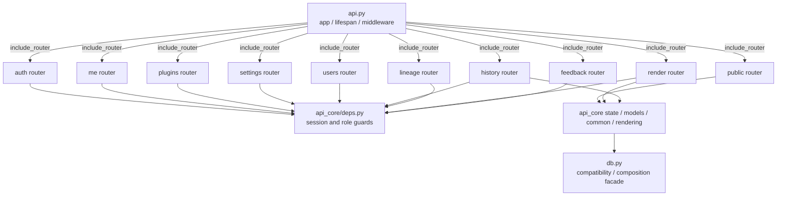
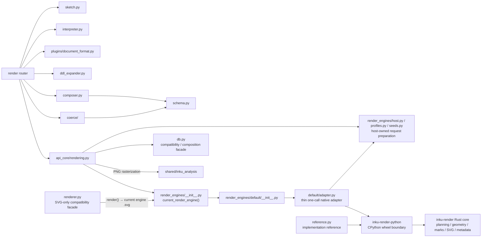
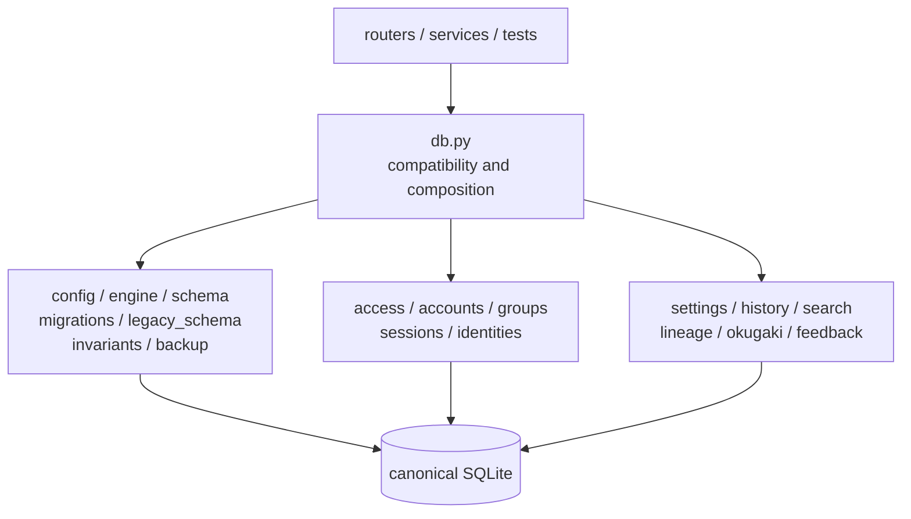
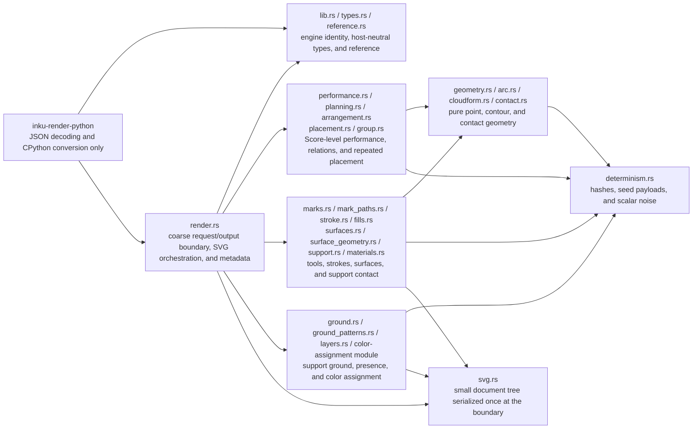

# Server components

## API surface

`api.py` owns process-wide assembly; endpoint bodies live in ten routers. Router defaults and endpoint dependencies both contribute authorization. `test_route_module_split.py` checks live `endpoint.__module__` values so endpoint ownership cannot drift back into `api.py` unnoticed.

The dependency direction is `api.py → routers → shared api_core/domain modules`. A search under `server/src/inku_server/api_core/routers/` found no import from `inku_server.api`.

## Processing surface

The canonical path is `api_core/rendering.py → render_engines` registry → `default/adapter.py` → the independent `inku-render-python` wheel → the platform-independent `inku-render` core. The adapter resolves host-owned canvas/profile data, serializes one canonical request, and receives SVG plus metadata in one call. `renderer.py` remains the SVG-only compatibility facade and delegates through the same registry.

Stage 6 removed the Python Engine 40 orchestration, planning, mark, surface, layer, SVG-emission, and stroke modules. `default/` now contains only its package export and the thin Rust adapter. `/api/reference` obtains renderer-owned tables from the native core instead of importing a second Python implementation. Android now calls the same core through the thin `inku-render-android` JNI adapter. Its SVG presentation uses the separate `inku-svg-raster` crate; this boundary does not change the Server's existing PNG raster path.

## Persistence surface

`db.py` is the public compatibility facade that avoids rewriting every caller
at once and the composition seam that supplies call-time dependencies.
`persistence/schema.py` owns the ORM schema; `config.py` and `engine.py` own
SQLite-only configuration and connection PRAGMAs; `migrations.py` owns the
versioned registry and startup decision; and `backup.py` plus `invariants.py`
own snapshots and the data-loss guard. Domain CRUD and queries belong to
modules separated by their reasons to change.

No direct SQL, transaction, migration Session, metadata-create, commit, or
flush implementation owner remains in `db.py`. Compatibility re-exports and
thin delegates are intentional. Only a wrapper with proven-zero readers is
removed; keeping new persistence behavior out of the facade matters more than
reducing its line count.

## Rust core internals

`types.rs` does not replace the Python schema; it receives only the canonical Score after validation/coercion and resolved host options. `render.rs` is the sole whole-render orchestrator. Planning owns work-level performance and placement, geometry owns side-effect-free point calculations, the material group owns marks/strokes/surfaces and their interaction with the support, the canvas group (`ground.rs`, `ground_patterns.rs`, `layers.rs`, and `palette.rs`) owns ground/presence/color assignment, and `svg.rs` owns the small document tree and final serialization. `determinism.rs` is shared across groups but never creates host entropy. The CPython binding calls this public surface coarsely, with no per-module Python round trips or host-SDK dependency in the core.

## Router groups

| Router | Endpoints | Main responsibility | Default guard |
|---|---:|---|---|
| `public` | 10 | Health, info, catalogs, models, Saijiki, references, prompts, demo | None; every route but `/health` and `/api/info` adds its own guard |
| `auth` | 4 | Auth configuration, login/logout | None; every route but login adds its own guard |
| `me` | 13 | Profile, user settings, user storage | `_current_user` |
| `plugins` | 8 | Browse, validate, CRUD, enable plugins | `_current_user`; admin for changes |
| `settings` | 16 | Server-wide settings and backup | `_admin_user` |
| `users` | 8 | User/group management | `_user_manager` |
| `history` | 18 | History, SVG, thumbnails, mark, trash, sharing, derivative rebuild | `_current_user` |
| `lineage` | 8 | Lineage graph/group, promote, colophon | `_current_user` |
| `render` | 8 | Variation, compose, interpret, render, Paint, vision | `_current_user` |
| `feedback` | 3 | Unread words | `_current_user` |

Total: 96. The three-path public allowlist is `/health`, `/api/info`, and `/api/auth/login` (`test_route_authorization.py`). The rule is that nothing logging in does not need stays on it.

**⚠ The counts in this table are copied by hand, and no gate reddens for them** (only the three allowlist paths are held by a check). The canonical count is `EXPECTED_ROUTE_COUNT` in `test_route_authorization.py`.

## Main flows

- `/api/paint` and `/api/paint/stream` consume the same `_paint_events` iterator; only the stream emits the layer-completion events early (`sketch`, `stage1`, `score`; `sketch` only on requests where that layer ran). **Once any early event has been written, a failure arrives as an `error` event in the body rather than as an HTTP status.**
- `/api/compose` starts from supplied DDL and proceeds through plugin → Stage 1.5 → Stage 2 → coerce → performance.
- `provider_for_model` and `_resolved_stage_model` resolve request, user settings, and provider catalog choices.
- `api_core/rendering.py` joins Score/performance to history and optional work-file persistence.

## Evidence map

Evidence: `SYS-API`, `API-ROUTERS`, `API-AUTH`, `PIPE-*`, `PIPE-HISTORY`, `SYS-DB`, `DATA-MIGRATION`, `SYS-FILES`.
