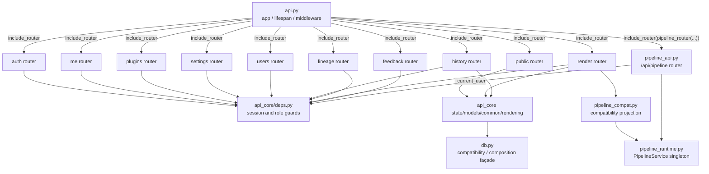
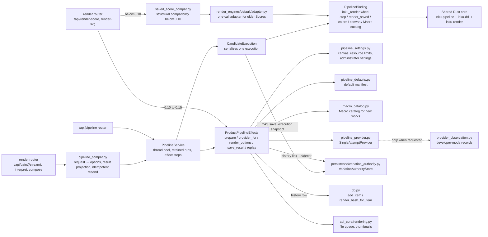
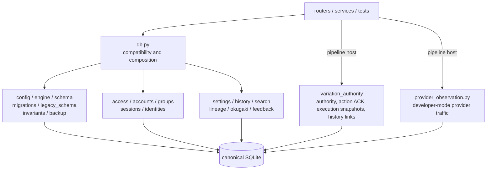
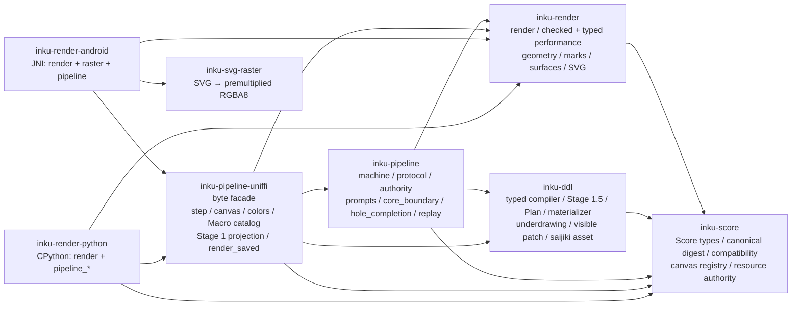

# Server components

## API surface

`api.py` owns process-wide assembly, while endpoint bodies live in ten routers and the shared pipeline router. Router-level default dependencies and per-route dependencies both participate in authorization. `test_route_module_split.py` checks live routes' `endpoint.__module__` so endpoints do not regress back into `api.py`.

The dependency direction is `api.py → routers → api_core shared modules / domain modules`. A search for imports of `inku_server.api` from `server/src/inku_server/api_core/routers/` returned zero results. The shared pipeline service is an in-process singleton that `pipeline_runtime.py` creates lazily; the render router's compatibility routes and the `/api/pipeline` router both use the same service.

## Processing surface

The canonical path is router → `pipeline_compat.py` (or HTTP `/api/pipeline`) → `PipelineService` → `CandidateExecution` → `step` in the native wheel. `CandidateExecution` serializes the calls for one execution, hands each effect the core returns to `ProductPipelineEffects` to perform once, and returns the result to the core. The next snapshot after each effect is saved to `VariationAuthorityStore` by compare-and-set, so a replacement worker resumes from the saved snapshot. A client cannot send snapshots, authority sidecars, effect results, or resource policies, and the `render` command is never accepted directly (only `perform`, to which the host attaches trusted options).

`ProductPipelineEffects` has five host responsibilities, none of which decides meaning. `prepare` validates options and resolves the instruction language, the Macro catalog, the canvas, seeds, the color catalog and its resolved colors, and the stage models. `provider_for` sends each action the core requests once through `SingleAttemptProvider` and records elapsed time and provider failures in the execution context. `render_options` builds trusted render options from the saved snapshot. `save_result` saves a performance as a history row and a history link. `replay` performs a compact Score again under its saved policy.

Only replay of an older Score below 0.10 goes through the structural compatibility of `saved_score_compat.py` and then `api_core/rendering.py` → the `render_engines` registry → `default/adapter.py` → one `render` call in the native wheel. `renderer.py` is a compatibility façade for existing callers that need SVG only, and it delegates to the same registry. The old `interpreter.py`, `composer.py`, `ddl_expander.py`, `coerce/compose.py`, and `coerce/normalize.py` have been deleted; all that remains in `coerce/` is compatibility for saved observation records (`observability.py`).

## Persistence surface

`db.py` is the public compatibility façade that lets existing callers keep their imports and call shapes, and it is also the composition seam that resolves call-time dependencies. `persistence/schema.py` owns the ORM schema, `config.py` and `engine.py` own SQLite-only configuration and connection PRAGMAs, `migrations.py` owns the versioned registry and startup decision, and `backup.py` plus `invariants.py` own snapshots and data-loss guards. Domain CRUD and queries live in modules divided by reason for change. Shared-pipeline state (variation authority, action acknowledgments, execution snapshots, history links) is owned by `persistence/variation_authority.py`, and developer-mode provider traffic by `provider_observation.py`, without going through the façade.

The current `db.py` no longer owns direct SQL, transactions, migration sessions, metadata creation, commits, or flushes. Compatibility re-exports and thin delegates are intentional boundaries; remove only those proven to have no readers. Preventing new persistence behavior from returning to the façade matters more than reducing line count.

## Rust core internals

Of the eight crates, the five host-neutral ones use `#![forbid(unsafe_code)]`, and the remaining three binding crates are thin adapters. Dependencies run one way. `inku-score` is the lowest layer and holds Score types and resource authority; `inku-ddl` and `inku-render` do not depend on each other. Only `inku-pipeline` joins them, and it performs a compiled delivery only with the same compiler options. `inku-pipeline-uniffi` is a façade that passes only owned UTF-8 JSON byte buffers; the Python and JNI adapters sit thinly on top of it and do not duplicate semantic branches. A panic is closed into a stable `internal_invariant` error envelope rather than a platform exception.

```mermaid
flowchart LR
    SRC["document / parser / clause\nsource-preserving lexemes and clauses"]
    EVID["noun_phrase / phrase / attachment\nrelation_reference / opaque_head\nmeaning-neutral evidence"]
    MACRO["macro_resolution / macro_parameter_binding\nmacro_expansion / macro_seed / macro_definition"]
    SEM["semantic_association / semantic_instruction\nsemantic_document / composition\ngeometry / shape_constraint / fluctuation"]
    LOCK["compiler_lock\ncanonical meaning, four lock states"]
    PROJ["execution_projection\nsealed projection when not canonical"]
    S15["stage15_transform\nfocus and explicit variation"]
    PLAN["composition_plan / group_quantity\nplan_reference_extent"]
    RES["plan_resources\nhard policy + operational budget"]
    MAT["score_materialization / score_lowering\nscore_angle → compact Score"]
    AUX["work_plan / visible_patch / prompt / saijiki\nauthoring aids and assets"]

    SRC --> EVID --> MACRO --> SEM --> LOCK
    LOCK -->|"canonical_ready"| S15
    LOCK -->|"otherwise"| PROJ --> S15
    S15 --> PLAN --> RES --> MAT
    AUX -.->|"Stage 1 printing, hole patches, vocabulary"| SRC
```

The entry point of `inku-ddl` is `compile_ddl_to_score_with_resources` (`compiler_execution.rs`). It compiles the original `NormalizedDdlDocument` once, then runs Stage 1.5, the Plan, resource selection, and materialization in order. Source, provenance, and Macro definitions are checked when the lock is built; only lock-verified meaning reaches Stage 1.5.

In `inku-render`, `render.rs` is the only overall orchestrator. `render_with_resources` lets `checked_performance` tell Score versions apart, sending compact Scores to `typed_performance` (instances from the recipe and `arrangement_performance`) and older Scores to the established `anchor_execution` (dependency order from `anchor_schedule`). The geometry group (`geometry`, `affine`, `affine_geometry`, `arc`, `cloudform`, `contact`, `fill_geometry`, `surface_geometry`) computes side-effect-free point sequences; the material group (`marks`, `mark_paths`, `stroke`, `fills`, `accepted_fills`, `surfaces`, `support`, `materials`, `ink_spread`) owns mark/stroke/surface and support interaction; the canvas group (`ground`, `ground_patterns`, `layers`, `palette`) owns ground, presence, and color assignment; `compat_clip` and `render_fill_scopes` own fill-boundary clipping and paint order; and `svg.rs` owns the small document tree and final serialization. `determinism.rs` is used across the crate but never creates host entropy.

## Router classification

| Router | Endpoints | Main responsibility | Default guard |
|---|---:|---|---|
| `public` | 9 | Health, info, catalog, models, saijiki, plugin preview, reference, client config, demo | None; routes other than `/health` and `/api/info` have explicit guards |
| `auth` | 4 | Auth config and login/logout | None; routes other than login have explicit guards |
| `me` | 13 | Profile, user settings, per-user storage | `_current_user` |
| `plugins` | 8 | Plugin read/validation/CRUD/enable | `_current_user`; mutation requires admin |
| `settings` | 16 | Server-wide settings and backup | `_admin_user` |
| `users` | 8 | User/group management | `_user_manager` |
| `history` | 17 | History, SVG, thumbnails, marks, trash, sharing, artifact rebuild, animation and card export | `_current_user` |
| `lineage` | 8 | Lineage graph/group, promote, colophon | `_current_user` |
| `render` | 8 | Variation seeds, compose, interpret, render-score/svg, paint, paint stream, vision advice | `_current_user` |
| `feedback` | 3 | Unread words | `_current_user` |
| `pipeline` | 13 | Canvas formats; start, read, and fork variations; the system prompts a variation sent; execution commands; author DDL; history links and forks; DDL export of a work (with the plugin definitions it names); reading and forking older works; provider observations | `_current_user` on each route; provider observations also require developer mode |

Total: 107. The public allowlist contains three paths: `/health`, `/api/info`, and `/api/auth/login` (`test_route_authorization.py`). The standard is to leave out anything login does not need.

**⚠ The per-router counts were copied by hand, and no check turns them red.** The total's source of truth is `EXPECTED_ROUTE_COUNT` (107) in `test_route_authorization.py`, and `tests/data/api-surface-baseline.json`, generated from the live app's OpenAPI, also records 107 operations.

## Main flows

- `/api/paint`, `/api/paint/stream`, `/api/interpret`, and `/api/compose` go through `pipeline_compat.py` to the same `PipelineService`. The stream re-reads the execution, reports `sketch`, `stage1`, `score`, and `done` in order, and returns a failure after the first event as an in-band `error` event. When a completion proposal needs approval, the three other routes answer 409 with the current view, and the stream answers 409 before its first event or an `error` event after it. A description start hands only the label-cut description to the core and refuses a label-only description with 400.
- `/api/pipeline/variations` starts a variation from a description or direct DDL; `/executions/{id}/commands` accepts author commands (approve, decline, request completion, regenerate, perform, cancel), and `/executions/{id}/author-ddl` accepts DDL edits. A DDL edit that changes settings leaves the original intact and creates a parent-linked variation.
- `/api/pipeline/history/{id}` returns the variation and revision of a work saved through the shared pipeline, and `/history/{id}/fork` derives from that moment's configuration, host context, and Macro definitions. `/history/{id}/ddl-export` exports the work's visible DDL together with the plugin definitions it names. `/legacy/{id}` and `/legacy/{id}/fork` read an older work without a link and derive from it without changing the original row.
- `/api/render-score` and `/api/render-svg` branch on the Score version: compact Scores go through `ProductPipelineEffects.replay`, and those below 0.10 through `saved_score_compat.py`.
- Provider/model selection resolves the request, the user's Stage settings, and the manifest default through `resolved_stage_model`.

## Evidence mapping

| Diagram element | Evidence ID | Evidence |
|---|---|---|
| App/router/deps | `SYS-API`, `API-ROUTERS`, `API-AUTH` | `api.py`, `api_core/routers`, `pipeline_api.py:pipeline_router`, `deps.py` |
| Pipeline host | `PIPE-HOST`, `PIPE-LIMITS`, `API-LIMIT` | `pipeline_runtime.py`, `pipeline_api.py`, `pipeline_candidate.py`, `pipeline_product.py`, `pipeline_settings.py`, `pipeline_defaults.py` |
| Shared Rust core | `SYS-CORE`, `PIPE-MACHINE`, `PIPE-TYPED-DDL`, `PIPE-LOWER`, `PIPE-RENDER` | `core/Cargo.toml`, each crate's `lib.rs` |
| Older Score compatibility | `PIPE-COMPAT` | `saved_score_compat.py`, `render_engines/default/adapter.py` |
| Persistence | `PIPE-HISTORY`, `SYS-DB`, `DATA-MIGRATION`, `DATA-AUTHORITY` | `pipeline_product.py:save_result`, `db.py`, `persistence/*`, `provider_observation.py` |
| Shared rasterizer | `SYS-FILES` | `shared/src/inku_analysis/rasterizer.py`, `api_core/thumbnails.py` |
