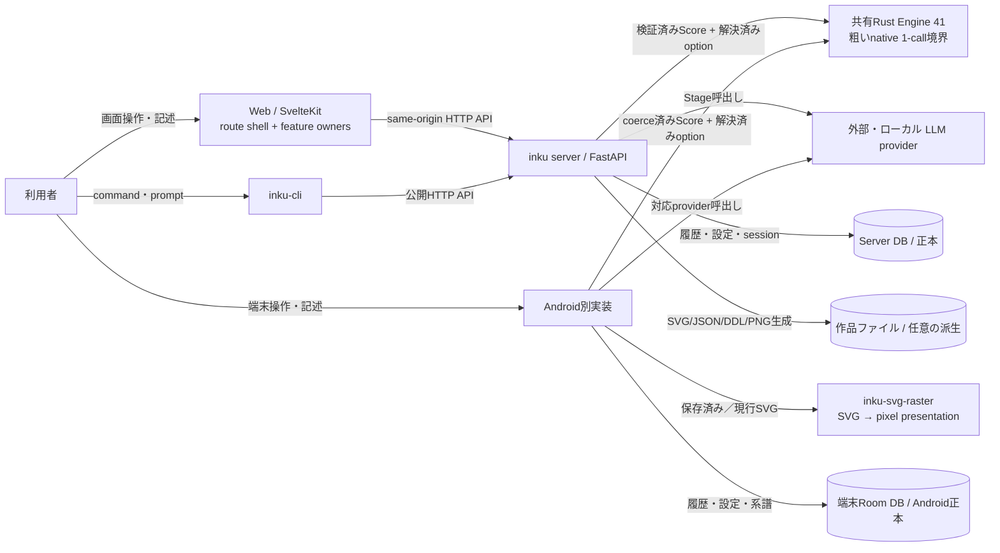

# システムコンテキスト

WebとCLIはserverのHTTP APIを利用する。Androidは同じserverを薄いclientとして呼ぶのではなく、端末内に別のDDL pipelineとRoom DBを持ち、描画はServerと同じRust coreをJNIから呼ぶ。Server DBがserver作品の正本であり、作品ファイル領域は任意の派生保存である。

Web内部では `+page.svelte` がroute lifecycle、画面構成、owner配線を担い、Session・Work・Batch・Demo・Refinement・Settings・history/lineage・viewportをroute-instance ownerへ分離する。1回のPaintやrefinement処理はstateless operation、CanvasとSettingsの表示はfocused viewが所有する。Serverの薄いPython adapterとAndroidの薄いJNI adapterは同じplatform-independentなRust coreを呼び、Engine 41のplanning、geometry、mark、surface、layer、SVG、metadataを共有する。Androidの保存済み／現行SVGは別のhost-neutral raster crateを通り、pixelは派生presentationとしてBitmap／Composeへ渡る。詳細なcanonical owner図は `client-boundaries.ja.md`、Rust module図は`server-components.ja.md`が持つ。

## 外部境界と信頼境界

| 境界 | 契約 | 根拠 |
|---|---|---|
| Browser → Web | UI状態はroute-instance feature owner、localStorage・IndexedDB・File System Accessはbrowser側 | `+page.svelte`; `features/session/state.svelte.ts`; `features/work/state.svelte.ts`; `features/canvas/refinement-coordinator.svelte.ts`; `features/export/save-target.ts` |
| Web → API | developmentはVite proxy、配布時はSvelteKit hook proxy | `vite.config.ts`; `web/src/hooks.server.ts` |
| CLI → API | `urllib`によるHTTPのみ。Server内部packageをimportしない | `cli/src/inku_cli/cli.py` |
| API → provider | provider/modelを解決後、Anthropic/Gemini/OpenAI互換へ接続 | `model_settings.py`; `interpreter.py`; `composer.py` |
| API → Rust core | 検証済みScoreと解決済みhost optionを1個のJSON requestで渡し、SVGとmetadataを一緒に受け取る | `render_engines/default/adapter.py`; `inku-render-python`; `core/crates/inku-render` |
| Android → Rust core | coerce済みScoreと解決済みhost optionをJNIの1 requestで渡し、SVGとmetadataを一緒に受け取る | `AndroidRenderHost.kt`; `NativeRenderBridge.kt`; `inku-render-android` |
| Android SVG → raster | canonical SVGとtarget geometryを渡し、明示的なpremultiplied RGBA8/strideを受け取る | `RustArtworkRasterizer.kt`; `core/crates/inku-svg-raster` |
| API → DB | server生成の履歴、系譜、設定、認証状態を保存 | `db.py`; `rendering.py` |
| API → files | DB保存と独立したbest-effort queue。満杯時はfileだけskip | `api_core/state.py`; `rendering.py:_submit_history_artifact_save` |
| Android | serverとは別のtrust/storage boundary。描画／rasterは共有Rustで、Roomと`rh3`はhost所有 | `InkuRepository`; `InkuDatabase`; `LocalFallbackPipeline`; `AndroidRenderHost` |

## ノード／edge根拠

| 図要素 | Evidence ID | 主な根拠 |
|---|---|---|
| 利用者/Web/CLI/Android | `SYS-USER`, `SYS-WEB`, `SYS-CLI`, `SYS-ANDROID` | 各entry pointとUI/parser |
| FastAPI/provider | `SYS-API`, `SYS-LLM` | `api.py`, `model_settings.py` |
| Rust render core | `PIPE-RENDER` | `default/adapter.py`, `inku-render-python`, `inku-render` |
| Server DB/files | `SYS-DB`, `SYS-FILES` | `db.py`, `rendering.py` |
| Android Room | `SYS-ANDROID` | `data/db/InkuDatabase.kt` |
