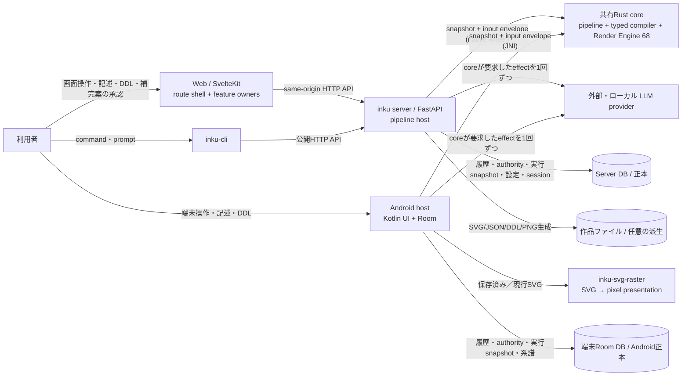

# システムコンテキスト

WebとCLIはserverのHTTP APIを利用する。Androidはserverを経由せず、端末内のKotlin hostから同じ共有Rust coreをJNIで呼び、自身のRoom DBへ保存する。記述から可視DDL、Score、SVGまでの意味の判断は、ServerでもAndroidでも共有Rust coreが所有する。Python／Kotlin hostが担うのはprovider通信、原子的な保存、UI、host固有の設定解決である。Server DBがserver作品の正本であり、作品ファイル領域は任意の派生保存である。

共有Rust coreは5つのhost非依存crate（`inku-score`、`inku-ddl`、`inku-pipeline`、`inku-render`、`inku-svg-raster`）と3つのbinding crateから成る。authoring state machine（`inku-pipeline`）はsnapshotとinputを受け、次のsnapshot、進行event、最大1個のeffectを返す。hostはそのeffect（LLM呼出しまたは可視DDLのCAS保存）を1回だけ実行し、identityを保った結果を返す。再試行、fallback、authority遷移、compileの契機はcoreが決める。typed compiler（`inku-ddl`）が可視DDLをScoreへ一度だけ下ろし、Render Engine（`inku-render`）がSVGを演奏する。Androidの保存済み／現行SVGは別のraster crateを通り、pixelは派生presentationとしてBitmap／Composeへ渡る。

Web内部では`+page.svelte`がroute lifecycle、画面構成、owner配線を担い、Session・Work・Batch・Demo・Refinement・Settings・history/lineage・viewportをroute-instance ownerへ分離する。共有pipelineの実行（DDL編集、補完案の承認、記述からのfork）は`features/pipeline/`のcontrollerが保存済み状態を読んで表示し、作者の操作だけをServerへ渡す。詳細なcanonical owner図は`client-boundaries.ja.md`、Server内部とRust crate図は`server-components.ja.md`が持つ。

## 外部境界と信頼境界

| 境界 | 契約 | 根拠 |
|---|---|---|
| Browser → Web | UI状態はroute-instance feature owner、localStorage・IndexedDB・File System Accessはbrowser側 | `+page.svelte`; `features/session/state.svelte.ts`; `features/work/state.svelte.ts`; `features/canvas/refinement-coordinator.svelte.ts`; `features/export/save-target.ts` |
| Web → API | developmentはVite proxy、配布時はSvelteKit hook proxy。clientはsnapshot、authority sidecar、effect結果、資源policyを送れない | `vite.config.ts`; `web/src/hooks.server.ts`; `pipeline_candidate.py`（module docstring） |
| CLI → API | `urllib`によるHTTPのみ。Server内部packageをimportしない | `cli/src/inku_cli/cli.py` |
| API → Rust core | 信頼済みconfigとsnapshotを所有したbyte bufferで渡し、次snapshotと演奏結果を受け取る。binding版とprotocol版の一致を起動時に要求する | `pipeline_candidate.py:PipelineBinding`; `inku-render-python`; `inku-pipeline-uniffi` |
| API → provider | model参照を解決後、coreが要求したeffectをtransport 1回で実行し、再試行しない | `pipeline_provider.py:SingleAttemptProvider`; `model_settings.py` |
| Android → Rust core | 同じbyte protocolをJNIで渡す。新しい演奏はcoreのrender入力、保存済みScoreの再演は復元した資源policyの下で`renderSaved`を使う（端末専用の旧9:5形式だけ`AndroidRenderHost`） | `SharedPipelineHost.kt`; `NativePipelineBridge.kt`; `AndroidWorkPipeline.kt`; `inku-render-android` |
| Android SVG → raster | canonical SVGとtarget geometryを渡し、明示的なpremultiplied RGBA8/strideを受け取る | `RustArtworkRasterizer.kt`; `core/crates/inku-svg-raster` |
| API → DB | 可視DDLとauthorityのCAS、action ACK、実行snapshot、server生成の履歴、系譜、設定、認証状態を保存 | `persistence/variation_authority.py`; `db.py`; `pipeline_product.py:save_result` |
| API → files | DB保存と独立したbest-effort queue。満杯時はfileだけskip | `api_core/state.py`; `rendering.py:_submit_history_artifact_save` |
| Android | serverとは別のtrust/storage boundary。意味判断と描画は共有Rust、Room・provider設定・`rh3`計算はhost所有 | `InkuRepository`; `InkuDatabase`; `RoomSharedPipelineStore`; `AndroidWorkPipeline` |

## ノード／edge根拠

| 図要素 | Evidence ID | 主な根拠 |
|---|---|---|
| 利用者/Web/CLI/Android | `SYS-USER`, `SYS-WEB`, `SYS-CLI`, `SYS-ANDROID` | 各entry pointとUI/parser |
| FastAPI/provider | `SYS-API`, `PIPE-HOST`, `SYS-LLM` | `api.py`, `pipeline_runtime.py`, `pipeline_provider.py` |
| 共有Rust core | `SYS-CORE`, `PIPE-MACHINE`, `PIPE-TYPED-DDL`, `PIPE-RENDER` | `core/Cargo.toml`, `inku-pipeline`, `inku-ddl`, `inku-render` |
| raster | `PIPE-RASTER` | `inku-svg-raster`, `RustArtworkRasterizer.kt` |
| Server DB/files | `SYS-DB`, `DATA-AUTHORITY`, `SYS-FILES` | `db.py`, `variation_authority.py`, `rendering.py` |
| Android Room | `SYS-ANDROID` | `data/db/InkuDatabase.kt`, `RoomSharedPipelineStore.kt` |
