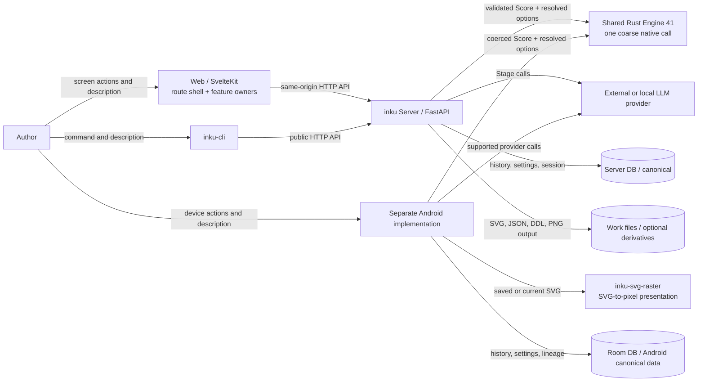

# System context

Web and the CLI use the Server HTTP API. Android is not a thin client over that same pipeline: it carries a separate DDL pipeline and Room DB on the device, while calling the same Rust render core as the Server through JNI. The Server DB is canonical for Server works; automatic work files are optional derivatives.

Within Web, `+page.svelte` retains route lifecycle, view composition, and owner wiring while route-instance owners hold Session, Work, Batch, Demo, Refinement, Settings, history/lineage, and viewport state. Stateless operations perform one Paint or refinement action; focused views own Canvas and Settings presentation. The Server's thin Python adapter and Android's thin JNI adapter call the same platform-independent Rust core, sharing Engine 41 planning, geometry, marks, surfaces, layers, SVG, and metadata. Android sends saved/current SVG through a separate host-neutral raster crate and treats pixels as derived Bitmap/Compose presentation. The canonical owner diagram lives in `client-boundaries.md`; the Rust module diagram lives in `server-components.md`.

## External and trust boundaries

| Boundary | Contract | Evidence |
|---|---|---|
| Browser → Web | Route-instance feature owners hold UI state; localStorage, IndexedDB, and File System Access stay in the browser | `+page.svelte`; `features/session/state.svelte.ts`; `features/work/state.svelte.ts`; `features/canvas/refinement-coordinator.svelte.ts`; `features/export/save-target.ts` |
| Web → API | Vite proxy in development; SvelteKit hook proxy in the packaged service | `vite.config.ts`; `web/src/hooks.server.ts` |
| CLI → API | HTTP through `urllib`; no Server package import | `cli/src/inku_cli/cli.py` |
| API → provider | Resolve provider/model, then use Anthropic, Gemini, or OpenAI-compatible connections | `model_settings.py`; `interpreter.py`; `composer.py` |
| API → Rust core | Pass a validated Score and resolved host options as one JSON request and receive SVG plus metadata together | `render_engines/default/adapter.py`; `inku-render-python`; `core/crates/inku-render` |
| Android → Rust core | Pass a coerced Score and resolved host options through one JNI request and receive SVG plus metadata together | `AndroidRenderHost.kt`; `NativeRenderBridge.kt`; `inku-render-android` |
| Android SVG → raster | Pass canonical SVG and target geometry and receive explicit premultiplied RGBA8 pixels and stride | `RustArtworkRasterizer.kt`; `core/crates/inku-svg-raster` |
| API → DB | Persist Server history, lineage, settings, and authentication state | `db.py`; `rendering.py` |
| API → files | Best-effort queue independent of DB persistence; a full queue skips only the file job | `api_core/state.py`; `rendering.py:_submit_history_artifact_save` |
| Android | Separate trust, pipeline, and storage boundary; shared Rust owns render/raster while the host owns Room and `rh3` | `InkuRepository`; `InkuDatabase`; `LocalFallbackPipeline`; `AndroidRenderHost` |

## Evidence map

| Diagram element | Evidence ID | Primary source |
|---|---|---|
| Author, Web, CLI, Android | `SYS-USER`, `SYS-WEB`, `SYS-CLI`, `SYS-ANDROID` | Entry points and client code |
| FastAPI and provider | `SYS-API`, `SYS-LLM` | `api.py`, `model_settings.py` |
| Rust render core | `PIPE-RENDER` | `default/adapter.py`, `inku-render-python`, `inku-render` |
| Server DB and files | `SYS-DB`, `SYS-FILES` | `db.py`, `rendering.py` |
| Android Room | `SYS-ANDROID` | `data/db/InkuDatabase.kt` |
